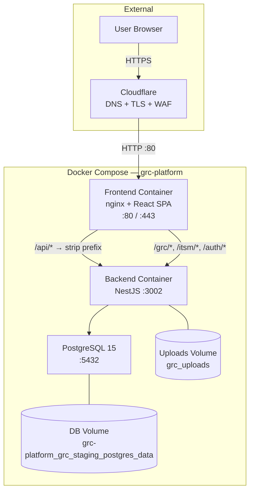
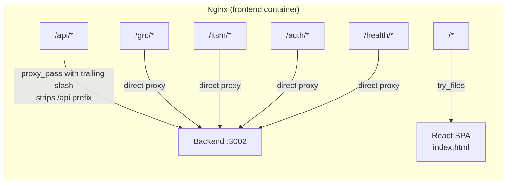
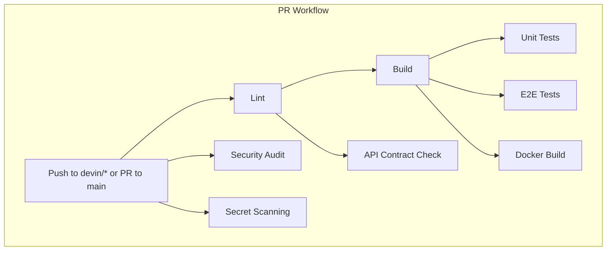

# Infrastructure & Platform Operations Guide

> **Version:** 1.0 | **Last Updated:** 2026-02-26 | **Status:** Outline (Ready for Final Writing)
>
> **Audience:** IT Operations, DevOps, Data Center Team, Auditors
>
> **Evidence Map:** [EVIDENCE_MAP_v1.md](../discovery/EVIDENCE_MAP_v1.md) — Section 1

---

## Executive Summary

- **What this document covers:** Complete infrastructure topology, deployment architecture, and operational procedures for the GRC Platform.
- **Deployment model:** Docker Compose on a single Linux server (Hetzner); Cloudflare for DNS/TLS termination in staging.
- **Services:** PostgreSQL 15, NestJS backend (port 3002), nginx + React frontend (port 80/443).
- **CI/CD:** GitHub Actions — 20+ workflows for lint, build, test, security scanning, and automated staging deploy.
- **Security posture:** TLS via Cloudflare, JWT auth, multi-tenant isolation, rate limiting, audit logging, TruffleHog secret scanning.
- **Known limitations:** Single-node Docker Compose only (no HA/clustering). No Redis/queue. No Kubernetes manifests. Backup is manual.

---

## Table of Contents

1. [System Architecture Overview](#1-system-architecture-overview)
2. [Docker Compose Topology](#2-docker-compose-topology)
3. [Nginx Reverse Proxy](#3-nginx-reverse-proxy)
4. [Environment Configuration](#4-environment-configuration)
5. [Database Architecture](#5-database-architecture)
6. [CI/CD Pipeline](#6-cicd-pipeline)
7. [Deployment Workflow](#7-deployment-workflow)
8. [Health Checks & Monitoring](#8-health-checks--monitoring)
9. [Security Infrastructure](#9-security-infrastructure)
10. [Backup & Disaster Recovery](#10-backup--disaster-recovery)
11. [Capacity Planning & Scaling](#11-capacity-planning--scaling)
12. [Troubleshooting](#12-troubleshooting)
13. [Validation Checklist](#13-validation-checklist)

---

## 1. System Architecture Overview

### 1.1 Architecture Diagram

> **EVIDENCE:** `docker-compose.staging.yml`, `frontend/nginx.conf`

### 1.2 Service Inventory

<!-- Table: container name, image, port, health check, restart policy -->

| Container | Image | Internal Port | Health Check | Restart |
|-----------|-------|---------------|-------------|---------|
| `grc-staging-db` | `postgres:15-alpine` | 5432 | `pg_isready` | unless-stopped |
| `grc-staging-backend` | Custom (NestJS) | 3002 | `wget http://localhost:3002/health/ready` | unless-stopped |
| `grc-staging-frontend` | Custom (nginx+React) | 80 | `wget http://localhost/frontend-health` | unless-stopped |

> **EVIDENCE:** `docker-compose.staging.yml` (lines 38-143)

### 1.3 Network Topology

<!-- Network: grc-staging-network (bridge), inter-container DNS -->

> **EVIDENCE:** `docker-compose.staging.yml` (lines 169-174)

---

## 2. Docker Compose Topology

### 2.1 Staging Compose (`docker-compose.staging.yml`)

<!-- Detail: project name pinning, service definitions, volumes, networks -->

**Key design decisions:**
- Project name pinned to `grc-platform` to prevent volume drift
- DB volume is `external: true` to prevent accidental recreation
- Upload volume uses named volume to bypass bind-mount permission issues
- Backend depends_on db with `condition: service_healthy`
- Frontend depends_on backend with `condition: service_healthy`

> **EVIDENCE:** `docker-compose.staging.yml` (175 lines)

### 2.2 Local Development Compose (`docker-compose.nest.yml`)

<!-- Detail: 2-service stack, DB_SYNC=true for dev, no frontend container -->

> **EVIDENCE:** `docker-compose.nest.yml` (94 lines)

### 2.3 Volume Strategy

<!-- Table: volume name, mount path, purpose, external flag -->

| Volume | Mount Path | Purpose | External |
|--------|-----------|---------|----------|
| `grc-platform_grc_staging_postgres_data` | `/var/lib/postgresql/data` | DB persistence | Yes (must pre-exist) |
| `grc_uploads` | `/app/data/uploads` | File upload storage | No (auto-created) |
| `./staging-data` | `/app/data` | General data (bind mount) | N/A |

---

## 3. Nginx Reverse Proxy

### 3.1 Routing Architecture

### 3.2 API Prefix Stripping

<!-- Critical: /api/ location with trailing slash on proxy_pass -->
<!-- Detail the exact behavior: /api/grc/risks → /grc/risks on backend -->

> **SECURITY:** The `/api/` prefix stripping is critical. Backend controllers use `@Controller('grc/...')` with NO `api/` prefix.

> **EVIDENCE:** `frontend/nginx.conf` (lines 288-299)

### 3.3 Security Headers

<!-- X-Frame-Options, X-Content-Type-Options, X-XSS-Protection -->

### 3.4 Gzip Compression

<!-- Enabled for text/css/js/json -->

### 3.5 HTTPS Configuration

<!-- Reference nginx-https.conf for TLS termination -->

> **EVIDENCE:** `frontend/nginx-https.conf`

---

## 4. Environment Configuration

### 4.1 Required Environment Variables

<!-- Table: all env vars from .env.example and .env.production.template -->
<!-- Mark required vs optional, note which are secrets -->

> **SECURITY:** Never commit secret values. Use `.env` files excluded from git.

> **EVIDENCE:** `backend-nest/.env.example`, `backend-nest/.env.production.template`

### 4.2 DB_SYNC Kill Switch

<!-- Detail the app.module.ts kill switch that exits if DB_SYNC=true in production -->

> **RISK:** `DB_SYNC=true` in production/staging causes `process.exit(1)`. This is intentional safety.

> **EVIDENCE:** `backend-nest/src/app.module.ts` (lines 88-114)

### 4.3 Frontend Environment

<!-- REACT_APP_API_URL, staging vs production configuration -->

> **EVIDENCE:** `frontend/.env.example`, `frontend/.env.staging`

---

## 5. Database Architecture

### 5.1 PostgreSQL Configuration

<!-- Version 15-alpine, connection pooling, shared database for both backends -->

### 5.2 Migration Strategy

<!-- TypeORM migrations, 85+ files, deterministic, migration:run:prod -->

> **EVIDENCE:** `backend-nest/src/migrations/` (85+ files), `backend-nest/src/data-source.ts`

### 5.3 Seed Data Strategy

<!-- 18+ seed scripts, idempotent, tenant-scoped -->

> **EVIDENCE:** `backend-nest/src/scripts/seed-*.ts` (18+ files)

### 5.4 Schema Contract Validation

<!-- schema-contract.ts, schema-contract.cli.ts -->

> **EVIDENCE:** `backend-nest/src/scripts/schema-contract.ts`

---

## 6. CI/CD Pipeline

### 6.1 Pipeline Architecture

### 6.2 Workflow Inventory

<!-- Table: 20+ workflows with trigger, purpose, blocking status -->

> **EVIDENCE:** `.github/workflows/` (20+ files)

### 6.3 Security Scanning

<!-- TruffleHog, secret-pattern-check, credential-check, CodeQL -->

### 6.4 Staging Deployment Workflow

<!-- SSH-based deploy, disk preflight, docker compose up, health checks, smoke tests -->

> **EVIDENCE:** `.github/workflows/deploy-staging.yml` (703 lines)

---

## 7. Deployment Workflow

### 7.1 Staging Deployment Steps

<!-- Step-by-step from the deploy workflow -->

### 7.2 Disk Preflight & Cleanup

<!-- Automatic disk check, safe cleanup (no volume prune), threshold configuration -->

### 7.3 Post-Deploy Validation

<!-- Health checks, smoke tests, migration verification -->

### 7.4 Rollback Procedure

<!-- Git revert + redeploy strategy -->

---

## 8. Health Checks & Monitoring

### 8.1 Health Endpoints

| Endpoint | Type | Checks |
|----------|------|--------|
| `/health/live` | Liveness | App is running |
| `/health/ready` | Readiness | App + DB connection |
| `/health/db` | Database | PostgreSQL connectivity |
| `/health/auth` | Auth | JWT + refresh token config |
| `/frontend-health` | Frontend | Nginx is serving |
| `/metrics` | Prometheus | Application metrics |

> **EVIDENCE:** `backend-nest/src/health/` (controllers, services, tests)

### 8.2 Platform Health Dashboard

<!-- Admin UI for smoke test persistence -->

> **EVIDENCE:** `backend-nest/src/platform-health/`, UI: `/admin/platform-health`

### 8.3 Monitoring Recommendations [PLANNED]

<!-- Prometheus + Grafana setup (not in repo, recommendations only) -->

> **PLANNED:** No Grafana dashboards or alerting rules exist in the repo. The `/metrics` endpoint is available for integration.

---

## 9. Security Infrastructure

### 9.1 TLS/SSL

<!-- Cloudflare TLS termination, nginx-https.conf for direct TLS -->

### 9.2 Rate Limiting

<!-- ThrottlerModule: read 120/min, write 30/min, auth 10/min -->

> **EVIDENCE:** `backend-nest/src/app.module.ts` (lines 216-245)

### 9.3 Security Headers

<!-- Nginx security headers, CORS configuration -->

### 9.4 Secret Management

<!-- .env files, no secrets in code, TruffleHog CI scanning -->

---

## 10. Backup & Disaster Recovery

### 10.1 Database Backup

<!-- Manual pg_dump procedure, reference DB-BACKUP-RUNBOOK.md -->

> **RISK:** No automated backup pipeline exists. Manual process only.

> **EVIDENCE:** `docs/DB-BACKUP-RUNBOOK.md`

### 10.2 Volume Backup

<!-- Docker volume backup for uploads -->

### 10.3 Recovery Procedure

<!-- pg_restore, volume restore, migration re-run -->

---

## 11. Capacity Planning & Scaling

### 11.1 Current Architecture Limits

<!-- Single-node Docker Compose, vertical scaling only -->

> **RISK:** No horizontal scaling. Single point of failure for all services.

### 11.2 Resource Recommendations

<!-- CPU, RAM, disk recommendations per environment -->

### 11.3 Kubernetes Path [PLANNED]

> **PLANNED:** No Kubernetes manifests exist. Docker Compose is the only supported deployment.

---

## 12. Troubleshooting

### 12.1 Common Issues

| Symptom | Cause | Resolution |
|---------|-------|------------|
| "volume not found" on deploy | External DB volume missing | `docker volume create grc-platform_grc_staging_postgres_data` |
| Backend 404 on `/api/grc/*` | Nginx proxy_pass missing trailing slash | Verify `proxy_pass http://backend/;` |
| DB_SYNC exit(1) | `DB_SYNC=true` in production | Set `DB_SYNC=false` and use migrations |
| Migrations pending | New migrations not run after deploy | `docker compose exec backend npx typeorm migration:run -d dist/data-source.js` |
| Frontend infinite spinner | API calls going to wrong path | Verify `REACT_APP_API_URL` is empty for same-origin |

### 12.2 Log Locations

<!-- Container logs, nginx access/error logs -->

### 12.3 Diagnostic Commands

<!-- docker compose ps, logs, exec commands -->

---

## 13. Validation Checklist

| # | Check | Expected | Command | Status |
|---|-------|----------|---------|--------|
| 1 | All containers running | 3 containers healthy | `docker compose -f docker-compose.staging.yml ps` | |
| 2 | Backend liveness | 200 OK | `curl http://localhost:3002/health/live` | |
| 3 | Backend readiness | 200 OK | `curl http://localhost:3002/health/ready` | |
| 4 | DB connectivity | 200 OK | `curl http://localhost:3002/health/db` | |
| 5 | Frontend serving | 200 OK | `curl http://localhost/frontend-health` | |
| 6 | API routing works | 401 (not 404) | `curl -i http://localhost/api/grc/controls` | |
| 7 | Nginx prefix stripping | Backend receives `/grc/...` | Check nginx access logs | |
| 8 | Migrations up to date | All migrations applied | `docker compose exec backend npx typeorm migration:show -d dist/data-source.js` | |
| 9 | No pending seeds | Seed data present | `docker compose exec backend node dist/scripts/platform-validate.js` | |
| 10 | Secret scanning green | No secrets in code | CI: `secret-scanning.yml` passes | |

---

## Appendix

### A. Related Documents

- [Installation Guide (BT Runbook)](./01A_INSTALLATION_GUIDE.md)
- [Evidence Map — Infrastructure](../discovery/EVIDENCE_MAP_v1.md#1-infrastructure)
- [Technical Architecture](./02_TECHNICAL.md)

### B. File Reference Index

| File | Purpose |
|------|---------|
| `docker-compose.staging.yml` | Staging deployment |
| `docker-compose.nest.yml` | Local development |
| `frontend/nginx.conf` | Reverse proxy config |
| `frontend/nginx-https.conf` | HTTPS config |
| `backend-nest/Dockerfile` | Backend image |
| `frontend/Dockerfile` | Frontend image |
| `backend-nest/.env.example` | Env template (dev) |
| `backend-nest/.env.production.template` | Env template (prod) |
| `.github/workflows/deploy-staging.yml` | Deploy workflow |
