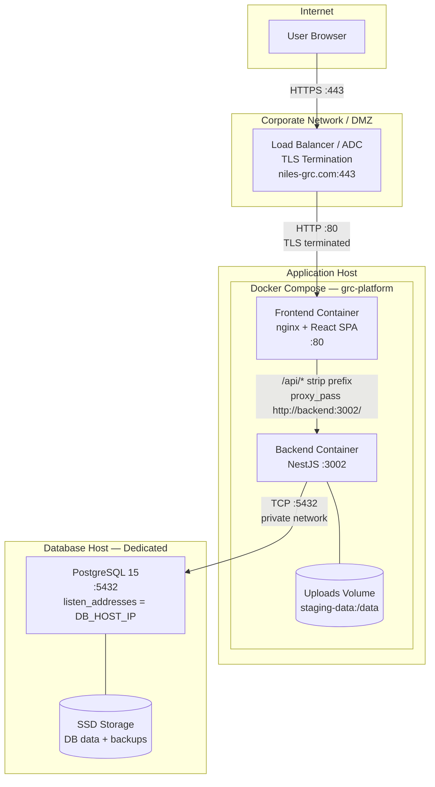
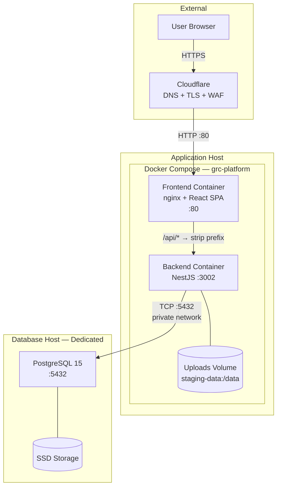
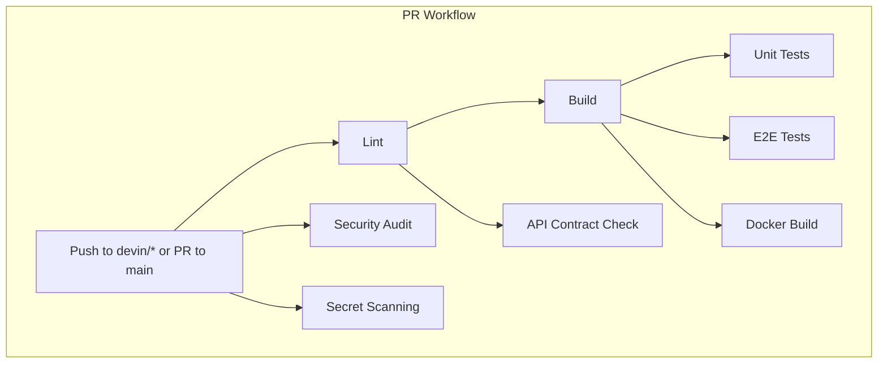

# Infrastructure & Platform Operations Guide

> **Version:** 1.1 | **Last Updated:** 2026-02-26 | **Status:** Final (High-Impact Sections) | **Owner:** infra
>
> **Audience:** IT Operations, DevOps, Data Center Team, Auditors
>
> **Evidence Map:** [EVIDENCE_MAP_v1.md](../discovery/EVIDENCE_MAP_v1.md) — Section 1

---

## Executive Summary

- **What this document covers:** Complete infrastructure topology, deployment architecture, and operational procedures for the GRC Platform.
- **Deployment model:** Docker Compose on a dedicated application server with a **dedicated PostgreSQL database host** on a private network. TLS terminated at corporate load balancer / ADC.
- **Domain:** `niles-grc.com` — API served under `/api` on the same domain.
- **Services:** PostgreSQL 15 (dedicated host), NestJS backend (port 3002), nginx + React frontend (port 80).
- **CI/CD:** GitHub Actions — 20+ workflows for lint, build, test, security scanning, and automated staging deploy.
- **Security posture:** TLS via corporate LB/ADC (primary) or Cloudflare (staging), JWT auth, multi-tenant isolation, rate limiting, audit logging, TruffleHog secret scanning.
- **Known limitations:** Single-node Docker Compose only (no HA/clustering). No Redis/queue. No Kubernetes manifests. Backup is manual (automated recommended).

---

## Table of Contents

1. [System Architecture Overview](#1-system-architecture-overview)
2. [Docker Compose Topology](#2-docker-compose-topology)
3. [Nginx Reverse Proxy](#3-nginx-reverse-proxy)
4. [Environment Configuration](#4-environment-configuration)
5. [Database Architecture](#5-database-architecture)
6. [CI/CD Pipeline](#6-cicd-pipeline)
7. [Deployment Workflow](#7-deployment-workflow)
8. [Health Checks & Monitoring](#8-health-checks--monitoring)
9. [Security Infrastructure](#9-security-infrastructure)
10. [Backup & Disaster Recovery](#10-backup--disaster-recovery)
11. [Capacity Planning & Scaling](#11-capacity-planning--scaling)
12. [Troubleshooting](#12-troubleshooting)
13. [Validation Checklist](#13-validation-checklist)

---

## 1. System Architecture Overview

### 1.1 Architecture Diagram

#### Production Topology (Corporate LB/ADC + Dedicated DB Host)



#### Staging Topology (Cloudflare + Dedicated DB Host)



> **KEY DECISION:** The database MUST run on a dedicated host, not as a container on the application server. This ensures data isolation, independent scaling, and proper backup procedures.

> **EVIDENCE:** `docker-compose.staging.yml`, `frontend/nginx.conf`

### 1.2 Service Inventory

| Container | Image | Internal Port | Health Check | Restart |
|-----------|-------|---------------|-------------|---------|
| `grc-staging-backend` | Custom (NestJS) | 3002 | `wget http://localhost:3002/health/ready` | unless-stopped |
| `grc-staging-frontend` | Custom (nginx+React) | 80 | `wget http://localhost/frontend-health` | unless-stopped |

> **NOTE:** PostgreSQL runs natively on the dedicated database host, not as a Docker container.

> **EVIDENCE:** `docker-compose.staging.yml`

### 1.3 Network Topology

| Segment | From | To | Port | Protocol | Purpose |
|---------|------|----|------|----------|---------|
| Public | Users | LB/ADC VIP | 443 | HTTPS | User access (TLS terminated at LB) |
| DMZ to App | LB/ADC | App host | 80 | HTTP | Forwarded traffic |
| App to DB | App host | DB host | 5432 | TCP | PostgreSQL (private network only) |
| Container | nginx | backend | 3002 | HTTP | API proxy (Docker network) |

> **RED LINE:** Ports 5432 and 3002 MUST NOT be exposed to external networks.

> **EVIDENCE:** `docker-compose.staging.yml` (network definitions)

---

## 2. Docker Compose Topology

### 2.1 Staging Compose (`docker-compose.staging.yml`)

**Key design decisions:**
- Project name pinned to `grc-platform` to prevent volume drift
- **No database container** in production — PostgreSQL runs on dedicated host, `DB_HOST` points to its private IP
- Upload volume uses bind mount `./staging-data:/data` with proper ownership (1001:65533)
- Frontend depends_on backend with `condition: service_healthy`

> **EVIDENCE:** `docker-compose.staging.yml`

### 2.2 Local Development Compose (`docker-compose.nest.yml`)

- 2-service stack (backend + PostgreSQL container for local dev only)
- `DB_SYNC=true` allowed in development (NOT in staging/production)
- No frontend container — use `npm start` for local React dev server

> **EVIDENCE:** `docker-compose.nest.yml`

### 2.3 Volume Strategy

| Volume | Mount Path | Purpose | Notes |
|--------|-----------|---------|-------|
| `./staging-data` | `/data` | File upload storage | Bind mount, ownership: 1001:65533 |
| `./staging-data/uploads` | `/data/uploads` | Upload files | Must exist with correct permissions |

> **NOTE:** Database volumes are managed on the dedicated DB host filesystem, not via Docker volumes.

---

## 3. Nginx Reverse Proxy

### 3.1 Routing Architecture


### 3.2 API Prefix Stripping

The `/api/` location block uses `proxy_pass http://backend/;` (with trailing slash) to strip the `/api` prefix before forwarding to the backend.

**Example:** `https://niles-grc.com/api/grc/risks` -> backend receives `/grc/risks`

> **CRITICAL:** Backend controllers use `@Controller('grc/...')` with NO `api/` prefix. Nginx strips `/api` before forwarding. Do not change this convention.

> **EVIDENCE:** `frontend/nginx.conf`

### 3.3 Security Headers

- `X-Frame-Options: SAMEORIGIN`
- `X-Content-Type-Options: nosniff`
- `X-XSS-Protection: 1; mode=block`

### 3.4 Gzip Compression

Enabled for `text/css`, `application/javascript`, `application/json`.

### 3.5 TLS Configuration

**Primary (Production):** TLS terminated at corporate LB/ADC — nginx receives plain HTTP on port 80.

**Fallback:** Use `frontend/nginx-https.conf` for direct TLS termination at nginx level. Mount certificates into the frontend container.

> **EVIDENCE:** `frontend/nginx-https.conf`

---

## 4. Environment Configuration

### 4.1 Required Environment Variables

| Variable | Required | Secret | Description |
|----------|----------|--------|-------------|
| `DB_HOST` | Yes | No | **Dedicated DB host private IP** (not `db` or `localhost`) |
| `DB_PORT` | Yes | No | PostgreSQL port (5432) |
| `DB_USER` | Yes | No | PostgreSQL user |
| `DB_PASSWORD` | Yes | **Yes** | PostgreSQL password |
| `DB_NAME` | Yes | No | Database name |
| `DB_SYNC` | Yes | No | **MUST be `false`** in production/staging |
| `JWT_SECRET` | Yes | **Yes** | JWT signing secret (min 32 hex chars) |
| `REFRESH_TOKEN_SECRET` | Yes | **Yes** | Refresh token signing secret |
| `REFRESH_TOKEN_EXPIRES_IN` | Yes | No | Refresh token TTL (e.g., `7d`) |
| `NODE_ENV` | Yes | No | `production` |
| `PORT` | Yes | No | Backend port (3002) |
| `DEMO_ADMIN_EMAIL` | Yes | No | Initial admin email |
| `DEMO_ADMIN_PASSWORD` | Yes | **Yes** | Initial admin password |
| `AI_ENCRYPTION_KEY` | Optional | **Yes** | AI feature encryption key |

> **SECURITY:** Never commit secret values. Use `.env` files excluded from git. Generate secrets with `openssl rand -hex 32`. Do not use fallback values for secrets in code — use environment variables only.

> **EVIDENCE:** `backend-nest/.env.example`, `backend-nest/.env.production.template`

### 4.2 DB_SYNC Kill Switch

The application module (`app.module.ts`) includes a safety mechanism that calls `process.exit(1)` if `DB_SYNC=true` is detected in production or staging environments. This prevents TypeORM from auto-syncing the schema, which can cause data loss.

> **RED LINE:** `DB_SYNC=true` in production/staging causes immediate process exit. This is intentional safety.

> **EVIDENCE:** `backend-nest/src/app.module.ts`

### 4.3 Frontend Environment

The frontend uses same-origin API calls via nginx reverse proxy. `REACT_APP_API_URL` should be empty or unset for production (API calls go to `/api/*` on the same domain).

> **EVIDENCE:** `frontend/.env.example`, `frontend/.env.staging`

---

## 5. Database Architecture

### 5.1 PostgreSQL Configuration

- **Version:** PostgreSQL 15
- **Location:** Dedicated database host (not a Docker container)
- **Network:** Private network, `listen_addresses` bound to DB host private IP
- **Access control:** `pg_hba.conf` restricts connections to application host IP only
- **Extensions:** `uuid-ossp`, `pgcrypto`

> **KEY DECISION:** Database runs on a dedicated host for data isolation, independent scaling, and proper backup procedures. Connection from the application host is via private network TCP on port 5432.

### 5.2 Migration Strategy

- TypeORM migrations (85+ migration files)
- Deterministic, version-controlled schema changes
- Run via: `npx typeorm migration:run -d dist/data-source.js`
- Always run `migration:show` before `migration:run` to verify pending changes
- Production containers only have `dist/` — always use `dist/data-source.js`, not `src/data-source.ts`

> **EVIDENCE:** `backend-nest/src/migrations/` (85+ files), `backend-nest/src/data-source.ts`

### 5.3 Seed Data Strategy

- 18+ seed scripts, all idempotent (safe to re-run)
- Split into **required for production** and **optional demo seeds**
- All seeds are tenant-scoped (use default tenant `00000000-0000-0000-0000-000000000001`)
- Production containers use `node dist/scripts/seed-*.js` (not ts-node with src paths)
- See [Installation Guide — Seed Data](./01A_INSTALLATION_GUIDE.md#67-seed-data) for the complete list

> **EVIDENCE:** `backend-nest/src/scripts/seed-*.ts` (18+ files)

### 5.4 Schema Contract Validation

Schema contract validation ensures the database schema matches expected entity definitions.

> **EVIDENCE:** `backend-nest/src/scripts/schema-contract.ts`

### 5.5 Backup and Recovery

- **Backup:** `pg_dump` on the dedicated DB host (see [Installation Guide — Backup](./01A_INSTALLATION_GUIDE.md#93-backup--restore))
- **Automated backup:** Recommended daily cron job with 30-day retention
- **Recovery:** Stop backend, restore from backup on DB host, restart backend

> **RED LINE:** No automated backup pipeline exists by default. Manual setup required.

---

## 6. CI/CD Pipeline

### 6.1 Pipeline Architecture



### 6.2 Workflow Inventory

> **EVIDENCE:** `.github/workflows/` (20+ files)

### 6.3 Security Scanning

- **TruffleHog:** Scans for secrets in code
- **Secret pattern check:** Custom regex patterns for credential detection
- **CodeQL:** Static analysis for security vulnerabilities

### 6.4 Staging Deployment Workflow

SSH-based deploy with disk preflight, docker compose up, health checks, and smoke tests.

> **EVIDENCE:** `.github/workflows/deploy-staging.yml`

---

## 7. Deployment Workflow

### 7.1 Staging Deployment Steps

See [Installation Guide — Application Deployment](./01A_INSTALLATION_GUIDE.md#6-step-by-step-application-deployment) for step-by-step instructions.

### 7.2 Disk Preflight and Cleanup

Automatic disk check before deployment. Safe cleanup uses `docker image prune` and `docker builder prune` only.

> **RED LINE:** Never use `docker volume prune` — it can destroy the upload volume.

### 7.3 Post-Deploy Validation

See [Installation Guide — Post-Deploy Validation](./01A_INSTALLATION_GUIDE.md#7-step-by-step-post-deploy-validation).

### 7.4 Rollback Procedure

See [Installation Guide — Rollback Procedure](./01A_INSTALLATION_GUIDE.md#95-rollback-procedure).

---

## 8. Health Checks & Monitoring

### 8.1 Health Endpoints

| Endpoint | Type | Checks |
|----------|------|--------|
| `/health/live` | Liveness | App is running |
| `/health/ready` | Readiness | App + DB connection |
| `/health/db` | Database | PostgreSQL connectivity (dedicated host) |
| `/health/auth` | Auth | JWT + refresh token config (should show `REFRESH_TOKEN_EXPIRES_IN configured: true`) |
| `/frontend-health` | Frontend | Nginx is serving |
| `/metrics` | Prometheus | Application metrics |

> **EVIDENCE:** `backend-nest/src/health/` (controllers, services, tests)

### 8.2 Platform Health Dashboard

Admin UI for smoke test persistence and health run history.

> **EVIDENCE:** `backend-nest/src/platform-health/`, UI: `/admin/platform-health`

### 8.3 Monitoring Recommendations [PLANNED]

> **PLANNED:** No Grafana dashboards or alerting rules exist in the repo. The `/metrics` endpoint is available for Prometheus integration.

Recommended stack: Prometheus + Grafana + Alertmanager. See [Installation Guide — Monitoring](./01A_INSTALLATION_GUIDE.md#96-monitoring--alerting-recommendations).

---

## 9. Security Infrastructure

### 9.1 TLS/SSL

**Production:** TLS terminated at corporate load balancer / ADC. All external traffic arrives via `https://niles-grc.com`. The LB forwards plain HTTP to the application host on port 80.

**Staging:** TLS terminated at Cloudflare (DNS + WAF).

**Fallback:** Direct nginx TLS termination using `frontend/nginx-https.conf` and mounted certificates.

> **KEY DECISION:** Production TLS MUST be terminated at the corporate LB/ADC. Self-signed certificates are not acceptable for production.

### 9.2 Rate Limiting

ThrottlerModule configuration:
- **Read operations:** 120 requests/minute
- **Write operations:** 30 requests/minute
- **Authentication:** 10 requests/minute

> **EVIDENCE:** `backend-nest/src/app.module.ts`

### 9.3 Security Headers

Nginx adds security headers for all responses:
- `X-Frame-Options: SAMEORIGIN`
- `X-Content-Type-Options: nosniff`
- `X-XSS-Protection: 1; mode=block`
- CORS configuration for same-origin

### 9.4 Secret Management

- `.env` files excluded from git (`.gitignore`)
- No fallback values for secrets in code (environment variables only)
- TruffleHog CI scanning for secret detection
- All secrets generated with `openssl rand -hex 32`

---

## 10. Backup & Disaster Recovery

### 10.1 Database Backup

Database backups are performed on the dedicated DB host using `pg_dump`:

```bash
# Manual backup (on DB host)
sudo -u postgres pg_dump grc_db | gzip > /var/backups/grc/grc_$(date +%Y%m%d_%H%M%S).sql.gz

# Recommended: daily cron job with 30-day retention
```

> **RISK:** No automated backup pipeline exists by default. Manual setup required on DB host.

See [Installation Guide — Backup](./01A_INSTALLATION_GUIDE.md#93-backup--restore) for complete procedures.

> **EVIDENCE:** `docs/DB-BACKUP-RUNBOOK.md`

### 10.2 Volume Backup

Upload files are stored in `./staging-data/uploads` on the application host. Back up this directory separately.

### 10.3 Recovery Procedure

1. Stop backend services
2. Restore database from backup on DB host: `gunzip -c backup.sql.gz | sudo -u postgres psql grc_db`
3. Restore upload files if needed
4. Restart backend services
5. Verify health endpoints
6. Run migration verification

---

## 11. Capacity Planning & Scaling

### 11.1 Current Architecture Limits

Single-node Docker Compose with dedicated DB host. Vertical scaling only for both hosts.

> **RISK:** No horizontal scaling. Single point of failure for app host (DB host is separate).

### 11.2 Resource Recommendations

| Host | Component | Min CPU | Min RAM | Min Disk |
|------|-----------|---------|---------|----------|
| App host | Docker (backend + frontend) | 2 cores | 4 GB | 20 GB |
| App host | Docker (recommended) | 4+ cores | 8+ GB | 50+ GB SSD |
| DB host | PostgreSQL 15 | 2 cores | 4 GB | 20 GB |
| DB host | PostgreSQL (recommended) | 4+ cores | 8+ GB | 100+ GB SSD |

### 11.3 Kubernetes Path [PLANNED]

> **PLANNED:** No Kubernetes manifests exist. Docker Compose is the only supported deployment. Migration path documented in capacity planning section of the Installation Guide.

---

## 12. Troubleshooting

### 12.1 Common Issues

| Symptom | Cause | Resolution |
|---------|-------|------------|
| Backend can't connect to DB | Wrong `DB_HOST` in .env | Set to dedicated DB host private IP |
| Backend 404 on `/api/grc/*` | Nginx proxy_pass missing trailing slash | Verify `proxy_pass http://backend/;` |
| DB_SYNC exit(1) | `DB_SYNC=true` in production | Set `DB_SYNC=false` and use migrations |
| Migrations pending | New migrations not run after deploy | `docker compose exec backend npx typeorm migration:run -d dist/data-source.js` |
| Frontend infinite spinner | API calls going to wrong path | Verify `REACT_APP_API_URL` is empty for same-origin |
| Upload permission denied | Wrong directory ownership | `chown -R 1001:65533 staging-data && chmod -R 775 staging-data` |
| `connection refused` on 5432 | DB host `pg_hba.conf` or `listen_addresses` wrong | Check DB host config — see Installation Guide Section 5.2 |
| `MODULE_NOT_FOUND` for .ts files | Script using src paths in production | Use `dist/` paths in production containers |

### 12.2 Log Locations

| Log | Command |
|-----|---------|
| Backend | `docker compose -f docker-compose.staging.yml logs --tail=100 backend` |
| Frontend/nginx | `docker compose -f docker-compose.staging.yml logs --tail=100 frontend` |
| PostgreSQL | `sudo journalctl -u postgresql --no-pager -n 100` (on DB host) |

### 12.3 Diagnostic Commands

```bash
# Container status
docker compose -f docker-compose.staging.yml ps

# Health checks (inside container — use wget as curl may not be installed)
docker compose -f docker-compose.staging.yml exec backend \
  wget -q -S -O /dev/null http://localhost:3002/health/db

# Environment check (no secrets)
docker compose -f docker-compose.staging.yml exec backend \
  sh -c 'echo NODE_ENV=$NODE_ENV PORT=$PORT DB_HOST=$DB_HOST DB_SYNC=$DB_SYNC'

# Nginx configuration test
docker compose -f docker-compose.staging.yml exec frontend nginx -T | head -50
```

---

## 13. Validation Checklist

| # | Check | Expected | Command | Status |
|---|-------|----------|---------|--------|
| 1 | Application containers running | 2 containers healthy | `docker compose -f docker-compose.staging.yml ps` | |
| 2 | Backend liveness | 200 OK | Health endpoint `/health/live` | |
| 3 | Backend readiness | 200 OK | Health endpoint `/health/ready` | |
| 4 | DB connectivity (dedicated host) | 200 OK | Health endpoint `/health/db` | |
| 5 | Auth check | 200 OK with refresh config | Health endpoint `/health/auth` | |
| 6 | Frontend serving | 200 OK | `curl http://localhost/frontend-health` | |
| 7 | API routing works | 401 (not 404) | `curl -i http://localhost/api/grc/controls` | |
| 8 | Nginx prefix stripping | Backend receives `/grc/...` | Check nginx access logs | |
| 9 | Migrations up to date | All migrations applied | `migration:show` | |
| 10 | No pending seeds | Seed data present | `platform-validate.js` | |
| 11 | Secret scanning green | No secrets in code | CI: `secret-scanning.yml` passes | |
| 12 | DB host firewall | Only 5432 from app host | Check `pg_hba.conf` and UFW | |
| 13 | TLS active | Valid cert at niles-grc.com | `curl -I https://niles-grc.com/` | |
| 14 | Upload directory writable | Write test passes | Check `/data/uploads` in container | |

---

## Appendix

### A. Related Documents

- [Installation Guide (BT Runbook)](./01A_INSTALLATION_GUIDE.md)
- [Evidence Map — Infrastructure](../discovery/EVIDENCE_MAP_v1.md#1-infrastructure)
- [Technical Architecture](./02_TECHNICAL.md)

### B. File Reference Index

| File | Purpose |
|------|---------|
| `docker-compose.staging.yml` | Staging deployment |
| `docker-compose.nest.yml` | Local development |
| `frontend/nginx.conf` | Reverse proxy config |
| `frontend/nginx-https.conf` | HTTPS config (fallback) |
| `backend-nest/Dockerfile` | Backend image |
| `frontend/Dockerfile` | Frontend image |
| `backend-nest/.env.example` | Env template (dev) |
| `backend-nest/.env.production.template` | Env template (prod) |
| `.github/workflows/deploy-staging.yml` | Deploy workflow |
| `ops/staging-db-validate.sh` | DB validation script |
| `ops/staging-deploy-validate.sh` | Deploy validation script |
