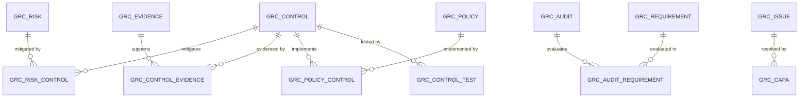
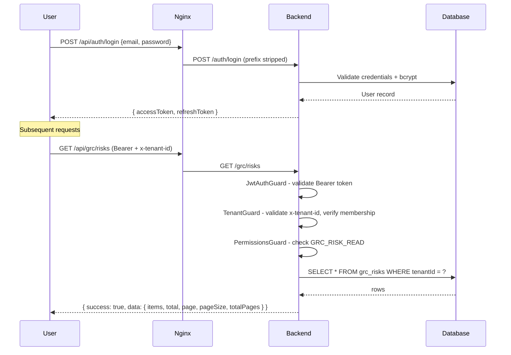

# Technical Architecture Guide

> **Version:** 2.0 | **Last Updated:** 2026-02-26 | **Status:** Final
>
> **Audience:** Product/Engineering, Backend Developers, Solution Architects, Auditors
>
> **Evidence Map:** [EVIDENCE_MAP_v1.md](../discovery/EVIDENCE_MAP_v1.md) — Section 2

---

## Executive Summary

The GRC Platform is a **multi-tenant, enterprise-grade Governance, Risk & Compliance + IT Service Management system** built on a NestJS modular monolith backed by PostgreSQL 15. It combines GRC workflows (risk, policy, control, audit, compliance) with full ITSM capabilities (incident, change, problem, CMDB) and an AI layer (Incident Copilot, AI Admin, Tool Gateway).

**Architecture at a glance:**

- **Backend:** NestJS (Node.js) modular monolith — 28 domain modules, TypeORM, PostgreSQL 15
- **Frontend:** React SPA (TypeScript, Material UI) served by nginx, same-origin API via `/api/*` prefix stripping
- **Multi-tenancy:** Column-level isolation — `tenantId` UUID FK on every domain entity, enforced by `TenantGuard` on every protected route
- **Security:** Three-layer guard stack (`JwtAuthGuard` then `TenantGuard` then `PermissionsGuard`), 200+ granular permissions, AES-256-GCM encryption for secrets at rest, SSRF protection on all outbound calls
- **API:** REST with consistent `{ success, data }` envelope, LIST-CONTRACT pagination, structured JSON error responses
- **Observability:** Structured JSON logging with correlation IDs, Prometheus metrics endpoint, event-driven audit trail
- **CI/CD:** 21 GitHub Actions workflows — lint, build, unit tests, E2E, Docker build, secret scanning (TruffleHog), CodeQL, staging deploy

**Key guarantees:**

| Guarantee | Mechanism | Evidence |
|-----------|-----------|----------|
| Tenant isolation | `tenantId` column + `TenantGuard` | `backend-nest/src/tenants/guards/tenant.guard.ts` |
| Auth on every route | `JwtAuthGuard` (Passport JWT) | `backend-nest/src/auth/guards/jwt-auth.guard.ts` |
| Permission enforcement | `PermissionsGuard` + 200+ `Permission` enum values | `backend-nest/src/auth/permissions/` |
| SSRF prevention | `SsrfGuardService` on all outbound URLs | `backend-nest/src/notification-engine/services/ssrf-guard.service.ts` |
| No schema drift | `DB_SYNC` kill switch exits process in production | `backend-nest/src/app.module.ts` (lines 86-114) |
| Secrets encrypted at rest | AES-256-GCM via `EncryptionService` | `backend-nest/src/ai-admin/encryption/encryption.service.ts` |
| Full audit trail | `AuditInterceptor` emits events on every request | `backend-nest/src/audit/audit.interceptor.ts` |

---

## Table of Contents

1. [Repo and Build Layout](#1-repo-and-build-layout)
2. [Backend Architecture](#2-backend-architecture)
3. [Frontend Architecture](#3-frontend-architecture)
4. [Data Model and Persistence](#4-data-model-and-persistence)
5. [Authentication and Authorization](#5-authentication-and-authorization)
6. [API Standards](#6-api-standards)
7. [Config Management](#7-config-management)
8. [Observability and Audit](#8-observability-and-audit)
9. [Testing and CI](#9-testing-and-ci)
10. [Living Index](#10-living-index)
11. [Implemented vs Planned](#11-implemented-vs-planned)
12. [Validation Checklist](#12-validation-checklist)
---

## 1. Repo and Build Layout

### 1.1 Monorepo Structure

```
grc/
 backend-nest/             # Canonical NestJS backend (PRIMARY)
   src/
     app.module.ts         # Root module - wires all 28 modules
     main.ts               # Bootstrap - port 3002, global pipes, Swagger
     auth/                 # JWT strategy, guards, permissions
     grc/                  # GRC domain (risks, policies, controls, audits...)
     itsm/                 # ITSM domain (incidents, changes, CMDB...)
     ai-admin/             # AI provider config + encryption
     tool-gateway/         # External tool integration (ServiceNow, etc.)
     copilot/              # Incident Copilot AI
     common/               # Shared filters, interceptors, middleware, logger
     config/               # Config module + env validation
     migrations/           # 80+ TypeORM migration files
     scripts/              # Seed scripts, smoke tests, schema contract
   Dockerfile
   package.json
 backend/                  # Legacy Express backend (being phased out)
 frontend/
   src/
     App.tsx               # Route definitions (product + admin routes)
     services/
       api.ts              # Axios client - auth headers, token refresh
       grcClient.ts        # API_PATHS registry + typed request helpers
     contexts/             # AuthContext, NotificationContext, OnboardingContext
     pages/                # Page components (admin/, itsm/, grc/, etc.)
   nginx.conf              # Reverse proxy + /api prefix stripping
   package.json
 docs/
   suite/                  # Six-doc documentation set
   templates/              # Style guide + section template
 .github/workflows/        # 21 CI/CD workflow files
 docker-compose.staging.yml
 docker-compose.nest.yml
```

> **EVIDENCE:** `backend-nest/src/app.module.ts`, `frontend/src/App.tsx`, `frontend/nginx.conf`

### 1.2 Build Outputs

| Target | Command | Output |
|--------|---------|--------|
| Backend (dev) | `npm run start:dev` | ts-node watch, port 3002 |
| Backend (prod) | `npm run build` | `dist/` — compiled JS |
| Frontend (prod) | `npm run build` | `build/` — static assets |
| Docker (staging) | `docker compose -f docker-compose.staging.yml up -d --build` | Two containers: backend + frontend |

> **SECURITY:** Production containers contain only `dist/` — no `src/` directory. All migration and seed commands must use `dist/data-source.js`, not `src/data-source.ts`.

> **EVIDENCE:** `backend-nest/Dockerfile`, `docker-compose.staging.yml`

### 1.3 Key Directories

| Directory | Purpose |
|-----------|---------|
| `backend-nest/src/grc/entities/` | 70+ GRC domain entity files |
| `backend-nest/src/grc/controllers/` | 30+ GRC controller files |
| `backend-nest/src/itsm/` | 18 ITSM sub-modules (incident, change, problem, cmdb, sla, etc.) |
| `backend-nest/src/common/` | Shared infrastructure (filters, interceptors, middleware, logger, list-query) |
| `backend-nest/src/migrations/` | 80+ TypeORM migration files |
| `backend-nest/src/scripts/` | 30+ seed scripts, smoke tests, schema contract |
| `frontend/src/pages/admin/` | 17 admin page components |
| `frontend/src/services/` | API client, telemetry, GRC client |
| `.github/workflows/` | 21 CI/CD workflow files |
---

## 2. Backend Architecture

### 2.1 Application Bootstrap

The application starts in `backend-nest/src/main.ts` (411 lines):

- `NestFactory.create()` with Express adapter
- `trust proxy` enabled (for `x-forwarded-for` behind nginx/Cloudflare)
- Global `ValidationPipe` with `whitelist: true`, `forbidNonWhitelisted: true`, `transform: true`
- CORS configured from `CORS_ORIGINS` env variable
- Swagger UI at `/api/docs` (bearer auth + `x-tenant-id` header documented)
- Database diagnostics at startup: checks for critical tables (`grc_requirements`, `grc_policies`, `grc_risks`, `sys_db_object`, `sys_dictionary`, `dynamic_records`)
- Port: `3002` (default, configurable via `PORT` env)
- Health: `GET /health/live`, `GET /health/ready`, `GET /health/db`, `GET /health/auth`
- Metrics: `GET /metrics` (Prometheus format)

> **EVIDENCE:** `backend-nest/src/main.ts`

### 2.2 Module Map

All 28 modules registered in `app.module.ts`:

| Domain | Module | Path | Status |
|--------|--------|------|--------|
| **Health** | HealthModule | `src/health/` | **[IMPL]** |
| **Auth** | AuthModule | `src/auth/` | **[IMPL]** |
| **Platform** | UsersModule | `src/users/` | **[IMPL]** |
| **Platform** | TenantsModule | `src/tenants/` | **[IMPL]** |
| **Platform** | SettingsModule | `src/settings/` | **[IMPL]** |
| **Platform** | AdminModule | `src/admin/` | **[IMPL]** |
| **Platform** | OnboardingModule | `src/onboarding/` | **[IMPL]** |
| **Platform** | PlatformModule | `src/platform/` | **[IMPL]** |
| **Platform** | TodosModule | `src/todos/` | **[IMPL]** |
| **Platform** | PlatformHealthModule | `src/platform-health/` | **[IMPL]** |
| **GRC** | GrcModule | `src/grc/` | **[IMPL]** |
| **ITSM** | ItsmModule | `src/itsm/` | **[IMPL]** |
| **CMDB** | CmdbModule | `src/itsm/cmdb/` | **[IMPL]** |
| **CMDB** | CmdbImportModule | `src/itsm/cmdb/import/` | **[IMPL]** |
| **CMDB** | CmdbHealthModule | `src/itsm/cmdb/health/` | **[IMPL]** |
| **AI** | CopilotModule | `src/copilot/` | **[IMPL]** |
| **AI** | AiAdminModule | `src/ai-admin/` | **[IMPL]** |
| **AI** | ToolGatewayModule | `src/tool-gateway/` | **[IMPL]** |
| **Observability** | AuditModule | `src/audit/` | **[IMPL]** |
| **Observability** | MetricsModule | `src/metrics/` | **[IMPL]** |
| **Observability** | TelemetryModule | `src/telemetry/` | **[IMPL]** |
| **Notifications** | NotificationsModule | `src/notifications/` | **[IMPL]** |
| **Notifications** | NotificationEngineModule | `src/notification-engine/` | **[IMPL]** |
| **Events** | EventBusModule | `src/event-bus/` | **[IMPL]** |
| **Events** | EventsModule | `src/events/` | **[IMPL]** |
| **Infra** | DashboardModule | `src/dashboard/` | **[IMPL]** |
| **Infra** | JobsModule | `src/jobs/` | **[IMPL]** |
| **Infra** | ApiCatalogModule | `src/api-catalog/` | **[IMPL]** |

> **EVIDENCE:** `backend-nest/src/app.module.ts` (294 lines)

### 2.3 Module Pattern

Every domain module follows the same internal structure:

```
grc/
  grc.module.ts            # Module definition - imports, providers, exports
  controllers/
    grc-risk.controller.ts
    ...
  services/
    grc-risk.service.ts
    ...
  entities/
    grc-risk.entity.ts
    ...
  dto/
    create-risk.dto.ts
    ...
```

**Controller pattern:**

```typescript
@Controller('grc/risks')                          // NO /api prefix
@UseGuards(JwtAuthGuard, TenantGuard, PermissionsGuard)
export class GrcRiskController {
  @Get()
  @Permissions(Permission.GRC_RISK_READ)
  findAll(@TenantId() tenantId: string, @Query() query: ListQueryDto) { ... }
}
```

> **SECURITY:** Controllers use `@Controller('grc/...')` with NO `api/` prefix. Nginx strips `/api` before proxying to the backend. External call: `/api/grc/risks` becomes backend route `/grc/risks`. Do not change this convention.

> **EVIDENCE:** `backend-nest/src/grc/controllers/grc-risk.controller.ts`

### 2.4 Global Middleware Pipeline

Request processing order:

```
Incoming Request
  |
  v
SecurityHeadersMiddleware     CSP, X-Frame-Options, HSTS, Permissions-Policy
  |
  v
CorrelationIdMiddleware       generate/extract x-correlation-id, set logger context
  |
  v
MethodBasedThrottlerGuard     read: 120/min, write: 30/min, auth: 10/min
  |
  v
JwtAuthGuard                  validate Bearer token via Passport JWT strategy
  |
  v
TenantGuard                   validate x-tenant-id header, verify user membership
  |
  v
PermissionsGuard              check user role has required Permission enum values
  |
  v
RequestTimingInterceptor      measure latency
  |
  v
PerformanceInterceptor        log slow requests
  |
  v
ResponseTransformInterceptor  wrap response in { success: true, data: T }
  |
  v
Controller Handler            actual business logic
  |
  v
AuditInterceptor              emit AuditLogEvent on response
  |
  v
GlobalExceptionFilter         catch all errors, return { success: false, error }
```

**Security headers set by `SecurityHeadersMiddleware`:**

| Header | Value |
|--------|-------|
| `X-Frame-Options` | `DENY` |
| `X-Content-Type-Options` | `nosniff` |
| `X-XSS-Protection` | `1; mode=block` |
| `Referrer-Policy` | `strict-origin-when-cross-origin` |
| `Cache-Control` | `no-store, no-cache, must-revalidate, proxy-revalidate` |
| `Content-Security-Policy` | `default-src 'self'; script-src 'self'; style-src 'self' 'unsafe-inline'; img-src 'self' data:; font-src 'self'; connect-src 'self'; frame-ancestors 'none';` |
| `Strict-Transport-Security` | `max-age=31536000; includeSubDomains; preload` (production only) |
| `Permissions-Policy` | Restricts camera, geolocation, microphone, payment, USB |

> **EVIDENCE:** `backend-nest/src/common/middleware/security-headers.middleware.ts`, `backend-nest/src/common/middleware/correlation-id.middleware.ts`

### 2.5 DB_SYNC Kill Switch

`app.module.ts` (lines 86-114) calls `process.exit(1)` if `DB_SYNC=true` is detected when `NODE_ENV` is `production` or `staging`. This prevents TypeORM from auto-syncing the schema, which can cause irreversible data loss.

> **RISK:** `DB_SYNC=true` in production/staging causes immediate process exit. This is intentional safety. Always use `migration:run:prod` for schema changes.

> **EVIDENCE:** `backend-nest/src/app.module.ts` (lines 86-114)

### 2.6 Tool Gateway Architecture

The Tool Gateway provides a secure, policy-controlled bridge to external tools (e.g., ServiceNow):

```
Admin configures provider (base URL, credentials)
  --> EncryptionService encrypts credentials (AES-256-GCM)
  --> SsrfGuardService validates base URL (blocks private IPs, localhost, metadata)
  --> Provider stored in DB (credentials encrypted)

Runtime tool execution:
  --> Policy check (is tool enabled for tenant?)
  --> Provider lookup
  --> SsrfGuardService re-validates URL
  --> Tool executed (ServiceNowToolProvider)
  --> AiAuditEvent logged
```

**Admin endpoints:** `@Controller('grc/admin/tools')` — CRUD for providers, test connection, policy management

**Runtime endpoints:** `@Controller('grc/tools')` — run tool, get tool status

> **SECURITY:** All outbound URLs are validated by `SsrfGuardService` before execution. Private IP ranges (RFC 1918, loopback, link-local, cloud metadata) are blocked. Only HTTPS is allowed by default.

> **EVIDENCE:** `backend-nest/src/tool-gateway/tool-gateway.controller.ts`, `backend-nest/src/tool-gateway/tool-gateway.service.ts`, `backend-nest/src/notification-engine/services/ssrf-guard.service.ts`

### 2.7 AI Control Center Architecture

The AI Admin module manages AI provider configurations (OpenAI, Azure OpenAI, custom endpoints):

- Provider CRUD with encrypted API keys (AES-256-GCM via `EncryptionService`)
- Feature policy management per tenant
- Audit log for all AI operations
- Config resolution: resolves the active provider for a given `featureKey`

**Encryption:** `EncryptionService` uses `AI_ENCRYPTION_KEY` env var (falls back to `JWT_SECRET`-derived key with a warning). Format: `base64(iv:authTag:ciphertext)`.

> **SECURITY:** Set `AI_ENCRYPTION_KEY` explicitly in production. Falling back to `JWT_SECRET` is functional but not recommended. An ephemeral key (no env vars set) means encrypted data is lost on restart.

> **EVIDENCE:** `backend-nest/src/ai-admin/ai-admin.controller.ts`, `backend-nest/src/ai-admin/encryption/encryption.service.ts`

### 2.8 Incident Copilot

The Copilot module provides AI-assisted incident analysis and suggestions:

- AI analysis endpoint on incidents
- Integrates with Tool Gateway for ServiceNow data retrieval
- AI apply-back is strictly allowlisted: only `work_notes` and `additional_comments` fields permitted
- Learning and indexing sub-modules for context building

> **SECURITY:** AI apply-back fields are strictly allowlisted. Only `work_notes` and `additional_comments` are permitted. This prevents AI from writing to arbitrary fields.

> **EVIDENCE:** `backend-nest/src/copilot/copilot.controller.ts`, `backend-nest/src/copilot/`
---

## 3. Frontend Architecture

### 3.1 Technology Stack

| Layer | Technology |
|-------|-----------|
| Framework | React 18 (TypeScript) |
| UI Library | Material UI (MUI) |
| Routing | React Router v6 |
| HTTP Client | Axios (`frontend/src/services/api.ts`) |
| State | React Context (Auth, Notification, Onboarding) |
| Markdown | react-markdown + rehype-raw + rehype-sanitize + remark-gfm |
| Docs Rendering | Custom markdown parser + DOMPurify sanitization |
| Build | Create React App / Webpack |
| Serving | nginx (Docker container, port 80) |

### 3.2 Route Structure

Routes are split into two categories in `frontend/src/App.tsx` (578 lines):

**Product routes** (authenticated, under `Layout`):

| Path | Feature |
|------|---------|
| `/dashboard` | Main dashboard |
| `/risks/*`, `/risk` | Risk management |
| `/policies/*` | Policy management |
| `/requirements/*` | Compliance requirements |
| `/controls/*` | Control management |
| `/evidence/*` | Evidence management |
| `/audits/*` | Audit management |
| `/findings/*` | Audit findings |
| `/standards/*` | Standards library |
| `/soa/*` | Statement of Applicability |
| `/issues/*` | GRC issues |
| `/capa/*` | Corrective actions |
| `/processes/*` | Process management |
| `/itsm/incidents/*` | ITSM incident management |
| `/itsm/changes/*` | ITSM change management |
| `/itsm/problems/*` | ITSM problem management |
| `/itsm/known-errors/*` | Known error database |
| `/itsm/major-incidents/*` | Major incident management |
| `/itsm/services/*` | Service catalog |
| `/itsm/studio/*` | ITSM workflow studio |
| `/itsm/analytics` | ITSM analytics dashboard |
| `/cmdb/cis/*` | CMDB configuration items |
| `/cmdb/classes/*` | CMDB CI classes |
| `/cmdb/services/*` | CMDB service map |
| `/cmdb/import-jobs/*` | CMDB import jobs |
| `/copilot` | Incident Copilot AI |
| `/bcm/services/*` | Business continuity |
| `/calendar` | ITSM calendar |
| `/insights` | GRC insights |
| `/coverage` | Control coverage |
| `/dotwalking` | Dynamic data dot-walking |

**Admin routes** (authenticated, admin-only, under `AdminLayout`):

| Path | Feature |
|------|---------|
| `/admin/users` | User management |
| `/admin/roles` | Role management |
| `/admin/permissions` | Permission viewer |
| `/admin/settings` | Platform settings |
| `/admin/tenants` | Tenant management |
| `/admin/audit-logs` | Audit log viewer |
| `/admin/system` | System info |
| `/admin/data-model` | Data model dictionary |
| `/admin/frameworks` | Compliance frameworks |
| `/admin/platform-builder` | Dynamic table builder |
| `/admin/event-log` | Event bus log |
| `/admin/notification-studio` | Notification templates |
| `/admin/api-catalog` | API catalog |
| `/admin/platform-health` | Platform health dashboard |
| `/admin/ai-control-center` | AI provider management |
| `/admin/tool-gateway` | Tool integration management |
| `/admin/docs` | Docs Center |

> **EVIDENCE:** `frontend/src/App.tsx`

### 3.3 API Client

The Axios client in `frontend/src/services/api.ts` is the single source of truth for HTTP communication:

- **Base URL:** Resolved from `getApiBaseUrl()` — defaults to same-origin `/api` in production
- **Request interceptor:** Injects `Authorization: Bearer <token>` and `x-tenant-id: <uuid>` headers on every request
- **Response interceptor:** Handles 401 (token refresh flow), 429 (rate limit — user-friendly message), and standard error envelope transformation
- **Token refresh:** Automatic silent refresh via `POST /auth/refresh`; on failure, clears localStorage and redirects to `/login`
- **Token storage:** `localStorage` keys: `token`, `accessToken`, `refreshToken`, `tenantId`
- **Telemetry:** Records API calls with correlation IDs for frontend telemetry context

> **EVIDENCE:** `frontend/src/services/api.ts` (368 lines), `frontend/src/services/grcClient.ts`

### 3.4 Docs Center Rendering Stack

The Docs Center (`/admin/docs`) uses a **custom markdown-to-HTML renderer** with DOMPurify sanitization:

1. Markdown files fetched from the backend docs endpoint
2. `markdownToHtml()` converts markdown to HTML using regex transforms
3. Code blocks extracted to placeholders before processing (prevents regex corruption)
4. Inline code HTML-entity-escaped before DOMPurify sanitization
5. `DOMPurify.sanitize()` applied to final HTML before rendering
6. TOC auto-extracted from heading structure
7. Metadata (version, last updated, status) extracted from frontmatter

**XSS posture:** DOMPurify strips any raw HTML that is not produced by the renderer. Angle brackets in code blocks are entity-escaped before sanitization, so placeholder notation in docs renders as visible text.

> **SECURITY:** All rendered markdown passes through DOMPurify. Raw HTML in `.md` files will be stripped. Use only standard markdown syntax in documentation files.

> **EVIDENCE:** `frontend/src/pages/admin/AdminDocsCenter.tsx` (lines 144-255)

### 3.5 Error Handling

- `ErrorBoundary` component wraps the entire app for uncaught React errors
- `InitializationErrorBoundary` catches errors during app initialization
- `errorSanitizer` utility sanitizes error messages before display
- `ApiError` class provides typed error handling for API responses

> **EVIDENCE:** `frontend/src/components/common/ErrorBoundary.tsx`, `frontend/src/utils/errorSanitizer.ts`
---

## 4. Data Model and Persistence

### 4.1 TypeORM Approach

- **ORM:** TypeORM with decorators (`@Entity`, `@Column`, `@ManyToOne`, etc.)
- **Database:** PostgreSQL 15 (dedicated host — not a Docker container in production)
- **Extensions:** `uuid-ossp`, `pgcrypto`
- **Synchronize:** Always `false` in code; `DB_SYNC` env var triggers kill switch if `true` in production

### 4.2 Multi-Tenant Data Model

Every domain entity carries a `tenantId` column:

```typescript
@Column({ type: 'uuid' })
tenantId: string;  // FK to nest_tenants.id
```

All queries are scoped by `tenantId` at the service layer. The `TenantGuard` attaches `request.tenantId` from the validated `x-tenant-id` header, and controllers pass it to services.

**Demo tenant ID:** `00000000-0000-0000-0000-000000000001`

> **SECURITY:** Never query domain entities without a `tenantId` filter. Cross-tenant data leakage is a critical security defect.

### 4.3 Enum Convention

All PostgreSQL enum labels use **UPPERCASE**:

| Enum | Values |
|------|--------|
| Evidence type | `BASELINE`, `TEST`, `PERIODIC` |
| Status (general) | `PLANNED`, `IN_PROGRESS`, `COMPLETED`, `CANCELLED` |

```typescript
@Column({ type: 'enum', enum: EvidenceType, default: EvidenceType.BASELINE })
evidenceType: EvidenceType;
```

> **RISK:** PostgreSQL enums are hard to rename or remove. Use additive/compatible approaches only. Never attempt destructive enum renames in migrations.

### 4.4 Migration Strategy

- **80+ migration files** in `backend-nest/src/migrations/`
- Timestamp-based naming: `UNIX_TIMESTAMP-DescriptiveName.ts`
- Deterministic — no auto-sync in production
- Run via: `npx typeorm migration:run -d dist/data-source.js`
- Always run `migration:show` before `migration:run` to verify pending changes

```bash
# Show pending migrations (inside backend container)
npx typeorm migration:show -d dist/data-source.js

# Run pending migrations
npx typeorm migration:run -d dist/data-source.js
```

> **EVIDENCE:** `backend-nest/src/migrations/` (80+ files), `backend-nest/src/data-source.ts`

### 4.5 Seed Strategy

**30+ seed scripts** in `backend-nest/src/scripts/seed-*.ts`, all idempotent (safe to re-run):

| Category | Scripts | Purpose |
|----------|---------|---------|
| **Required** | `seed-grc`, `seed-itsm-baseline`, `seed-dictionary-core`, `seed-frameworks`, `seed-standards`, `seed-onboarding`, `seed-itsm-choices`, `seed-risk-categories` | Core data required for production |
| **Demo** | `seed-demo-story`, `seed-golden-flow`, `seed-cmdb-mi-demo`, `seed-cab-demo`, `seed-itsm-analytics-demo`, `seed-notification-demo`, `seed-webhook-demo` | Demo/showcase data |
| **Platform** | `seed-cmdb-baseline`, `seed-cmdb-content-pack-v1`, `seed-platform-builder`, `seed-api-catalog-demo`, `seed-soa`, `seed-service-portfolio` | Platform configuration |
| **ITSM** | `seed-change-governance-demo`, `seed-change-task-demo`, `seed-change-task-sla-demo`, `seed-sla-v2-demo`, `seed-topology-demo`, `seed-topology-closed-loop-demo` | ITSM demo scenarios |

All seeds use the demo tenant ID `00000000-0000-0000-0000-000000000001` and are safe to re-run.

> **EVIDENCE:** `backend-nest/src/scripts/seed-*.ts` (30+ files)

### 4.6 Key Entity Relationships



> **NOTE:** Standards and clauses exist in legacy tables `standards` and `standard_clauses` (NOT `grc_standards`/`grc_standard_clauses`).

> **EVIDENCE:** `backend-nest/src/grc/entities/` (70+ entity files)
---

## 5. Authentication and Authorization

### 5.1 Auth Flow



### 5.2 Guard Stack

The three guards must always be applied in this order:

| Guard | File | Responsibility |
|-------|------|---------------|
| `JwtAuthGuard` | `src/auth/guards/jwt-auth.guard.ts` | Validates Bearer JWT token via Passport `jwt` strategy. Routes decorated with `@Public()` bypass this guard. |
| `TenantGuard` | `src/tenants/guards/tenant.guard.ts` | Reads `x-tenant-id` header, validates UUID format, verifies user belongs to that tenant, attaches `request.tenantId`. Emits `TenantAccessedEvent` for audit. |
| `PermissionsGuard` | `src/auth/permissions/permissions.guard.ts` | Reads `@Permissions(...)` decorator, checks user role has ALL required permissions. Logs structured `access.denied` event on failure. |

```typescript
// Standard usage on every protected controller method
@Permissions(Permission.GRC_RISK_READ)
@UseGuards(JwtAuthGuard, TenantGuard, PermissionsGuard)
@Get()
findAll() { ... }
```

> **SECURITY:** The guard stack order is critical. `JwtAuthGuard` must run before `TenantGuard` (needs `request.user`). `TenantGuard` must run before `PermissionsGuard` (needs `request.tenantId`). Never disable or bypass these guards.

> **EVIDENCE:** `backend-nest/src/auth/guards/jwt-auth.guard.ts`, `backend-nest/src/tenants/guards/tenant.guard.ts`, `backend-nest/src/auth/permissions/permissions.guard.ts`

### 5.3 Permission System

200+ granular permissions defined in `Permission` enum, organized by domain:

| Domain | Example Permissions |
|--------|-------------------|
| GRC | `GRC_RISK_READ`, `GRC_RISK_WRITE`, `GRC_POLICY_READ`, `GRC_POLICY_WRITE`, `GRC_CONTROL_READ`, `GRC_AUDIT_READ`, `GRC_EVIDENCE_READ` |
| ITSM | `ITSM_INCIDENT_READ`, `ITSM_INCIDENT_WRITE`, `ITSM_CHANGE_READ`, `ITSM_CHANGE_WRITE`, `ITSM_SERVICE_READ` |
| Admin | `ADMIN_USERS_READ`, `ADMIN_USERS_WRITE`, `ADMIN_ROLES_READ`, `ADMIN_SETTINGS_READ`, `ADMIN_SETTINGS_WRITE` |
| Platform | `PLATFORM_CMDB_READ`, `PLATFORM_CMDB_WRITE`, `PLATFORM_NOTIFICATION_READ`, `PLATFORM_API_CATALOG_READ` |

Naming convention: `MODULE_RESOURCE_ACTION` (e.g., `GRC_RISK_READ`).

Each permission has a human-readable description in `PermissionDescriptions`.

> **EVIDENCE:** `backend-nest/src/auth/permissions/permission.enum.ts` (384 lines)

### 5.4 Token Lifecycle

| Token | Storage | TTL | Refresh |
|-------|---------|-----|---------|
| Access token | `localStorage.token` | `JWT_EXPIRES_IN` (default: 24h) | Via refresh token |
| Refresh token | `localStorage.refreshToken` | `REFRESH_TOKEN_EXPIRES_IN` (default: 7d) | Re-login required |

### 5.5 LDAP/SSO [PARTIAL]

> **PLANNED:** LDAP directory structure exists at `src/auth/ldap/` but full integration depth is unverified.

### 5.6 MFA [PARTIAL]

> **PLANNED:** MFA directory structure exists at `src/auth/mfa/` but full integration depth is unverified.
---

## 6. API Standards

### 6.1 URL Conventions

```
External (via nginx):   GET /api/grc/risks?page=1&pageSize=20
Backend receives:       GET /grc/risks?page=1&pageSize=20
Controller prefix:      @Controller('grc/risks')
```

**Pattern:** `/<domain>/<resource>[/<id>][/<sub-resource>]`

All controllers use `grc/` prefix (no `api/` prefix). Nginx strips `/api` via `proxy_pass http://backend/;` (trailing slash is critical for prefix stripping).

> **VALIDATION:** `curl -i http://localhost/api/grc/controls` (unauthenticated) must return `401`, not `404`. A `404` indicates broken routing.

### 6.2 Response Envelope

All successful responses are wrapped by `ResponseTransformInterceptor`:

```json
{
  "success": true,
  "data": {}
}
```

For paginated list responses (LIST-CONTRACT format):

```json
{
  "success": true,
  "data": {
    "items": [],
    "total": 100,
    "page": 1,
    "pageSize": 20,
    "totalPages": 5
  }
}
```

> **EVIDENCE:** `backend-nest/src/common/interceptors/response-transform.interceptor.ts`

### 6.3 Error Response Format

All errors are caught by `GlobalExceptionFilter` and returned as:

```json
{
  "success": false,
  "error": {
    "code": "VALIDATION_ERROR",
    "message": "Validation failed",
    "details": {},
    "fieldErrors": [
      { "field": "email", "message": "must be a valid email" }
    ]
  }
}
```

**Error codes:**

| Code | HTTP Status | Cause |
|------|-------------|-------|
| `BAD_REQUEST` | 400 | Malformed request |
| `UNAUTHORIZED` | 401 | Missing or invalid JWT |
| `FORBIDDEN` | 403 | Insufficient permissions |
| `NOT_FOUND` | 404 | Resource not found |
| `CONFLICT` | 409 | Duplicate resource |
| `VALIDATION_ERROR` | 422 | DTO validation failure |
| `TOO_MANY_REQUESTS` | 429 | Rate limit exceeded |
| `INTERNAL_SERVER_ERROR` | 500 | Unhandled exception |
| `SERVICE_UNAVAILABLE` | 503 | Downstream service down |

**Diagnosing 403 errors:** Determine the source:

- **(A) Cloudflare challenge** — HTML response body (not JSON)
- **(B) Nginx** — plain 403, no JSON body
- **(C) Backend PermissionsGuard** — JSON `{ success: false, error: { code: "FORBIDDEN" } }`

> **EVIDENCE:** `backend-nest/src/common/filters/global-exception.filter.ts` (273 lines)

### 6.4 Pagination and Filtering

The `list-query` system provides universal filtering for list endpoints:

- `?page=1&pageSize=20` — pagination
- `?q=search+term` — quick search (max 120 chars)
- `?filter=<json>` — structured filter tree (max 4000 chars, max depth 5, max 30 conditions)
- `?sort=field:asc` — sorting (allowlisted fields only)

**Filter operators by field type:**

| Field Type | Operators |
|-----------|-----------|
| `string` | `is`, `is_not`, `is_empty`, `is_not_empty`, `contains`, `not_contains` |
| `enum` | `is`, `is_not`, `is_empty`, `is_not_empty` |
| `date` | `is`, `is_not`, `is_empty`, `is_not_empty`, `after`, `before`, `gt`, `lt`, `gte`, `lte` |
| `number` | `is`, `is_not`, `is_empty`, `is_not_empty`, `gt`, `lt`, `gte`, `lte` |
| `uuid` | `is`, `is_not`, `is_empty`, `is_not_empty` |
| `boolean` | `is`, `is_not`, `is_empty`, `is_not_empty` |

**Filter tree example:**

```json
{
  "and": [
    { "field": "status", "op": "is", "value": "IN_PROGRESS" },
    { "field": "createdAt", "op": "after", "value": "2025-01-01" }
  ]
}
```

**Security limits:**

| Limit | Default |
|-------|---------|
| Max search length | 120 chars |
| Max filter JSON length | 4000 chars |
| Max filter depth | 5 levels |
| Max conditions | 30 |

> **EVIDENCE:** `backend-nest/src/common/list-query/` (7 files including spec)

### 6.5 Rate Limiting

| Scope | Limit | Applies To |
|-------|-------|-----------|
| `read` | 120 req/min | GET endpoints |
| `write` | 30 req/min | POST, PUT, PATCH, DELETE |
| `auth` | 10 req/min | `/auth/*` endpoints |

On limit exceeded: `429 Too Many Requests` with `Retry-After` header.

> **EVIDENCE:** `backend-nest/src/app.module.ts` (ThrottlerModule config)

### 6.6 SSRF-Safe Outbound Policy

All outbound HTTP calls (Tool Gateway, AI providers, webhooks) must pass through `SsrfGuardService.validateUrl()`:

- Only HTTPS allowed (unless `allowInsecure` explicitly set)
- Blocked hostnames: `localhost`, `metadata.google.internal`, `metadata`, `instance-data`
- Blocked IP ranges: loopback (`127.x`), private (`10.x`, `172.16-31.x`, `192.168.x`), link-local (`169.254.x`), IPv6 private ranges, cloud metadata (`100.64-127.x`)
- URLs with embedded credentials rejected
- Invalid port numbers rejected

> **SECURITY:** Never call external URLs without first passing through `SsrfGuardService`. This prevents SSRF attacks that could expose internal services or cloud metadata.

> **EVIDENCE:** `backend-nest/src/notification-engine/services/ssrf-guard.service.ts`
---

## 7. Config Management

### 7.1 Environment Variables

Config loaded via NestJS `ConfigModule` with fail-fast validation (`class-validator`):

| Variable | Required | Secret | Default | Description |
|----------|----------|--------|---------|-------------|
| `JWT_SECRET` | Yes | Yes | -- | JWT signing secret (min 32 chars). No fallback. |
| `REFRESH_TOKEN_SECRET` | Yes | Yes | -- | Refresh token signing secret |
| `REFRESH_TOKEN_EXPIRES_IN` | Yes | No | `7d` | Refresh token TTL |
| `JWT_EXPIRES_IN` | No | No | `24h` | Access token TTL |
| `DB_HOST` | Yes | No | `localhost` | PostgreSQL host (dedicated DB host IP in prod) |
| `DB_PORT` | No | No | `5432` | PostgreSQL port |
| `DB_USER` | Yes | No | `postgres` | PostgreSQL user |
| `DB_PASSWORD` | Yes | Yes | -- | PostgreSQL password |
| `DB_NAME` | Yes | No | `grc_platform` | Database name |
| `DB_SYNC` | Yes | No | `false` | **MUST be `false` in production** |
| `NODE_ENV` | Yes | No | `development` | `production` / `staging` / `development` |
| `PORT` | No | No | `3002` | Backend port |
| `CORS_ORIGINS` | No | No | `http://localhost:3000,...` | Allowed CORS origins |
| `AI_ENCRYPTION_KEY` | Optional | Yes | -- | AES-256-GCM key for AI secrets |
| `NEST_AUDIT_LOG_ENABLED` | No | No | `true` | Enable/disable audit logging |
| `DEMO_ADMIN_EMAIL` | Yes | No | -- | Initial admin email |
| `DEMO_ADMIN_PASSWORD` | Yes | Yes | -- | Initial admin password |
| `NEST_API_URL` | No | No | `http://localhost:3002` | Backend self-URL |
| `LOG_LEVEL` | No | No | `INFO` | Log level (ERROR, WARN, INFO, DEBUG, VERBOSE) |

> **SECURITY:** Never commit secret values. Use `.env` files excluded from git. Generate secrets with `openssl rand -hex 32`. Do not use fallback values for secrets in code — use environment variables only.

> **EVIDENCE:** `backend-nest/src/config/configuration.ts`, `backend-nest/src/config/validation.ts`

### 7.2 Config Validation

The `EnvironmentVariables` class uses `class-validator` decorators for fail-fast validation at startup:

```typescript
class EnvironmentVariables {
  @IsNotEmpty()
  JWT_SECRET: string;  // Required - no default, no fallback
  // ...
}
```

If validation fails, the process exits with a descriptive error listing all missing/invalid variables.

> **EVIDENCE:** `backend-nest/src/config/validation.ts`

### 7.3 Per-Tenant Settings

The `SettingsModule` provides per-tenant configuration stored in the database. Tenants can override platform defaults for their specific needs.

> **EVIDENCE:** `backend-nest/src/settings/`

### 7.4 Encryption at Rest

The `EncryptionService` provides AES-256-GCM encryption for sensitive configuration values:

- **Algorithm:** `aes-256-gcm` with 16-byte IV and 16-byte auth tag
- **Key source:** `AI_ENCRYPTION_KEY` env var (preferred) or derived from `JWT_SECRET` (fallback with warning)
- **Format:** `base64(iv + authTag + ciphertext)`
- **Used by:** Tool Gateway (provider credentials), AI Admin (API keys)

> **EVIDENCE:** `backend-nest/src/ai-admin/encryption/encryption.service.ts`
---

## 8. Observability and Audit

### 8.1 Structured Logging

`StructuredLoggerService` outputs JSON to stdout/stderr:

```json
{
  "timestamp": "2026-02-26T12:00:00.000Z",
  "level": "INFO",
  "message": "GET /grc/risks",
  "correlationId": "abc-123",
  "tenantId": "00000000-0000-0000-0000-000000000001",
  "userId": "user-uuid",
  "path": "/grc/risks",
  "method": "GET",
  "latencyMs": 45,
  "statusCode": 200
}
```

- Log level controlled by `LOG_LEVEL` env var (`ERROR`, `WARN`, `INFO`, `DEBUG`, `VERBOSE`)
- PII/token sanitization via `sanitizeLogData` and `sanitizeString`
- Correlation ID propagated from `x-correlation-id` header (or generated if absent)
- Context includes: `correlationId`, `tenantId`, `userId`, `path`, `method`
- Context cleared after each request completes

> **EVIDENCE:** `backend-nest/src/common/logger/structured-logger.service.ts` (328 lines), `backend-nest/src/common/middleware/correlation-id.middleware.ts`

### 8.2 Audit Trail

`AuditInterceptor` (global) emits `AuditLogEvent` on every non-health API request:

- Captures: `userId`, `tenantId`, `action` (METHOD + path), `resource`, `resourceId`, `statusCode`, `ipAddress`, `duration`, `userAgent`
- Excludes: `/health`, `/health/live`, `/health/ready`, `/metrics`, `/favicon.ico`
- Events emitted via `EventEmitter2` and persisted by `AuditService`
- Viewable in Admin UI at `/admin/audit-logs`

> **EVIDENCE:** `backend-nest/src/audit/audit.interceptor.ts`, `backend-nest/src/audit/`

### 8.3 Metrics

Prometheus-compatible metrics exposed at `GET /metrics` (port 3002).

> **PLANNED:** No Grafana dashboards or alerting rules exist in the repo. The `/metrics` endpoint is available for Prometheus integration.

### 8.4 Platform Health Dashboard

Admin UI at `/admin/platform-health` shows smoke test results and health run history.

> **EVIDENCE:** `backend-nest/src/platform-health/`

### 8.5 Telemetry

Frontend telemetry service records API calls with correlation IDs for debugging context.

> **EVIDENCE:** `backend-nest/src/telemetry/`, `frontend/src/services/telemetryService.ts`
---

## 9. Testing and CI

### 9.1 Test Layers

| Layer | Framework | Location | Command |
|-------|-----------|----------|---------|
| Unit tests | Jest | `**/*.spec.ts` | `cd backend-nest && npm test` |
| Integration tests | Jest | `**/*.integration-spec.ts` | `cd backend-nest && npm run test:integration` |
| E2E smoke tests | Custom scripts | `src/scripts/smoke-*.ts` | `npm run smoke:*` |
| Schema contract | Custom script | `src/scripts/schema-contract.ts` | `npm run schema:contract` |
| Platform validation | Custom script | `src/scripts/platform-validate.ts` | `npm run platform:validate:prod` |
| Frontend unit tests | Jest + RTL | `**/*.test.tsx` | `cd frontend && npm test` |

### 9.2 Determinism Rules

- TypeORM migrations must be deterministic (no random data, no `Date.now()` in schema)
- Seed scripts must be idempotent (safe to re-run without duplicating data)
- Tests must not depend on external services (use mocks/stubs)
- `platform:validate:prod` must remain green after all changes

### 9.3 CI Workflow Inventory

21 GitHub Actions workflows in `.github/workflows/`:

| Workflow | Trigger | Purpose |
|----------|---------|---------|
| `backend-nest-ci.yml` | PR, push | Backend lint, build, unit tests |
| `frontend-ci.yml` | PR, push | Frontend lint, build, unit tests |
| `e2e-smoke.yml` | PR, push | E2E smoke tests |
| `e2e-smoke-real.yml` | PR, push | E2E against real backend |
| `e2e-tests.yml` | PR, push | Full E2E test suite |
| `e2e-mock-ui.yml` | PR, push | UI mock tests |
| `deploy-staging.yml` | Push to main | SSH deploy to staging |
| `deploy-preflight.yml` | PR | Disk preflight check |
| `docker-build-preflight.yml` | PR | Docker build validation |
| `secret-scanning.yml` | PR, push | TruffleHog secret scan |
| `secret-pattern-check.yml` | PR, push | Custom credential pattern check |
| `credential-check.yml` | PR, push | Credential detection |
| `codeql.yml` | PR, push | CodeQL static analysis |
| `platform-health-nightly.yml` | Schedule | Nightly health checks |
| `platform-health-smoke.yml` | PR, push | Platform health smoke |
| `platform-validate-dist.yml` | PR, push | Dist build validation |
| `smoke-staging.yml` | Post-deploy | Staging smoke tests |
| `staging-smoke.yml` | Post-deploy | Staging validation |
| `scenario-pack-smoke.yml` | PR, push | Scenario pack tests |
| `db-bootstrap-preflight.yml` | PR | DB bootstrap validation |
| `backend-ci.yml` | PR, push | Legacy backend CI |

> **EVIDENCE:** `.github/workflows/` (21 files)

### 9.4 Quality Gates

- Lint must pass (ESLint for both backend and frontend)
- Unit tests must pass
- TruffleHog secret scan must pass (no secrets in code)
- CodeQL security analysis must pass
- Docker build must succeed
- `platform:validate:prod` must remain green
---

## 10. Living Index

### 10.1 GRC Core

| Module | Key Entities | Key Endpoints (backend) | Key UI Routes |
|--------|-------------|------------------------|---------------|
| **Risk** | `grc-risk.entity.ts`, `grc-risk-control.entity.ts`, `grc-risk-category.entity.ts` | `GET/POST /grc/risks`, `GET/PATCH /grc/risks/:id` | `/risks`, `/risks/:id` |
| **Policy** | `grc-policy.entity.ts`, `grc-policy-version.entity.ts`, `grc-policy-control.entity.ts` | `GET/POST /grc/policies`, `GET /grc/policies/:id/versions` | `/policies`, `/policies/:id` |
| **Control** | `grc-control.entity.ts`, `grc-control-evidence.entity.ts`, `grc-control-test.entity.ts` | `GET/POST /grc/controls`, `GET/PATCH /grc/controls/:id` | `/controls`, `/controls/:id` |
| **Evidence** | `grc-evidence.entity.ts`, `grc-evidence-test-result.entity.ts` | `GET/POST /grc/evidence`, `GET /grc/evidence/:id` | `/evidence`, `/evidence/:id` |
| **Requirement** | `grc-requirement.entity.ts`, `grc-requirement-control.entity.ts` | `GET/POST /grc/requirements` | `/requirements`, `/requirements/:id` |
| **Audit** | `grc-audit.entity.ts`, `grc-audit-requirement.entity.ts` | `GET/POST /grc/audits`, `GET /grc/audits/:id` | `/audits`, `/audits/:id` |
| **Issue** | `grc-issue.entity.ts`, `grc-issue-evidence.entity.ts` | `GET/POST /grc/issues` | `/issues`, `/issues/:id` |
| **CAPA** | `grc-capa.entity.ts`, `grc-capa-task.entity.ts` | `GET/POST /grc/capa` | `/capa`, `/capa/:id` |
| **SOA** | `grc-soa-profile.entity.ts`, `grc-soa-item.entity.ts` | `GET/POST /grc/soa` | `/soa` |
| **Standards** | `standard.entity.ts`, `standard-clause.entity.ts` | `GET /grc/standards`, `GET /grc/standards/:id/clauses` | `/standards` |
| **BCM** | `bcm-service.entity.ts`, `bcm-plan.entity.ts`, `bcm-exercise.entity.ts` | `GET /grc/bcm/services`, `GET /grc/bcm/plans` | `/bcm/services`, `/bcm/exercises` |
| **Customer Risk** | `customer-risk-catalog.entity.ts`, `customer-risk-binding.entity.ts` | `GET /grc/customer-risks` | `/risk` |
| **Coverage** | (cross-entity) | `GET /grc/coverage` | `/coverage` |
| **Insights** | (cross-entity) | `GET /grc/insights` | `/insights` |

> **EVIDENCE:** `backend-nest/src/grc/entities/` (70+ files), `backend-nest/src/grc/controllers/`

### 10.2 ITSM Core

| Module | Key Entities | Key Endpoints (backend) | Key UI Routes |
|--------|-------------|------------------------|---------------|
| **Incident** | `incident.entity.ts`, `incident-ci.entity.ts`, `incident-ai-analysis.entity.ts` | `GET/POST /grc/itsm/incidents` | `/itsm/incidents`, `/itsm/incidents/:id` |
| **Change** | `change.entity.ts`, `change-ci.entity.ts` | `GET/POST /grc/itsm/changes` | `/itsm/changes`, `/itsm/changes/:id` |
| **Problem** | (in problem module) | `GET/POST /grc/itsm/problems` | `/itsm/problems`, `/itsm/problems/:id` |
| **Known Error** | (in known-error module) | `GET /grc/itsm/known-errors` | `/itsm/known-errors` |
| **Major Incident** | (in major-incident module) | `GET /grc/itsm/major-incidents` | `/itsm/major-incidents` |
| **Service** | `itsm-service.entity.ts` | `GET /grc/itsm/services` | `/itsm/services` |
| **SLA** | (in sla module) | `GET /grc/itsm/sla` | (admin) |
| **Analytics** | (in analytics module) | `GET /grc/itsm/analytics` | `/itsm/analytics` |
| **Business Rule** | (in business-rule module) | `GET /grc/itsm/business-rules` | `/itsm/studio` |
| **Journal** | (in journal module) | `POST /grc/itsm/:type/:id/journal` | (inline in records) |
| **Diagnostics** | (in diagnostics module) | `GET /grc/itsm/diagnostics` | `/itsm/diagnostics` |
| **CAB** | (in change/cab module) | `GET /grc/itsm/cab` | `/itsm/change-management/cab` |

> **EVIDENCE:** `backend-nest/src/itsm/`

### 10.3 CMDB

| Module | Key Entities | Key Endpoints (backend) | Key UI Routes |
|--------|-------------|------------------------|---------------|
| **CI** | (in ci module) | `GET/POST /grc/cmdb/cis`, `GET /grc/cmdb/cis/:id` | `/cmdb/cis`, `/cmdb/cis/:id` |
| **CI Class** | (in ci-class module) | `GET/POST /grc/cmdb/classes` | `/cmdb/classes` |
| **Relationship** | (in ci-rel module) | `GET /grc/cmdb/relationships` | (inline in CI detail) |
| **Relationship Type** | (in relationship-type module) | `GET /grc/cmdb/relationship-types` | `/cmdb/relationship-types` |
| **Service** | (in cmdb/service module) | `GET /grc/cmdb/services` | `/cmdb/services` |
| **Topology** | (in topology module) | `GET /grc/cmdb/topology` | (inline) |
| **Health Rules** | (in health module) | `GET /grc/cmdb/health-rules`, `GET /grc/cmdb/health-findings` | (admin) |
| **Quality** | (in health module) | `GET /grc/cmdb/quality` | (admin) |
| **Import** | (in import module) | `POST /grc/cmdb/import` | `/cmdb/import-jobs` |
| **Service Offering** | (in service-offering module) | `GET /grc/cmdb/service-offerings` | (inline) |

> **EVIDENCE:** `backend-nest/src/itsm/cmdb/`

### 10.4 AI Control Center

| Module | Key Entities | Key Endpoints (backend) | Key UI Routes |
|--------|-------------|------------------------|---------------|
| **AI Admin** | `ai-provider-config`, `ai-audit-event` | `GET/POST /grc/admin/ai/providers`, `GET /grc/admin/ai/audit`, `GET /grc/admin/ai/config/resolve`, `GET/PUT /grc/admin/ai/policies` | `/admin/ai-control-center` |
| **Copilot** | `incident-ai-analysis` | `POST /grc/itsm/incidents/:id/copilot/analyze` | `/copilot` |

> **EVIDENCE:** `backend-nest/src/ai-admin/`, `backend-nest/src/copilot/`

### 10.5 Tool Gateway

| Module | Key Entities | Key Endpoints (backend) | Key UI Routes |
|--------|-------------|------------------------|---------------|
| **Admin** | `tool-provider`, `tool-policy` | `GET/POST/PATCH/DELETE /grc/admin/tools/providers`, `POST /grc/admin/tools/providers/:id/test`, `GET/PUT /grc/admin/tools/policies` | `/admin/tool-gateway` |
| **Runtime** | -- | `POST /grc/tools/run`, `GET /grc/tools/status` | (used by Copilot) |

> **EVIDENCE:** `backend-nest/src/tool-gateway/`

### 10.6 Docs Center and Platform

| Module | Key Files | Key Endpoints | Key UI Routes |
|--------|-----------|---------------|---------------|
| **Docs Center** | `docs/suite/*.md` (7 documents) | Static files served by nginx | `/admin/docs` |
| **Renderer** | `AdminDocsCenter.tsx` | -- | `/admin/docs` |

**Document registry:**

| ID | Title | File | Status |
|----|-------|------|--------|
| 01A | Installation and Deployment Guide | `01A_INSTALLATION_GUIDE.md` | Final |
| 01 | Infrastructure and Operations | `01_INFRASTRUCTURE.md` | Final |
| 02 | Technical Architecture | `02_TECHNICAL.md` | Final |
| 03 | ITSM Module | `03_ITSM.md` | Outline |
| 04 | GRC Module | `04_GRC.md` | Outline |
| 05 | ITSM-GRC Bridges | `05_ITSM_GRC_BRIDGES.md` | Outline |
| 06 | AI Features | `06_AI_FEATURES.md` | Outline |

> **EVIDENCE:** `frontend/src/pages/admin/AdminDocsCenter.tsx`, `docs/suite/`
---

## 11. Implemented vs Planned

| Component | Status | Notes |
|-----------|--------|-------|
| **GRC Core** (risk, policy, control, evidence, audit, requirement) | **[IMPL]** | Full CRUD, cross-linking, LIST-CONTRACT |
| **GRC Issues and CAPA** | **[IMPL]** | Full lifecycle management |
| **GRC SOA** | **[IMPL]** | Statement of Applicability with control links |
| **GRC BCM** | **[IMPL]** | Business continuity services, plans, exercises |
| **Standards and Clauses** | **[IMPL]** | Legacy tables (`standards`, `standard_clauses`) |
| **Compliance Frameworks** | **[IMPL]** | Framework management + tenant assignment |
| **Customer Risk Catalog** | **[IMPL]** | Risk catalog with bindings and observations |
| **ITSM Incident** | **[IMPL]** | Full lifecycle, SLA, journal, CI linking |
| **ITSM Change** | **[IMPL]** | Full lifecycle, CAB, approval, CI linking |
| **ITSM Problem** | **[IMPL]** | Problem management + known error database |
| **ITSM Major Incident** | **[IMPL]** | Major incident process + PIR |
| **ITSM SLA** | **[IMPL]** | SLA definitions + breach tracking |
| **ITSM Business Rules** | **[IMPL]** | Configurable automation rules |
| **ITSM UI Policies** | **[IMPL]** | Field visibility/mandatory rules |
| **ITSM Analytics** | **[IMPL]** | ITSM metrics dashboard |
| **ITSM Workflow** | **[IMPL]** | Workflow engine for ITSM processes |
| **CMDB CI Management** | **[IMPL]** | CI CRUD, class hierarchy, relationships |
| **CMDB Topology** | **[IMPL]** | Visual topology map |
| **CMDB Health** | **[IMPL]** | Health rules + findings + quality scoring |
| **CMDB Import** | **[IMPL]** | Bulk CI import jobs |
| **AI Control Center** | **[IMPL]** | Provider config, encryption, audit, policy |
| **Incident Copilot** | **[IMPL]** | AI analysis, apply-back (allowlisted fields) |
| **Tool Gateway** | **[IMPL]** | ServiceNow integration, SSRF protection, policy |
| **Docs Center** | **[IMPL]** | Markdown rendering, DOMPurify, TOC, search |
| **Platform Builder** | **[IMPL]** | Dynamic table/dictionary management |
| **Notification Engine** | **[IMPL]** | Event-driven notifications, templates |
| **API Catalog** | **[IMPL]** | API endpoint registry |
| **Audit Trail** | **[IMPL]** | Full request audit logging |
| **Structured Logging** | **[IMPL]** | JSON logs with correlation IDs |
| **Prometheus Metrics** | **[IMPL]** | `/metrics` endpoint |
| **Rate Limiting** | **[IMPL]** | Method-based throttling (read/write/auth) |
| **SSRF Protection** | **[IMPL]** | SsrfGuardService on all outbound calls |
| **Grafana Dashboards** | **[PLANNED]** | No dashboards in repo yet |
| **Alerting Rules** | **[PLANNED]** | No alerting config in repo yet |
| **WebSocket / Real-time** | **[PLANNED]** | Nginx locations configured, no backend impl |
| **Redis / Message Queue** | **[PLANNED]** | No Redis/Bull in current stack |
| **Full-text Search** | **[PLANNED]** | No Elasticsearch; basic `q=` search only |
| **LDAP/SSO** | **[PARTIAL]** | Directory structure exists, depth unverified |
| **MFA** | **[PARTIAL]** | Directory structure exists, depth unverified |
| **HA / Clustering** | **[PLANNED]** | Single-node Docker Compose only |
| **Kubernetes Manifests** | **[PLANNED]** | No K8s manifests in repo |
| **Automated Backups** | **[PLANNED]** | Manual `pg_dump` only; cron recommended |
---

## 12. Validation Checklist

| # | Check | Expected | Command / Method | Status |
|---|-------|----------|-----------------|--------|
| 1 | Backend builds | No errors | `cd backend-nest && npm run build` | PASS / FAIL |
| 2 | Backend lint | No errors | `cd backend-nest && npm run lint` | PASS / FAIL |
| 3 | Frontend lint | No errors | `cd frontend && npm run lint` | PASS / FAIL |
| 4 | Unit tests pass | All green | `cd backend-nest && npm test` | PASS / FAIL |
| 5 | Routing convention | 401 (not 404) | `curl -i http://localhost/api/grc/controls` (no auth) | PASS / FAIL |
| 6 | Auth login | 200 + tokens | `POST /api/auth/login` with valid credentials | PASS / FAIL |
| 7 | Guard stack active | 401 without token | `GET /api/grc/risks` (no Authorization header) | PASS / FAIL |
| 8 | Tenant isolation | 403 wrong tenant | `GET /api/grc/risks` with wrong `x-tenant-id` | PASS / FAIL |
| 9 | Response envelope | `{ success: true, data }` | Any authenticated API call | PASS / FAIL |
| 10 | LIST-CONTRACT | `{ items, total, page, pageSize, totalPages }` | `GET /api/grc/risks?page=1&pageSize=5` | PASS / FAIL |
| 11 | Rate limiting | 429 after threshold | Rapid-fire `POST /api/auth/login` (>10/min) | PASS / FAIL |
| 12 | Health endpoints | 200 OK | `GET /api/health/live`, `GET /api/health/ready` | PASS / FAIL |
| 13 | DB_SYNC kill switch | Process exits | Set `DB_SYNC=true` in staging — backend should not start | PASS / FAIL |
| 14 | Audit log populated | Records created | Check `/admin/audit-logs` after any API call | PASS / FAIL |
| 15 | SSRF protection | 400 on private IP | `POST /api/grc/admin/tools/providers` with `baseUrl: "http://192.168.1.1"` | PASS / FAIL |
| 16 | Encryption service | Secrets not in plaintext | Check `tool_providers` table — credentials should be base64 ciphertext | PASS / FAIL |
| 17 | Migrations current | No pending | `npx typeorm migration:show -d dist/data-source.js` | PASS / FAIL |
| 18 | Platform validate | All green | `npm run platform:validate:prod` | PASS / FAIL |
| 19 | Docs Center renders | Markdown visible | Navigate to `/admin/docs`, select a document | PASS / FAIL |
| 20 | Secret scan | No secrets detected | TruffleHog CI workflow passes | PASS / FAIL |
---

## Appendix

### A. Related Documents

- [Infrastructure Guide](./01_INFRASTRUCTURE.md) — Deployment topology, Docker Compose, nginx, CI/CD
- [Installation Guide](./01A_INSTALLATION_GUIDE.md) — Step-by-step setup, seed data, post-deploy validation
- [ITSM Guide](./03_ITSM.md) — ITSM module deep-dive (outline)
- [GRC Guide](./04_GRC.md) — GRC module deep-dive (outline)
- [ITSM-GRC Bridges](./05_ITSM_GRC_BRIDGES.md) — Cross-module integration patterns (outline)
- [AI Features](./06_AI_FEATURES.md) — AI Control Center, Copilot, Tool Gateway deep-dive (outline)
- [Evidence Map](../discovery/EVIDENCE_MAP_v1.md) — Full code evidence index

### B. Key File Quick Reference

| Topic | File |
|-------|------|
| Root module (all 28 modules) | `backend-nest/src/app.module.ts` |
| Bootstrap (port, pipes, Swagger) | `backend-nest/src/main.ts` |
| JWT guard | `backend-nest/src/auth/guards/jwt-auth.guard.ts` |
| Tenant guard | `backend-nest/src/tenants/guards/tenant.guard.ts` |
| Permissions guard | `backend-nest/src/auth/permissions/permissions.guard.ts` |
| Permission enum (200+ values) | `backend-nest/src/auth/permissions/permission.enum.ts` |
| Response envelope | `backend-nest/src/common/interceptors/response-transform.interceptor.ts` |
| Error handling | `backend-nest/src/common/filters/global-exception.filter.ts` |
| Security headers | `backend-nest/src/common/middleware/security-headers.middleware.ts` |
| Correlation ID | `backend-nest/src/common/middleware/correlation-id.middleware.ts` |
| Structured logger | `backend-nest/src/common/logger/structured-logger.service.ts` |
| Audit interceptor | `backend-nest/src/audit/audit.interceptor.ts` |
| SSRF guard | `backend-nest/src/notification-engine/services/ssrf-guard.service.ts` |
| Encryption service | `backend-nest/src/ai-admin/encryption/encryption.service.ts` |
| Config factory | `backend-nest/src/config/configuration.ts` |
| Config validation | `backend-nest/src/config/validation.ts` |
| List query system | `backend-nest/src/common/list-query/` |
| Migrations | `backend-nest/src/migrations/` (80+ files) |
| Seed scripts | `backend-nest/src/scripts/seed-*.ts` (30+ files) |
| Frontend routes | `frontend/src/App.tsx` |
| API client | `frontend/src/services/api.ts` |
| GRC client (API paths) | `frontend/src/services/grcClient.ts` |
| Docs Center renderer | `frontend/src/pages/admin/AdminDocsCenter.tsx` |
| Nginx config | `frontend/nginx.conf` |
| CI workflows | `.github/workflows/` (21 files) |
