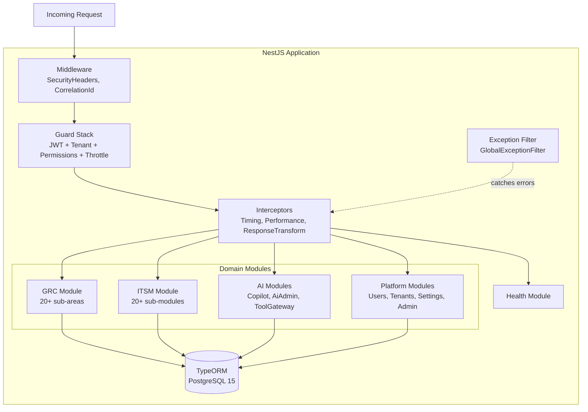
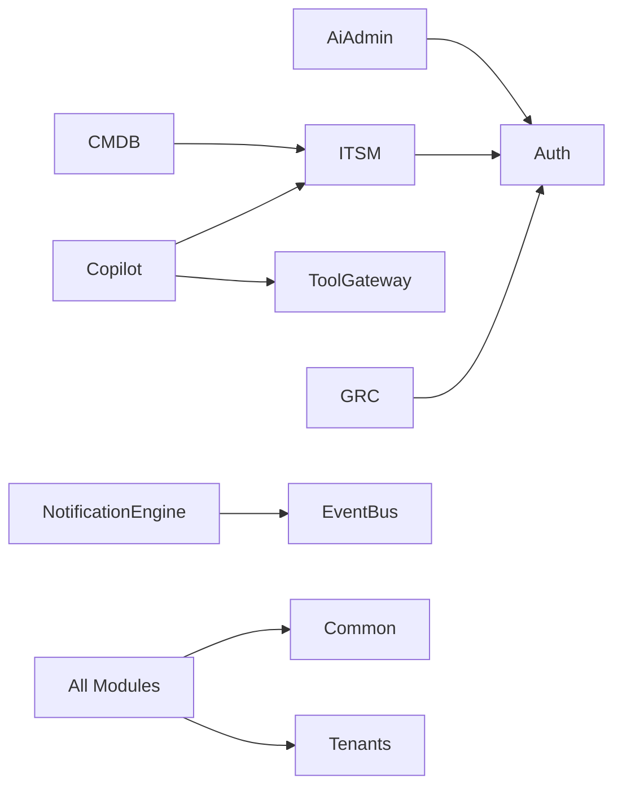
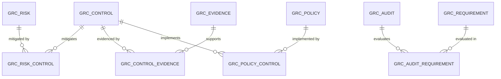
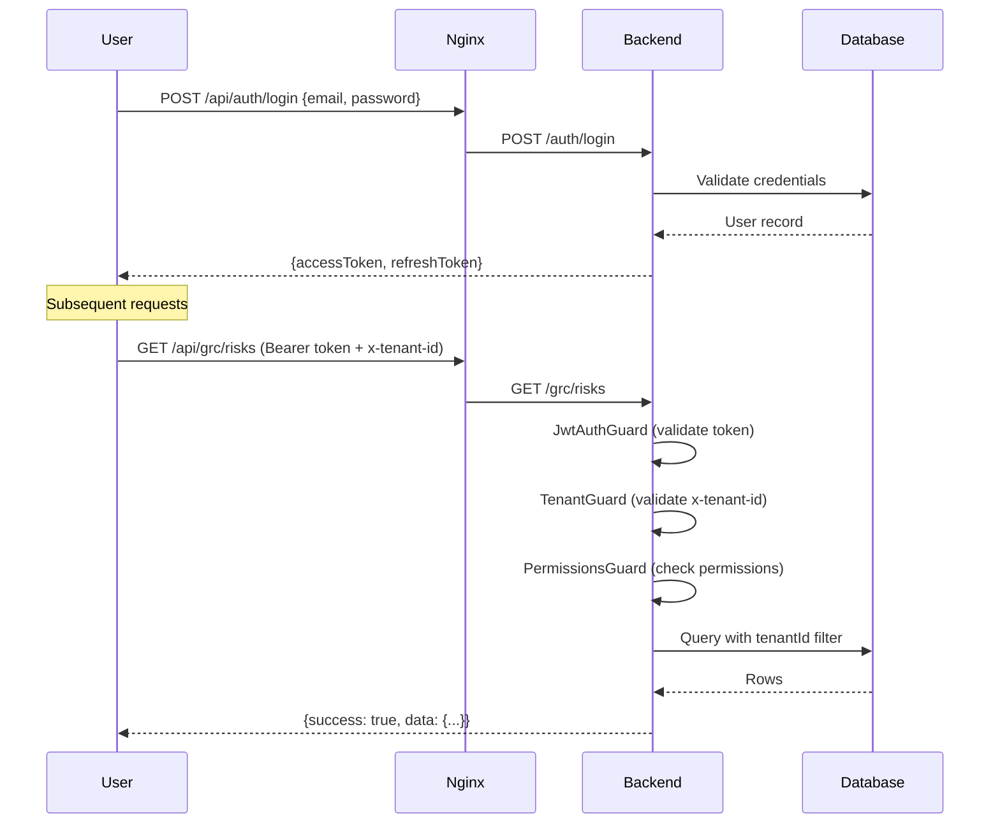

# Technical Architecture Guide

> **Version:** 1.0 | **Last Updated:** 2026-02-26 | **Status:** Outline (Ready for Final Writing)
>
> **Audience:** Product/Engineering, Backend Developers, Solution Architects
>
> **Evidence Map:** [EVIDENCE_MAP_v1.md](../discovery/EVIDENCE_MAP_v1.md) — Section 2

---

## Executive Summary

- **What this document covers:** Full backend architecture — NestJS module system, TypeORM data model, authentication/authorization, API conventions, common infrastructure.
- **Framework:** NestJS (Node.js) with TypeORM on PostgreSQL 15.
- **Architecture style:** Modular monolith — 28 NestJS modules organized by domain (GRC, ITSM, CMDB, AI, Platform).
- **Multi-tenancy:** Column-level isolation via `tenantId` UUID on all domain entities + `x-tenant-id` header.
- **API conventions:** REST with guard stack (JWT + Tenant + Permissions), LIST-CONTRACT pagination, `{ success, data }` envelope.
- **Known limitations:** No message queue (Redis/Bull), no full-text search (Elasticsearch), no WebSocket implementation (infrastructure-only).

---

## Table of Contents

1. [Backend Architecture Overview](#1-backend-architecture-overview)
2. [Module System](#2-module-system)
3. [Data Model & TypeORM](#3-data-model--typeorm)
4. [Authentication & Authorization](#4-authentication--authorization)
5. [API Conventions](#5-api-conventions)
6. [Common Infrastructure](#6-common-infrastructure)
7. [Configuration System](#7-configuration-system)
8. [Error Handling](#8-error-handling)
9. [Logging & Observability](#9-logging--observability)
10. [Testing Strategy](#10-testing-strategy)
11. [Frontend Architecture](#11-frontend-architecture)
12. [Troubleshooting](#12-troubleshooting)
13. [Validation Checklist](#13-validation-checklist)

---

## 1. Backend Architecture Overview

### 1.1 High-Level Architecture Diagram



> **EVIDENCE:** `backend-nest/src/app.module.ts` (294 lines)

### 1.2 Application Bootstrap

<!-- main.ts: Nest factory, global pipes, CORS, Swagger, port binding -->

> **EVIDENCE:** `backend-nest/src/main.ts`

---

## 2. Module System

### 2.1 Module Registration Map

<!-- Table: all 28 modules from app.module.ts with domain grouping -->

| Domain | Module | Path | Status |
|--------|--------|------|--------|
| **Health** | HealthModule | `src/health/` | [IMPL] |
| **Auth** | AuthModule | `src/auth/` | [IMPL] |
| **Platform** | UsersModule | `src/users/` | [IMPL] |
| **Platform** | TenantsModule | `src/tenants/` | [IMPL] |
| **Platform** | SettingsModule | `src/settings/` | [IMPL] |
| **Platform** | AdminModule | `src/admin/` | [IMPL] |
| **Platform** | OnboardingModule | `src/onboarding/` | [IMPL] |
| **Platform** | PlatformModule | `src/platform/` | [IMPL] |
| **Platform** | TodosModule | `src/todos/` | [IMPL] |
| **GRC** | GrcModule | `src/grc/` | [IMPL] |
| **ITSM** | ItsmModule | `src/itsm/` | [IMPL] |
| **AI** | CopilotModule | `src/copilot/` | [IMPL] |
| **AI** | AiAdminModule | `src/ai-admin/` | [IMPL] |
| **AI** | ToolGatewayModule | `src/tool-gateway/` | [IMPL] |
| **Observability** | AuditModule | `src/audit/` | [IMPL] |
| **Observability** | MetricsModule | `src/metrics/` | [IMPL] |
| **Observability** | TelemetryModule | `src/telemetry/` | [IMPL] |
| **Notifications** | NotificationsModule | `src/notifications/` | [IMPL] |
| **Notifications** | NotificationEngineModule | `src/notification-engine/` | [IMPL] |
| **Events** | EventBusModule | `src/event-bus/` | [IMPL] |
| **Events** | EventsModule | `src/events/` | [IMPL] |
| **Infra** | DashboardModule | `src/dashboard/` | [IMPL] |
| **Infra** | JobsModule | `src/jobs/` | [IMPL] |
| **Infra** | ApiCatalogModule | `src/api-catalog/` | [IMPL] |
| **CMDB** | CmdbModule | `src/itsm/cmdb/` | [IMPL] |
| **CMDB** | CmdbImportModule | `src/itsm/cmdb/import/` | [IMPL] |
| **CMDB** | CmdbHealthModule | `src/itsm/cmdb/health/` | [IMPL] |
| **Platform** | PlatformHealthModule | `src/platform-health/` | [IMPL] |

> **Evidence Map:** See [EVIDENCE_MAP_v1.md, Section 2.1](../discovery/EVIDENCE_MAP_v1.md#21-app-module--bootstrap)

### 2.2 Module Dependency Graph

<!-- Mermaid diagram showing inter-module dependencies -->



---

## 3. Data Model & TypeORM

### 3.1 Entity Overview

<!-- Grouped tables: GRC entities, ITSM entities, Platform entities -->
<!-- Each with table name, key columns, relationships -->

> **Evidence Map:** See [EVIDENCE_MAP_v1.md, Sections 3-4](../discovery/EVIDENCE_MAP_v1.md#3-itsm)

### 3.2 Multi-Tenant Column Pattern

<!-- Every entity has tenantId: uuid FK → nest_tenants -->
<!-- BaseEntity / AbstractEntity pattern if any -->

### 3.3 Enum Convention

<!-- Postgres enums in UPPERCASE: BASELINE, TEST, PERIODIC, PLANNED, IN_PROGRESS, COMPLETED, CANCELLED -->
<!-- TypeORM @Column({ type: 'enum' }) mapping -->

> **RISK:** Postgres enums are hard to rename/remove. Use additive/compatible approaches only.

### 3.4 Migration Strategy

<!-- 85+ migration files, timestamp-based naming, migration:run:prod -->

> **EVIDENCE:** `backend-nest/src/migrations/` (85+ files)

### 3.5 Relationship Patterns



---

## 4. Authentication & Authorization

### 4.1 Auth Flow



### 4.2 Guard Stack

<!-- Order: JwtAuthGuard → TenantGuard → PermissionsGuard -->
<!-- Each guard's responsibility -->

> **SECURITY:** The guard stack order is critical. Never disable or bypass these guards.

> **EVIDENCE:** `backend-nest/src/auth/guards/`, `backend-nest/src/common/guards/`, `backend-nest/src/auth/permissions/`

### 4.3 Permission System

<!-- PermissionEnum constants, @RequirePermissions decorator -->
<!-- GRC permissions separate from ITSM permissions -->

> **EVIDENCE:** `backend-nest/src/auth/permissions/permission.enum.ts`

### 4.4 LDAP/SSO [PARTIAL]

<!-- Directory exists at src/auth/ldap/ — implementation depth unverified -->

> **PLANNED:** LDAP directory structure exists but full integration status requires validation.

### 4.5 MFA [PARTIAL]

<!-- Directory exists at src/auth/mfa/ — implementation depth unverified -->

> **PLANNED:** MFA directory structure exists but full integration status requires validation.

---

## 5. API Conventions

### 5.1 Route Naming

<!-- @Controller('grc/...') — NO /api prefix (nginx handles that) -->

> **SECURITY:** Controllers use `@Controller('grc/...')` with NO `api/` prefix. Do NOT change routing conventions.

### 5.2 Response Envelope

<!-- ResponseTransformInterceptor wraps all responses in { success, data } -->

```json
{
  "success": true,
  "data": { ... }
}
```

### 5.3 LIST-CONTRACT Format

<!-- Paginated list response format -->

```json
{
  "success": true,
  "data": {
    "items": [ ... ],
    "total": 100,
    "page": 1,
    "pageSize": 20
  }
}
```

> **EVIDENCE:** `backend-nest/src/common/list-query/`

### 5.4 Error Response Format

<!-- GlobalExceptionFilter error envelope -->

### 5.5 Rate Limiting

<!-- ThrottlerModule: read 120/min, write 30/min, auth 10/min -->

---

## 6. Common Infrastructure

### 6.1 Structured Logger

<!-- StructuredLoggerService, correlation IDs -->

> **EVIDENCE:** `backend-nest/src/common/logger/`

### 6.2 Middleware Pipeline

<!-- SecurityHeadersMiddleware, CorrelationIdMiddleware -->

> **EVIDENCE:** `backend-nest/src/common/middleware/`

### 6.3 Global Interceptors

<!-- RequestTimingInterceptor, PerformanceInterceptor, ResponseTransformInterceptor -->

> **EVIDENCE:** `backend-nest/src/common/interceptors/`

### 6.4 Utility Services

<!-- safeArray, ensureArray, common DTOs, common pipes -->

---

## 7. Configuration System

### 7.1 Config Module

<!-- backend-nest/src/config/ — validation, fail-fast -->

### 7.2 Feature Flags

<!-- Any feature toggle mechanisms -->

### 7.3 Per-Tenant Settings

<!-- NestTenantSetting entity, settings module -->

---

## 8. Error Handling

### 8.1 GlobalExceptionFilter

<!-- Catches all exceptions, returns consistent error response -->

> **EVIDENCE:** `backend-nest/src/common/filters/`

### 8.2 Error Categories

<!-- HTTP exceptions, TypeORM exceptions, validation exceptions -->

---

## 9. Logging & Observability

### 9.1 Structured Logging

<!-- JSON-format logs, correlation IDs -->

### 9.2 Metrics Endpoint

<!-- /metrics for Prometheus scraping -->

### 9.3 Audit Logging

<!-- AuditLog entity, AuditModule -->

> **EVIDENCE:** `backend-nest/src/audit/`

### 9.4 Telemetry

<!-- TelemetryModule -->

> **EVIDENCE:** `backend-nest/src/telemetry/`

---

## 10. Testing Strategy

### 10.1 Unit Tests

<!-- Jest, *.spec.ts files, coverage -->

### 10.2 E2E Tests

<!-- E2E smoke tests, scenario packs -->

> **EVIDENCE:** `.github/workflows/e2e-smoke.yml`

### 10.3 Smoke & Validation Scripts

<!-- smoke-grc.ts, smoke-soa.ts, platform-validate.ts -->

> **EVIDENCE:** `backend-nest/src/scripts/smoke-*.ts`, `backend-nest/src/scripts/platform-validate.ts`

### 10.4 Schema Contract Tests

<!-- schema-contract.ts, API contract check in CI -->

---

## 11. Frontend Architecture

### 11.1 Technology Stack

<!-- React, TypeScript, Material UI, React Router -->

### 11.2 API Client

<!-- grcClient.ts — baseURL "/api", x-tenant-id header injection -->

> **EVIDENCE:** `frontend/src/services/grcClient.ts`

### 11.3 Authentication Context

<!-- AuthContext.tsx — JWT management, token refresh -->

> **EVIDENCE:** `frontend/src/context/AuthContext.tsx`

### 11.4 Route Map

<!-- Major routes: /risks, /controls, /policies, /itsm/*, /cmdb/*, /admin/* -->

> **EVIDENCE:** `frontend/src/App.tsx`

### 11.5 Component Architecture

<!-- Page-level components, shared components, form patterns -->

---

## 12. Troubleshooting

| Symptom | Cause | Resolution |
|---------|-------|------------|
| `Cannot find module` build error | Missing import or circular dependency | Check import paths, run `npm run build` locally |
| 401 on all endpoints | JWT token expired/invalid | Re-authenticate via `/auth/login` |
| 403 Forbidden (JSON) | PermissionsGuard rejection | Check user permissions for the required action |
| 403 Forbidden (HTML) | Cloudflare challenge | Access via correct domain, verify Cloudflare rules |
| `DB_SYNC` exit | `DB_SYNC=true` in production | Set to `false`, use migration:run:prod |
| Empty list response | Missing tenantId header | Add `x-tenant-id` header to request |

---

## 13. Validation Checklist

| # | Check | Expected | Command | Status |
|---|-------|----------|---------|--------|
| 1 | Backend builds | No errors | `npm run build` | |
| 2 | Lint passes | No errors | `npm run lint` | |
| 3 | Unit tests pass | All green | `npm run test` | |
| 4 | Auth login works | 200 + tokens | `POST /auth/login` | |
| 5 | Guard stack active | 401 without token | `GET /grc/risks` (no auth) | |
| 6 | Tenant isolation | Only tenant data | Query with different tenant IDs | |
| 7 | Response envelope | `{ success, data }` | Any API call | |
| 8 | List pagination | LIST-CONTRACT format | `GET /grc/risks?page=1&pageSize=5` | |
| 9 | Rate limiting active | 429 after threshold | Rapid-fire auth endpoint | |
| 10 | Health endpoints | 200 OK | `GET /health/live`, `/health/ready` | |

---

## Appendix

### A. Related Documents

- [Infrastructure Guide](./01_INFRASTRUCTURE.md)
- [Evidence Map — Technical](../discovery/EVIDENCE_MAP_v1.md#2-technical-backend-architecture)
- [ITSM Guide](./03_ITSM.md)
- [GRC Guide](./04_GRC.md)
