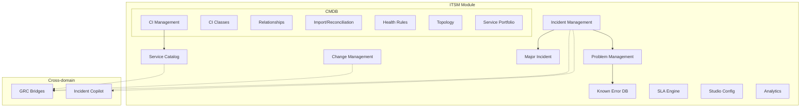
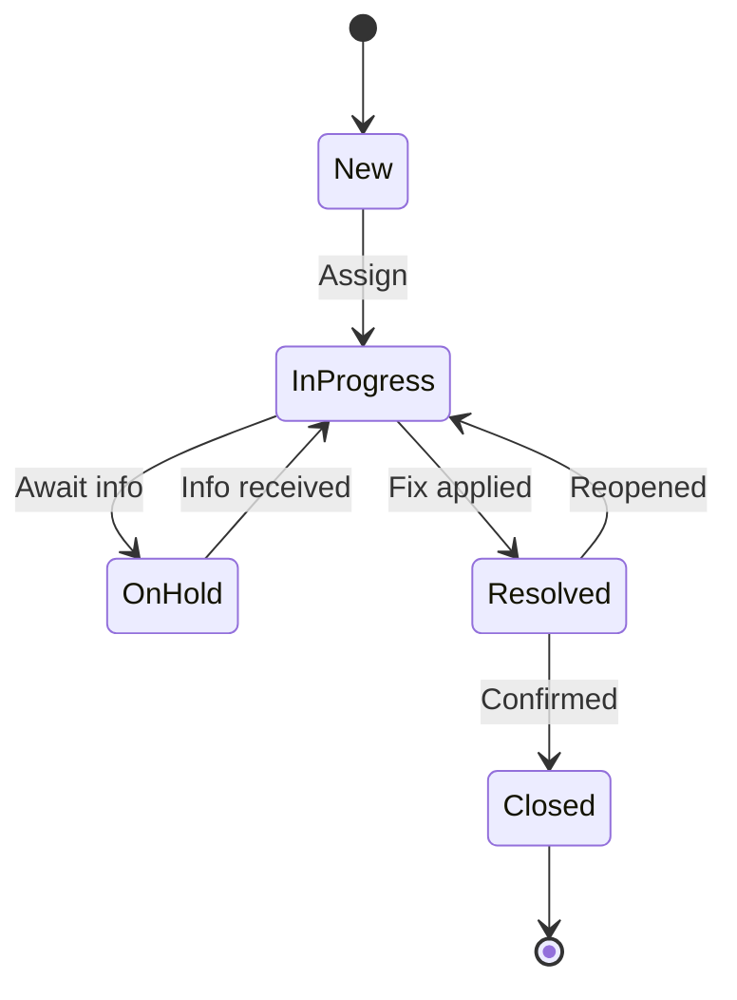
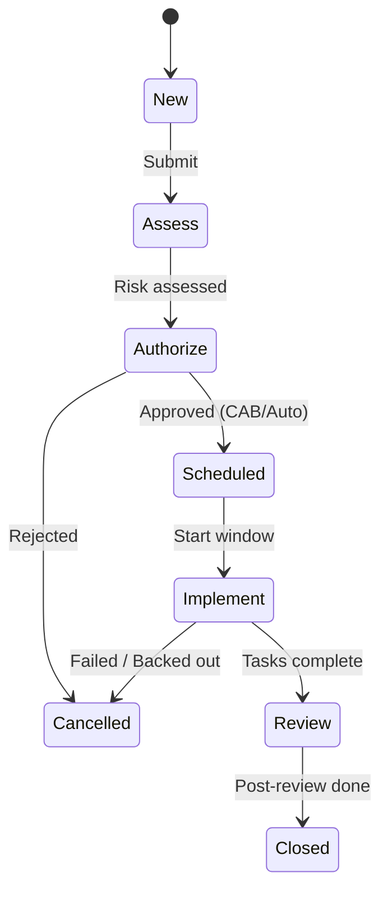
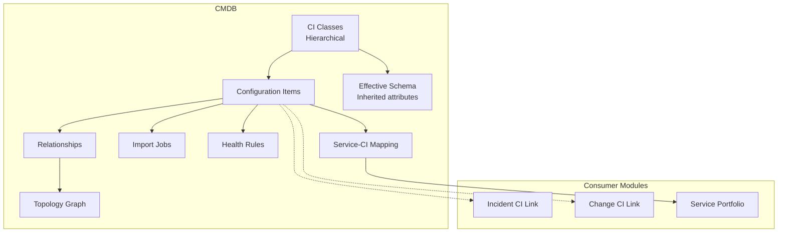

# ITSM Module Guide

> **Version:** 1.0 | **Last Updated:** 2026-02-26 | **Status:** Outline (Ready for Final Writing)
>
> **Audience:** Product/Engineering, IT Operations, Service Desk, Auditors
>
> **Evidence Map:** [EVIDENCE_MAP_v1.md](../discovery/EVIDENCE_MAP_v1.md) — Section 3

---

## Executive Summary

- **What this document covers:** Full ITSM (IT Service Management) module — Incident, Change, Problem, Known Error, Major Incident, Service Catalog, SLA Engine, CMDB, Analytics, and Studio configuration.
- **Module scope:** 20+ NestJS sub-modules under `src/itsm/`, 10+ controllers, full CRUD + lifecycle management.
- **CMDB:** Configuration Item management with class hierarchy, effective schema, import/reconciliation, health rules, topology, and service portfolio.
- **Studio:** Admin configuration for Business Rules, UI Policies, Workflows, Choices, SLA, Priority Matrix.
- **Bridge to GRC:** Dedicated bridge entities link Incidents, Changes, and Services to GRC Risks and Controls. See [ITSM-GRC Bridges](./05_ITSM_GRC_BRIDGES.md).
- **AI integration:** Incident Copilot provides AI-powered analysis, suggestions, and apply-back for incidents.
- **Known limitations:** SLA Dashboard is planned. CMDB Import sources may need validation. No ServiceNow sync (except via Copilot/Tool Gateway).

---

## Table of Contents

1. [ITSM Architecture Overview](#1-itsm-architecture-overview)
2. [Incident Management](#2-incident-management)
3. [Change Management](#3-change-management)
4. [Problem Management](#4-problem-management)
5. [Known Error Database](#5-known-error-database)
6. [Major Incident Management](#6-major-incident-management)
7. [Service Catalog](#7-service-catalog)
8. [SLA Engine](#8-sla-engine)
9. [CMDB (Configuration Management Database)](#9-cmdb)
10. [ITSM Studio (Configuration)](#10-itsm-studio)
11. [ITSM Analytics](#11-itsm-analytics)
12. [Security & Governance](#12-security--governance)
13. [Operations Runbook](#13-operations-runbook)
14. [Troubleshooting](#14-troubleshooting)
15. [Validation Checklist](#15-validation-checklist)

---

## 1. ITSM Architecture Overview

### 1.1 Module Map



> **EVIDENCE:** `backend-nest/src/itsm/itsm.module.ts`

### 1.2 Entity Summary

<!-- Count of entities per sub-module, key relationships -->

---

## 2. Incident Management

### 2.1 Data Model

<!-- Incident entity: fields, statuses, priorities, relationships -->

> **Evidence Map:** [Section 3.1](../discovery/EVIDENCE_MAP_v1.md#31-incident-management)

### 2.2 Endpoints

| Method | Route | Description | Guards |
|--------|-------|-------------|--------|
| GET | `/itsm/incidents` | List incidents (LIST-CONTRACT) | JWT + Tenant + Permissions |
| POST | `/itsm/incidents` | Create incident | JWT + Tenant + Permissions |
| GET | `/itsm/incidents/:id` | Get incident detail | JWT + Tenant + Permissions |
| PATCH | `/itsm/incidents/:id` | Update incident | JWT + Tenant + Permissions |
| DELETE | `/itsm/incidents/:id` | Delete incident | JWT + Tenant + Permissions |

### 2.3 Lifecycle / State Machine



### 2.4 AI Analysis (Copilot)

<!-- IncidentAiAnalysis entity, Copilot integration -->

> **EVIDENCE:** `backend-nest/src/itsm/incident/incident-ai-analysis.entity.ts`, `incident-copilot.controller.ts`

### 2.5 CI Linking

<!-- IncidentCi entity, linking incidents to CMDB CIs -->

> **EVIDENCE:** `backend-nest/src/itsm/incident/incident-ci.entity.ts`

### 2.6 UI Pages

| Page | Route | Component |
|------|-------|-----------|
| Incident List | `/itsm/incidents` | `ItsmIncidentList.tsx` |
| Incident Detail | `/itsm/incidents/:id` | `ItsmIncidentDetail.tsx` |

---

## 3. Change Management

### 3.1 Data Model

<!-- Change entity: fields, types (Normal, Standard, Emergency), statuses, risk levels -->

> **Evidence Map:** [Section 3.2](../discovery/EVIDENCE_MAP_v1.md#32-change-management)

### 3.2 Sub-modules

| Sub-module | Path | Purpose |
|-----------|------|---------|
| Approvals | `src/itsm/change/approval/` | Change approval workflow |
| CAB | `src/itsm/change/cab/` | Change Advisory Board meetings |
| Calendar | `src/itsm/change/calendar/` | Change freeze windows + scheduling |
| Tasks | `src/itsm/change/task/` | Implementation task tracking |
| Templates | `src/itsm/change/template/` | Pre-built change templates |
| Risk | `src/itsm/change/risk/` | Change risk assessment |

### 3.3 Endpoints

<!-- CRUD + approval endpoints + CAB endpoints -->

### 3.4 Lifecycle / State Machine



### 3.5 CI Linking

<!-- ChangeCi entity, linking changes to CMDB CIs -->

### 3.6 UI Pages

| Page | Route | Component |
|------|-------|-----------|
| Change List | `/itsm/changes` | `ItsmChangeList.tsx` |
| Change Detail | `/itsm/changes/:id` | `ItsmChangeDetail.tsx` |
| Change Calendar | `/itsm/change-calendar` | `ItsmChangeCalendar.tsx` |
| Change Templates | `/itsm/change-templates` | `ItsmChangeTemplateList.tsx` |
| CAB Meetings | `/itsm/cab` | `ItsmCabMeetingList.tsx` |
| CAB Detail | `/itsm/cab/:id` | `ItsmCabMeetingDetail.tsx` |

---

## 4. Problem Management

### 4.1 Data Model

<!-- Problem entity: fields, statuses, root cause analysis -->

> **Evidence Map:** [Section 3.3](../discovery/EVIDENCE_MAP_v1.md#33-problem-management)

### 4.2 Relationships

<!-- Problem ↔ Incident join, Problem ↔ Change join -->

### 4.3 Endpoints

<!-- CRUD endpoints -->

### 4.4 UI Pages

| Page | Route | Component |
|------|-------|-----------|
| Problem List | `/itsm/problems` | `ItsmProblemList.tsx` |
| Problem Detail | `/itsm/problems/:id` | `ItsmProblemDetail.tsx` |

---

## 5. Known Error Database

### 5.1 Data Model

<!-- KnownError entity: linked to Problem, workaround, permanent fix status -->

> **Evidence Map:** [Section 3.4](../discovery/EVIDENCE_MAP_v1.md#34-known-error-database)

### 5.2 UI Pages

| Page | Route | Component |
|------|-------|-----------|
| Known Error List | `/itsm/known-errors` | `ItsmKnownErrorList.tsx` |
| Known Error Detail | `/itsm/known-errors/:id` | `ItsmKnownErrorDetail.tsx` |

---

## 6. Major Incident Management

### 6.1 Data Model

<!-- MajorIncident entity: escalation from incident, bridge/war room, PIR -->

> **Evidence Map:** [Section 3.5](../discovery/EVIDENCE_MAP_v1.md#35-major-incident)

### 6.2 PIR (Post-Incident Review)

<!-- PIR sub-module under ITSM -->

> **EVIDENCE:** `backend-nest/src/itsm/pir/`

### 6.3 UI Pages

| Page | Route | Component |
|------|-------|-----------|
| Major Incident List | `/itsm/major-incidents` | `ItsmMajorIncidentList.tsx` |
| Major Incident Detail | `/itsm/major-incidents/:id` | `ItsmMajorIncidentDetail.tsx` |

---

## 7. Service Catalog

### 7.1 Data Model

<!-- ItsmService entity: service definition, SLA links -->

> **Evidence Map:** [Section 3.6](../discovery/EVIDENCE_MAP_v1.md#36-service-catalog)

### 7.2 UI Pages

| Page | Route | Component |
|------|-------|-----------|
| Service List | `/itsm/services` | `ItsmServiceList.tsx` |
| Service Detail | `/itsm/services/:id` | `ItsmServiceDetail.tsx` |

---

## 8. SLA Engine

### 8.1 Data Model

<!-- SLA definitions, conditions, breach calculations -->

> **Evidence Map:** [Section 3.7](../discovery/EVIDENCE_MAP_v1.md#37-sla-engine)

### 8.2 Condition Builder

<!-- SLA condition builder (phase 2) -->

### 8.3 SLA Dashboard [PLANNED]

> **PLANNED:** SLA dashboard UI exists as a studio admin page. Dedicated user-facing SLA reporting is planned.

---

## 9. CMDB

### 9.1 Architecture Overview



### 9.2 CI Management

<!-- CmdbCi entity, CRUD, dynamic attributes -->

> **Evidence Map:** [Section 3.10](../discovery/EVIDENCE_MAP_v1.md#310-cmdb)

### 9.3 CI Class Hierarchy

<!-- CmdbCiClass entity, parent-child, effective schema inheritance -->

### 9.4 Relationships & Topology

<!-- CmdbRelationship, relationship types, topology graph -->

### 9.5 Import & Reconciliation

<!-- CmdbImportJob, reconciliation rules, source connectors -->

### 9.6 Health & Quality Rules

<!-- CmdbHealthRule, quality scoring -->

### 9.7 Service Portfolio

<!-- CmdbService, service-CI mapping, service offering -->

### 9.8 Content Pack

<!-- Baseline CI classes and sample CIs via seed -->

> **EVIDENCE:** `backend-nest/src/scripts/seed-cmdb-content-pack-v1.ts`

### 9.9 UI Pages

| Page | Route | Component |
|------|-------|-----------|
| CI List | `/cmdb/cis` | `CmdbCiList.tsx` |
| CI Detail | `/cmdb/cis/:id` | `CmdbCiDetail.tsx` |
| Class List | `/cmdb/classes` | `CmdbCiClassList.tsx` |
| Class Detail | `/cmdb/classes/:id` | `CmdbCiClassDetail.tsx` |
| Class Tree | `/cmdb/class-tree` | `CmdbCiClassTree.tsx` |
| Import Jobs | `/cmdb/import-jobs` | `CmdbImportJobList.tsx` |
| Services | `/cmdb/services` | `CmdbServiceList.tsx` |
| Rel Types | `/cmdb/relationship-types` | `CmdbRelationshipTypeList.tsx` |

---

## 10. ITSM Studio

### 10.1 Configuration Areas

| Area | Backend Path | UI Component | Status |
|------|-------------|-------------|--------|
| Business Rules | `src/itsm/business-rule/` | `ItsmStudioBusinessRules.tsx` | [IMPL] |
| UI Policies | `src/itsm/ui-policy/` | `ItsmStudioUiPolicies.tsx` | [IMPL] |
| Workflows | `src/itsm/workflow/` | `ItsmStudioWorkflows.tsx` | [IMPL] |
| Choices | `src/itsm/choice/` | `ItsmChoiceAdmin.tsx` | [IMPL] |
| SLA | `src/itsm/sla/` | `ItsmStudioSla.tsx` | [IMPL] |
| Priority Matrix | `src/itsm/priority-matrix/` | `ItsmStudioPriorityMatrix.tsx` | [IMPL] |
| Tables | (platform) | `ItsmStudioTables.tsx` | [IMPL] |

---

## 11. ITSM Analytics

### 11.1 Analytics Engine

<!-- Controller, service, aggregation queries -->

> **Evidence Map:** [Section 3.9](../discovery/EVIDENCE_MAP_v1.md#39-itsm-analytics)

### 11.2 Dashboard

<!-- ItsmAnalyticsDashboard.tsx -->

### 11.3 Seed Data

<!-- seed-itsm-analytics-demo.ts for demo metrics -->

---

## 12. Security & Governance

### 12.1 ITSM-Specific Permissions

<!-- ITSM_INCIDENT_READ/WRITE, ITSM_CHANGE_READ/WRITE, etc. — separate from GRC -->

> **SECURITY:** ITSM permissions are separate from GRC permissions.

### 12.2 Journal / Work Notes

<!-- Journal sub-module for activity tracking -->

> **EVIDENCE:** `backend-nest/src/itsm/journal/`

### 12.3 Diagnostics

<!-- ITSM diagnostics sub-module -->

> **EVIDENCE:** `backend-nest/src/itsm/diagnostics/`

---

## 13. Operations Runbook

### 13.1 Seed ITSM Data

```bash
# Seed ITSM baseline data
docker compose exec backend node dist/scripts/seed-itsm-baseline.js

# Seed ITSM choice lists
docker compose exec backend node dist/scripts/seed-itsm-choices.js

# Seed analytics demo data
docker compose exec backend node dist/scripts/seed-itsm-analytics-demo.js
```

### 13.2 CMDB Content Pack

```bash
# Seed CMDB baseline classes and CIs
docker compose exec backend node dist/scripts/seed-cmdb-content-pack-v1.js

# Seed CMDB Model Intelligence demo
docker compose exec backend node dist/scripts/seed-cmdb-mi-demo.js
```

---

## 14. Troubleshooting

| Symptom | Cause | Resolution |
|---------|-------|------------|
| Empty incident list | Missing tenant data or wrong tenant ID | Verify `x-tenant-id` header matches seeded data |
| Choices not loading | ITSM choices not seeded | Run `seed-itsm-choices.js` |
| SLA not calculating | SLA rules not configured | Configure via ITSM Studio → SLA |
| CMDB classes empty | Content pack not seeded | Run `seed-cmdb-content-pack-v1.js` |
| Import job stuck | Import source unreachable | Check import source configuration and network |

---

## 15. Validation Checklist

| # | Check | Expected | Command / Steps | Status |
|---|-------|----------|-----------------|--------|
| 1 | Incident CRUD | 200 OK | `POST /itsm/incidents`, `GET /itsm/incidents` | |
| 2 | Change CRUD | 200 OK | `POST /itsm/changes`, `GET /itsm/changes` | |
| 3 | Problem CRUD | 200 OK | `POST /itsm/problems`, `GET /itsm/problems` | |
| 4 | Service CRUD | 200 OK | `POST /itsm/services`, `GET /itsm/services` | |
| 5 | CMDB CI list | Items returned | `GET /itsm/cmdb/cis` | |
| 6 | CMDB Class tree | Hierarchical data | `GET /itsm/cmdb/ci-classes` | |
| 7 | Analytics endpoint | Aggregated data | `GET /itsm/analytics/summary` | |
| 8 | ITSM permissions | 403 without perms | Access with restricted user | |
| 9 | Journal entries | Activity logged | Create/update incident, check journal | |
| 10 | Copilot integration | AI analysis | Trigger copilot on incident | |

---

## Appendix

### A. Related Documents

- [ITSM-GRC Bridges](./05_ITSM_GRC_BRIDGES.md)
- [AI Features — Incident Copilot](./06_AI_FEATURES.md)
- [Evidence Map — ITSM](../discovery/EVIDENCE_MAP_v1.md#3-itsm)
