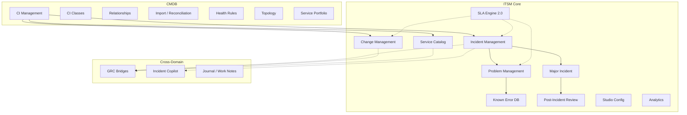
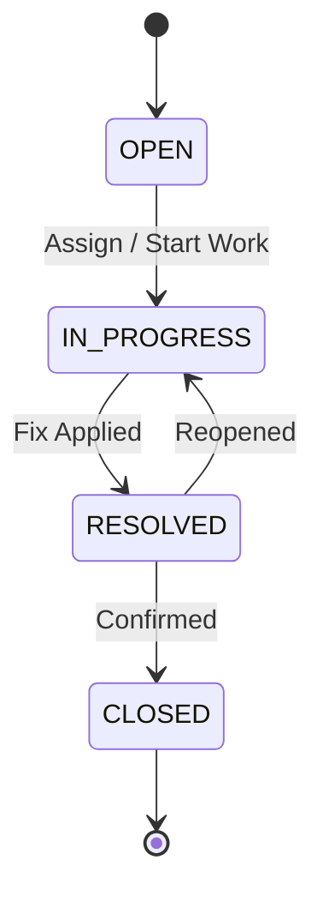
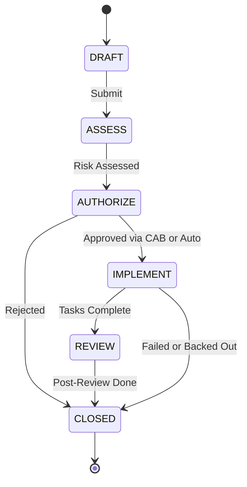
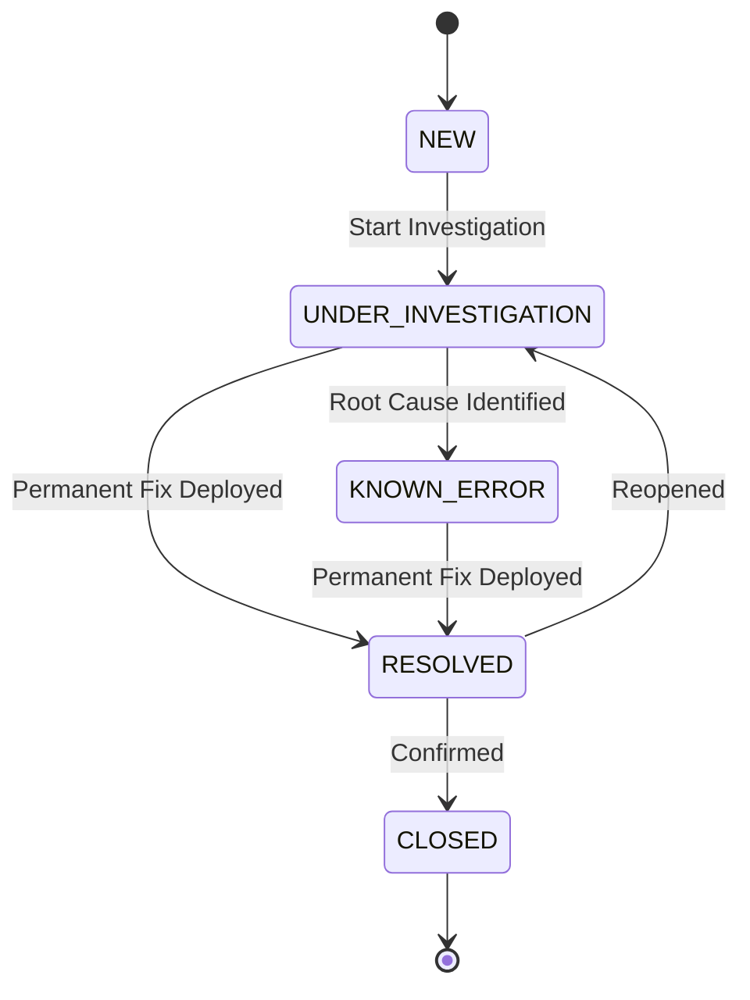
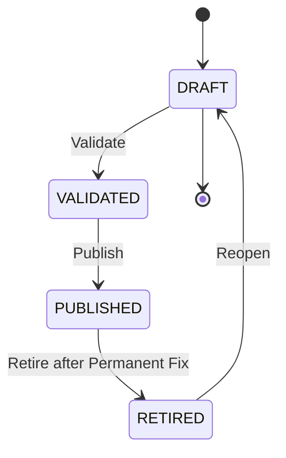
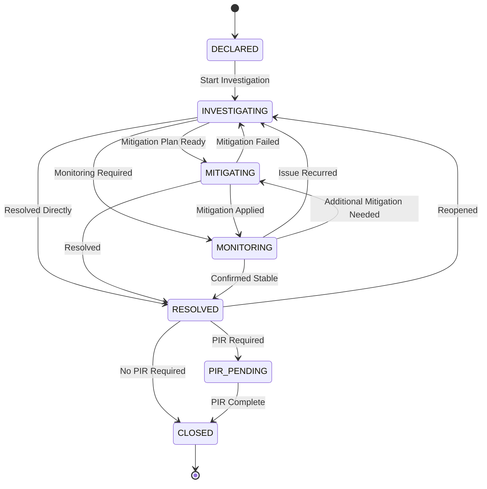
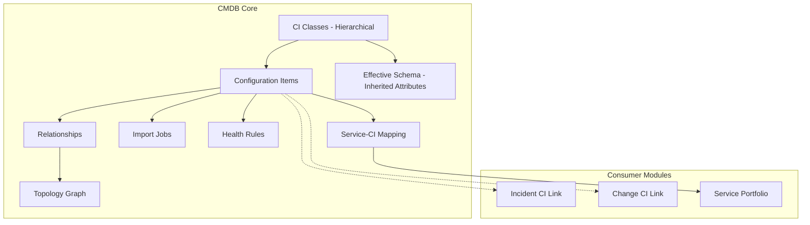

# 03 — ITSM Module Guide

> **Version:** 2.0
> **Last Updated:** 2026-02-27
> **Status:** Final
> **Audience:** Product/Engineering, IT Operations, Service Desk, Auditors
> **Evidence Map:** [EVIDENCE_MAP_v1.md](../discovery/EVIDENCE_MAP_v1.md) — Section 3

---

## Table of Contents

1. [Executive Summary](#1-executive-summary)
2. [Architecture Overview](#2-architecture-overview)
3. [Incident Management](#3-incident-management)
4. [Change Management](#4-change-management)
5. [Problem Management](#5-problem-management)
6. [Known Error Database](#6-known-error-database)
7. [Major Incident Management](#7-major-incident-management)
8. [Service Catalog](#8-service-catalog)
9. [SLA Engine](#9-sla-engine)
10. [CMDB](#10-cmdb)
11. [ITSM Studio](#11-itsm-studio)
12. [ITSM Analytics](#12-itsm-analytics)
13. [Security and Governance](#13-security-and-governance)
14. [Operations Runbook](#14-operations-runbook)
15. [Troubleshooting](#15-troubleshooting)
16. [Validation Checklist](#16-validation-checklist)
17. [Evidence Index](#17-evidence-index)

---

## 1. Executive Summary

The GRC platform includes a **full-featured ITSM (IT Service Management) module** following ITIL best practices. It covers the complete service management lifecycle from incident detection through root cause analysis, change governance, and post-incident learning.

### What's Implemented Today

| Module | Status | Key Features |
|--------|--------|--------------|
| **Incident Management** | IMPLEMENTED | Full CRUD, lifecycle (OPEN / IN_PROGRESS / RESOLVED / CLOSED), priority matrix, CI linking, AI Copilot |
| **Change Management** | IMPLEMENTED | Full CRUD, lifecycle (DRAFT / ASSESS / AUTHORIZE / IMPLEMENT / REVIEW / CLOSED), CAB, calendar, freeze windows, risk assessment, task management, templates, CI linking, GRC bridge |
| **Problem Management** | IMPLEMENTED | Full CRUD, lifecycle (NEW / UNDER_INVESTIGATION / KNOWN_ERROR / RESOLVED / CLOSED), structured RCA (5-Whys, timeline, root cause), incident/change linking |
| **Known Error Database** | IMPLEMENTED | Full CRUD, lifecycle (DRAFT / VALIDATED / PUBLISHED / RETIRED), workaround tracking, permanent fix status |
| **Major Incident Management** | IMPLEMENTED | Full CRUD, lifecycle (DECLARED / INVESTIGATING / MITIGATING / MONITORING / RESOLVED / PIR_PENDING / CLOSED), bridge/war room, timeline updates, role assignments |
| **Post-Incident Review (PIR)** | IMPLEMENTED | PIR lifecycle (DRAFT / IN_REVIEW / APPROVED / CLOSED), action tracking, knowledge candidate generation |
| **Service Catalog** | IMPLEMENTED | Service definitions, criticality levels, CMDB service/offering linkage |
| **SLA Engine 2.0** | IMPLEMENTED | Condition builder (AND/OR), response/resolution time tracking, breach detection, pause/resume, business hours, multi-record-type support |
| **CMDB** | IMPLEMENTED | CI management, CI class hierarchy, relationships, import/reconciliation, health rules, topology, service portfolio |
| **ITSM Studio** | IMPLEMENTED | Business Rules, UI Policies, Workflows, Choices (sys_choice), SLA admin, Priority Matrix, Tables |
| **ITSM Analytics** | IMPLEMENTED | Executive summary, problem trends, major incident metrics, PIR effectiveness, known error lifecycle, closure effectiveness, backlog |
| **Journal / Work Notes** | IMPLEMENTED | Activity tracking for all ITSM records (work_note and comment types) |
| **Diagnostics** | IMPLEMENTED | Runtime diagnostics and logging |

### What's Not Included Yet

| Feature | Status | Notes |
|---------|--------|-------|
| **Request Management** | PARTIAL | Entity scaffolded; controller/service not yet implemented |
| **SLA User-Facing Dashboard** | PLANNED | SLA admin UI exists in Studio; dedicated reporting dashboard is planned |
| **CMDB Import Source Connectors** | PARTIAL | Import job entity exists; source connectors need validation |
| **ServiceNow Sync** | PLANNED | No direct sync; Tool Gateway provides read-only ServiceNow access for Incident Copilot only |

> **SECURITY:** All ITSM endpoints require JWT authentication, tenant isolation (`x-tenant-id` header), and permission-based access control. ITSM permissions are separate from GRC permissions (e.g., `ITSM_INCIDENT_READ/WRITE`, `ITSM_CHANGE_READ/WRITE`).

### Module Scope

- **20+ NestJS sub-modules** under `backend-nest/src/itsm/`
- **13+ controllers** with full CRUD and lifecycle management
- **30+ entities** across Incident, Change, Problem, Known Error, Major Incident, PIR, Service, SLA, CMDB, Studio
- **40+ frontend routes** in `frontend/src/App.tsx`
- **6 seed scripts** for ITSM and CMDB baseline/demo data

> **EVIDENCE:** `backend-nest/src/itsm/itsm.module.ts` (lines 168-361)

---

## 2. Architecture Overview

### 2.1 ITSM Module Map



> **EVIDENCE:** `backend-nest/src/itsm/itsm.module.ts` (lines 168-361)

### 2.2 Entity Summary

| Sub-Module | Entities | Key Relationships |
|------------|----------|-------------------|
| **Incident** | `ItsmIncident`, `ItsmIncidentCi`, `IncidentAiAnalysis` | CmdbService, CmdbServiceOffering, CmdbCi, GrcRisk, GrcPolicy |
| **Change** | `ItsmChange`, `ItsmChangeCi`, `ItsmChangeTask`, `ItsmChangeTemplate`, `RiskAssessment`, `ItsmApproval`, `CabMeeting`, `CalendarEvent`, `FreezeWindow` | CmdbService, CmdbCi, GrcRisk (via `ItsmChangeRisk`), GrcControl (via `ItsmChangeControl`) |
| **Problem** | `ItsmProblem`, `ItsmProblemIncident`, `ItsmProblemChange` | Incident, Change |
| **Known Error** | `ItsmKnownError` | Problem |
| **Major Incident** | `ItsmMajorIncident`, `ItsmMajorIncidentUpdate`, `ItsmMajorIncidentLink` | Incident, Change, Problem, CmdbService, CmdbCi |
| **PIR** | `ItsmPir`, `ItsmPirAction`, `ItsmKnowledgeCandidate` | MajorIncident |
| **Service** | `ItsmService` | CmdbService, CmdbServiceOffering |
| **SLA** | `SlaDefinition`, `SlaInstance` | Incident, Change, Problem, Request, Task |
| **CMDB** | `CmdbCi`, `CmdbCiClass`, `CmdbCiRel`, `CmdbService`, `CmdbServiceOffering`, `CmdbImportJob`, `CmdbQualitySnapshot` | Hierarchical CI classes, relationships, service portfolio |
| **Studio** | `BusinessRule`, `UiPolicy`, `UiAction`, `WorkflowDefinition`, `SysChoice`, `PriorityMatrixEntry` | Configuration for all ITSM modules |
| **Journal** | `ItsmJournal` | Generic activity tracking for all ITSM records |

### 2.3 API Routing Convention

All ITSM backend controllers use the path prefix `grc/itsm/...` **without** the `api/` prefix. Nginx strips `/api` before proxying to the backend.

| Layer | Path |
|-------|------|
| External (browser / curl) | `/api/grc/itsm/incidents` |
| Nginx proxy strips `/api` | -- |
| Backend controller receives | `/grc/itsm/incidents` |

> **SECURITY:** All endpoints require the three-guard stack in order:
> 1. `JwtAuthGuard` -- Bearer token authentication
> 2. `TenantGuard` -- `x-tenant-id` header for multi-tenant isolation
> 3. `PermissionsGuard` -- Permission-based access control

> **EVIDENCE:** `backend-nest/src/itsm/incident/incident.controller.ts` (lines 52-53)

---

## 3. Incident Management

### 3.1 Data Model

The `ItsmIncident` entity represents an IT service incident following ITIL best practices.

**Key Fields:**

| Field | Type | Description |
|-------|------|-------------|
| `number` | varchar(20) | Auto-generated incident number (unique per tenant) |
| `shortDescription` | varchar(255) | Brief incident summary |
| `description` | text | Detailed incident description |
| `category` | enum | `HARDWARE`, `SOFTWARE`, `NETWORK`, `ACCESS`, `OTHER` |
| `impact` | enum | `LOW`, `MEDIUM`, `HIGH` |
| `urgency` | enum | `LOW`, `MEDIUM`, `HIGH` |
| `priority` | enum | `P1`, `P2`, `P3`, `P4` (calculated from impact x urgency matrix) |
| `status` | enum | `OPEN`, `IN_PROGRESS`, `RESOLVED`, `CLOSED` |
| `source` | enum | `USER`, `MONITORING`, `EMAIL`, `PHONE`, `SELF_SERVICE` |
| `assignmentGroup` | varchar(100) | Assignment group name |
| `assignedTo` | uuid | Assigned user ID |
| `serviceId` | uuid | FK to `CmdbService` |
| `offeringId` | uuid | FK to `CmdbServiceOffering` |
| `relatedRiskId` | uuid | FK to `GrcRisk` (GRC bridge) |
| `relatedPolicyId` | uuid | FK to `GrcPolicy` (GRC bridge) |
| `firstResponseAt` | timestamptz | First response timestamp |
| `resolvedAt` | timestamptz | Resolution timestamp |
| `resolutionNotes` | text | Resolution notes |

> **EVIDENCE:** `backend-nest/src/itsm/incident/incident.entity.ts` (lines 25-155)

### 3.2 Lifecycle / State Machine



| Status | Description |
|--------|-------------|
| `OPEN` | Incident created, awaiting assignment |
| `IN_PROGRESS` | Actively being worked on |
| `RESOLVED` | Fix applied, awaiting confirmation |
| `CLOSED` | Confirmed resolved, incident closed |

> **EVIDENCE:** `backend-nest/src/itsm/enums/index.ts` (lines 55-60)

### 3.3 Priority Matrix

Priority is calculated from Impact x Urgency using the ITIL matrix:

| Impact / Urgency | HIGH | MEDIUM | LOW |
|------------------|------|--------|-----|
| **HIGH** | P1 | P2 | P3 |
| **MEDIUM** | P2 | P3 | P4 |
| **LOW** | P3 | P4 | P4 |

> **EVIDENCE:** `backend-nest/src/itsm/enums/index.ts` (lines 269-295)

### 3.4 Endpoints

| Method | Route | Description | Permission |
|--------|-------|-------------|------------|
| GET | `/grc/itsm/incidents` | List incidents (LIST-CONTRACT) | `ITSM_INCIDENT_READ` |
| POST | `/grc/itsm/incidents` | Create incident | `ITSM_INCIDENT_WRITE` |
| GET | `/grc/itsm/incidents/:id` | Get incident detail | `ITSM_INCIDENT_READ` |
| PATCH | `/grc/itsm/incidents/:id` | Update incident | `ITSM_INCIDENT_WRITE` |
| DELETE | `/grc/itsm/incidents/:id` | Soft delete incident | `ITSM_INCIDENT_WRITE` |
| POST | `/grc/itsm/incidents/:id/resolve` | Resolve incident | `ITSM_INCIDENT_WRITE` |
| POST | `/grc/itsm/incidents/:id/close` | Close incident | `ITSM_INCIDENT_WRITE` |
| GET | `/grc/itsm/incidents/:id/affected-cis` | List affected CIs | `ITSM_INCIDENT_READ` |
| POST | `/grc/itsm/incidents/:id/affected-cis` | Add affected CI | `ITSM_INCIDENT_WRITE` |
| DELETE | `/grc/itsm/incidents/:id/affected-cis/:linkId` | Remove affected CI | `ITSM_INCIDENT_WRITE` |
| GET | `/grc/itsm/incidents/:id/impact-summary` | Get impact / blast radius summary | `ITSM_INCIDENT_READ` |
| GET | `/grc/itsm/incidents/statistics` | Incident statistics | `ITSM_STATISTICS_READ` |

> **EVIDENCE:** `backend-nest/src/itsm/incident/incident.controller.ts` (lines 64-390)

### 3.5 CI Linking

The `ItsmIncidentCi` entity links incidents to CMDB Configuration Items to track affected infrastructure.

| Field | Description |
|-------|-------------|
| `incidentId` | FK to `ItsmIncident` |
| `ciId` | FK to `CmdbCi` |
| `relationshipType` | Type of relationship (e.g., `AFFECTED`, `CAUSED_BY`, `RELATED`) |
| `impactScope` | Scope of impact (e.g., `FULL_OUTAGE`, `DEGRADED`, `MINOR`) |

> **EVIDENCE:** `backend-nest/src/itsm/incident/incident-ci.entity.ts` (lines 7-36)

### 3.6 AI Analysis -- Incident Copilot

The Incident Copilot provides AI-powered analysis using the AI Control Center and Tool Gateway.

**Endpoints:**

| Method | Route | Description |
|--------|-------|-------------|
| POST | `/grc/itsm/incidents/:id/ai/analyze` | Run AI analysis |
| GET | `/grc/itsm/incidents/:id/ai/analyses` | List analysis snapshots |
| GET | `/grc/itsm/incidents/:id/ai/analyses/:analysisId` | Get single analysis |
| GET | `/grc/itsm/incidents/:id/ai/status` | Get copilot status |

All Copilot endpoints require `ITSM_INCIDENT_READ` permission.

**Analysis Results Stored (`IncidentAiAnalysis`):**

| Field | Description |
|-------|-------------|
| `summaryText` | Executive summary (max 2000 chars) |
| `recommendedActions` | Structured action list with severity and category |
| `customerUpdateDraft` | Draft customer communication (max 2000 chars) |
| `proposedTasks` | Suggested tasks (DRAFT only -- never auto-written) |
| `similarIncidents` | Similar incidents found (safe excerpts only) |
| `impactAssessment` | Impact assessment summary |
| `confidence` | Confidence level: `LOW`, `MEDIUM`, `HIGH` |
| `usedDataSources` | Data sources used (e.g., `ServiceNow`, `CMDB`) |

> **SECURITY:** Only SHA-256 hashes of prompts/responses are stored for traceability. No full prompts or raw tool payloads are persisted. AI apply-back fields are strictly allowlisted to `work_notes` and `additional_comments` only.

> **EVIDENCE:** `backend-nest/src/itsm/incident/incident-copilot.controller.ts` (lines 36-154), `backend-nest/src/itsm/incident/incident-ai-analysis.entity.ts` (lines 37-179)

For full AI governance details, see [06 -- AI Features](./06_AI_FEATURES.md).

### 3.7 UI Pages

| Page | Route | Component |
|------|-------|-----------|
| Incident List | `/itsm/incidents` | `ItsmIncidentList.tsx` |
| Incident Detail | `/itsm/incidents/:id` | `ItsmIncidentDetail.tsx` |

> **EVIDENCE:** `frontend/src/App.tsx` (lines 235-245)

---

## 4. Change Management

### 4.1 Data Model

The `ItsmChange` entity represents a change request following ITIL change management best practices.

**Key Fields:**

| Field | Type | Description |
|-------|------|-------------|
| `number` | varchar(50) | Auto-generated change number (unique per tenant) |
| `title` | varchar(255) | Change title |
| `description` | text | Detailed change description |
| `type` | enum | `STANDARD`, `NORMAL`, `EMERGENCY` |
| `state` | enum | `DRAFT`, `ASSESS`, `AUTHORIZE`, `IMPLEMENT`, `REVIEW`, `CLOSED` |
| `risk` | enum | `LOW`, `MEDIUM`, `HIGH` |
| `approvalStatus` | enum | `NOT_REQUESTED`, `REQUESTED`, `APPROVED`, `REJECTED` |
| `requesterId` | uuid | FK to User (requester) |
| `assigneeId` | uuid | FK to User (assignee) |
| `serviceId` | uuid | FK to `CmdbService` |
| `offeringId` | uuid | FK to `CmdbServiceOffering` |
| `plannedStartAt` | timestamptz | Planned start time |
| `plannedEndAt` | timestamptz | Planned end time |
| `actualStartAt` | timestamptz | Actual start time |
| `actualEndAt` | timestamptz | Actual end time |
| `implementationPlan` | text | Implementation plan |
| `backoutPlan` | text | Backout / rollback plan |
| `justification` | text | Business justification |

> **EVIDENCE:** `backend-nest/src/itsm/change/change.entity.ts` (lines 36-142)

### 4.2 Lifecycle / State Machine



| State | Description |
|-------|-------------|
| `DRAFT` | Change being drafted |
| `ASSESS` | Risk assessment in progress |
| `AUTHORIZE` | Awaiting approval (CAB or auto-approval) |
| `IMPLEMENT` | Implementation in progress |
| `REVIEW` | Post-implementation review |
| `CLOSED` | Change closed |

> **EVIDENCE:** `backend-nest/src/itsm/change/change.entity.ts` (lines 14-21)

### 4.3 Change Types

| Type | Description | Approval Required |
|------|-------------|-------------------|
| `STANDARD` | Pre-approved, low-risk, repeatable change | No (pre-authorized) |
| `NORMAL` | Standard change requiring CAB approval | Yes (CAB) |
| `EMERGENCY` | Urgent change to restore service | Yes (expedited) |

### 4.4 Sub-Modules

| Sub-Module | Path | Purpose | Status |
|-----------|------|---------|--------|
| **Approvals** | `src/itsm/change/approval/` | Change approval workflow | IMPLEMENTED |
| **CAB** | `src/itsm/change/cab/` | Change Advisory Board meetings and agenda items | IMPLEMENTED |
| **Calendar** | `src/itsm/change/calendar/` | Change calendar, freeze windows, conflict detection | IMPLEMENTED |
| **Tasks** | `src/itsm/change/task/` | Implementation task tracking with dependencies | IMPLEMENTED |
| **Templates** | `src/itsm/change/template/` | Pre-built change templates with task templates | IMPLEMENTED |
| **Risk** | `src/itsm/change/risk/` | Change risk assessment, scoring, topology impact analysis | IMPLEMENTED |

> **EVIDENCE:** `backend-nest/src/itsm/itsm.module.ts` (lines 66-156)

### 4.5 Endpoints

| Method | Route | Description | Permission |
|--------|-------|-------------|------------|
| GET | `/grc/itsm/changes` | List changes (LIST-CONTRACT) | `ITSM_CHANGE_READ` |
| POST | `/grc/itsm/changes` | Create change | `ITSM_CHANGE_WRITE` |
| GET | `/grc/itsm/changes/:id` | Get change detail | `ITSM_CHANGE_READ` |
| PATCH | `/grc/itsm/changes/:id` | Update change | `ITSM_CHANGE_WRITE` |
| DELETE | `/grc/itsm/changes/:id` | Soft delete change | `ITSM_CHANGE_WRITE` |
| GET | `/grc/itsm/changes/calendar-range` | Get changes for calendar time range | `ITSM_CHANGE_READ` |
| GET | `/grc/itsm/changes/:id/risks` | Get linked risks (GRC bridge) | `GRC_RISK_READ` |
| POST | `/grc/itsm/changes/:id/risks/:riskId` | Link risk to change | `ITSM_CHANGE_WRITE` |
| DELETE | `/grc/itsm/changes/:id/risks/:riskId` | Unlink risk from change | `ITSM_CHANGE_WRITE` |
| GET | `/grc/itsm/changes/:id/controls` | Get linked controls (GRC bridge) | `GRC_CONTROL_READ` |
| POST | `/grc/itsm/changes/:id/controls/:controlId` | Link control to change | `ITSM_CHANGE_WRITE` |
| DELETE | `/grc/itsm/changes/:id/controls/:controlId` | Unlink control from change | `ITSM_CHANGE_WRITE` |

> **EVIDENCE:** `backend-nest/src/itsm/change/change.controller.ts` (lines 30-308)

### 4.6 Risk Assessment

The `RiskAssessment` entity provides automated risk scoring for changes.

**Risk Factors Evaluated:**
- Impacted CI count
- Impacted service count
- Freeze window conflicts
- SLA risk
- Topology impact (downstream dependencies)

**Risk Levels:** `LOW`, `MEDIUM`, `HIGH`, `CRITICAL`

Each factor produces a weighted score. The breakdown is stored as JSONB for audit:

```json
{
  "name": "impacted_ci_count",
  "weight": 0.3,
  "score": 8,
  "weightedScore": 2.4,
  "evidence": "12 CIs in blast radius"
}
```

> **EVIDENCE:** `backend-nest/src/itsm/change/risk/risk-assessment.entity.ts` (lines 21-66)

### 4.7 GRC Bridge -- Risk and Control Linking

Changes can be linked to GRC Risks and Controls via dedicated bridge entities:

- `ItsmChangeRisk` -- Links changes to risks
- `ItsmChangeControl` -- Links changes to controls

This enables governance workflows where high-risk changes must be linked to mitigating controls before authorization.

> **EVIDENCE:** `backend-nest/src/itsm/itsm.module.ts` (lines 158-162)

For full GRC bridge details, see [05 -- ITSM-GRC Bridges](./05_ITSM_GRC_BRIDGES.md).

### 4.8 CI Linking

The `ItsmChangeCi` entity links changes to CMDB Configuration Items to track affected infrastructure.

| Field | Description |
|-------|-------------|
| `changeId` | FK to `ItsmChange` |
| `ciId` | FK to `CmdbCi` |
| `relationshipType` | Type (e.g., `AFFECTS`, `MODIFIES`, `RELATED`) |
| `impactScope` | Scope (e.g., `FULL_OUTAGE`, `DEGRADED`, `MINOR`) |

> **EVIDENCE:** `backend-nest/src/itsm/change/change-ci.entity.ts` (lines 7-36)

### 4.9 UI Pages

| Page | Route | Component |
|------|-------|-----------|
| Change List | `/itsm/changes` | `ItsmChangeList.tsx` |
| Change Detail | `/itsm/changes/:id` | `ItsmChangeDetail.tsx` |
| Change Calendar | `/itsm/change-calendar` | `ItsmChangeCalendar.tsx` |
| Change Templates | `/itsm/change-templates` | `ItsmChangeTemplateList.tsx` |
| Template Detail | `/itsm/change-templates/:id` | `ItsmChangeTemplateDetail.tsx` |
| CAB Meetings | `/itsm/change-management/cab` | `ItsmCabMeetingList.tsx` |
| CAB Detail | `/itsm/change-management/cab/:id` | `ItsmCabMeetingDetail.tsx` |

> **EVIDENCE:** `frontend/src/App.tsx` (lines 250-298)

---

## 5. Problem Management

### 5.1 Data Model

The `ItsmProblem` entity represents a problem record following ITIL best practices. Problems track the root cause of one or more incidents.

**Key Fields:**

| Field | Type | Description |
|-------|------|-------------|
| `number` | varchar(20) | Auto-generated problem number (unique per tenant) |
| `shortDescription` | varchar(255) | Brief problem summary |
| `description` | text | Detailed problem description |
| `category` | enum | `HARDWARE`, `SOFTWARE`, `NETWORK`, `SECURITY`, `DATABASE`, `APPLICATION`, `INFRASTRUCTURE`, `OTHER` |
| `state` | enum | `NEW`, `UNDER_INVESTIGATION`, `KNOWN_ERROR`, `RESOLVED`, `CLOSED` |
| `priority` | enum | `P1`, `P2`, `P3`, `P4` |
| `impact` | enum | `LOW`, `MEDIUM`, `HIGH` |
| `urgency` | enum | `LOW`, `MEDIUM`, `HIGH` |
| `source` | enum | `MANUAL`, `INCIDENT_CLUSTER`, `MONITORING`, `POSTMORTEM`, `PROACTIVE` |
| `symptomSummary` | text | Symptom summary |
| `workaroundSummary` | text | Workaround summary |
| `rootCauseSummary` | text | Root cause summary |
| `knownError` | boolean | Is this a known error? |
| `assignmentGroup` | varchar(100) | Assignment group |
| `assignedTo` | uuid | Assigned user ID |
| `serviceId` | uuid | FK to `CmdbService` |
| `rcaEntries` | jsonb | Structured RCA entries |
| `fiveWhySummary` | text | 5-Whys analysis summary |
| `contributingFactors` | jsonb | Contributing factors array |
| `rootCauseCategory` | enum | `HUMAN_ERROR`, `PROCESS_FAILURE`, `TECHNOLOGY_FAILURE`, `EXTERNAL_FACTOR`, `DESIGN_FLAW`, `CAPACITY_ISSUE`, `CHANGE_RELATED`, `CONFIGURATION_ERROR`, `VENDOR_ISSUE`, `UNKNOWN` |
| `detectionGap` | text | Detection gap analysis |
| `monitoringGap` | text | Monitoring gap analysis |
| `rcaCompletedAt` | timestamptz | RCA completion timestamp |
| `reopenCount` | int | Number of times reopened |
| `lastReopenReason` | text | Last reopen reason |

> **EVIDENCE:** `backend-nest/src/itsm/problem/problem.entity.ts` (lines 34-220)

### 5.2 Lifecycle / State Machine



| State | Description |
|-------|-------------|
| `NEW` | Problem created, awaiting investigation |
| `UNDER_INVESTIGATION` | Root cause analysis in progress |
| `KNOWN_ERROR` | Root cause identified, workaround documented |
| `RESOLVED` | Permanent fix deployed |
| `CLOSED` | Confirmed resolved, problem closed |

> **EVIDENCE:** `backend-nest/src/itsm/enums/index.ts` (lines 89-95)

### 5.3 Root Cause Analysis (RCA)

Problems support structured RCA with multiple entry types stored in the `rcaEntries` JSONB field.

**RCA Entry Types:**

| Type | Description |
|------|-------------|
| `TIMELINE` | Timeline entry documenting what happened when |
| `CONTRIBUTING_FACTOR` | Factor that contributed to the problem |
| `FIVE_WHYS` | 5-Whys analysis step |
| `ROOT_CAUSE` | Root cause identification |
| `CORRECTIVE_ACTION` | Action taken to correct the issue |
| `PREVENTIVE_ACTION` | Action to prevent recurrence |
| `LESSON_LEARNED` | Lesson learned from the incident |

**RCA Entry Structure:**
```json
{
  "type": "FIVE_WHYS",
  "content": "Why did the database fail? Because disk was full.",
  "order": 1,
  "createdAt": "2026-02-27T07:00:00Z",
  "createdBy": "user-uuid"
}
```

> **EVIDENCE:** `backend-nest/src/itsm/problem/problem.entity.ts` (lines 19-25), `backend-nest/src/itsm/enums/index.ts` (lines 172-180)

### 5.4 Incident and Change Linking

| Join Entity | Relationship Types |
|-------------|-------------------|
| `ItsmProblemIncident` | `PRIMARY_SYMPTOM`, `RELATED`, `RECURRENCE` |
| `ItsmProblemChange` | `INVESTIGATES`, `WORKAROUND`, `PERMANENT_FIX`, `ROLLBACK_RELATED` |

> **EVIDENCE:** `backend-nest/src/itsm/itsm.module.ts` (lines 100-104)

### 5.5 Endpoints

| Method | Route | Description | Permission |
|--------|-------|-------------|------------|
| GET | `/grc/itsm/problems` | List problems (LIST-CONTRACT) | `ITSM_PROBLEM_READ` |
| POST | `/grc/itsm/problems` | Create problem | `ITSM_PROBLEM_CREATE` |
| GET | `/grc/itsm/problems/:id` | Get problem detail | `ITSM_PROBLEM_READ` |
| PATCH | `/grc/itsm/problems/:id` | Update problem | `ITSM_PROBLEM_UPDATE` |
| DELETE | `/grc/itsm/problems/:id` | Soft delete problem | `ITSM_PROBLEM_UPDATE` |
| POST | `/grc/itsm/problems/:id/mark-known-error` | Mark as known error | `ITSM_PROBLEM_UPDATE` |
| POST | `/grc/itsm/problems/:id/unmark-known-error` | Unmark as known error | `ITSM_PROBLEM_UPDATE` |
| GET | `/grc/itsm/problems/:id/incidents` | List linked incidents | `ITSM_PROBLEM_READ` |
| POST | `/grc/itsm/problems/:id/incidents/:incidentId` | Link incident | `ITSM_PROBLEM_LINK_INCIDENT` |
| DELETE | `/grc/itsm/problems/:id/incidents/:incidentId` | Unlink incident | `ITSM_PROBLEM_LINK_INCIDENT` |
| GET | `/grc/itsm/problems/:id/changes` | List linked changes | `ITSM_PROBLEM_READ` |
| POST | `/grc/itsm/problems/:id/changes/:changeId` | Link change | `ITSM_PROBLEM_LINK_CHANGE` |
| DELETE | `/grc/itsm/problems/:id/changes/:changeId` | Unlink change | `ITSM_PROBLEM_LINK_CHANGE` |
| GET | `/grc/itsm/problems/:id/summary` | Get rollup summary | `ITSM_PROBLEM_READ` |
| GET | `/grc/itsm/problems/:id/rca` | Get RCA entries | `ITSM_PROBLEM_READ` |
| POST | `/grc/itsm/problems/:id/rca/complete` | Mark RCA as complete | `ITSM_PROBLEM_UPDATE` |
| POST | `/grc/itsm/problems/:id/reopen` | Reopen problem | `ITSM_PROBLEM_UPDATE` |
| GET | `/grc/itsm/problems/statistics` | Problem statistics | `ITSM_PROBLEM_READ` |

> **EVIDENCE:** `backend-nest/src/itsm/problem/problem.controller.ts` (lines 40-664)

### 5.6 UI Pages

| Page | Route | Component |
|------|-------|-----------|
| Problem List | `/itsm/problems` | `ItsmProblemList.tsx` |
| Problem Detail | `/itsm/problems/:id` | `ItsmProblemDetail.tsx` |

> **EVIDENCE:** `frontend/src/App.tsx` (lines 426-436)

---

## 6. Known Error Database

### 6.1 Data Model

A Known Error is created when the root cause of a problem is identified and a workaround is documented, but a permanent fix is not yet deployed.

**Key Fields:**

| Field | Type | Description |
|-------|------|-------------|
| `title` | varchar(255) | Known error title |
| `symptoms` | text | Symptom description |
| `rootCause` | text | Root cause description |
| `workaround` | text | Workaround description |
| `permanentFixStatus` | enum | `NONE`, `WORKAROUND_AVAILABLE`, `FIX_IN_PROGRESS`, `FIX_DEPLOYED` |
| `articleRef` | varchar(255) | Knowledge base article reference |
| `state` | enum | `DRAFT`, `VALIDATED`, `PUBLISHED`, `RETIRED` |
| `publishedAt` | timestamptz | Published timestamp |
| `problemId` | uuid | FK to `ItsmProblem` |
| `knowledgeCandidate` | boolean | Is this a knowledge candidate? |
| `retiredAt` | timestamptz | Retired timestamp |
| `validatedAt` | timestamptz | Validated timestamp |
| `validatedBy` | uuid | Validated by user ID |

> **EVIDENCE:** `backend-nest/src/itsm/known-error/known-error.entity.ts` (lines 19-85)

### 6.2 Lifecycle / State Machine



| State | Description |
|-------|-------------|
| `DRAFT` | Known error being drafted |
| `VALIDATED` | Validated by subject matter expert |
| `PUBLISHED` | Published to knowledge base |
| `RETIRED` | Retired -- permanent fix deployed |

> **EVIDENCE:** `backend-nest/src/itsm/enums/index.ts` (lines 199-204)

### 6.3 Endpoints

| Method | Route | Description | Permission |
|--------|-------|-------------|------------|
| GET | `/grc/itsm/known-errors` | List known errors (LIST-CONTRACT) | `ITSM_KNOWN_ERROR_READ` |
| POST | `/grc/itsm/known-errors` | Create known error | `ITSM_KNOWN_ERROR_CREATE` |
| GET | `/grc/itsm/known-errors/:id` | Get known error detail | `ITSM_KNOWN_ERROR_READ` |
| PATCH | `/grc/itsm/known-errors/:id` | Update known error | `ITSM_KNOWN_ERROR_UPDATE` |
| DELETE | `/grc/itsm/known-errors/:id` | Soft delete known error | `ITSM_KNOWN_ERROR_UPDATE` |
| POST | `/grc/itsm/known-errors/:id/validate` | Validate known error | `ITSM_KNOWN_ERROR_UPDATE` |
| POST | `/grc/itsm/known-errors/:id/publish` | Publish known error | `ITSM_KNOWN_ERROR_UPDATE` |
| POST | `/grc/itsm/known-errors/:id/retire` | Retire known error | `ITSM_KNOWN_ERROR_UPDATE` |
| POST | `/grc/itsm/known-errors/:id/reopen` | Reopen retired known error | `ITSM_KNOWN_ERROR_UPDATE` |

> **EVIDENCE:** `backend-nest/src/itsm/known-error/known-error.controller.ts` (lines 39-251)

### 6.4 UI Pages

| Page | Route | Component |
|------|-------|-----------|
| Known Error List | `/itsm/known-errors` | `ItsmKnownErrorList.tsx` |
| Known Error Detail | `/itsm/known-errors/:id` | `ItsmKnownErrorDetail.tsx` |

> **EVIDENCE:** `frontend/src/App.tsx` (lines 441-451)

---

## 7. Major Incident Management

### 7.1 Data Model

The `ItsmMajorIncident` entity represents a major incident coordination record. Major incidents involve significant business impact and require structured command-and-control response.

**Key Fields:**

| Field | Type | Description |
|-------|------|-------------|
| `number` | varchar(20) | Auto-generated major incident number (unique per tenant) |
| `title` | varchar(255) | Major incident title |
| `status` | enum | `DECLARED`, `INVESTIGATING`, `MITIGATING`, `MONITORING`, `RESOLVED`, `PIR_PENDING`, `CLOSED` |
| `severity` | enum | `SEV1`, `SEV2`, `SEV3` |
| `commanderId` | uuid | Incident Commander user ID |
| `communicationsLeadId` | uuid | Communications Lead user ID |
| `techLeadId` | uuid | Tech Lead user ID |
| `bridgeUrl` | varchar(500) | Bridge / war room URL |
| `bridgeChannel` | varchar(255) | Bridge channel (e.g., Slack, Teams) |
| `bridgeStartedAt` | timestamptz | Bridge started timestamp |
| `bridgeEndedAt` | timestamptz | Bridge ended timestamp |
| `customerImpactSummary` | text | Customer impact summary |
| `businessImpactSummary` | text | Business impact summary |
| `primaryServiceId` | uuid | FK to `CmdbService` (primary affected service) |
| `primaryOfferingId` | uuid | FK to `CmdbServiceOffering` |
| `declaredAt` | timestamptz | Declared timestamp |
| `resolvedAt` | timestamptz | Resolved timestamp |
| `closedAt` | timestamptz | Closed timestamp |
| `resolutionSummary` | text | Resolution summary |
| `resolutionCode` | varchar(100) | Resolution code |
| `sourceIncidentId` | uuid | FK to `ItsmIncident` (source incident that escalated) |

> **EVIDENCE:** `backend-nest/src/itsm/major-incident/major-incident.entity.ts` (lines 19-125)

### 7.2 Lifecycle / State Machine



> **EVIDENCE:** `backend-nest/src/itsm/major-incident/major-incident.enums.ts` (lines 63-90)

### 7.3 Timeline Updates

Major incidents support structured timeline updates for internal and external communication.

**Update Types:**

| Type | Description |
|------|-------------|
| `STATUS_CHANGE` | Status change |
| `STAKEHOLDER_UPDATE` | Stakeholder update |
| `TECHNICAL_UPDATE` | Technical update |
| `DECISION` | Decision made |
| `ESCALATION` | Escalation |
| `COMMUNICATION` | Communication sent |
| `ACTION_TAKEN` | Action taken |
| `BRIDGE_NOTE` | Bridge / war room note |

**Visibility:** `INTERNAL` (internal only) or `EXTERNAL` (customer-facing)

> **EVIDENCE:** `backend-nest/src/itsm/major-incident/major-incident.enums.ts` (lines 28-45)

### 7.4 Endpoints

| Method | Route | Description | Permission |
|--------|-------|-------------|------------|
| GET | `/grc/itsm/major-incidents` | List major incidents (LIST-CONTRACT) | `ITSM_MAJOR_INCIDENT_READ` |
| POST | `/grc/itsm/major-incidents` | Declare major incident | `ITSM_MAJOR_INCIDENT_CREATE` |
| GET | `/grc/itsm/major-incidents/:id` | Get major incident detail | `ITSM_MAJOR_INCIDENT_READ` |
| PATCH | `/grc/itsm/major-incidents/:id` | Update major incident | `ITSM_MAJOR_INCIDENT_UPDATE` |
| DELETE | `/grc/itsm/major-incidents/:id` | Soft delete major incident | `ITSM_MAJOR_INCIDENT_CREATE` |
| GET | `/grc/itsm/major-incidents/:id/timeline` | Get timeline updates | `ITSM_MAJOR_INCIDENT_READ` |
| POST | `/grc/itsm/major-incidents/:id/timeline` | Post timeline update | `ITSM_MAJOR_INCIDENT_UPDATE` |
| GET | `/grc/itsm/major-incidents/:id/links` | Get linked records | `ITSM_MAJOR_INCIDENT_READ` |
| POST | `/grc/itsm/major-incidents/:id/links` | Link record (Incident, Change, Problem, CMDB) | `ITSM_MAJOR_INCIDENT_LINK` |
| DELETE | `/grc/itsm/major-incidents/:id/links/:linkId` | Unlink record | `ITSM_MAJOR_INCIDENT_LINK` |
| GET | `/grc/itsm/major-incidents/statistics` | Major incident statistics | `ITSM_MAJOR_INCIDENT_READ` |

> **EVIDENCE:** `backend-nest/src/itsm/major-incident/major-incident.controller.ts` (lines 42-236)

### 7.5 Post-Incident Review (PIR)

PIRs are structured post-incident reviews linked to major incidents.

**PIR Lifecycle:** `DRAFT` then `IN_REVIEW` then `APPROVED` then `CLOSED`

**PIR Sections:**
- Summary
- What happened
- Timeline highlights
- Root causes
- What worked well
- What did not work
- Customer impact
- Detection effectiveness
- Response effectiveness
- Preventive actions
- Corrective actions

**PIR Actions** (`ItsmPirAction`) track follow-up items with statuses: `OPEN`, `IN_PROGRESS`, `COMPLETED`, `OVERDUE`, `CANCELLED`

**Knowledge Candidates** (`ItsmKnowledgeCandidate`) can be generated from PIRs, Known Errors, or Problems and follow the lifecycle: `DRAFT` then `REVIEWED` then `PUBLISHED` (or `REJECTED`)

> **EVIDENCE:** `backend-nest/src/itsm/pir/pir.entity.ts` (lines 14-86), `backend-nest/src/itsm/pir/pir.enums.ts` (lines 6-98)

### 7.6 UI Pages

| Page | Route | Component |
|------|-------|-----------|
| Major Incident List | `/itsm/major-incidents` | `ItsmMajorIncidentList.tsx` |
| Major Incident Detail | `/itsm/major-incidents/:id` | `ItsmMajorIncidentDetail.tsx` |

> **EVIDENCE:** `frontend/src/App.tsx` (lines 457-462)

---

## 8. Service Catalog

### 8.1 Data Model

The `ItsmService` entity represents a service definition in the service catalog.

**Key Fields:**

| Field | Type | Description |
|-------|------|-------------|
| `name` | varchar(255) | Service name (unique per tenant) |
| `description` | text | Service description |
| `criticality` | enum | `CRITICAL`, `HIGH`, `MEDIUM`, `LOW` |
| `status` | enum | `ACTIVE`, `INACTIVE`, `DEPRECATED` |
| `ownerUserId` | uuid | FK to User (service owner) |
| `serviceId` | uuid | FK to `CmdbService` (CMDB service linkage) |
| `offeringId` | uuid | FK to `CmdbServiceOffering` (CMDB offering linkage) |

> **EVIDENCE:** `backend-nest/src/itsm/service/service.entity.ts` (lines 21-79)

### 8.2 UI Pages

| Page | Route | Component |
|------|-------|-----------|
| Service List | `/itsm/services` | `ItsmServiceList.tsx` |
| Service Detail | `/itsm/services/:id` | `ItsmServiceDetail.tsx` |

> **EVIDENCE:** `frontend/src/App.tsx` (lines 220-230)

---

## 9. SLA Engine

### 9.1 Overview

The SLA Engine 2.0 provides flexible SLA management with condition-based policy matching, multi-record-type support, and business hours scheduling.

**Key Features:**
- Condition builder with AND/OR logic
- Separate response time and resolution time objectives
- Pause/resume logic (e.g., pause on `ON_HOLD` state)
- Business hours support with configurable days and hours
- Multi-record-type support: Incident, Change, Problem, Request, Task, Change Task
- Breach detection via scheduled job (`SlaBreachCheckerJob`)
- Event-driven SLA evaluation via `SlaEventListener`

### 9.2 SLA Definition

**Key Fields (`SlaDefinition`):**

| Field | Type | Description |
|-------|------|-------------|
| `name` | varchar(255) | SLA name (unique per tenant) |
| `appliesToRecordType` | varchar(50) | `INCIDENT`, `CHANGE`, `PROBLEM`, `REQUEST`, `TASK`, `CHANGE_TASK` |
| `conditionTree` | jsonb | Condition builder JSON tree (AND/OR with leaf conditions) |
| `responseTimeSeconds` | int | Response time target in seconds |
| `resolutionTimeSeconds` | int | Resolution time target in seconds |
| `schedule` | enum | `24X7`, `BUSINESS_HOURS` |
| `businessStartHour` | int | Business hours start (0-23) |
| `businessEndHour` | int | Business hours end (0-23) |
| `businessDays` | jsonb | Business days array (1=Monday, 7=Sunday) |
| `stopOnStates` | jsonb | States that stop the SLA clock |
| `pauseOnStates` | jsonb | States that pause the SLA clock |
| `isActive` | boolean | Is this SLA active? |
| `priorityWeight` | int | Precedence weight (higher = matched first) |
| `stopProcessing` | boolean | Stop evaluating further policies after this one matches? |
| `effectiveFrom` | timestamptz | Effective from date |
| `effectiveTo` | timestamptz | Effective to date |

> **EVIDENCE:** `backend-nest/src/itsm/sla/sla-definition.entity.ts` (lines 65-173)

### 9.3 SLA Instance

**Key Fields (`SlaInstance`):**

| Field | Type | Description |
|-------|------|-------------|
| `recordType` | varchar(50) | Record type (e.g., `INCIDENT`) |
| `recordId` | uuid | Record ID |
| `definitionId` | uuid | FK to `SlaDefinition` |
| `objectiveType` | varchar(50) | `RESPONSE` or `RESOLUTION` |
| `startAt` | timestamptz | SLA start timestamp |
| `dueAt` | timestamptz | SLA due timestamp |
| `pausedDurationSeconds` | int | Total paused duration |
| `breached` | boolean | Is this SLA breached? |
| `elapsedSeconds` | int | Elapsed time |
| `remainingSeconds` | int | Remaining time |
| `status` | enum | `IN_PROGRESS`, `PAUSED`, `MET`, `BREACHED`, `CANCELLED` |
| `matchedPolicySnapshot` | jsonb | Snapshot of matched policy (audit trail) |
| `matchReason` | text | Why this policy matched |

> **EVIDENCE:** `backend-nest/src/itsm/sla/sla-instance.entity.ts` (lines 14-86)

### 9.4 Condition Builder

The condition builder supports complex AND/OR logic for SLA policy matching.

**Example Condition Tree:**
```json
{
  "operator": "AND",
  "children": [
    { "field": "priority", "operator": "equals", "value": "P1" },
    {
      "operator": "OR",
      "children": [
        { "field": "category", "operator": "equals", "value": "HARDWARE" },
        { "field": "category", "operator": "equals", "value": "SOFTWARE" }
      ]
    }
  ]
}
```

**Supported Operators:** `equals`, `not_equals`, `in`, `not_in`, `contains`, `not_contains`, `greater_than`, `less_than`, `is_empty`, `is_not_empty`

> **EVIDENCE:** `backend-nest/src/itsm/sla/sla-definition.entity.ts` (lines 39-63)

### 9.5 Endpoints

| Method | Route | Description | Permission |
|--------|-------|-------------|------------|
| GET | `/grc/itsm/sla/definitions` | List SLA definitions | `ITSM_SLA_READ` |
| POST | `/grc/itsm/sla/definitions` | Create SLA definition | `ITSM_SLA_WRITE` |
| GET | `/grc/itsm/sla/definitions/:id` | Get SLA definition | `ITSM_SLA_READ` |
| PATCH | `/grc/itsm/sla/definitions/:id` | Update SLA definition | `ITSM_SLA_WRITE` |
| DELETE | `/grc/itsm/sla/definitions/:id` | Soft delete SLA definition | `ITSM_SLA_WRITE` |
| GET | `/grc/itsm/sla/instances` | List SLA instances | `ITSM_SLA_READ` |
| GET | `/grc/itsm/sla/records/:recordType/:recordId` | Get SLAs for a record | `ITSM_SLA_READ` |
| POST | `/grc/itsm/sla/instances/:id/recompute` | Recompute SLA instance | `ITSM_SLA_WRITE` |
| GET | `/grc/itsm/sla/breach-summary` | Get breach summary | `ITSM_SLA_READ` |
| GET | `/grc/itsm/sla/field-registry` | Get field registry for condition builder | `ITSM_SLA_READ` |
| POST | `/grc/itsm/sla/validate-condition` | Validate condition tree | `ITSM_SLA_WRITE` |
| POST | `/grc/itsm/sla/evaluate` | Evaluate SLA for a context | `ITSM_SLA_READ` |
| POST | `/grc/itsm/sla/records/:recordType/:recordId/reapply` | Reapply SLA to a record | `ITSM_SLA_WRITE` |

> **EVIDENCE:** `backend-nest/src/itsm/sla/sla.controller.ts` (lines 37-254)

> **PLANNED:** Dedicated user-facing SLA reporting dashboard. SLA admin UI is available in ITSM Studio today.

---

## 10. CMDB

### 10.1 Architecture Overview



### 10.2 CI Management

Configuration Items (CIs) represent infrastructure components tracked in the CMDB.

**Key Features:**
- Dynamic attributes based on CI class schema
- Effective schema inheritance from parent classes
- Lifecycle states (ACTIVE, INACTIVE, RETIRED, etc.)
- Health scoring
- Relationship tracking

> **EVIDENCE:** `backend-nest/src/itsm/cmdb/ci/ci.entity.ts`

### 10.3 CI Class Hierarchy

CI classes define the schema and behavior for CIs. Classes support inheritance, allowing child classes to inherit attributes from parent classes.

**Example Hierarchy:**
```
Hardware
  Server
    Physical Server
    Virtual Server
  Network Device
    Router
    Switch
    Firewall
  Storage
    SAN
    NAS
```

> **EVIDENCE:** `backend-nest/src/itsm/cmdb/ci-class/ci-class.entity.ts`

### 10.4 Relationships and Topology

CIs can be linked via relationships to model infrastructure topology.

**Common Relationship Types:** `DEPENDS_ON`, `HOSTED_ON`, `CONNECTS_TO`, `PART_OF`, `USES`

> **EVIDENCE:** `backend-nest/src/itsm/cmdb/ci-rel/ci-rel.entity.ts`

### 10.5 Import and Reconciliation

> **PARTIAL:** Import job entity exists. Source connectors need validation.

### 10.6 Health and Quality Rules

> **PARTIAL:** Health rule entity and quality snapshot entity exist. Quality scoring implementation needs validation.

> **EVIDENCE:** `backend-nest/src/itsm/cmdb/health/cmdb-quality-snapshot.entity.ts`

### 10.7 Service Portfolio

CMDB services represent business services mapped to CIs.

> **EVIDENCE:** `backend-nest/src/itsm/cmdb/service/cmdb-service.entity.ts`

### 10.8 Content Pack

Baseline CI classes and sample CIs can be seeded via:

```bash
docker compose -f docker-compose.staging.yml exec -T backend sh -lc \
  'node dist/scripts/seed-cmdb-content-pack-v1.js'
```

> **EVIDENCE:** `backend-nest/src/scripts/seed-cmdb-content-pack-v1.ts`

### 10.9 UI Pages

| Page | Route | Component |
|------|-------|-----------|
| CI List | `/cmdb/cis` | `CmdbCiList.tsx` |
| CI Detail | `/cmdb/cis/:id` | `CmdbCiDetail.tsx` |
| Class List | `/cmdb/classes` | `CmdbCiClassList.tsx` |
| Class Detail | `/cmdb/classes/:id` | `CmdbCiClassDetail.tsx` |
| Class Tree | `/cmdb/classes/tree` | `CmdbCiClassTree.tsx` |
| Import Jobs | `/cmdb/import-jobs` | `CmdbImportJobList.tsx` |
| Services | `/cmdb/services` | `CmdbServiceList.tsx` |
| Relationship Types | `/cmdb/relationship-types` | `CmdbRelationshipTypeList.tsx` |

> **EVIDENCE:** `frontend/src/App.tsx` (lines 188-404)

---

## 11. ITSM Studio

ITSM Studio provides administrative configuration for all ITSM modules.

### 11.1 Configuration Areas

| Area | Backend Path | UI Component | Status | Description |
|------|-------------|-------------|--------|-------------|
| **Business Rules** | `src/itsm/business-rule/` | `ItsmStudioBusinessRules.tsx` | IMPLEMENTED | Server-side business logic rules |
| **UI Policies** | `src/itsm/ui-policy/` | `ItsmStudioUiPolicies.tsx` | IMPLEMENTED | Client-side UI behavior rules |
| **UI Actions** | `src/itsm/ui-policy/` | `ItsmStudioUiActions.tsx` | IMPLEMENTED | UI action definitions |
| **Workflows** | `src/itsm/workflow/` | `ItsmStudioWorkflows.tsx` | IMPLEMENTED | Workflow definitions |
| **Choices** | `src/itsm/choice/` | `ItsmChoiceAdmin.tsx` | IMPLEMENTED | Choice lists (sys_choice) for dropdowns |
| **SLA** | `src/itsm/sla/` | `ItsmStudioSla.tsx` | IMPLEMENTED | SLA definitions and policies |
| **Priority Matrix** | `src/itsm/priority-matrix/` | `ItsmStudioPriorityMatrix.tsx` | IMPLEMENTED | Impact/Urgency to Priority matrix |
| **Tables** | (platform) | `ItsmStudioTables.tsx` | IMPLEMENTED | Table metadata viewer |

> **EVIDENCE:** `backend-nest/src/itsm/itsm.module.ts` (lines 24-131), `frontend/src/App.tsx` (lines 305-361)

### 11.2 Choices (sys_choice)

The `SysChoice` entity provides dropdown choice lists for ITSM tables.

**Managed Tables:**
- `itsm_incidents` -- Incident choice fields
- `itsm_changes` -- Change choice fields
- `itsm_services` -- Service choice fields

**Seed Script:**
```bash
docker compose -f docker-compose.staging.yml exec -T backend sh -lc \
  'node dist/scripts/seed-itsm-choices.js'
```

> **EVIDENCE:** `backend-nest/src/itsm/choice/sys-choice.entity.ts` (lines 5-43), `backend-nest/src/scripts/seed-itsm-choices.ts`

### 11.3 Priority Matrix

The `PriorityMatrixEntry` entity stores the configurable Impact x Urgency to Priority mapping per tenant. The default matrix follows ITIL conventions (see Section 3.3).

> **EVIDENCE:** `backend-nest/src/itsm/priority-matrix/priority-matrix.entity.ts`

---

## 12. ITSM Analytics

### 12.1 Analytics Engine

The ITSM Analytics module provides aggregated analytics across the full ITSM lifecycle:

```
Problem -> Major Incident -> PIR -> Action -> Known Error -> Knowledge Candidate
```

All analytics endpoints are read-only and tenant-scoped. No additional DB tables are required -- the engine runs pure aggregation queries on existing entities.

### 12.2 Endpoints

| Method | Route | Description | Permission |
|--------|-------|-------------|------------|
| GET | `/grc/itsm/analytics/executive-summary` | Top-level KPIs, trends, closure effectiveness | `ITSM_STATISTICS_READ` |
| GET | `/grc/itsm/analytics/problem-trends` | State/priority/category distributions, aging, reopens | `ITSM_STATISTICS_READ` |
| GET | `/grc/itsm/analytics/major-incident-metrics` | Counts, MTTR, bridge duration, PIR rate | `ITSM_STATISTICS_READ` |
| GET | `/grc/itsm/analytics/pir-effectiveness` | Completion rates, action tracking, knowledge generation | `ITSM_STATISTICS_READ` |
| GET | `/grc/itsm/analytics/known-error-lifecycle` | State distribution, publication/retirement rates | `ITSM_STATISTICS_READ` |
| GET | `/grc/itsm/analytics/closure-effectiveness` | Closure trends, reopen rates, completion times | `ITSM_STATISTICS_READ` |
| GET | `/grc/itsm/analytics/backlog` | Open items by priority, overdue actions, stale items | `ITSM_STATISTICS_READ` |

> **EVIDENCE:** `backend-nest/src/itsm/analytics/analytics.controller.ts` (lines 20-115)

### 12.3 Dashboard

| Page | Route | Component |
|------|-------|-----------|
| Analytics Dashboard | `/itsm/analytics` | `ItsmAnalyticsDashboard.tsx` |

> **EVIDENCE:** `frontend/src/App.tsx` (line 468)

### 12.4 Demo Seed Data

```bash
docker compose -f docker-compose.staging.yml exec -T backend sh -lc \
  'node dist/scripts/seed-itsm-analytics-demo.js'
```

> **EVIDENCE:** `backend-nest/src/scripts/seed-itsm-analytics-demo.ts`

---

## 13. Security and Governance

### 13.1 ITSM-Specific Permissions

ITSM permissions are separate from GRC permissions to enable fine-grained role-based access control.

| Category | Permissions |
|----------|-------------|
| **Incident** | `ITSM_INCIDENT_READ`, `ITSM_INCIDENT_WRITE` |
| **Change** | `ITSM_CHANGE_READ`, `ITSM_CHANGE_WRITE` |
| **Problem** | `ITSM_PROBLEM_READ`, `ITSM_PROBLEM_CREATE`, `ITSM_PROBLEM_UPDATE`, `ITSM_PROBLEM_LINK_INCIDENT`, `ITSM_PROBLEM_LINK_CHANGE` |
| **Known Error** | `ITSM_KNOWN_ERROR_READ`, `ITSM_KNOWN_ERROR_CREATE`, `ITSM_KNOWN_ERROR_UPDATE` |
| **Major Incident** | `ITSM_MAJOR_INCIDENT_READ`, `ITSM_MAJOR_INCIDENT_CREATE`, `ITSM_MAJOR_INCIDENT_UPDATE`, `ITSM_MAJOR_INCIDENT_LINK` |
| **Service** | `ITSM_SERVICE_READ`, `ITSM_SERVICE_WRITE` |
| **SLA** | `ITSM_SLA_READ`, `ITSM_SLA_WRITE` |
| **Choice** | `ITSM_CHOICE_READ`, `ITSM_CHOICE_WRITE` |
| **Statistics** | `ITSM_STATISTICS_READ` |

> **SECURITY:** All ITSM endpoints use the standard three-guard stack: `JwtAuthGuard` + `TenantGuard` + `PermissionsGuard`. Never disable or bypass these guards.

### 13.2 Multi-Tenant Isolation

Every ITSM entity includes a `tenantId` column (uuid FK to `nest_tenants`). All queries are scoped by `tenantId`. Cross-resource operations validate that both resources belong to the same tenant.

**Demo tenant ID:** `00000000-0000-0000-0000-000000000001`

### 13.3 Journal / Work Notes

The `ItsmJournal` entity provides activity tracking for all ITSM records.

| Field | Description |
|-------|-------------|
| `tableName` | Table the journal entry belongs to (e.g., `itsm_incidents`) |
| `recordId` | Record ID |
| `type` | `work_note` (internal) or `comment` (customer-facing) |
| `message` | Journal message text |

> **SECURITY:** AI apply-back is strictly limited to `work_notes` and `additional_comments` fields. No AI content is auto-written to customer-facing fields.

> **EVIDENCE:** `backend-nest/src/itsm/journal/journal.entity.ts` (lines 10-34)

### 13.4 Diagnostics

The ITSM diagnostics module provides runtime diagnostics and logging for troubleshooting.

> **EVIDENCE:** `backend-nest/src/itsm/diagnostics/diagnostics.controller.ts`

| Page | Route | Component |
|------|-------|-----------|
| Diagnostics | `/itsm/diagnostics` | `ItsmDiagnostics.tsx` |

---

## 14. Operations Runbook

### 14.1 Seed ITSM Data

**Required for Production:**

```bash
# Seed ITSM baseline data (incidents, changes, problems, services)
docker compose -f docker-compose.staging.yml exec -T backend sh -lc \
  'node dist/scripts/seed-itsm-baseline.js'

# Seed ITSM choice lists (dropdowns for incidents, changes, services)
docker compose -f docker-compose.staging.yml exec -T backend sh -lc \
  'node dist/scripts/seed-itsm-choices.js'
```

**Optional Demo Data:**

```bash
# Seed analytics demo data
docker compose -f docker-compose.staging.yml exec -T backend sh -lc \
  'node dist/scripts/seed-itsm-analytics-demo.js'
```

> **EVIDENCE:** `backend-nest/src/scripts/seed-itsm-baseline.ts`, `backend-nest/src/scripts/seed-itsm-choices.ts`, `backend-nest/src/scripts/seed-itsm-analytics-demo.ts`

### 14.2 CMDB Content Pack

```bash
# Seed CMDB baseline classes and CIs
docker compose -f docker-compose.staging.yml exec -T backend sh -lc \
  'node dist/scripts/seed-cmdb-content-pack-v1.js'

# Seed CMDB Model Intelligence demo
docker compose -f docker-compose.staging.yml exec -T backend sh -lc \
  'node dist/scripts/seed-cmdb-mi-demo.js'
```

> **EVIDENCE:** `backend-nest/src/scripts/seed-cmdb-content-pack-v1.ts`, `backend-nest/src/scripts/seed-cmdb-mi-demo.ts`

### 14.3 Health Checks

```bash
# Backend health checks (from host)
curl -i http://46.224.99.150/api/health/live
curl -i http://46.224.99.150/api/health/db
curl -i http://46.224.99.150/api/health/auth

# From inside backend container (use wget -- curl may not be installed)
docker compose -f docker-compose.staging.yml exec -T backend sh -lc \
  'wget -q -S -O /dev/null http://localhost:3002/health/live'
```

> **OPS:** All health endpoints should return 200 OK. The `/health/auth` endpoint should show `REFRESH_TOKEN_EXPIRES_IN configured: true`.

### 14.4 Run Migrations

```bash
# Show pending migrations
docker compose -f docker-compose.staging.yml exec -T backend sh -lc \
  'npx typeorm migration:show -d dist/data-source.js'

# Run pending migrations
docker compose -f docker-compose.staging.yml exec -T backend sh -lc \
  'npx typeorm migration:run -d dist/data-source.js'
```

> **OPS:** Migrations run against `dist/data-source.js`. Always verify git status is clean on staging before and after operations. No local modifications on staging -- all changes must be via PR.

---

## 15. Troubleshooting

| Symptom | Cause | Resolution |
|---------|-------|------------|
| Empty incident list | Missing tenant data or wrong tenant ID | Verify `x-tenant-id: 00000000-0000-0000-0000-000000000001` header |
| Choices not loading | ITSM choices not seeded | Run `seed-itsm-choices.js` |
| SLA not calculating | SLA rules not configured | Configure via ITSM Studio then SLA |
| CMDB classes empty | Content pack not seeded | Run `seed-cmdb-content-pack-v1.js` |
| Import job stuck | Import source unreachable | Check import source configuration and network |
| 401 Unauthorized | Missing or invalid JWT token | Verify `Authorization: Bearer <token>` header |
| 403 Forbidden | Missing permissions | Verify user has required ITSM permissions |
| 404 on `/api/grc/itsm/*` | Nginx routing issue | Verify nginx config has `location ^~ /api/` with `proxy_pass http://backend/;` (trailing slash required) |
| Incident Copilot not working | AI not enabled for tenant | Enable AI via AI Control Center |
| SLA breach not detected | SLA breach checker job not running | Verify `SlaBreachCheckerJob` is running |
| Infinite spinner on ITSM pages | Frontend calling `/grc/itsm/*` directly (Cloudflare challenge) | Ensure frontend uses `/api/grc/itsm/*` paths |

---

## 16. Validation Checklist

All endpoints require:
- `Authorization: Bearer <token>` header
- `x-tenant-id: 00000000-0000-0000-0000-000000000001` header

| # | Check | Expected | Command / Steps |
|---|-------|----------|-----------------|
| 1 | Incident CRUD | 200 OK | `POST /api/grc/itsm/incidents`, `GET /api/grc/itsm/incidents` |
| 2 | Change CRUD | 200 OK | `POST /api/grc/itsm/changes`, `GET /api/grc/itsm/changes` |
| 3 | Problem CRUD | 200 OK | `POST /api/grc/itsm/problems`, `GET /api/grc/itsm/problems` |
| 4 | Known Error CRUD | 200 OK | `POST /api/grc/itsm/known-errors`, `GET /api/grc/itsm/known-errors` |
| 5 | Major Incident CRUD | 200 OK | `POST /api/grc/itsm/major-incidents`, `GET /api/grc/itsm/major-incidents` |
| 6 | Service CRUD | 200 OK | `POST /api/grc/itsm/services`, `GET /api/grc/itsm/services` |
| 7 | CMDB CI list | Items returned | `GET /api/grc/itsm/cmdb/cis` |
| 8 | CMDB Class tree | Hierarchical data | `GET /api/grc/itsm/cmdb/ci-classes` |
| 9 | Analytics executive summary | Aggregated data | `GET /api/grc/itsm/analytics/executive-summary` |
| 10 | SLA definitions | List returned | `GET /api/grc/itsm/sla/definitions` |
| 11 | Choices endpoint | Choice lists returned | `GET /api/grc/itsm/choices?table=itsm_incidents` |
| 12 | Incident Copilot status | Status returned | `GET /api/grc/itsm/incidents/:id/ai/status` |
| 13 | Change Risk Assessment | Risk score in response | `GET /api/grc/itsm/changes/:id` |
| 14 | CAB Meeting CRUD | 200 OK | `POST /api/grc/itsm/change-management/cab`, `GET /api/grc/itsm/change-management/cab` |
| 15 | PIR CRUD | 200 OK | `POST /api/grc/itsm/pirs`, `GET /api/grc/itsm/pirs` |
| 16 | Unauthenticated request | 401 Unauthorized (not 404) | `curl -i http://46.224.99.150/api/grc/itsm/incidents` (no auth header) |

---

## 17. Evidence Index

### Backend Entities

| Entity | Path | Lines |
|--------|------|-------|
| `ItsmIncident` | `backend-nest/src/itsm/incident/incident.entity.ts` | 25-155 |
| `ItsmIncidentCi` | `backend-nest/src/itsm/incident/incident-ci.entity.ts` | 7-36 |
| `IncidentAiAnalysis` | `backend-nest/src/itsm/incident/incident-ai-analysis.entity.ts` | 37-179 |
| `ItsmChange` | `backend-nest/src/itsm/change/change.entity.ts` | 36-142 |
| `ItsmChangeCi` | `backend-nest/src/itsm/change/change-ci.entity.ts` | 7-36 |
| `RiskAssessment` | `backend-nest/src/itsm/change/risk/risk-assessment.entity.ts` | 21-66 |
| `ItsmProblem` | `backend-nest/src/itsm/problem/problem.entity.ts` | 34-220 |
| `ItsmKnownError` | `backend-nest/src/itsm/known-error/known-error.entity.ts` | 19-85 |
| `ItsmMajorIncident` | `backend-nest/src/itsm/major-incident/major-incident.entity.ts` | 19-125 |
| `ItsmPir` | `backend-nest/src/itsm/pir/pir.entity.ts` | 14-86 |
| `ItsmService` | `backend-nest/src/itsm/service/service.entity.ts` | 21-79 |
| `SlaDefinition` | `backend-nest/src/itsm/sla/sla-definition.entity.ts` | 65-173 |
| `SlaInstance` | `backend-nest/src/itsm/sla/sla-instance.entity.ts` | 14-86 |
| `SysChoice` | `backend-nest/src/itsm/choice/sys-choice.entity.ts` | 5-43 |
| `ItsmJournal` | `backend-nest/src/itsm/journal/journal.entity.ts` | 10-34 |

### Backend Controllers

| Controller | Path | Lines |
|------------|------|-------|
| `IncidentController` | `backend-nest/src/itsm/incident/incident.controller.ts` | 52-391 |
| `IncidentCopilotController` | `backend-nest/src/itsm/incident/incident-copilot.controller.ts` | 36-154 |
| `ChangeController` | `backend-nest/src/itsm/change/change.controller.ts` | 30-308 |
| `ProblemController` | `backend-nest/src/itsm/problem/problem.controller.ts` | 40-664 |
| `KnownErrorController` | `backend-nest/src/itsm/known-error/known-error.controller.ts` | 39-251 |
| `MajorIncidentController` | `backend-nest/src/itsm/major-incident/major-incident.controller.ts` | 42-236 |
| `SlaController` | `backend-nest/src/itsm/sla/sla.controller.ts` | 37-254 |
| `ChoiceController` | `backend-nest/src/itsm/choice/choice.controller.ts` | 28-164 |
| `AnalyticsController` | `backend-nest/src/itsm/analytics/analytics.controller.ts` | 20-115 |

### Backend Module

| Module | Path | Lines |
|--------|------|-------|
| `ItsmModule` | `backend-nest/src/itsm/itsm.module.ts` | 168-361 |

### Frontend Routes

| Route Pattern | Component | Lines in App.tsx |
|---------------|-----------|------------------|
| `/itsm/incidents` | `ItsmIncidentList` | 235-245 |
| `/itsm/changes` | `ItsmChangeList` | 250-260 |
| `/itsm/change-calendar` | `ItsmChangeCalendar` | 265-265 |
| `/itsm/change-templates` | `ItsmChangeTemplateList` | 271-281 |
| `/itsm/change-management/cab` | `ItsmCabMeetingList` | 288-298 |
| `/itsm/problems` | `ItsmProblemList` | 426-436 |
| `/itsm/known-errors` | `ItsmKnownErrorList` | 441-451 |
| `/itsm/major-incidents` | `ItsmMajorIncidentList` | 457-462 |
| `/itsm/services` | `ItsmServiceList` | 220-230 |
| `/itsm/analytics` | `ItsmAnalyticsDashboard` | 468 |
| `/itsm/studio/*` | Studio components | 305-361 |
| `/cmdb/*` | CMDB components | 188-404 |

### Seed Scripts

| Script | Path |
|--------|------|
| `seed-itsm-baseline.ts` | `backend-nest/src/scripts/seed-itsm-baseline.ts` |
| `seed-itsm-choices.ts` | `backend-nest/src/scripts/seed-itsm-choices.ts` |
| `seed-itsm-analytics-demo.ts` | `backend-nest/src/scripts/seed-itsm-analytics-demo.ts` |
| `seed-cmdb-content-pack-v1.ts` | `backend-nest/src/scripts/seed-cmdb-content-pack-v1.ts` |
| `seed-cmdb-mi-demo.ts` | `backend-nest/src/scripts/seed-cmdb-mi-demo.ts` |

### Enums

| Enum File | Path | Lines |
|-----------|------|-------|
| ITSM core enums | `backend-nest/src/itsm/enums/index.ts` | 1-296 |
| Major Incident enums | `backend-nest/src/itsm/major-incident/major-incident.enums.ts` | 6-101 |
| PIR enums | `backend-nest/src/itsm/pir/pir.enums.ts` | 6-98 |

---

**End of Document**
