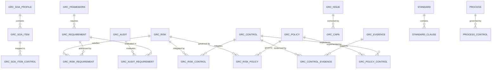
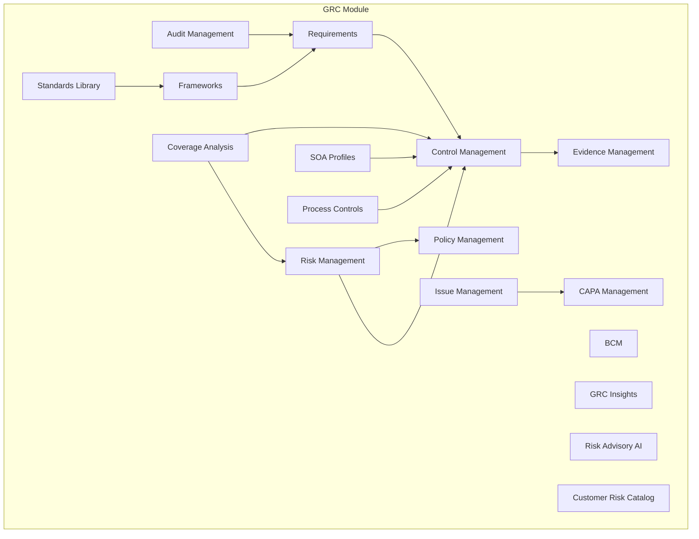
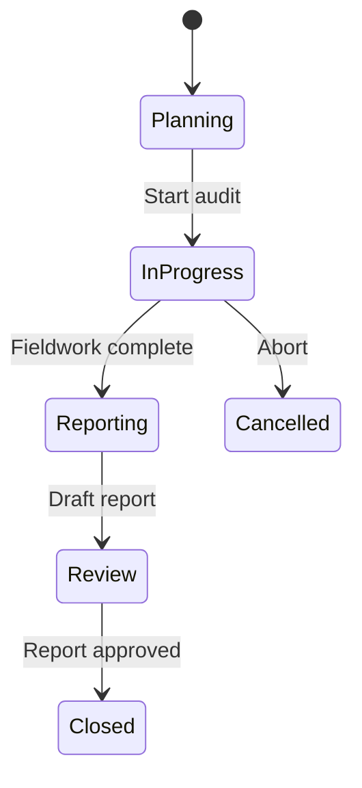
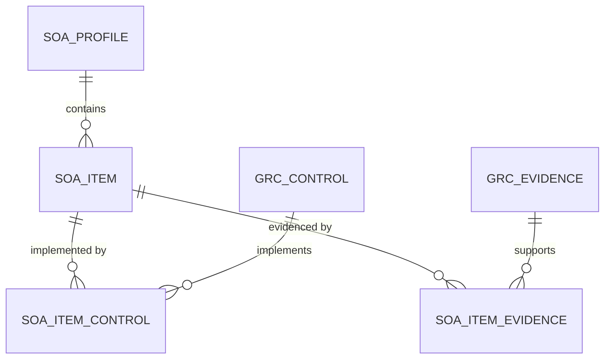

# GRC Module Guide

> **Version:** 1.0 | **Last Updated:** 2026-02-26 | **Status:** Outline (Ready for Final Writing)
>
> **Audience:** Product/Engineering, Compliance Officers, Auditors, Executive
>
> **Evidence Map:** [EVIDENCE_MAP_v1.md](../discovery/EVIDENCE_MAP_v1.md) — Section 4

---

## Executive Summary

- **What this document covers:** Full GRC (Governance, Risk & Compliance) module — Risk, Control, Policy, Evidence, Issue, CAPA, Audit, Requirements, Frameworks, SOA, BCM, Standards, Process Controls, Coverage Analysis, and GRC Insights.
- **Module scope:** 20+ GRC sub-areas under `src/grc/`, 24+ controllers, 30+ entities, full CRUD with relationship mapping.
- **Risk-Control-Evidence triad:** Core design pattern — risks are mitigated by controls, controls are evidenced by evidence items, everything is auditable.
- **Compliance frameworks:** ISO 27001, NIST, and custom frameworks with clause-level mapping to requirements and controls.
- **Bridge to ITSM:** Incidents, Changes, and Services are linked to GRC Risks and Controls via dedicated bridge entities. See [ITSM-GRC Bridges](./05_ITSM_GRC_BRIDGES.md).
- **AI integration:** Risk Advisory provides AI-powered risk suggestions. See [AI Features](./06_AI_FEATURES.md).
- **Known limitations:** Risk Assessments (advanced) planned. Policy Templates/Reviews planned. Control Testing (advanced) planned. Audit Reports (advanced) planned.

---

## Table of Contents

1. [GRC Architecture Overview](#1-grc-architecture-overview)
2. [Risk Management](#2-risk-management)
3. [Control Management](#3-control-management)
4. [Policy Management](#4-policy-management)
5. [Evidence Management](#5-evidence-management)
6. [Issue & CAPA Management](#6-issue--capa-management)
7. [Audit Management](#7-audit-management)
8. [Requirements & Standards](#8-requirements--standards)
9. [SOA (Statement of Applicability)](#9-soa-statement-of-applicability)
10. [BCM (Business Continuity Management)](#10-bcm-business-continuity-management)
11. [Frameworks](#11-frameworks)
12. [Process Controls](#12-process-controls)
13. [Coverage Analysis & Insights](#13-coverage-analysis--insights)
14. [Security & Governance](#14-security--governance)
15. [Operations Runbook](#15-operations-runbook)
16. [Troubleshooting](#16-troubleshooting)
17. [Validation Checklist](#17-validation-checklist)

---

## 1. GRC Architecture Overview

### 1.1 Domain Model Diagram



### 1.2 Module Layout



> **EVIDENCE:** `backend-nest/src/grc/grc.module.ts`

---

## 2. Risk Management

### 2.1 Data Model

<!-- GrcRisk entity: inherent/residual risk scoring, categories, treatments, control links, policy links, requirement links -->

> **Evidence Map:** [Section 4.1](../discovery/EVIDENCE_MAP_v1.md#41-risk-management)

### 2.2 Entities

| Entity | Table | Purpose |
|--------|-------|---------|
| GrcRisk | `grc_risks` | Core risk record |
| GrcRiskAssessment | `grc_risk_assessments` | Risk assessment details |
| GrcRiskCategory | `grc_risk_categories` | Risk categorization |
| GrcRiskTreatmentAction | `grc_risk_treatment_actions` | Treatment plans |
| GrcRiskControl | `grc_risk_controls` | Risk ↔ Control mapping |
| GrcRiskPolicy | `grc_risk_policies` | Risk ↔ Policy mapping |
| GrcRiskRequirement | `grc_risk_requirements` | Risk ↔ Requirement mapping |

### 2.3 Endpoints

| Method | Route | Description |
|--------|-------|-------------|
| GET | `/grc/risks` | List risks (LIST-CONTRACT) |
| POST | `/grc/risks` | Create risk |
| GET | `/grc/risks/:id` | Get risk detail |
| PATCH | `/grc/risks/:id` | Update risk |
| DELETE | `/grc/risks/:id` | Delete risk |

### 2.4 Risk Matrix / Scoring

<!-- Inherent vs Residual risk calculation, impact × likelihood -->

### 2.5 UI Pages

| Page | Route | Component |
|------|-------|-----------|
| Risk List | `/risks` | `RiskManagement.tsx` |
| Risk Detail | `/risks/:id` | `RiskDetail.tsx` |

### 2.6 Risk Assessments (Advanced) [PLANNED]

> **PLANNED:** Advanced risk assessment features (quantitative scoring, Monte Carlo) are planned but not yet implemented.

---

## 3. Control Management

### 3.1 Data Model

<!-- GrcControl entity: control type, effectiveness, testing status, evidence links -->

> **Evidence Map:** [Section 4.2](../discovery/EVIDENCE_MAP_v1.md#42-control-management)

### 3.2 Entities

| Entity | Table | Purpose |
|--------|-------|---------|
| GrcControl | `grc_controls` | Core control record |
| GrcControlEvidence | `grc_control_evidences` | Control ↔ Evidence mapping |
| GrcControlTest | `grc_control_tests` | Control test records |
| GrcControlProcess | `grc_control_processes` | Control ↔ Process mapping |

### 3.3 Endpoints

| Method | Route | Description |
|--------|-------|-------------|
| GET | `/grc/controls` | List controls (LIST-CONTRACT) |
| POST | `/grc/controls` | Create control |
| GET | `/grc/controls/:id` | Get control detail |
| PATCH | `/grc/controls/:id` | Update control |
| DELETE | `/grc/controls/:id` | Delete control |

### 3.4 Control Testing

<!-- Control test entities, test results, evidence attachment -->

> **EVIDENCE:** `backend-nest/src/grc/entities/grc-control-test.entity.ts`

### 3.5 UI Pages

| Page | Route | Component |
|------|-------|-----------|
| Control List | `/controls` | `ControlList.tsx` |
| Control Detail | `/controls/:id` | `ControlDetail.tsx` |

---

## 4. Policy Management

### 4.1 Data Model

<!-- GrcPolicy entity: versioning, control links, approval status -->

> **Evidence Map:** [Section 4.3](../discovery/EVIDENCE_MAP_v1.md#43-policy-management)

### 4.2 Entities

| Entity | Table | Purpose |
|--------|-------|---------|
| GrcPolicy | `grc_policies` | Core policy record |
| GrcPolicyVersion | `grc_policy_versions` | Policy version history |
| GrcPolicyControl | `grc_policy_controls` | Policy ↔ Control mapping |

### 4.3 Policy Versioning

<!-- Version history, draft/published lifecycle -->

### 4.4 UI Pages

| Page | Route | Component |
|------|-------|-----------|
| Policy Detail | `/policies/:id` | `PolicyDetail.tsx` |

### 4.5 Policy Templates [PLANNED]

> **PLANNED:** Pre-built policy templates are planned but not yet implemented.

### 4.6 Policy Reviews [PLANNED]

> **PLANNED:** Periodic policy review workflows are planned but not yet implemented.

---

## 5. Evidence Management

### 5.1 Data Model

<!-- GrcEvidence entity: evidence type (BASELINE, TEST, PERIODIC), file attachments, control links -->

> **Evidence Map:** [Section 4.4](../discovery/EVIDENCE_MAP_v1.md#44-evidence-management)

### 5.2 Entities

| Entity | Table | Purpose |
|--------|-------|---------|
| GrcEvidence | `grc_evidences` | Core evidence record |
| GrcEvidenceTestResult | `grc_evidence_test_results` | Evidence ↔ Test Result link |

### 5.3 Evidence Types (Postgres Enum)

<!-- BASELINE, TEST, PERIODIC — UPPERCASE enum labels -->

> **RISK:** Postgres enums are UPPERCASE. Use `BASELINE`, `TEST`, `PERIODIC` in seed scripts and migrations.

### 5.4 UI Pages

| Page | Route | Component |
|------|-------|-----------|
| Evidence List | `/evidence` | `EvidenceList.tsx` |
| Evidence Detail | `/evidence/:id` | `EvidenceDetail.tsx` |

---

## 6. Issue & CAPA Management

### 6.1 Issue Data Model

<!-- GrcIssue entity: finding from audits, linked to clauses/evidence/requirements -->

> **Evidence Map:** [Section 4.5](../discovery/EVIDENCE_MAP_v1.md#45-issue--capa-management)

### 6.2 Issue Link Entities

| Entity | Purpose |
|--------|---------|
| GrcIssueClause | Issue ↔ Standard Clause link |
| GrcIssueEvidence | Issue ↔ Evidence link |
| GrcIssueRequirement | Issue ↔ Requirement link |

### 6.3 CAPA Data Model

<!-- GrcCapa entity: corrective/preventive action linked to issues -->

### 6.4 CAPA Tasks

<!-- GrcCapaTask entity: actionable tasks within a CAPA -->

### 6.5 UI Pages

| Page | Route | Component |
|------|-------|-----------|
| Issue List | `/issues` | `IssueList.tsx` |
| Issue Detail | `/issues/:id` | `IssueDetail.tsx` |
| CAPA List | `/capas` | `CapaList.tsx` |
| CAPA Detail | `/capas/:id` | `CapaDetail.tsx` |

---

## 7. Audit Management

### 7.1 Data Model

<!-- GrcAudit entity: audit planning, scope, findings, requirements evaluation -->

> **Evidence Map:** [Section 4.6](../discovery/EVIDENCE_MAP_v1.md#46-audit-management)

### 7.2 Entities

| Entity | Table | Purpose |
|--------|-------|---------|
| GrcAudit | `grc_audits` | Core audit record |
| GrcAuditRequirement | `grc_audit_requirements` | Audit ↔ Requirement evaluation |
| AuditScopeStandard | — | Audit ↔ Standard scope |
| AuditScopeClause | — | Audit ↔ Clause scope |
| GrcAuditReportTemplate | — | Report template definitions |

### 7.3 Audit Lifecycle



### 7.4 Report Templates

<!-- GrcAuditReportTemplate entity, report generation -->

### 7.5 Audit Dashboard

<!-- Role-protected audit dashboard -->

> **EVIDENCE:** `frontend/src/pages/dashboards/AuditDashboard.tsx`

### 7.6 UI Pages

| Page | Route | Component |
|------|-------|-----------|
| Audit List | `/audits` | `AuditList.tsx` |
| Audit Detail | `/audits/:id` | `AuditDetail.tsx` |
| Report Viewer | `/audits/:id/report` | `ReportViewer.tsx` |
| Finding Detail | `/audits/:id/findings/:fid` | `FindingDetail.tsx` |

### 7.7 Audit Reports (Advanced) [PLANNED]

> **PLANNED:** Advanced audit report generation with customizable templates is planned.

---

## 8. Requirements & Standards

### 8.1 Requirements

<!-- GrcRequirement entity: compliance requirements, linked to frameworks, controls, risks -->

> **Evidence Map:** [Section 4.7](../discovery/EVIDENCE_MAP_v1.md#47-requirements--standards)

### 8.2 Standards Library

<!-- Standard entity, StandardClause entity, hierarchical clause structure -->

### 8.3 Clause-level Mapping

<!-- Standards → Clauses → Requirements → Controls (traceability chain) -->

### 8.4 UI Pages

| Page | Route | Component |
|------|-------|-----------|
| Standards Library | `/standards` | `StandardsLibrary.tsx` |
| Standard Detail | `/standards/:id` | `StandardDetail.tsx` |
| Clause Detail | `/standards/:id/clauses/:cid` | `ClauseDetail.tsx` |
| Requirement Detail | `/requirements/:id` | `RequirementDetail.tsx` |

---

## 9. SOA (Statement of Applicability)

### 9.1 Data Model

<!-- GrcSoaProfile, GrcSoaItem, mapped to controls and evidence -->

> **Evidence Map:** [Section 4.8](../discovery/EVIDENCE_MAP_v1.md#48-soa-statement-of-applicability)

### 9.2 SOA-Control-Evidence Chain



### 9.3 UI Pages

| Page | Route | Component |
|------|-------|-----------|
| SOA Profiles | `/soa` | `SoaProfilesList.tsx` |
| SOA Profile Detail | `/soa/:id` | `SoaProfileDetail.tsx` |
| SOA Item Detail | `/soa/:pid/items/:iid` | `SoaItemDetail.tsx` |

---

## 10. BCM (Business Continuity Management)

### 10.1 Data Model

<!-- BcmService, BcmBia, BcmPlan, BcmPlanStep, BcmExercise -->

> **Evidence Map:** [Section 4.9](../discovery/EVIDENCE_MAP_v1.md#49-bcm-business-continuity-management)

### 10.2 BIA (Business Impact Analysis)

<!-- BcmBia entity: RTO, RPO, impact scoring -->

### 10.3 BCM Plans & Exercises

<!-- BcmPlan with steps, BcmExercise for plan testing -->

### 10.4 UI Pages

| Page | Route | Component |
|------|-------|-----------|
| BCM Services | `/bcm` | `BcmServiceList.tsx` |
| BCM Service Detail | `/bcm/:id` | `BcmServiceDetail.tsx` |
| BCM Exercises | `/bcm/exercises` | `BcmExerciseList.tsx` |

---

## 11. Frameworks

### 11.1 Data Model

<!-- GrcFramework, GrcTenantFramework (per-tenant adoption) -->

> **Evidence Map:** [Section 4.10](../discovery/EVIDENCE_MAP_v1.md#410-frameworks)

### 11.2 Framework → Requirements → Controls Chain

<!-- Traceability: Framework → Requirements → Controls → Evidence -->

### 11.3 UI Pages

| Page | Route | Component |
|------|-------|-----------|
| Frameworks Admin | `/admin/frameworks` | `AdminFrameworks.tsx` |

---

## 12. Process Controls

### 12.1 Data Model

<!-- Process, ProcessControl, ProcessControlRisk, ProcessViolation -->

> **Evidence Map:** [Section 4.11](../discovery/EVIDENCE_MAP_v1.md#411-process-controls)

### 12.2 Compliance Monitoring

<!-- ProcessComplianceService: monitoring process adherence -->

### 12.3 Violations

<!-- ProcessViolation entity: detected non-compliance events -->

### 12.4 UI Pages

| Page | Route | Component |
|------|-------|-----------|
| Process Management | `/processes` | `ProcessManagement.tsx` |
| Process Detail | `/processes/:id` | `ProcessDetail.tsx` |
| Violations | `/processes/violations` | `ProcessViolations.tsx` |
| Violation Detail | `/processes/violations/:id` | `ViolationDetail.tsx` |

---

## 13. Coverage Analysis & Insights

### 13.1 Coverage Analysis

<!-- Cross-domain coverage: risk-to-control, control-to-evidence, requirement-to-control -->

> **EVIDENCE:** `backend-nest/src/grc/controllers/grc-coverage.controller.ts`

### 13.2 GRC Insights

<!-- Aggregated analytics and insights dashboard -->

> **EVIDENCE:** `backend-nest/src/grc/controllers/grc-insights.controller.ts` (if present)

### 13.3 Customer Risk Catalog

<!-- CustomerRiskCatalog entity: pre-built risk library -->

> **EVIDENCE:** `backend-nest/src/grc/entities/customer-risk-catalog.entity.ts`

### 13.4 UI Pages

| Page | Route | Component |
|------|-------|-----------|
| Coverage | `/coverage` | `Coverage.tsx` |

---

## 14. Security & Governance

### 14.1 GRC-Specific Permissions

<!-- Separate permission sets for each GRC area -->

### 14.2 Audit Trail

<!-- AuditLog entity captures all GRC mutations -->

### 14.3 Data Integrity

<!-- Referential integrity via TypeORM relations, cascading rules -->

---

## 15. Operations Runbook

### 15.1 Seed GRC Data

```bash
# Seed core GRC data (risks, controls, policies)
docker compose exec backend node dist/scripts/seed-grc.js

# Seed compliance standards (ISO 27001, NIST)
docker compose exec backend node dist/scripts/seed-standards.js

# Seed frameworks
docker compose exec backend node dist/scripts/seed-frameworks.js

# Seed SOA profiles
docker compose exec backend node dist/scripts/seed-soa.js

# Seed golden flow demo data
docker compose exec backend node dist/scripts/seed-golden-flow.js
```

### 15.2 Smoke Tests

```bash
# GRC smoke test
docker compose exec backend node dist/scripts/smoke-grc.js

# SOA smoke test
docker compose exec backend node dist/scripts/smoke-soa.js
```

---

## 16. Troubleshooting

| Symptom | Cause | Resolution |
|---------|-------|------------|
| Empty risk list | Missing seed data | Run `seed-grc.js` |
| SOA items not mapping | Missing SOA seed | Run `seed-soa.js` |
| Framework not visible | Not adopted for tenant | Adopt framework via Admin UI |
| Audit requirements empty | Scope not configured | Add standards/clauses to audit scope |
| Coverage shows 0% | No risk-control links | Create risk-control mappings |

---

## 17. Validation Checklist

| # | Check | Expected | Command / Steps | Status |
|---|-------|----------|-----------------|--------|
| 1 | Risk CRUD | 200 OK | `POST /grc/risks`, `GET /grc/risks` | |
| 2 | Control CRUD | 200 OK | `POST /grc/controls`, `GET /grc/controls` | |
| 3 | Policy CRUD | 200 OK | `POST /grc/policies`, `GET /grc/policies` | |
| 4 | Evidence CRUD | 200 OK | `POST /grc/evidences`, `GET /grc/evidences` | |
| 5 | Risk-Control link | Link created | `POST /grc/risks/:id/controls` | |
| 6 | Control-Evidence link | Link created | `POST /grc/controls/:id/evidences` | |
| 7 | Audit lifecycle | Status transitions | Create audit, add scope, progress states | |
| 8 | SOA mapping | Items mapped to controls | Create SOA profile, add items, map controls | |
| 9 | Coverage analysis | Percentage data | `GET /grc/coverage` | |
| 10 | GRC permissions | 403 without perms | Access with restricted user | |

---

## Appendix

### A. Related Documents

- [ITSM-GRC Bridges](./05_ITSM_GRC_BRIDGES.md)
- [AI Features — Risk Advisory](./06_AI_FEATURES.md)
- [Evidence Map — GRC](../discovery/EVIDENCE_MAP_v1.md#4-grc)
