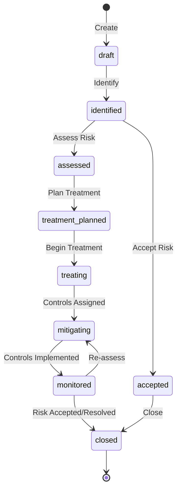

# 04 — GRC Module Guide

> **Version:** 2.0
> **Last Updated:** 2026-02-27
> **Status:** Final
> **Audience:** Product/Engineering, Compliance Officers, Auditors, Executive
> **Evidence Map:** [EVIDENCE_MAP_v1.md](../discovery/EVIDENCE_MAP_v1.md) — Section 4

---

## Table of Contents

1. [Executive Summary](#1-executive-summary)
2. [Golden Flow](#2-golden-flow)
3. [Architecture Overview](#3-architecture-overview)
4. [Risk Management](#4-risk-management)
5. [Control Management](#5-control-management)
6. [Policy Management](#6-policy-management)
7. [Evidence Management](#7-evidence-management)
8. [Issue & CAPA Management](#8-issue--capa-management)
9. [Audit Management](#9-audit-management)
10. [Standards & Frameworks Library](#10-standards--frameworks-library)
11. [Requirements & Compliance](#11-requirements--compliance)
12. [Statement of Applicability (SOA)](#12-statement-of-applicability-soa)
13. [Business Continuity Management (BCM)](#13-business-continuity-management-bcm)
14. [Process Controls & Violations](#14-process-controls--violations)
15. [Coverage Analysis & Insights](#15-coverage-analysis--insights)
16. [Implemented vs Planned Matrix](#16-implemented-vs-planned-matrix)
17. [Security & Governance](#17-security--governance)
18. [Operations Runbook](#18-operations-runbook)
19. [Troubleshooting](#19-troubleshooting)
20. [Validation Checklist](#20-validation-checklist)
21. [Evidence Index](#21-evidence-index)

---

## 1. Executive Summary

The GRC platform delivers a **full Governance, Risk & Compliance module** spanning risk registers, control libraries, policy governance, evidence collection, issue tracking, corrective/preventive actions (CAPA), audit management, standards/framework mapping, statement of applicability (SOA), business continuity management (BCM), and process-level controls with violation tracking.

### What's Implemented Today

| Module | Status | Key Features |
|--------|--------|--------------|
| **Risk Management** | IMPLEMENTED | Full CRUD, 4x5 heat-map scoring (4 severity x 5 likelihood), treatment strategies (mitigate / accept / transfer / avoid), risk appetite thresholds, residual risk calculation, risk-control effectiveness linking, policy & requirement linking, treatment actions, risk assessments |
| **Control Management** | IMPLEMENTED | Full CRUD, lifecycle (DRAFT / IN_DESIGN / IMPLEMENTED / INOPERATIVE / RETIRED), process linking, evidence linking, test results, control tests, issue tracking, universal list with advanced filter DSL |
| **Policy Management** | IMPLEMENTED | Full CRUD, lifecycle (DRAFT / UNDER_REVIEW / APPROVED / ACTIVE / RETIRED), versioning (major / minor), control linking, risk linking, review scheduling, statistics |
| **Evidence Management** | IMPLEMENTED | Full CRUD, metadata-based records (DOCUMENT / SCREENSHOT / LOG / REPORT / CONFIG_EXPORT / LINK), control linking, test-result linking, issue linking, status lifecycle (DRAFT / APPROVED / RETIRED) |
| **Issue Management** | IMPLEMENTED | Full CRUD, lifecycle (OPEN / IN_PROGRESS / RESOLVED / CLOSED / REJECTED), severity levels, source tracking (MANUAL / TEST_RESULT / SOA_ITEM), control / test-result / evidence linking, status transitions with history, CAPA creation from issues |
| **CAPA Management** | IMPLEMENTED | Full CRUD, lifecycle (PLANNED / IN_PROGRESS / IMPLEMENTED / VERIFIED / REJECTED / CLOSED), task management with progress tracking, issue linking, status history |
| **Audit Management** | IMPLEMENTED | Full CRUD, audit scoping (requirement-level), finding creation, report generation (PDF), template system, statistics, standard-clause scope with finding linking |
| **Standards Library** | IMPLEMENTED | Full CRUD, clause hierarchy (tree), audit scope linking, finding-to-clause mapping, summary statistics |
| **Requirements** | IMPLEMENTED | Full CRUD, framework mapping, control linking, risk linking, issue linking, statistics, summary reporting |
| **SOA (Statement of Applicability)** | IMPLEMENTED | Profile CRUD, item initialization from standards, control & evidence linking, issue & CAPA linking, applicability & implementation tracking, CSV export, publish with versioning, statistics |
| **BCM** | IMPLEMENTED | Services, BIA (Business Impact Analysis), recovery plans, exercises with outcomes, service dependencies, nested entity management |
| **Process Controls** | IMPLEMENTED | Full CRUD, risk linking, method / frequency configuration, result tracking (boolean / numeric / qualitative), violation auto-creation |
| **Coverage Analysis** | IMPLEMENTED | Requirement coverage, process coverage, unlinked controls detection, statistics aggregation |
| **GRC Insights** | IMPLEMENTED | Aggregated dashboard metrics: open issues by severity, overdue CAPAs, recent failed tests, evidence statistics |
| **GRC Calendar** | IMPLEMENTED | Unified calendar view for audits, control tests, policy reviews, CAPA due dates |
| **Frameworks** | IMPLEMENTED | Global framework catalog (ISO 27001, NIST, SOC2, GDPR, HIPAA, PCI-DSS, COBIT, ISO 22301), per-tenant framework activation |
| **ITSM Bridge** | IMPLEMENTED | Incident / Change / Service linking to risks and controls. See [ITSM-GRC Bridges](./05_ITSM_GRC_BRIDGES.md) |
| **AI Risk Advisory** | IMPLEMENTED | AI-powered risk suggestions with heuristic pre-filtering. See [AI Features](./06_AI_FEATURES.md) |

### Known Limitations

| Area | Status | Notes |
|------|--------|-------|
| Evidence file upload | PARTIAL | Metadata records implemented; binary file upload storage via `/data/uploads` volume mount available but not yet integrated into GRC evidence flow |
| Advanced risk assessment workflows | PLANNED | Basic risk assessments exist; multi-stage assessment workflows planned |
| Policy approval workflows | PLANNED | Status transitions exist; multi-approver workflow engine planned |
| Audit report templates (advanced) | PARTIAL | Basic PDF generation implemented; advanced template customization planned |
| Control automation | PLANNED | Manual and hybrid test types exist; fully automated control testing planned |

---

## 2. Golden Flow

The **Golden Flow** is the narrative spine of the GRC module. Every compliance activity traces through this chain:

```
Standard/Requirement --> Control --> Evidence (metadata) --> Test/Result
        --> Finding/Issue --> CAPA --> Closure
```


### Golden Flow Entities

| Step | Entity | Key Enum Values | Evidence |
|------|--------|----------------|----------|
| 1. Standard / Requirement | `GrcStandard`, `GrcStandardClause`, `GrcRequirement` | `RequirementStatus`: NOT_STARTED, IN_PROGRESS, IMPLEMENTED, VERIFIED, NON_COMPLIANT | `backend-nest/src/grc/entities/standard.entity.ts` |
| 2. Control | `GrcControl` | `ControlStatus`: DRAFT, IN_DESIGN, IMPLEMENTED, INOPERATIVE, RETIRED | `backend-nest/src/grc/entities/grc-control.entity.ts` |
| 3. Evidence | `GrcEvidence`, `GrcControlEvidence` | `EvidenceType`: DOCUMENT, SCREENSHOT, LOG, REPORT, CONFIG_EXPORT, LINK; `ControlEvidenceType`: BASELINE, TEST, PERIODIC | `backend-nest/src/grc/entities/grc-evidence.entity.ts` |
| 4. Control Test | `GrcControlTest` | `ControlTestType`: MANUAL, AUTOMATED, HYBRID; `ControlTestStatus`: PLANNED, IN_PROGRESS, COMPLETED, CANCELLED | `backend-nest/src/grc/entities/grc-control-test.entity.ts` |
| 5. Test Result | `GrcTestResult` | `TestResultOutcome`: PASS, FAIL, INCONCLUSIVE, NOT_APPLICABLE; `EffectivenessRating`: EFFECTIVE, PARTIALLY_EFFECTIVE, INEFFECTIVE | `backend-nest/src/grc/entities/grc-test-result.entity.ts` |
| 6. Issue / Finding | `GrcIssue`, `GrcAuditFinding` | `IssueStatus`: OPEN, IN_PROGRESS, RESOLVED, CLOSED, REJECTED; `IssueSource`: MANUAL, TEST_RESULT, SOA_ITEM | `backend-nest/src/grc/entities/grc-issue.entity.ts` |
| 7. CAPA | `GrcCapa` | `CapaStatus`: PLANNED, IN_PROGRESS, IMPLEMENTED, VERIFIED, REJECTED, CLOSED; `CapaType`: CORRECTIVE, PREVENTIVE, BOTH | `backend-nest/src/grc/entities/grc-capa.entity.ts` |
| 8. CAPA Task | `GrcCapaTask` | `CAPATaskStatus`: PENDING, IN_PROGRESS, COMPLETED, CANCELLED | `backend-nest/src/grc/entities/grc-capa-task.entity.ts` |

### Golden Flow State Machine


---

## 3. Architecture Overview

### Multi-Tenant Isolation

Every GRC entity includes a `tenantId` column (UUID). All API calls require the `x-tenant-id` header. Queries are scoped by tenant at the service layer — no cross-tenant data leakage is possible.

```
+-----------+     x-tenant-id      +------------+     tenantId filter     +--------+
|  Client   | ------------------->  |  Backend   | --------------------->  |  DB    |
|  (React)  |                       |  (NestJS)  |                        |  (PG)  |
+-----------+                       +------------+                        +--------+
```

### Routing Convention

| Layer | Path Pattern | Example |
|-------|-------------|---------|
| **External (browser)** | `/api/grc/...` | `GET /api/grc/risks` |
| **Nginx** | Strips `/api` prefix | `proxy_pass http://backend/;` (trailing slash required) |
| **Backend controller** | `@Controller('grc/...')` | `@Controller('grc/risks')` — NO `api/` prefix |

> **Important:** Backend controllers use `@Controller('grc/...')` with NO `api/` prefix. Nginx exposes `/api/*` externally and strips the prefix before proxying. The trailing slash in `proxy_pass http://backend/;` is critical for correct path stripping.

### LIST-CONTRACT Response Format

All list endpoints return a standardized paginated response:

```json
{
  "data": {
    "items": [],
    "total": 42,
    "page": 1,
    "pageSize": 20,
    "totalPages": 3
  }
}
```

### Domain Model


---

## 4. Risk Management

### 4.1 Overview

The Risk module provides a comprehensive risk register with 4x5 risk scoring (4 severity levels x 5 likelihood levels), treatment strategy assignment, control effectiveness tracking, and residual risk calculation.

### 4.2 Risk Lifecycle



### 4.3 Key Enums

| Enum | Values |
|------|--------|
| `RiskStatus` | `draft`, `identified`, `assessed`, `treatment_planned`, `treating`, `mitigating`, `monitored`, `accepted`, `closed` |
| `RiskSeverity` | `low`, `medium`, `high`, `critical` |
| `RiskLikelihood` | `rare`, `unlikely`, `possible`, `likely`, `almost_certain` |
| `RiskType` | `strategic`, `operational`, `compliance`, `financial`, `technology`, `cyber`, `third_party`, `other` |
| `TreatmentStrategy` | `mitigate`, `accept`, `transfer`, `avoid` |
| `RiskAppetite` | `low`, `medium`, `high` |

### 4.4 Endpoints

| Method | Route | Description | Permission |
|--------|-------|-------------|------------|
| `GET` | `/api/grc/risks` | List risks (paginated, filterable) | `GRC_RISK_READ` |
| `POST` | `/api/grc/risks` | Create risk | `GRC_RISK_WRITE` |
| `GET` | `/api/grc/risks/summary` | Summary by status / severity / likelihood | `GRC_STATISTICS_READ` |
| `GET` | `/api/grc/risks/statistics` | Risk statistics | `GRC_STATISTICS_READ` |
| `GET` | `/api/grc/risks/high-severity` | High-severity risks | `GRC_RISK_READ` |
| `GET` | `/api/grc/risks/heatmap` | 4x5 heat-map data | `GRC_RISK_READ` |
| `GET` | `/api/grc/risks/above-appetite` | Risks exceeding appetite threshold | `GRC_RISK_READ` |
| `GET` | `/api/grc/risks/stats-with-appetite` | Stats with appetite overlay | `GRC_RISK_READ` |
| `GET` | `/api/grc/risks/:id` | Get risk by ID | `GRC_RISK_READ` |
| `PATCH` | `/api/grc/risks/:id` | Update risk | `GRC_RISK_WRITE` |
| `DELETE` | `/api/grc/risks/:id` | Soft-delete risk | `GRC_RISK_WRITE` |
| `GET` | `/api/grc/risks/:id/detail` | Risk with all relations | `GRC_RISK_READ` |
| `GET` | `/api/grc/risks/:id/controls` | Risk with linked controls | `GRC_RISK_READ` |
| `POST` | `/api/grc/risks/:id/controls` | Link control to risk | `GRC_RISK_WRITE` |
| `DELETE` | `/api/grc/risks/:id/controls/:controlId` | Unlink control | `GRC_RISK_WRITE` |
| `GET` | `/api/grc/risks/:id/controls-with-effectiveness` | Controls with effectiveness data | `GRC_RISK_READ` |
| `PATCH` | `/api/grc/risks/:id/controls/:controlId/effectiveness` | Update effectiveness | `GRC_RISK_WRITE` |
| `PATCH` | `/api/grc/risks/:id/controls/:controlId/effectiveness-override` | Override effectiveness | `GRC_RISK_WRITE` |
| `POST` | `/api/grc/risks/:id/recalculate-residual` | Recalculate residual risk | `GRC_RISK_WRITE` |
| `GET` | `/api/grc/risks/:id/policies` | Get linked policies | `GRC_RISK_READ` |
| `POST` | `/api/grc/risks/:id/policies` | Link policies | `GRC_RISK_WRITE` |
| `POST` | `/api/grc/risks/:id/policies/:policyId` | Link single policy | `GRC_RISK_WRITE` |
| `DELETE` | `/api/grc/risks/:id/policies/:policyId` | Unlink policy | `GRC_RISK_WRITE` |
| `GET` | `/api/grc/risks/:id/requirements` | Get linked requirements | `GRC_RISK_READ` |
| `POST` | `/api/grc/risks/:id/requirements` | Link requirements | `GRC_RISK_WRITE` |
| `GET` | `/api/grc/risks/:id/assessments` | Get risk assessments | `GRC_RISK_READ` |
| `POST` | `/api/grc/risks/:id/assessments` | Create risk assessment | `GRC_RISK_WRITE` |
| `GET` | `/api/grc/risks/:id/treatment-actions` | Get treatment actions | `GRC_RISK_READ` |
| `POST` | `/api/grc/risks/:id/treatment-actions` | Create treatment action | `GRC_RISK_WRITE` |
| `GET` | `/api/grc/risks/:id/treatment-actions/:actionId` | Get treatment action | `GRC_RISK_READ` |
| `PATCH` | `/api/grc/risks/:id/treatment-actions/:actionId` | Update treatment action | `GRC_RISK_WRITE` |
| `DELETE` | `/api/grc/risks/:id/treatment-actions/:actionId` | Delete treatment action | `GRC_RISK_WRITE` |
| `GET` | `/api/grc/risks/:id/treatment-summary` | Treatment summary | `GRC_RISK_READ` |

### 4.5 UI Pages

| Page | Route | Component | Key Features |
|------|-------|-----------|--------------|
| Risk Register | `/risks` | `RiskManagement` | Paginated list, severity / status filters, heat-map view, search, empty state: "No risks found" |
| Risk Detail | `/risks/:id` | `RiskDetail` | Tabs: Details, Policies, Controls (with effectiveness), Assessment, Treatment Actions, History |

#### Risk Detail Tabs

| Tab Index | Tab Name | Content |
|-----------|----------|---------|
| 0 | Details | Risk attributes, severity / likelihood / impact scoring, treatment strategy, review dates |
| 1 | Policies | Linked policies with link / unlink actions |
| 2 | Controls | Linked controls with effectiveness ratings, override capability, residual risk recalculation |
| 3 | History | Status change history |

### 4.6 AI Risk Advisory

The Risk module integrates with the AI Risk Advisory feature for AI-powered risk suggestions. The advisory uses a heuristic pre-filter before calling the AI provider to generate contextually relevant risk recommendations.

> **Cross-link:** See [06 — AI Features, Section 7: Risk Advisory](./06_AI_FEATURES.md#7-feature-risk-advisory) for full details on governance, heuristics, and adapter architecture.

---

## 5. Control Management

### 5.1 Overview

Controls are the primary mitigation mechanism for risks. Each control can be linked to risks, requirements, processes, evidence, and tested via the Golden Flow (Control Test -> Test Result).

### 5.2 Control Lifecycle


### 5.3 Key Enums

| Enum | Values |
|------|--------|
| `ControlType` | `preventive`, `detective`, `corrective` |
| `ControlImplementationType` | `manual`, `automated`, `it_dependent` |
| `ControlStatus` | `draft`, `in_design`, `implemented`, `inoperative`, `retired` |
| `ControlFrequency` | `continuous`, `daily`, `weekly`, `monthly`, `quarterly`, `annual` |

### 5.4 Endpoints

| Method | Route | Description | Permission |
|--------|-------|-------------|------------|
| `GET` | `/api/grc/controls` | List controls (universal list with filter DSL) | `GRC_CONTROL_READ` |
| `GET` | `/api/grc/controls/:id` | Get control with relations | `GRC_CONTROL_READ` |
| `PATCH` | `/api/grc/controls/:id` | Update control | `GRC_CONTROL_WRITE` |
| `POST` | `/api/grc/controls/:id/processes` | Link process to control | `GRC_CONTROL_WRITE` |
| `DELETE` | `/api/grc/controls/:id/processes/:processId` | Unlink process | `GRC_CONTROL_WRITE` |
| `GET` | `/api/grc/controls/:id/processes` | Get linked processes | `GRC_CONTROL_READ` |
| `GET` | `/api/grc/controls/:id/evidences` | Get linked evidence records | `GRC_CONTROL_READ` |
| `GET` | `/api/grc/controls/:id/test-results` | Get test results for control | `GRC_CONTROL_READ` |
| `GET` | `/api/grc/controls/:id/control-tests` | Get control tests for control | `GRC_CONTROL_READ` |

#### Advanced Filter DSL

The controls list endpoint supports a JSON filter tree via the `filter` query parameter:

```json
{ "and": [{ "field": "status", "op": "is", "value": "implemented" }] }
```

Supported operators: `is`, `is_not`, `is_empty`, `is_not_empty`, `contains`, `not_contains`, `after`, `before`, `gt`, `lt`, `gte`, `lte`.

Quick search via `q` parameter searches across `name`, `code`, and `description` columns.

### 5.5 UI Pages

| Page | Route | Component | Key Features |
|------|-------|-----------|--------------|
| Control List | `/controls` | `ControlList` | Paginated list, status / type filters, search, empty state: "No controls found" |
| Control Detail | `/controls/:id` | `ControlDetail` | Tabs: Details, Processes, Evidence, Status History, Test Results, Issues/CAPA, History |

#### Control Detail Tabs

| Tab Index | Tab Name | Content |
|-----------|----------|---------|
| 0 | Details | Control attributes, type, status, frequency, effectiveness rating |
| 1 | Processes | Linked business processes with link / unlink |
| 2 | Evidence | Linked GRC evidence records (BASELINE / TEST / PERIODIC) |
| 3 | Status History | Control status change timeline |
| 4 | Test Results | Test results with outcome chips (PASS / FAIL), create test result dialog, create issue from failing test |
| 5 | Issues/CAPA | Issues linked to this control via list contract |
| 6 | History | Full audit trail |

---

## 6. Policy Management

### 6.1 Overview

The Policy module manages organizational policies with versioning, review scheduling, and linkage to controls and risks.

### 6.2 Policy Lifecycle


### 6.3 Key Enums

| Enum | Values |
|------|--------|
| `PolicyStatus` | `draft`, `under_review`, `approved`, `active`, `retired` |
| `PolicyVersionStatus` | `draft`, `in_review`, `approved`, `published`, `retired` |
| `VersionType` | `major`, `minor` |

### 6.4 Endpoints

| Method | Route | Description | Permission |
|--------|-------|-------------|------------|
| `GET` | `/api/grc/policies` | List policies (paginated, filterable) | `GRC_POLICY_READ` |
| `POST` | `/api/grc/policies` | Create policy | `GRC_POLICY_WRITE` |
| `GET` | `/api/grc/policies/summary` | Summary by status / category | `GRC_STATISTICS_READ` |
| `GET` | `/api/grc/policies/statistics` | Policy statistics | `GRC_STATISTICS_READ` |
| `GET` | `/api/grc/policies/active` | Active policies only | `GRC_POLICY_READ` |
| `GET` | `/api/grc/policies/due-for-review` | Policies due for review | `GRC_STATISTICS_READ` |
| `GET` | `/api/grc/policies/:id` | Get policy by ID | `GRC_POLICY_READ` |
| `PATCH` | `/api/grc/policies/:id` | Update policy | `GRC_POLICY_WRITE` |
| `DELETE` | `/api/grc/policies/:id` | Soft-delete policy | `GRC_POLICY_WRITE` |
| `GET` | `/api/grc/policies/:id/controls` | Get policy with controls | `GRC_POLICY_READ` |
| `GET` | `/api/grc/policies/:id/risks` | Get linked risks | `GRC_POLICY_READ` |

### 6.5 UI Pages

| Page | Route | Component | Key Features |
|------|-------|-----------|--------------|
| Policy List | `/governance` | `Governance` | Paginated list, status filters, search, empty state: "No policies found" |
| Policy Detail | `/governance/:id` | `PolicyDetail` | Tabs with version history, control linking |

---

## 7. Evidence Management

### 7.1 Overview

Evidence records are metadata entries that document the existence of supporting artifacts for controls, test results, and issues. Evidence is the glue that connects controls to their proof of operation.

> **Note:** Evidence records store metadata (name, type, source, description, URL). Binary file upload integration into the GRC evidence flow is **[PLANNED]**. The backend volume mount at `/data/uploads` is available for future file storage.

### 7.2 Key Enums

| Enum | Values |
|------|--------|
| `EvidenceType` | `document`, `screenshot`, `log`, `report`, `config_export`, `link`, `other` |
| `EvidenceSourceType` | `manual`, `url`, `system` |
| `EvidenceStatus` | `draft`, `approved`, `retired` |
| `ControlEvidenceType` | `BASELINE`, `TEST`, `PERIODIC` |

### 7.3 Endpoints

| Method | Route | Description | Permission |
|--------|-------|-------------|------------|
| `GET` | `/api/grc/evidence` | List evidence (paginated) | `GRC_EVIDENCE_READ` |
| `POST` | `/api/grc/evidence` | Create evidence record | `GRC_EVIDENCE_WRITE` |
| `GET` | `/api/grc/evidence/:id` | Get evidence by ID | `GRC_EVIDENCE_READ` |
| `PATCH` | `/api/grc/evidence/:id` | Update evidence | `GRC_EVIDENCE_WRITE` |
| `DELETE` | `/api/grc/evidence/:id` | Delete evidence | `GRC_EVIDENCE_WRITE` |
| `POST` | `/api/grc/evidence/:id/controls/:controlId` | Link evidence to control | `GRC_EVIDENCE_WRITE` |
| `DELETE` | `/api/grc/evidence/:id/controls/:controlId` | Unlink evidence from control | `GRC_EVIDENCE_WRITE` |
| `POST` | `/api/grc/evidence/:id/test-results/:testResultId` | Link evidence to test result | `GRC_EVIDENCE_WRITE` |
| `DELETE` | `/api/grc/evidence/:id/test-results/:testResultId` | Unlink evidence from test result | `GRC_EVIDENCE_WRITE` |
| `POST` | `/api/grc/evidence/:id/issues/:issueId` | Link evidence to issue | `GRC_EVIDENCE_WRITE` |
| `DELETE` | `/api/grc/evidence/:id/issues/:issueId` | Unlink evidence from issue | `GRC_EVIDENCE_WRITE` |
| `GET` | `/api/grc/evidence/:id/controls` | Get linked controls | `GRC_EVIDENCE_READ` |
| `GET` | `/api/grc/evidence/:id/test-results` | Get linked test results | `GRC_EVIDENCE_READ` |
| `GET` | `/api/grc/evidence/:id/issues` | Get linked issues | `GRC_EVIDENCE_READ` |

### 7.4 UI Pages

| Page | Route | Component | Key Features |
|------|-------|-----------|--------------|
| Evidence List | `/evidence` | `EvidenceList` | Paginated list, type / status filters, search, empty state: "No evidence found" |
| Evidence Detail | `/evidence/:id` | `EvidenceDetail` | Tabs: Details, Links (controls / test-results / issues), History |

#### Evidence Detail Tabs

| Tab Index | Tab Name | Content |
|-----------|----------|---------|
| 0 | Details | Evidence metadata, type, status, source info |
| 1 | Links | Linked controls, test results, and issues with link / unlink dialogs |
| 2 | History | Status change history |

---

## 8. Issue & CAPA Management

### 8.1 Issue Management

Issues represent findings, non-conformities, or gaps discovered during audits, control testing, or manual review. Issues can be auto-created from failing test results or SOA item gaps.

#### Issue Lifecycle


#### Issue Enums

| Enum | Values |
|------|--------|
| `IssueStatus` | `open`, `in_progress`, `resolved`, `closed`, `rejected` |
| `IssueSeverity` | `low`, `medium`, `high`, `critical` |
| `IssueType` | `internal_audit`, `external_audit`, `incident`, `self_assessment`, `other` |
| `IssueSource` | `manual`, `test_result`, `soa_item` |

#### Issue Endpoints

| Method | Route | Description | Permission |
|--------|-------|-------------|------------|
| `GET` | `/api/grc/issues` | List issues (paginated, filterable) | `GRC_ISSUE_READ` |
| `POST` | `/api/grc/issues` | Create issue | `GRC_ISSUE_WRITE` |
| `GET` | `/api/grc/issues/filters` | Get filter metadata | `GRC_ISSUE_READ` |
| `GET` | `/api/grc/issues/:id` | Get issue by ID | `GRC_ISSUE_READ` |
| `PATCH` | `/api/grc/issues/:id` | Update issue | `GRC_ISSUE_WRITE` |
| `DELETE` | `/api/grc/issues/:id` | Delete issue | `GRC_ISSUE_WRITE` |
| `PATCH` | `/api/grc/issues/:id/status` | Update issue status (with reason) | `GRC_ISSUE_WRITE` |
| `POST` | `/api/grc/issues/:id/controls/:controlId` | Link control | `GRC_ISSUE_WRITE` |
| `DELETE` | `/api/grc/issues/:id/controls/:controlId` | Unlink control | `GRC_ISSUE_WRITE` |
| `POST` | `/api/grc/issues/:id/test-results/:testResultId` | Link test result | `GRC_ISSUE_WRITE` |
| `DELETE` | `/api/grc/issues/:id/test-results/:testResultId` | Unlink test result | `GRC_ISSUE_WRITE` |
| `POST` | `/api/grc/issues/:id/evidence/:evidenceId` | Link evidence | `GRC_ISSUE_WRITE` |
| `DELETE` | `/api/grc/issues/:id/evidence/:evidenceId` | Unlink evidence | `GRC_ISSUE_WRITE` |
| `GET` | `/api/grc/issues/:id/capas` | Get linked CAPAs | `GRC_ISSUE_READ` |
| `POST` | `/api/grc/issues/:id/capas` | Create CAPA from issue | `GRC_ISSUE_WRITE` |

#### Issue UI Pages

| Page | Route | Component | Key Features |
|------|-------|-----------|--------------|
| Issue List | `/issues` | `IssueList` | Paginated list, severity / status / source filters, empty state: "No issues found" |
| Issue Detail | `/issues/:id` | `IssueDetail` | Tabs: Details, Links & CAPAs, History |

**Issue Detail Tabs:**

| Tab Index | Tab Name | Content |
|-----------|----------|---------|
| 0 | Details | Issue attributes, severity, source, type, status transition button |
| 1 | Links & CAPAs | Linked controls, test results, evidence (with link / unlink); linked CAPAs with "Create CAPA" action |
| 2 | History | Status transition history with reason |

### 8.2 CAPA Management

Corrective and Preventive Actions (CAPAs) track remediation activities spawned from issues. Each CAPA can have multiple tasks with progress tracking.

#### CAPA Lifecycle


#### CAPA Enums

| Enum | Values |
|------|--------|
| `CapaStatus` | `planned`, `in_progress`, `implemented`, `verified`, `rejected`, `closed` |
| `CapaType` | `corrective`, `preventive`, `both` |
| `CAPAPriority` | `LOW`, `MEDIUM`, `HIGH`, `CRITICAL` |
| `CAPATaskStatus` | `PENDING`, `IN_PROGRESS`, `COMPLETED`, `CANCELLED` |

#### CAPA Endpoints

| Method | Route | Description | Permission |
|--------|-------|-------------|------------|
| `GET` | `/api/grc/capas` | List CAPAs (paginated, filterable) | `GRC_CAPA_READ` |
| `POST` | `/api/grc/capas` | Create CAPA | `GRC_CAPA_WRITE` |
| `GET` | `/api/grc/capas/filters` | Get filter metadata | `GRC_CAPA_READ` |
| `GET` | `/api/grc/capas/:id` | Get CAPA by ID | `GRC_CAPA_READ` |
| `PATCH` | `/api/grc/capas/:id` | Update CAPA | `GRC_CAPA_WRITE` |
| `DELETE` | `/api/grc/capas/:id` | Delete CAPA | `GRC_CAPA_WRITE` |
| `PATCH` | `/api/grc/capas/:id/status` | Update CAPA status (with reason) | `GRC_CAPA_WRITE` |
| `GET` | `/api/grc/capas/:id/tasks` | Get CAPA tasks (with stats) | `GRC_CAPA_READ` |
| `POST` | `/api/grc/capas/:id/tasks` | Create CAPA task | `GRC_CAPA_WRITE` |

#### CAPA UI Pages

| Page | Route | Component | Key Features |
|------|-------|-----------|--------------|
| CAPA List | `/capa` | `CapaList` | Paginated list, status / type filters, create CAPA dialog (with optional issue link), empty state: "No CAPAs found" |
| CAPA Detail | `/capa/:id` | `CapaDetail` | Tabs: Details, Linked Issue, Tasks, History |

**CAPA Detail Tabs:**

| Tab Index | Tab Name | Content |
|-----------|----------|---------|
| 0 | Details | CAPA attributes, type, priority, verification / closure notes |
| 1 | Linked Issue | Linked issue details with navigation link |
| 2 | Tasks | Task table with progress bar, add task, complete task actions, empty state: "No tasks have been created for this CAPA yet." |
| 3 | History | Status transition history |

---

## 9. Audit Management

### 9.1 Overview

The Audit module supports internal and external audit lifecycle management with standard-clause scoping, finding creation, requirement tracking, and report generation.

### 9.2 Endpoints

| Method | Route | Description | Permission |
|--------|-------|-------------|------------|
| `GET` | `/api/grc/audits` | List audits (paginated, filterable) | `GRC_AUDIT_READ` |
| `POST` | `/api/grc/audits` | Create audit | `GRC_AUDIT_WRITE` |
| `GET` | `/api/grc/audits/can/create` | Check create permission | `GRC_AUDIT_READ` |
| `GET` | `/api/grc/audits/distinct/:field` | Get distinct filter values | `GRC_AUDIT_READ` |
| `GET` | `/api/grc/audits/statistics` | Audit statistics | `GRC_STATISTICS_READ` |
| `GET` | `/api/grc/audits/:id` | Get audit by ID | `GRC_AUDIT_READ` |
| `GET` | `/api/grc/audits/:id/permissions` | Get user permissions for audit | `GRC_AUDIT_READ` |
| `PATCH` | `/api/grc/audits/:id` | Update audit | `GRC_AUDIT_WRITE` |
| `PUT` | `/api/grc/audits/:id` | Full update audit | `GRC_AUDIT_WRITE` |
| `DELETE` | `/api/grc/audits/:id` | Soft-delete audit | `GRC_AUDIT_WRITE` |
| `GET` | `/api/grc/audits/:id/requirements` | Get audit requirements | `GRC_AUDIT_READ` |
| `POST` | `/api/grc/audits/:id/requirements` | Add requirements to audit | `GRC_AUDIT_WRITE` |
| `DELETE` | `/api/grc/audits/:id/requirements/:reqId` | Remove requirement | `GRC_AUDIT_WRITE` |
| `PATCH` | `/api/grc/audits/:id/requirements/:reqId/status` | Update requirement status | `GRC_AUDIT_WRITE` |
| `GET` | `/api/grc/audits/:id/findings` | Get audit findings | `GRC_AUDIT_READ` |
| `POST` | `/api/grc/audits/:id/findings` | Create finding | `GRC_AUDIT_WRITE` |
| `GET` | `/api/grc/audits/:id/criteria` | Get audit criteria | `GRC_AUDIT_READ` |
| `GET` | `/api/grc/audits/:id/scope` | Get audit scope | `GRC_AUDIT_READ` |
| `GET` | `/api/grc/audits/:id/scope/objects` | Get scope objects | `GRC_AUDIT_READ` |
| `GET` | `/api/grc/audits/:id/reports` | Get audit reports | `GRC_AUDIT_READ` |

#### Audit Scope (Standard-Clause Based)

| Method | Route | Description | Permission |
|--------|-------|-------------|------------|
| `GET` | `/api/grc/audit-scope/:auditId` | Get audit scope | `GRC_AUDIT_READ` |
| `POST` | `/api/grc/audit-scope/:auditId` | Set audit scope (clause IDs) | `GRC_AUDIT_WRITE` |
| `POST` | `/api/grc/audit-scope/:auditId/lock` | Lock audit scope | `GRC_AUDIT_WRITE` |
| `GET` | `/api/grc/audit-scope/:auditId/clauses/:clauseId/findings` | Get clause findings | `GRC_AUDIT_READ` |
| `POST` | `/api/grc/audit-scope/:auditId/clauses/:clauseId/findings` | Create / link finding to clause | `GRC_AUDIT_WRITE` |
| `DELETE` | `/api/grc/audit-scope/:auditId/clauses/:clauseId/findings/:findingId` | Unlink finding | `GRC_AUDIT_WRITE` |

### 9.3 UI Pages

| Page | Route | Component | Key Features |
|------|-------|-----------|--------------|
| Audit List | `/audits` | `AuditList` | Paginated list, type / status / risk-level filters, search, empty state: "No audits found" |
| Audit Detail | `/audits/:id` | `AuditDetail` | Full audit management with scope, findings, requirements, tabs |
| Audit Report | `/audits/:auditId/reports/:reportId` | `ReportViewer` | PDF report viewer, empty state: "No report content available." |
| Finding Detail | `/findings/:id` | `FindingDetail` | Finding attributes, tabs with evidence linking |
| Audit Dashboard | `/dashboards/audit` | `AuditDashboard` | Role-gated (admin, auditor, audit_manager, governance) |

---

## 10. Standards & Frameworks Library

### 10.1 Overview

The Standards Library manages compliance standards (ISO 27001, NIST, SOC2, etc.) with hierarchical clause structures. Standards serve as the foundation for requirements, SOA profiles, and audit scoping.

> **Note:** Standards and clauses are stored in legacy tables named `standards` and `standard_clauses` (not `grc_standards` / `grc_standard_clauses`).

### 10.2 Endpoints

| Method | Route | Description | Permission |
|--------|-------|-------------|------------|
| `GET` | `/api/grc/standards` | List all active standards | `GRC_REQUIREMENT_READ` |
| `POST` | `/api/grc/standards` | Create standard | `GRC_REQUIREMENT_WRITE` |
| `GET` | `/api/grc/standards/summary` | Standards summary | `GRC_STATISTICS_READ` |
| `GET` | `/api/grc/standards/:id` | Get standard by ID | `GRC_REQUIREMENT_READ` |
| `GET` | `/api/grc/standards/:id/with-clauses` | Get standard with clause tree | `GRC_REQUIREMENT_READ` |
| `PATCH` | `/api/grc/standards/:id` | Update standard | `GRC_REQUIREMENT_WRITE` |
| `DELETE` | `/api/grc/standards/:id` | Delete standard | `GRC_REQUIREMENT_WRITE` |
| `GET` | `/api/grc/standards/:id/clauses` | Get clauses (flat) | `GRC_REQUIREMENT_READ` |
| `GET` | `/api/grc/standards/:id/clauses/tree` | Get clauses (tree) | `GRC_REQUIREMENT_READ` |
| `POST` | `/api/grc/standards/:id/clauses` | Create clause | `GRC_REQUIREMENT_WRITE` |
| `GET` | `/api/grc/standards/:id/clauses/:clauseId` | Get clause by ID | `GRC_REQUIREMENT_READ` |
| `PATCH` | `/api/grc/standards/:id/clauses/:clauseId` | Update clause | `GRC_REQUIREMENT_WRITE` |

#### Frameworks (Global Catalog)

| Method | Route | Description | Permission |
|--------|-------|-------------|------------|
| `GET` | `/api/grc/frameworks` | List all active frameworks | (JWT only) |
| `GET` | `/api/tenants/me/frameworks` | Get tenant's active framework keys | (Tenant) |
| `PUT` | `/api/tenants/me/frameworks` | Set tenant's active frameworks | `ADMIN_SETTINGS_WRITE` |

### 10.3 Supported Frameworks

| Framework | Enum Key | Standard |
|-----------|----------|----------|
| ISO 27001 | `iso27001` | Information Security Management |
| ISO 22301 | `iso22301` | Business Continuity Management |
| SOC 2 | `soc2` | Service Organization Controls |
| NIST | `nist` | Cybersecurity Framework |
| GDPR | `gdpr` | General Data Protection Regulation |
| HIPAA | `hipaa` | Health Information Privacy |
| PCI-DSS | `pci_dss` | Payment Card Industry |
| COBIT | `cobit` | IT Governance Framework |

### 10.4 UI Pages

| Page | Route | Component | Key Features |
|------|-------|-----------|--------------|
| Standards Library | `/standards` | `StandardsLibrary` | List of standards with search, empty state: "No standards found" |
| Standard Detail | `/standards/:id` | `StandardDetail` | Clause tree view, requirement mapping, empty state: "No requirements/clauses found for this standard" |
| Clause Detail | `/standards/clauses/:id` | `ClauseDetail` | Individual clause with linked requirements |

---

## 11. Requirements & Compliance

### 11.1 Overview

Requirements represent specific compliance obligations derived from standards and frameworks. They are linked to controls (which implement them) and tracked for coverage.

### 11.2 Key Enums

| Enum | Values |
|------|--------|
| `RequirementType` | `regulatory`, `contractual`, `internal`, `industry_standard`, `best_practice` |
| `RequirementStatus` | `not_started`, `in_progress`, `implemented`, `verified`, `non_compliant` |

### 11.3 Endpoints

| Method | Route | Description | Permission |
|--------|-------|-------------|------------|
| `GET` | `/api/grc/requirements` | List requirements (paginated) | `GRC_REQUIREMENT_READ` |
| `POST` | `/api/grc/requirements` | Create requirement | `GRC_REQUIREMENT_WRITE` |
| `GET` | `/api/grc/requirements/summary` | Summary / reporting data | `GRC_REQUIREMENT_READ` |
| `GET` | `/api/grc/requirements/statistics` | Requirement statistics | `GRC_REQUIREMENT_READ` |
| `GET` | `/api/grc/requirements/frameworks` | Get unique frameworks | `GRC_REQUIREMENT_READ` |
| `GET` | `/api/grc/requirements/filters` | Get filter options | `GRC_REQUIREMENT_READ` |
| `GET` | `/api/grc/requirements/:id` | Get requirement by ID | `GRC_REQUIREMENT_READ` |
| `PATCH` | `/api/grc/requirements/:id` | Update requirement | `GRC_REQUIREMENT_WRITE` |
| `DELETE` | `/api/grc/requirements/:id` | Delete requirement | `GRC_REQUIREMENT_WRITE` |
| `GET` | `/api/grc/requirements/:id/controls` | Get requirement with controls | `GRC_REQUIREMENT_READ` |
| `GET` | `/api/grc/requirements/:id/risks` | Get linked risks | `GRC_REQUIREMENT_READ` |
| `GET` | `/api/grc/requirements/:id/issues` | Get linked issues | `GRC_REQUIREMENT_READ` |

### 11.4 UI Pages

| Page | Route | Component | Key Features |
|------|-------|-----------|--------------|
| Compliance List | `/compliance` | `Compliance` | Paginated list with framework / status filters, empty state: "No compliance requirements found" |
| Requirement Detail | `/requirements/:id` | `RequirementDetail` | Requirement attributes, linked controls and risks |
| Compliance Dashboard | `/dashboards/compliance` | `ComplianceDashboard` | Role-gated (admin, governance, compliance, audit_manager) |

---

## 12. Statement of Applicability (SOA)

### 12.1 Overview

The SOA module implements ISO 27001 Annex A Statement of Applicability profiles. Each profile is linked to a standard, and items are auto-initialized from the standard's clauses. Items can be marked as applicable / not-applicable with justification, linked to controls and evidence, and tracked for implementation status.

### 12.2 Key Enums

| Enum | Values |
|------|--------|
| `SoaProfileStatus` | `DRAFT`, `PUBLISHED`, `ARCHIVED` |
| `SoaApplicability` | `APPLICABLE`, `NOT_APPLICABLE`, `UNDECIDED` |
| `SoaImplementationStatus` | `IMPLEMENTED`, `PARTIALLY_IMPLEMENTED`, `PLANNED`, `NOT_IMPLEMENTED` |

### 12.3 Endpoints

| Method | Route | Description | Permission |
|--------|-------|-------------|------------|
| `GET` | `/api/grc/soa/profiles` | List SOA profiles | `GRC_REQUIREMENT_READ` |
| `POST` | `/api/grc/soa/profiles` | Create SOA profile | `GRC_REQUIREMENT_WRITE` |
| `GET` | `/api/grc/soa/profiles/:id` | Get profile by ID | `GRC_REQUIREMENT_READ` |
| `PATCH` | `/api/grc/soa/profiles/:id` | Update profile | `GRC_REQUIREMENT_WRITE` |
| `DELETE` | `/api/grc/soa/profiles/:id` | Delete profile | `GRC_REQUIREMENT_WRITE` |
| `GET` | `/api/grc/soa/profiles/:id/items` | Get profile items | `GRC_REQUIREMENT_READ` |
| `GET` | `/api/grc/soa/profiles/:id/statistics` | Get profile statistics | `GRC_REQUIREMENT_READ` |
| `GET` | `/api/grc/soa/profiles/:id/export` | Export profile as CSV | `GRC_REQUIREMENT_READ` |
| `POST` | `/api/grc/soa/profiles/:id/initialize` | Initialize items from standard | `GRC_REQUIREMENT_WRITE` |
| `POST` | `/api/grc/soa/profiles/:id/publish` | Publish profile (increment version) | `GRC_REQUIREMENT_WRITE` |
| `GET` | `/api/grc/soa/items` | List SOA items (filterable) | `GRC_REQUIREMENT_READ` |
| `PATCH` | `/api/grc/soa/items/:id` | Update item | `GRC_REQUIREMENT_WRITE` |
| `POST` | `/api/grc/soa/items/:id/controls` | Link control to item | `GRC_REQUIREMENT_WRITE` |
| `DELETE` | `/api/grc/soa/items/:id/controls/:controlId` | Unlink control | `GRC_REQUIREMENT_WRITE` |
| `POST` | `/api/grc/soa/items/:id/evidence` | Link evidence to item | `GRC_REQUIREMENT_WRITE` |
| `DELETE` | `/api/grc/soa/items/:id/evidence/:evidenceId` | Unlink evidence | `GRC_REQUIREMENT_WRITE` |
| `GET` | `/api/grc/soa/items/:id/issues` | Get linked issues | `GRC_REQUIREMENT_READ` |
| `POST` | `/api/grc/soa/items/:id/issues` | Link / create issue for item | `GRC_REQUIREMENT_WRITE` |
| `GET` | `/api/grc/soa/items/:id/capas` | Get linked CAPAs | `GRC_REQUIREMENT_READ` |
| `POST` | `/api/grc/soa/items/:id/capas` | Link / create CAPA for item | `GRC_REQUIREMENT_WRITE` |

### 12.4 UI Pages

| Page | Route | Component | Key Features |
|------|-------|-----------|--------------|
| SOA Profiles List | `/soa` | `SoaProfilesList` | List of profiles with status badges |
| SOA Profile Detail | `/soa/:id` | `SoaProfileDetail` | Items table with filters (applicability, implementation, hasControls, hasEvidence), control / evidence linking, edit items, initialize, publish, CSV export, statistics dashboard |
| SOA Item Detail | `/soa/:profileId/items/:itemId` | `SoaItemDetail` | Individual item with linked controls, evidence, issues, CAPAs |

### 12.5 SOA Closure Loop

The SOA module implements a closure loop: when an SOA item has a gap (e.g., not_implemented for an applicable control), an Issue can be created with `IssueSource.SOA_ITEM`, which then triggers CAPA creation, task assignment, and eventual closure — completing the Golden Flow cycle.

---

## 13. Business Continuity Management (BCM)

### 13.1 Overview

The BCM module supports business continuity planning per ISO 22301. It covers critical service identification, business impact analysis (BIA), recovery plan management, and exercise / drill execution with outcome tracking.

### 13.2 Key Enums

| Enum | Values |
|------|--------|
| `BcmServiceStatus` | `DRAFT`, `ACTIVE`, `ARCHIVED` |
| `BcmCriticalityTier` | `TIER_0`, `TIER_1`, `TIER_2`, `TIER_3` |
| `BcmBiaStatus` | `DRAFT`, `REVIEWED`, `APPROVED` |
| `BcmPlanType` | `BCP`, `DRP`, `IT_CONTINUITY` |
| `BcmPlanStatus` | `DRAFT`, `APPROVED`, `ACTIVE`, `RETIRED` |
| `BcmExerciseType` | `TABLETOP`, `FAILOVER`, `RESTORE`, `COMMS` |
| `BcmExerciseStatus` | `PLANNED`, `IN_PROGRESS`, `COMPLETED`, `CANCELLED` |
| `BcmExerciseOutcome` | `PASS`, `PARTIAL`, `FAIL` |

### 13.3 Endpoints

| Method | Route | Description | Permission |
|--------|-------|-------------|------------|
| `GET` | `/api/grc/bcm/services` | List BCM services | `GRC_RISK_READ` |
| `POST` | `/api/grc/bcm/services` | Create service | `GRC_RISK_WRITE` |
| `GET` | `/api/grc/bcm/services/:id` | Get service by ID | `GRC_RISK_READ` |
| `PATCH` | `/api/grc/bcm/services/:id` | Update service | `GRC_RISK_WRITE` |
| `DELETE` | `/api/grc/bcm/services/:id` | Delete service | `GRC_RISK_WRITE` |
| `GET` | `/api/grc/bcm/bias` | List BIAs | `GRC_RISK_READ` |
| `POST` | `/api/grc/bcm/bias` | Create BIA | `GRC_RISK_WRITE` |
| `GET` | `/api/grc/bcm/bias/:id` | Get BIA by ID | `GRC_RISK_READ` |
| `PATCH` | `/api/grc/bcm/bias/:id` | Update BIA | `GRC_RISK_WRITE` |
| `DELETE` | `/api/grc/bcm/bias/:id` | Delete BIA | `GRC_RISK_WRITE` |
| `GET` | `/api/grc/bcm/plans` | List recovery plans | `GRC_RISK_READ` |
| `POST` | `/api/grc/bcm/plans` | Create plan | `GRC_RISK_WRITE` |
| `GET` | `/api/grc/bcm/plans/:id` | Get plan by ID | `GRC_RISK_READ` |
| `PATCH` | `/api/grc/bcm/plans/:id` | Update plan | `GRC_RISK_WRITE` |
| `DELETE` | `/api/grc/bcm/plans/:id` | Delete plan | `GRC_RISK_WRITE` |
| `GET` | `/api/grc/bcm/exercises` | List exercises | `GRC_RISK_READ` |
| `POST` | `/api/grc/bcm/exercises` | Create exercise | `GRC_RISK_WRITE` |
| `GET` | `/api/grc/bcm/exercises/:id` | Get exercise by ID | `GRC_RISK_READ` |
| `PATCH` | `/api/grc/bcm/exercises/:id` | Update exercise | `GRC_RISK_WRITE` |
| `DELETE` | `/api/grc/bcm/exercises/:id` | Delete exercise | `GRC_RISK_WRITE` |

### 13.4 UI Pages

| Page | Route | Component | Key Features |
|------|-------|-----------|--------------|
| BCM Service List | `/bcm/services` | `BcmServiceList` | Service register with criticality tiers |
| BCM Service Detail | `/bcm/services/:id` | `BcmServiceDetail` | Service details, linked BIAs, plans, dependencies |
| BCM Exercise List | `/bcm/exercises` | `BcmExerciseList` | Exercise log with type / status / outcome tracking |

---

## 14. Process Controls & Violations

### 14.1 Overview

Process Controls extend the GRC control framework to individual business processes. When a process control result is non-compliant, a violation is automatically created.

### 14.2 Key Enums

| Enum | Values |
|------|--------|
| `ProcessControlMethod` | `script`, `sampling`, `interview`, `walkthrough`, `observation` |
| `ProcessControlFrequency` | `daily`, `weekly`, `monthly`, `quarterly`, `annually`, `event_driven` |
| `ControlResultType` | `boolean`, `numeric`, `qualitative` |
| `ControlResultSource` | `manual`, `scheduled_job`, `integration` |
| `ViolationSeverity` | `low`, `medium`, `high`, `critical` |
| `ViolationStatus` | `open`, `in_progress`, `resolved` |

### 14.3 Endpoints

| Method | Route | Description | Permission |
|--------|-------|-------------|------------|
| `GET` | `/api/grc/process-controls` | List process controls | `GRC_CONTROL_READ` |
| `GET` | `/api/grc/process-controls/:id` | Get process control with relations | `GRC_CONTROL_READ` |
| `POST` | `/api/grc/process-controls` | Create process control | `GRC_CONTROL_WRITE` |
| `PATCH` | `/api/grc/process-controls/:id` | Update process control | `GRC_CONTROL_WRITE` |
| `DELETE` | `/api/grc/process-controls/:id` | Delete process control | `GRC_CONTROL_DELETE` |
| `GET` | `/api/grc/process-controls/:id/risks` | Get linked risks | `GRC_CONTROL_READ` |
| `PUT` | `/api/grc/process-controls/:id/risks` | Set linked risks | `GRC_CONTROL_WRITE` |

### 14.4 UI Pages

| Page | Route | Component | Key Features |
|------|-------|-----------|--------------|
| Process Management | `/processes` | `ProcessManagement` | Process list, empty state: "No processes found" / "Get started by creating your first business process." |
| Process Detail | `/processes/:id` | `ProcessDetail` | Process attributes, linked controls |
| Violations List | `/violations` | `ProcessViolations` | Violation list, empty state: "No violations found" / "Violations are automatically created when control results are non-compliant." |
| Violation Detail | `/violations/:id` | `ViolationDetail` | Violation details, linked process control |

---

## 15. Coverage Analysis & Insights

### 15.1 Coverage Analysis

The Coverage module provides visibility into how well requirements and processes are covered by controls.

#### Endpoints

| Method | Route | Description | Permission |
|--------|-------|-------------|------------|
| `GET` | `/api/grc/coverage` | Get coverage statistics | `GRC_CONTROL_READ` |
| `GET` | `/api/grc/coverage/requirements` | Detailed requirement coverage breakdown | `GRC_CONTROL_READ` |
| `GET` | `/api/grc/coverage/processes` | Detailed process coverage breakdown | `GRC_CONTROL_READ` |

#### Coverage Statistics

The coverage endpoint returns:
- `requirementCoverage` — percentage of requirements with at least one linked control
- `processCoverage` — percentage of processes with at least one linked control
- `unlinkedControlsCount` — controls not linked to any requirement or process

#### UI

| Page | Route | Component |
|------|-------|-----------|
| Coverage | `/coverage` | `Coverage` |

### 15.2 GRC Insights Dashboard

The Insights dashboard aggregates key GRC health metrics into a single view.

#### Endpoints

| Method | Route | Description | Permission |
|--------|-------|-------------|------------|
| `GET` | `/api/grc/insights` | Root (alias for overview) | `GRC_RISK_READ` |
| `GET` | `/api/grc/insights/overview` | Aggregated GRC metrics | `GRC_RISK_READ` |

#### Metrics Returned

- `openIssuesBySeverity` — issue counts grouped by severity
- `overdueCAPAsCount` — number of overdue CAPAs
- `recentFailTestResults` — recent failing test results
- `evidenceStats` — evidence statistics

#### UI

| Page | Route | Component |
|------|-------|-----------|
| GRC Insights | `/insights` | `GrcInsights` |
| GRC Health Dashboard | `/dashboards/grc-health` | `GrcHealthDashboard` (role-gated: admin, governance, executive, director) |

---

## 16. Implemented vs Planned Matrix

| Feature | Status | Notes |
|---------|--------|-------|
| Risk Register (CRUD, scoring, lifecycle) | IMPLEMENTED | Full 4x5 heat-map (4 severity x 5 likelihood), treatment strategies, appetite thresholds |
| Risk Assessments (basic) | IMPLEMENTED | Create / view assessments with type (inherent / residual) |
| Risk Assessments (multi-stage workflows) | PLANNED | Advanced assessment workflow engine |
| Risk-Control Effectiveness & Residual Calc | IMPLEMENTED | Override capability, recalculate endpoint |
| Risk Treatment Actions | IMPLEMENTED | Full CRUD with status tracking |
| Risk Advisory (AI) | IMPLEMENTED | Heuristic + AI provider adapter |
| Control Register (CRUD, lifecycle) | IMPLEMENTED | Universal list with advanced filter DSL |
| Control-Process Linking | IMPLEMENTED | Many-to-many with link / unlink |
| Control-Evidence Linking | IMPLEMENTED | BASELINE / TEST / PERIODIC types |
| Control Testing & Test Results | IMPLEMENTED | Manual / Automated / Hybrid, PASS / FAIL / INCONCLUSIVE outcomes |
| Issue Creation from Test Results | IMPLEMENTED | Auto-create from failing tests via UI |
| Policy Register (CRUD, lifecycle) | IMPLEMENTED | Versioning, review scheduling, statistics |
| Policy Approval Workflows | PLANNED | Multi-approver workflow engine |
| Policy Templates | PLANNED | Reusable policy templates |
| Evidence Metadata Records | IMPLEMENTED | All types, linking to controls / tests / issues |
| Evidence File Upload | PARTIAL | Volume mount available; GRC integration planned |
| Issue Register (CRUD, lifecycle) | IMPLEMENTED | Source tracking (manual / test_result / soa_item), status transitions |
| CAPA Register (CRUD, lifecycle) | IMPLEMENTED | Task management, progress tracking, issue linking |
| Audit Management | IMPLEMENTED | Full lifecycle, scope, findings, reports, statistics |
| Audit Report Generation (basic) | IMPLEMENTED | PDF generation with template system |
| Audit Report Templates (advanced) | PARTIAL | Basic templates; advanced customization planned |
| Standards Library | IMPLEMENTED | Hierarchical clauses, CRUD, summary |
| Requirements & Compliance | IMPLEMENTED | Framework mapping, control linking, statistics |
| SOA Profiles | IMPLEMENTED | Auto-initialize, publish, export, control / evidence / issue / CAPA linking |
| BCM Services & BIA | IMPLEMENTED | Full lifecycle, criticality tiers |
| BCM Plans & Exercises | IMPLEMENTED | Plan types (BCP / DRP / crisis / communication), exercise outcomes |
| Process Controls & Violations | IMPLEMENTED | Auto-violation on non-compliance |
| Coverage Analysis | IMPLEMENTED | Requirement and process coverage metrics |
| GRC Insights Dashboard | IMPLEMENTED | Aggregated health metrics |
| GRC Calendar | IMPLEMENTED | Unified calendar view |
| Frameworks Catalog | IMPLEMENTED | 8 frameworks, per-tenant activation |
| ITSM Bridge | IMPLEMENTED | Incident / Change / Service to Risk / Control linking |

---

## 17. Security & Governance

### Authentication & Authorization

All GRC endpoints require:

1. **JWT Authentication** — `JwtAuthGuard` validates bearer tokens
2. **Tenant Context** — `TenantGuard` enforces `x-tenant-id` header
3. **Permission Check** — `PermissionsGuard` validates role-based permissions

### GRC Permissions

| Permission | Scope |
|------------|-------|
| `GRC_RISK_READ` | Read risks, heat-map, assessments, treatment actions |
| `GRC_RISK_WRITE` | Create / update / delete risks, link entities |
| `GRC_CONTROL_READ` | Read controls, processes, evidence, tests |
| `GRC_CONTROL_WRITE` | Create / update controls, link processes |
| `GRC_CONTROL_DELETE` | Delete process controls |
| `GRC_POLICY_READ` | Read policies and relations |
| `GRC_POLICY_WRITE` | Create / update / delete policies |
| `GRC_EVIDENCE_READ` | Read evidence and links |
| `GRC_EVIDENCE_WRITE` | Create / update / delete evidence, manage links |
| `GRC_ISSUE_READ` | Read issues and linked entities |
| `GRC_ISSUE_WRITE` | Create / update / delete issues, manage links, create CAPAs |
| `GRC_CAPA_READ` | Read CAPAs and tasks |
| `GRC_CAPA_WRITE` | Create / update / delete CAPAs, manage tasks |
| `GRC_AUDIT_READ` | Read audits, scope, findings, reports |
| `GRC_AUDIT_WRITE` | Create / update / delete audits, manage scope / findings |
| `GRC_REQUIREMENT_READ` | Read requirements, standards, SOA, frameworks |
| `GRC_REQUIREMENT_WRITE` | Create / update / delete requirements, standards, SOA |
| `GRC_STATISTICS_READ` | Read statistics and summary endpoints |
| `ADMIN_SETTINGS_WRITE` | Manage tenant framework activation |

### Soft Delete

All GRC entities use soft delete (`deletedAt` timestamp). Deleted records are excluded from queries but retained in the database for audit purposes.

### Audit Trail

Status changes for Issues, CAPAs, Control Tests, and CAPA Tasks are tracked in a `StatusHistory` table with:
- `entityType` (issue / capa / control_test / capa_task)
- `entityId`
- `previousStatus`
- `newStatus`
- `changeReason`
- `changedByUserId`
- `createdAt`

---

## 18. Operations Runbook

### Smoke Test — GRC API Health

```bash
# Verify GRC endpoints are accessible (expect 401 Unauthorized, not 404)
curl -s -o /dev/null -w "%{http_code}" http://localhost/api/grc/risks
# Expected: 401

curl -s -o /dev/null -w "%{http_code}" http://localhost/api/grc/controls
# Expected: 401

curl -s -o /dev/null -w "%{http_code}" http://localhost/api/grc/audits
# Expected: 401
```

### Authenticated API Check

```bash
TENANT_ID="00000000-0000-0000-0000-000000000001"
TOKEN="<jwt-token>"

# List risks
curl -s -H "Authorization: Bearer $TOKEN" \
     -H "x-tenant-id: $TENANT_ID" \
     http://localhost/api/grc/risks | jq '.data | {total, page, pageSize}'

# List controls
curl -s -H "Authorization: Bearer $TOKEN" \
     -H "x-tenant-id: $TENANT_ID" \
     http://localhost/api/grc/controls | jq '.data | {total, page, pageSize}'

# GRC Insights
curl -s -H "Authorization: Bearer $TOKEN" \
     -H "x-tenant-id: $TENANT_ID" \
     http://localhost/api/grc/insights/overview | jq '.data'

# Coverage statistics
curl -s -H "Authorization: Bearer $TOKEN" \
     -H "x-tenant-id: $TENANT_ID" \
     http://localhost/api/grc/coverage | jq '.data'
```

### Database — Key Tables

```sql
-- Count GRC records by entity type
SELECT 'risks' AS entity, COUNT(*) FROM grc_risks WHERE "deletedAt" IS NULL
UNION ALL
SELECT 'controls', COUNT(*) FROM grc_controls WHERE "deletedAt" IS NULL
UNION ALL
SELECT 'policies', COUNT(*) FROM grc_policies WHERE "deletedAt" IS NULL
UNION ALL
SELECT 'evidence', COUNT(*) FROM grc_evidences WHERE "deletedAt" IS NULL
UNION ALL
SELECT 'issues', COUNT(*) FROM grc_issues WHERE "deletedAt" IS NULL
UNION ALL
SELECT 'capas', COUNT(*) FROM grc_capas WHERE "deletedAt" IS NULL
UNION ALL
SELECT 'audits', COUNT(*) FROM grc_audits WHERE "deletedAt" IS NULL;
```

### Standards Seeding

```bash
# Seed standards into the database (run inside backend container)
docker compose -f docker-compose.staging.yml exec -T backend \
  sh -lc 'npm run seed:standards:prod'
```

---

## 19. Troubleshooting

| Symptom | Cause | Resolution |
|---------|-------|------------|
| `404` on `/api/grc/risks` | Nginx not stripping `/api` prefix | Verify `proxy_pass http://backend/;` has trailing slash in nginx config |
| `401` on any GRC endpoint | Missing or invalid JWT token | Obtain valid token via `/api/auth/login` |
| `400 "x-tenant-id header is required"` | Missing tenant header | Add `x-tenant-id: <uuid>` header to request |
| Empty list returned for standards | Standards not seeded | Run `npm run seed:standards:prod` in backend container |
| SOA items empty after profile creation | Items not initialized | Click "Initialize Items" button or `POST /api/grc/soa/profiles/:id/initialize` |
| Coverage shows 0% | No controls linked to requirements / processes | Link controls to requirements via requirement or control detail pages |
| Risk heat-map empty | No risks created or all risks in `closed` status | Create risks with severity / likelihood values |
| Audit report empty | No report generated yet | Generate report from audit detail page |
| CAPA progress bar at 0% | No tasks created for CAPA | Add tasks via the Tasks tab in CAPA detail |
| Control test results not showing | Tab not selected | Navigate to Control Detail -> Test Results tab (index 4) |
| Issue not auto-created from test | Only manual creation via UI button | Use "Create Issue" button on failing test result row |
| Process violations not appearing | No process controls with non-compliant results | Create process controls and record non-compliant results |

---

## 20. Validation Checklist

### UI Validation

| # | Check | Expected Result |
|---|-------|-----------------|
| 1 | Navigate to `/risks` | Risk register loads with paginated list or empty state |
| 2 | Create a new risk at `/risks/new` | Risk saved with title, severity, likelihood, status |
| 3 | Navigate to `/controls` | Control list loads with filter bar |
| 4 | Open a control detail | 7 tabs visible: Details, Processes, Evidence, Status History, Test Results, Issues/CAPA, History |
| 5 | Navigate to `/evidence` | Evidence list loads with type / status filters |
| 6 | Open evidence detail | 3 tabs: Details, Links (controls / test-results / issues), History |
| 7 | Navigate to `/issues` | Issue list loads with severity / status filters |
| 8 | Create CAPA from issue detail | CAPA created and linked to source issue |
| 9 | Navigate to `/capa` | CAPA list loads with status filters |
| 10 | Open CAPA detail -> Tasks tab | Task table with progress bar and "Add Task" button |
| 11 | Navigate to `/audits` | Audit list loads with type / status / risk-level filters |
| 12 | Navigate to `/standards` | Standards library loads |
| 13 | Open standard detail | Clause tree renders |
| 14 | Navigate to `/soa` | SOA profiles list loads |
| 15 | Open SOA profile detail | Items table with applicability / implementation filters, control & evidence linking |
| 16 | Navigate to `/bcm/services` | BCM service list loads |
| 17 | Navigate to `/bcm/exercises` | BCM exercise list loads |
| 18 | Navigate to `/processes` | Process management page loads |
| 19 | Navigate to `/violations` | Violation list loads |
| 20 | Navigate to `/coverage` | Coverage analysis loads with requirement / process percentages |
| 21 | Navigate to `/insights` | GRC insights dashboard loads with metrics |
| 22 | Navigate to `/governance` | Policy list loads |
| 23 | Navigate to `/calendar` | GRC calendar renders |
| 24 | Navigate to `/dashboards/grc-health` | GRC health dashboard loads (admin / governance / executive / director only) |

### API Validation

| # | Check | Expected Result |
|---|-------|-----------------|
| 1 | `GET /api/grc/risks` (no auth) | `401 Unauthorized` |
| 2 | `GET /api/grc/risks` (with auth + tenant) | `200` with LIST-CONTRACT response |
| 3 | `POST /api/grc/risks` | `201` with created risk |
| 4 | `GET /api/grc/risks/:id/controls-with-effectiveness` | `200` with effectiveness data |
| 5 | `GET /api/grc/controls` | `200` with LIST-CONTRACT response |
| 6 | `GET /api/grc/controls?q=access` | `200` with filtered results |
| 7 | `GET /api/grc/evidence` | `200` with LIST-CONTRACT response |
| 8 | `POST /api/grc/evidence/:id/controls/:controlId` | `201` — evidence linked to control |
| 9 | `GET /api/grc/issues` | `200` with LIST-CONTRACT response |
| 10 | `PATCH /api/grc/issues/:id/status` | `200` with updated status + history entry |
| 11 | `GET /api/grc/capas/:id/tasks` | `200` with tasks and stats |
| 12 | `GET /api/grc/audits/statistics` | `200` with audit statistics |
| 13 | `GET /api/grc/standards/:id/with-clauses` | `200` with clause tree |
| 14 | `GET /api/grc/soa/profiles/:id/statistics` | `200` with applicability / implementation breakdown |
| 15 | `POST /api/grc/soa/profiles/:id/initialize` | `200` with `{ created, existing }` counts |
| 16 | `GET /api/grc/bcm/services` | `200` with service list |
| 17 | `GET /api/grc/coverage` | `200` with coverage percentages |
| 18 | `GET /api/grc/insights/overview` | `200` with aggregated metrics |
| 19 | `GET /api/grc/requirements/statistics` | `200` with requirement stats |
| 20 | `GET /api/grc/frameworks` | `200` with framework list |

---

## 21. Evidence Index

### Backend Controllers

| Controller | Path |
|------------|------|
| `GrcRiskController` | `backend-nest/src/grc/controllers/grc-risk.controller.ts` |
| `GrcControlController` | `backend-nest/src/grc/controllers/grc-control.controller.ts` |
| `GrcPolicyController` | `backend-nest/src/grc/controllers/grc-policy.controller.ts` |
| `GrcEvidenceController` | `backend-nest/src/grc/controllers/grc-evidence.controller.ts` |
| `GrcIssueController` | `backend-nest/src/grc/controllers/grc-issue.controller.ts` |
| `GrcCapaController` | `backend-nest/src/grc/controllers/grc-capa.controller.ts` |
| `GrcCapaTaskController` | `backend-nest/src/grc/controllers/grc-capa-task.controller.ts` |
| `GrcAuditController` | `backend-nest/src/grc/controllers/grc-audit.controller.ts` |
| `StandardsController` | `backend-nest/src/grc/controllers/standards.controller.ts` |
| `AuditScopeController` | `backend-nest/src/grc/controllers/standards.controller.ts` |
| `StandardClauseController` | `backend-nest/src/grc/controllers/standard-clause.controller.ts` |
| `GrcRequirementController` | `backend-nest/src/grc/controllers/grc-requirement.controller.ts` |
| `GrcSoaController` | `backend-nest/src/grc/controllers/grc-soa.controller.ts` |
| `BcmController` | `backend-nest/src/grc/controllers/bcm.controller.ts` |
| `ProcessControlController` | `backend-nest/src/grc/controllers/process-control.controller.ts` |
| `ProcessController` | `backend-nest/src/grc/controllers/process.controller.ts` |
| `ProcessViolationController` | `backend-nest/src/grc/controllers/process-violation.controller.ts` |
| `GrcCoverageController` | `backend-nest/src/grc/controllers/grc-coverage.controller.ts` |
| `GrcInsightsController` | `backend-nest/src/grc/controllers/grc-insights.controller.ts` |
| `GrcFrameworksController` | `backend-nest/src/grc/controllers/grc-frameworks.controller.ts` |
| `TenantFrameworksController` | `backend-nest/src/grc/controllers/grc-frameworks.controller.ts` |
| `GrcControlTestController` | `backend-nest/src/grc/controllers/grc-control-test.controller.ts` |
| `GrcTestResultController` | `backend-nest/src/grc/controllers/grc-test-result.controller.ts` |
| `GrcControlEvidenceController` | `backend-nest/src/grc/controllers/grc-control-evidence.controller.ts` |
| `GrcStatusHistoryController` | `backend-nest/src/grc/controllers/grc-status-history.controller.ts` |
| `CalendarController` | `backend-nest/src/grc/controllers/calendar.controller.ts` |
| `ControlResultController` | `backend-nest/src/grc/controllers/control-result.controller.ts` |
| `AuditReportTemplateController` | `backend-nest/src/grc/controllers/audit-report-template.controller.ts` |
| `ExportController` | `backend-nest/src/grc/controllers/export.controller.ts` |

### Enums

| Enum File | Path |
|-----------|------|
| GRC domain enums | `backend-nest/src/grc/enums/index.ts` |

### Frontend Routes (GRC scope)

| Route Pattern | Component |
|---------------|-----------|
| `/risks` | `RiskManagement` |
| `/risks/:id` | `RiskDetail` |
| `/controls` | `ControlList` |
| `/controls/:id` | `ControlDetail` |
| `/evidence` | `EvidenceList` |
| `/evidence/:id` | `EvidenceDetail` |
| `/test-results` | `TestResultList` |
| `/test-results/:id` | `TestResultDetail` |
| `/control-tests` | `ControlTestList` |
| `/control-tests/:id` | `ControlTestDetail` |
| `/issues` | `IssueList` |
| `/issues/:id` | `IssueDetail` |
| `/capa` | `CapaList` |
| `/capa/:id` | `CapaDetail` |
| `/governance` | `Governance` (Policy List) |
| `/governance/:id` | `PolicyDetail` |
| `/insights` | `GrcInsights` |
| `/standards` | `StandardsLibrary` |
| `/standards/:id` | `StandardDetail` |
| `/standards/clauses/:id` | `ClauseDetail` |
| `/compliance` | `Compliance` (Requirements) |
| `/requirements/:id` | `RequirementDetail` |
| `/audits` | `AuditList` |
| `/audits/:id` | `AuditDetail` |
| `/audits/:auditId/reports/:reportId` | `ReportViewer` |
| `/findings/:id` | `FindingDetail` |
| `/soa` | `SoaProfilesList` |
| `/soa/:id` | `SoaProfileDetail` |
| `/soa/:profileId/items/:itemId` | `SoaItemDetail` |
| `/bcm/services` | `BcmServiceList` |
| `/bcm/services/:id` | `BcmServiceDetail` |
| `/bcm/exercises` | `BcmExerciseList` |
| `/coverage` | `Coverage` |
| `/processes` | `ProcessManagement` |
| `/processes/:id` | `ProcessDetail` |
| `/violations` | `ProcessViolations` |
| `/violations/:id` | `ViolationDetail` |
| `/calendar` | `CalendarPage` |
| `/dashboards/audit` | `AuditDashboard` |
| `/dashboards/compliance` | `ComplianceDashboard` |
| `/dashboards/grc-health` | `GrcHealthDashboard` |

### Related Documents

- [ITSM-GRC Bridges](./05_ITSM_GRC_BRIDGES.md) — Incident / Change / Service linking to GRC entities
- [AI Features — Risk Advisory](./06_AI_FEATURES.md#7-feature-risk-advisory) — AI-powered risk suggestions
- [Technical Architecture](./02_TECHNICAL.md) — Platform-wide architecture
- [Infrastructure Guide](./01_INFRASTRUCTURE.md) — Deployment and operations

---

> **Audit Tip:** When verifying any claim in this document, locate the corresponding
> evidence path in Section 21 and verify the claim against the source code at that
> path. If no evidence row exists, the claim needs validation or should be treated
> as **[PLANNED]**.

> **EVIDENCE:** `docs/discovery/EVIDENCE_MAP_v1.md` — Section 4

---

**End of Document**
