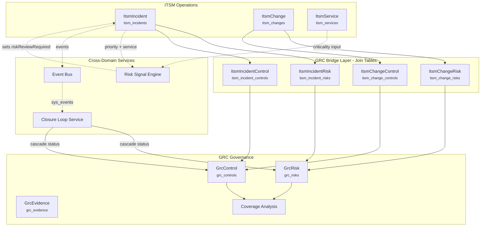
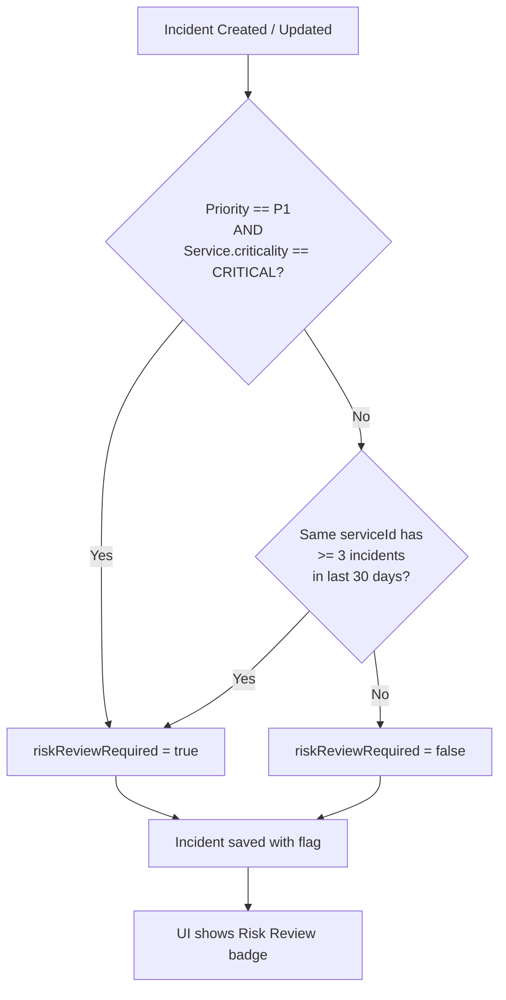
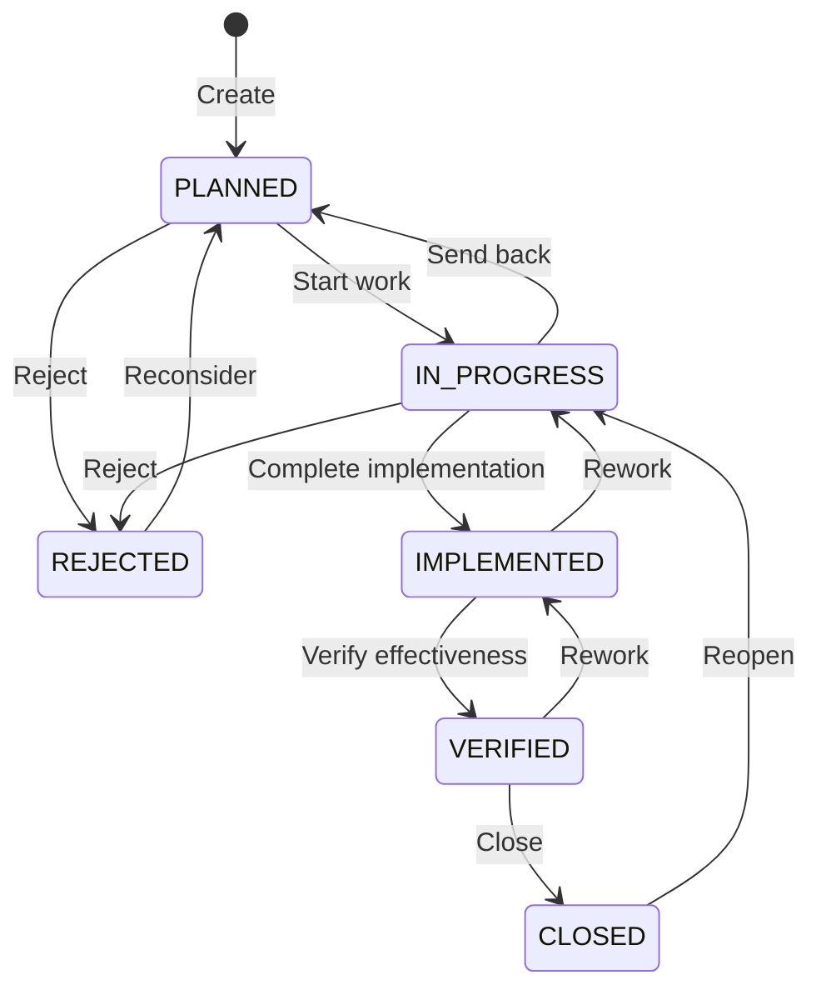
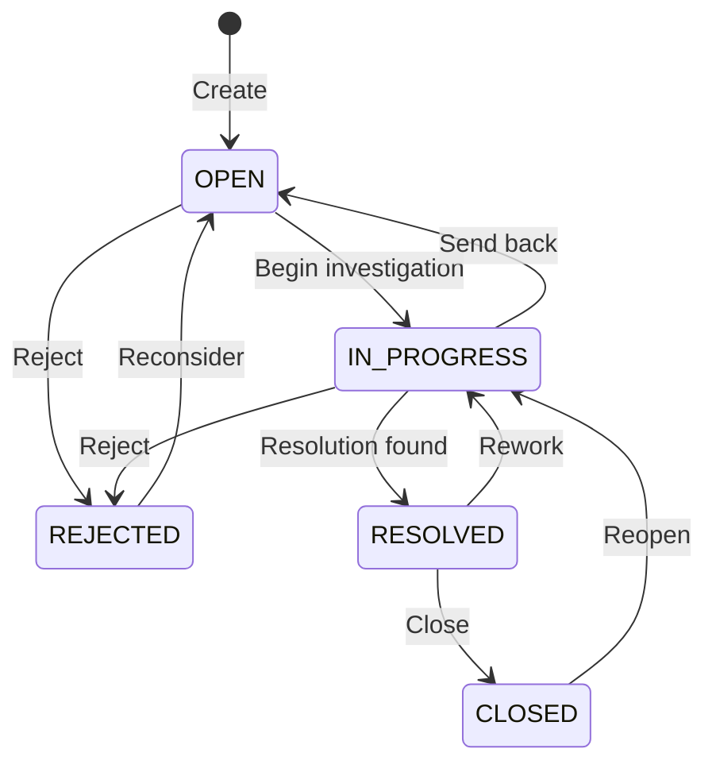
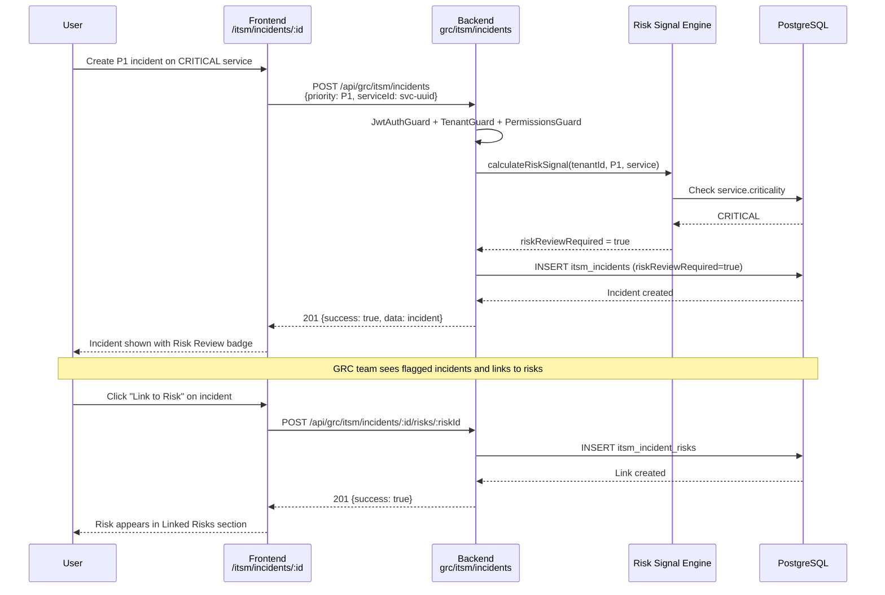
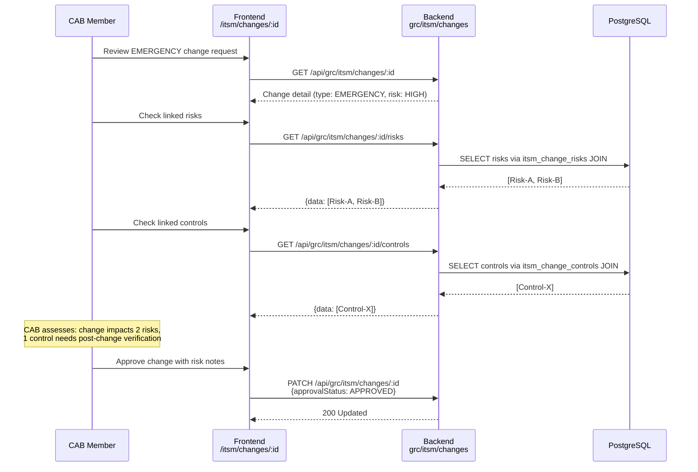
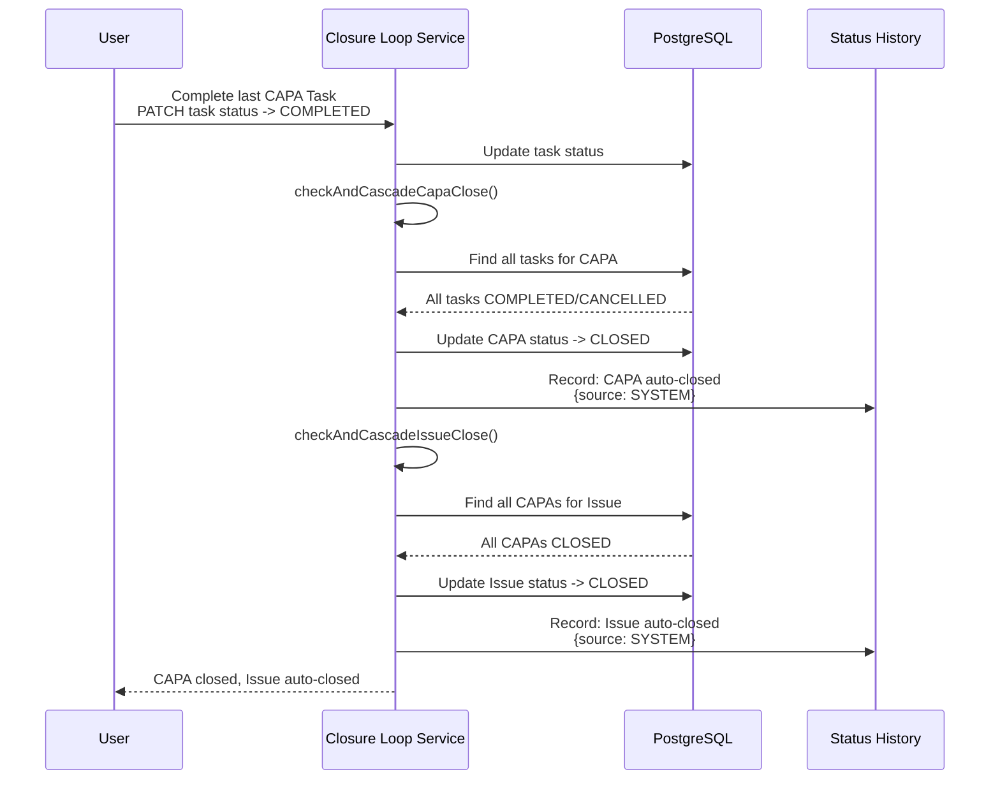
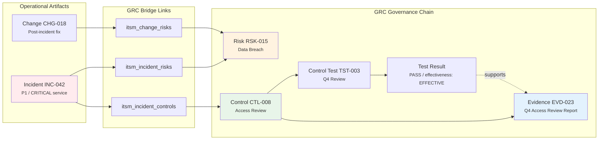
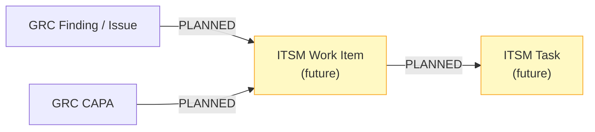

# 05 — ITSM-GRC Bridges Guide

> **Version:** 2.0
> **Last Updated:** 2026-02-27
> **Status:** Final
> **Audience:** Product/Engineering, Compliance Officers, IT Operations, Auditors
> **Evidence Map:** [EVIDENCE_MAP_v1.md](../discovery/EVIDENCE_MAP_v1.md) — Section 5

---

## Table of Contents

1. [Executive Summary](#1-executive-summary)
2. [Bridge Catalog](#2-bridge-catalog)
3. [Bridge Architecture](#3-bridge-architecture)
4. [Incident-GRC Bridge](#4-incident-grc-bridge)
5. [Change-GRC Bridge](#5-change-grc-bridge)
6. [Service-GRC Bridge](#6-service-grc-bridge)
7. [Risk Signal Engine](#7-risk-signal-engine)
8. [Closure Loop](#8-closure-loop)
9. [Coverage Analysis](#9-coverage-analysis)
10. [Flow Diagrams](#10-flow-diagrams)
11. [Cross-Module Scenarios](#11-cross-module-scenarios)
12. [Security and Governance](#12-security-and-governance)
13. [Operations and Troubleshooting](#13-operations-and-troubleshooting)
14. [Validation Checklist](#14-validation-checklist)
15. [Evidence Index](#15-evidence-index)

---

## 1. Executive Summary

The ITSM-GRC Bridge is the connection layer that turns operational IT records into governance intelligence. Without it, ITSM incidents and changes live in operational silos; with it, auditors can trace from a P1 outage directly to the risks it exposed, the controls that should have prevented it, and the evidence that proves remediation.

### Why Bridges Matter

**Auditability.** When an auditor asks "show me what happened after incident INC-0042," the bridge layer provides a direct link chain: Incident -> linked Risk(s) -> mitigating Control(s) -> supporting Evidence -> audit Finding. No manual spreadsheet correlation required.

**Operational intelligence.** The Risk Signal Engine automatically flags incidents that need GRC attention (P1 on a CRITICAL service, or repeated incidents on the same service). This turns reactive firefighting into proactive risk management.

**Closure assurance.** The Closure Loop service enforces that GRC artifacts (Issues, CAPAs, CAPA Tasks) reach terminal states in the correct order before closing parent records. This prevents premature closure and creates an auditable status history.

### What Is Implemented Today

| Capability | Status | Notes |
|-----------|--------|-------|
| Incident to Risk/Control linking | **IMPL** | Full CRUD with audit trail |
| Change to Risk/Control linking | **IMPL** | Full CRUD with audit trail |
| Service catalog (GRC-side) | **IMPL** | CRUD, criticality tracking, used by risk signal |
| Risk Signal Engine | **IMPL** | Auto-flags `riskReviewRequired` on incident create/update |
| Closure Loop (CAPA/Issue cascade) | **IMPL** | Status machine with cascade close, 471-line test suite |
| Coverage Analysis dashboard | **IMPL** | Requirement/process/control coverage percentages |
| Event Bus bridge events | **IMPL** | Incident CRUD events persisted to `sys_events` |
| GRC Finding/CAPA to ITSM work item | **PLANNED** | Not yet implemented; no code exists |
| Auto-discovery of links from ITSM events | **PLANNED** | Links are manual; no auto-linking from event patterns |
| Evidence file upload for ITSM artifacts | **PARTIAL** | Metadata records exist; binary upload not integrated into bridge flow |

### Architecture at a Glance

Bridge entities live in the **GRC module** (`backend-nest/src/grc/entities/itsm-*.entity.ts`), not in a separate ITSM module. This is intentional: GRC owns the governance view of operational data. ITSM controllers are mounted under `@Controller('grc/itsm/...')` and share the same guard stack (JWT + Tenant + Permissions) as all GRC endpoints.

---

## 2. Bridge Catalog

| # | Bridge Name | Source Module | Source Entity | Target Module | Target Entity | Join Entity | Data Fields | UI Screen | API Endpoints | Status |
|---|------------|--------------|---------------|--------------|---------------|-------------|-------------|-----------|--------------|--------|
| 1 | Incident-Risk | ITSM | `ItsmIncident` | GRC | `GrcRisk` | `ItsmIncidentRisk` | tenantId, incidentId, riskId, createdBy, createdAt | Incident Detail > Linked Risks | `POST/DELETE /grc/itsm/incidents/:id/risks/:riskId` | **IMPL** |
| 2 | Incident-Control | ITSM | `ItsmIncident` | GRC | `GrcControl` | `ItsmIncidentControl` | tenantId, incidentId, controlId, createdBy, createdAt | Incident Detail > Linked Controls | `POST/DELETE /grc/itsm/incidents/:id/controls/:controlId` | **IMPL** |
| 3 | Change-Risk | ITSM | `ItsmChange` | GRC | `GrcRisk` | `ItsmChangeRisk` | tenantId, changeId, riskId, createdBy, createdAt | Change Detail > Linked Risks | `POST/DELETE /grc/itsm/changes/:id/risks/:riskId` | **IMPL** |
| 4 | Change-Control | ITSM | `ItsmChange` | GRC | `GrcControl` | `ItsmChangeControl` | tenantId, changeId, controlId, createdBy, createdAt | Change Detail > Linked Controls | `POST/DELETE /grc/itsm/changes/:id/controls/:controlId` | **IMPL** |
| 5 | Service Catalog | ITSM | `ItsmService` | GRC | (indirect via incidents) | N/A | tenantId, name, criticality, status, ownerId | Service List/Detail | `GET/POST/PATCH/DELETE /grc/itsm/services` | **IMPL** |
| 6 | Risk Signal | ITSM | `ItsmIncident` | GRC | `GrcRisk` (advisory) | N/A | riskReviewRequired (boolean) | Incident Detail badge | Computed on create/update | **IMPL** |
| 7 | Coverage Analysis | GRC | `GrcControl` | GRC | `GrcRequirement`, `GrcProcess` | N/A | Coverage percentages | `/coverage` dashboard | `GET /grc/coverage[/requirements\|/processes]` | **IMPL** |
| 8 | Closure Loop | GRC | `GrcCapaTask` | GRC | `GrcCapa` -> `GrcIssue` | `GrcStatusHistory` | Status transitions, cascade rules | CAPA/Issue detail | `PATCH /grc/closure-loop/capas/:id/status` | **IMPL** |
| 9 | Finding to ITSM Work Item | GRC | `GrcIssue` / `GrcCapa` | ITSM | (future) | N/A | N/A | N/A | N/A | **PLANNED** |
| 10 | Evidence to ITSM Artifact | GRC | `GrcEvidence` | ITSM | (ticket metadata) | N/A | N/A | N/A | N/A | **PLANNED** |

---

## 3. Bridge Architecture

### 3.1 Cross-Domain Architecture Diagram



> **Evidence:** `backend-nest/src/grc/entities/itsm-*.entity.ts`, `backend-nest/src/grc/services/closure-loop.service.ts`, `backend-nest/src/event-bus/event-bridge.listener.ts`

### 3.2 Design Rationale

**Why bridge entities live in GRC, not ITSM.** The GRC module owns the governance perspective. By housing bridge entities (`ItsmIncidentRisk`, `ItsmChangeControl`, etc.) in `src/grc/entities/`, the GRC module can query risk-to-incident relationships without importing ITSM internals. The ITSM module remains focused on operational workflows (state machines, SLAs, priority matrices); GRC extends it with governance context.

**Why controllers use `grc/itsm/...` paths.** All bridge controllers are mounted under `@Controller('grc/itsm/...')`. This keeps the API namespace consistent: everything under `/grc/` is GRC-governed. Externally, clients call `/api/grc/itsm/incidents/...` — nginx strips `/api` before proxying to the backend.

**Why join tables, not direct FKs.** Many-to-many linking via dedicated join entities (`ItsmIncidentRisk`, `ItsmChangeControl`, etc.) allows:
- Multiple risks per incident and multiple incidents per risk
- `createdBy` and `createdAt` on each link for audit trail
- `CASCADE` delete: removing an incident or risk automatically cleans up links
- Unique constraints preventing duplicate links: `(tenantId, incidentId, riskId)`

---

## 4. Incident-GRC Bridge

### 4.1 Entities

| Entity | Table | File | Purpose |
|--------|-------|------|---------|
| `ItsmIncident` | `itsm_incidents` | `backend-nest/src/grc/entities/itsm-incident.entity.ts` | Incident record with ITIL v5 lifecycle |
| `ItsmIncidentRisk` | `itsm_incident_risks` | `backend-nest/src/grc/entities/itsm-incident-risk.entity.ts` | Join table: Incident to Risk |
| `ItsmIncidentControl` | `itsm_incident_controls` | `backend-nest/src/grc/entities/itsm-incident-control.entity.ts` | Join table: Incident to Control |

### 4.2 Key Entity Fields

**ItsmIncident** (132 lines):
- `tenantId` (uuid FK) — multi-tenant isolation
- `number` (varchar, unique per tenant) — auto-generated with prefix `INC-`
- `state` (enum: `NEW`, `IN_PROGRESS`, `RESOLVED`, `CLOSED`)
- `priority` (enum: `P1`..`P5`) — derived from impact x urgency matrix
- `impact` (enum: `HIGH`, `MEDIUM`, `LOW`)
- `urgency` (enum: `HIGH`, `MEDIUM`, `LOW`)
- `riskReviewRequired` (boolean, default `false`) — set by Risk Signal Engine
- `serviceId` (uuid FK, nullable) — links to ITSM Service for criticality assessment

**ItsmIncidentRisk** join table:
- `id` (uuid PK)
- `tenantId` (uuid FK)
- `incidentId` (uuid FK, CASCADE delete)
- `riskId` (uuid FK, CASCADE delete)
- `createdBy` (uuid, nullable) — who created the link
- `createdAt` (timestamp)
- Unique constraint: `(tenantId, incidentId, riskId)`

### 4.3 Controller and Service

| Component | File | Lines |
|-----------|------|-------|
| Controller | `backend-nest/src/grc/controllers/itsm-incident.controller.ts` | 315 |
| Service | `backend-nest/src/grc/services/itsm-incident.service.ts` | 541 |

Controller: `@Controller('grc/itsm/incidents')` with guard stack `JwtAuthGuard + TenantGuard + PermissionsGuard`.

### 4.4 API Endpoints

| Method | External Path | Backend Route | Permission | Description |
|--------|--------------|---------------|------------|-------------|
| `POST` | `/api/grc/itsm/incidents` | `grc/itsm/incidents` | `ITSM_INCIDENT_WRITE` | Create incident |
| `GET` | `/api/grc/itsm/incidents` | `grc/itsm/incidents` | `ITSM_INCIDENT_READ` | List incidents (paginated) |
| `GET` | `/api/grc/itsm/incidents/filters` | `grc/itsm/incidents/filters` | `ITSM_INCIDENT_READ` | Get filter enum values |
| `GET` | `/api/grc/itsm/incidents/:id` | `grc/itsm/incidents/:id` | `ITSM_INCIDENT_READ` | Get incident detail |
| `PATCH` | `/api/grc/itsm/incidents/:id` | `grc/itsm/incidents/:id` | `ITSM_INCIDENT_WRITE` | Update incident |
| `DELETE` | `/api/grc/itsm/incidents/:id` | `grc/itsm/incidents/:id` | `ITSM_INCIDENT_WRITE` | Soft-delete incident |
| `GET` | `/api/grc/itsm/incidents/:id/risks` | `grc/itsm/incidents/:id/risks` | `GRC_RISK_READ` | List linked risks |
| `POST` | `/api/grc/itsm/incidents/:id/risks/:riskId` | `grc/itsm/incidents/:id/risks/:riskId` | `GRC_RISK_WRITE` | Link risk to incident |
| `DELETE` | `/api/grc/itsm/incidents/:id/risks/:riskId` | `grc/itsm/incidents/:id/risks/:riskId` | `GRC_RISK_WRITE` | Unlink risk |
| `GET` | `/api/grc/itsm/incidents/:id/controls` | `grc/itsm/incidents/:id/controls` | `GRC_CONTROL_READ` | List linked controls |
| `POST` | `/api/grc/itsm/incidents/:id/controls/:controlId` | `grc/itsm/incidents/:id/controls/:controlId` | `ITSM_INCIDENT_WRITE` | Link control to incident |
| `DELETE` | `/api/grc/itsm/incidents/:id/controls/:controlId` | `grc/itsm/incidents/:id/controls/:controlId` | `ITSM_INCIDENT_WRITE` | Unlink control |

### 4.5 UI Integration

**Page:** `frontend/src/pages/itsm/ItsmIncidentDetail.tsx` (1239 lines)
**Route:** `/itsm/incidents/:id`

The incident detail page includes:
- **Linked Risks section** — expandable card showing linked `GrcRisk` records with code, name, and status chip. "Link to Risk" button opens a dialog that fetches available risks via `riskApi.list()` and calls `itsmApi.incidents.linkRisk()`.
- **Linked Controls section** — same pattern, using `controlApi.list()` and `itsmApi.incidents.linkControl()`.
- **Risk Review Required badge** — shown when `riskReviewRequired === true`, visually flagging incidents that need GRC attention.

> **Evidence:** `frontend/src/pages/itsm/ItsmIncidentDetail.tsx` lines 186-214 (state declarations), lines 420-456 (unlink handlers), lines 458-542 (link dialog handlers).

---

## 5. Change-GRC Bridge

### 5.1 Entities

| Entity | Table | File | Purpose |
|--------|-------|------|---------|
| `ItsmChange` | `itsm_changes` | `backend-nest/src/grc/entities/itsm-change.entity.ts` | Change request with ITIL v5 lifecycle |
| `ItsmChangeRisk` | `itsm_change_risks` | `backend-nest/src/grc/entities/itsm-change-risk.entity.ts` | Join table: Change to Risk |
| `ItsmChangeControl` | `itsm_change_controls` | `backend-nest/src/grc/entities/itsm-change-control.entity.ts` | Join table: Change to Control |

### 5.2 Key Entity Fields

**ItsmChange:**
- `tenantId` (uuid FK)
- `number` (varchar, unique per tenant) — prefix `CHG-`
- `type` (enum: `STANDARD`, `NORMAL`, `EMERGENCY`)
- `state` (enum: `DRAFT`, `ASSESS`, `AUTHORIZE`, `IMPLEMENT`, `REVIEW`, `CLOSED`)
- `risk` (enum: `LOW`, `MEDIUM`, `HIGH`) — change-level risk assessment
- `approvalStatus` (enum: `NOT_REQUESTED`, `REQUESTED`, `APPROVED`, `REJECTED`)
- `serviceId` (uuid FK, nullable) — linked ITSM Service

**ItsmChangeRisk** / **ItsmChangeControl** — same structure as incident join tables with `changeId` instead of `incidentId`. Same unique constraints and CASCADE delete behavior.

### 5.3 Controller and Service

| Component | File | Lines |
|-----------|------|-------|
| Controller | `backend-nest/src/grc/controllers/itsm-change.controller.ts` | 308 |
| Service | `backend-nest/src/grc/services/itsm-change.service.ts` | 449 |

Controller: `@Controller('grc/itsm/changes')` with the same guard stack.

### 5.4 API Endpoints

| Method | External Path | Permission | Description |
|--------|--------------|------------|-------------|
| `POST` | `/api/grc/itsm/changes` | `ITSM_CHANGE_WRITE` | Create change |
| `GET` | `/api/grc/itsm/changes` | `ITSM_CHANGE_READ` | List changes (paginated) |
| `GET` | `/api/grc/itsm/changes/filters` | `ITSM_CHANGE_READ` | Get filter enum values |
| `GET` | `/api/grc/itsm/changes/:id` | `ITSM_CHANGE_READ` | Get change detail |
| `PATCH` | `/api/grc/itsm/changes/:id` | `ITSM_CHANGE_WRITE` | Update change |
| `DELETE` | `/api/grc/itsm/changes/:id` | `ITSM_CHANGE_WRITE` | Soft-delete change |
| `GET` | `/api/grc/itsm/changes/:id/risks` | `GRC_RISK_READ` | List linked risks |
| `POST` | `/api/grc/itsm/changes/:id/risks/:riskId` | `GRC_RISK_WRITE` | Link risk |
| `DELETE` | `/api/grc/itsm/changes/:id/risks/:riskId` | `GRC_RISK_WRITE` | Unlink risk |
| `GET` | `/api/grc/itsm/changes/:id/controls` | `GRC_CONTROL_READ` | List linked controls |
| `POST` | `/api/grc/itsm/changes/:id/controls/:controlId` | `ITSM_CHANGE_WRITE` | Link control |
| `DELETE` | `/api/grc/itsm/changes/:id/controls/:controlId` | `ITSM_CHANGE_WRITE` | Unlink control |

### 5.5 UI Integration

**Page:** `frontend/src/pages/itsm/ItsmChangeDetail.tsx`
**Route:** `/itsm/changes/:id`

The change detail page follows the same pattern as incidents: expandable Linked Risks and Linked Controls sections with link/unlink dialogs.

---

## 6. Service-GRC Bridge

### 6.1 Entity

| Entity | Table | File | Purpose |
|--------|-------|------|---------|
| `ItsmService` | `itsm_services` | `backend-nest/src/grc/entities/itsm-service.entity.ts` | IT service catalog with criticality |

### 6.2 Key Entity Fields

- `tenantId` (uuid FK)
- `name` (varchar)
- `description` (text, nullable)
- `criticality` (enum: `CRITICAL`, `HIGH`, `MEDIUM`, `LOW`) — drives Risk Signal Engine
- `status` (enum: `ACTIVE`, `INACTIVE`, `DEPRECATED`)
- `ownerId` (uuid FK, nullable)

### 6.3 Controller and Service

| Component | File |
|-----------|------|
| Controller | `backend-nest/src/grc/controllers/itsm-service.controller.ts` |
| Service | `backend-nest/src/grc/services/itsm-service.service.ts` (187 lines) |

Controller: `@Controller('grc/itsm/services')` with the same guard stack.

### 6.4 API Endpoints

| Method | External Path | Permission | Description |
|--------|--------------|------------|-------------|
| `POST` | `/api/grc/itsm/services` | `ITSM_SERVICE_WRITE` | Create service |
| `GET` | `/api/grc/itsm/services` | `ITSM_SERVICE_READ` | List services |
| `GET` | `/api/grc/itsm/services/:id` | `ITSM_SERVICE_READ` | Get service detail |
| `PATCH` | `/api/grc/itsm/services/:id` | `ITSM_SERVICE_WRITE` | Update service |
| `DELETE` | `/api/grc/itsm/services/:id` | `ITSM_SERVICE_WRITE` | Soft-delete service |

### 6.5 Role in Bridge Architecture

Services do not have their own join tables to Risks/Controls. Instead, they participate indirectly:
1. **Risk Signal input:** When an incident references a `CRITICAL` service and has priority `P1`, the Risk Signal Engine sets `riskReviewRequired = true`.
2. **Impact analysis:** Incidents and changes reference a `serviceId`, allowing queries like "show all incidents for service X" to build a service risk profile.

> **Evidence:** `backend-nest/src/grc/services/itsm-incident.service.ts` lines 321-355 (`calculateRiskSignal` method).

---

## 7. Risk Signal Engine

The Risk Signal Engine is an automated mechanism that flags incidents requiring GRC risk review. It runs on every incident create and update.

### 7.1 How It Works

```
ItsmIncidentService.calculateRiskSignal(tenantId, priority, service, serviceId) -> boolean
```

The engine sets `riskReviewRequired = true` when **either** condition is met:

1. **Critical-service + P1 rule:** `priority === P1 AND service.criticality === CRITICAL`
2. **Repeated-incident rule:** `>= 3 incidents` on the same service within the last `30 days`

### 7.2 Configuration Constants

| Constant | Value | File | Line |
|----------|-------|------|------|
| `RISK_SIGNAL_INCIDENT_THRESHOLD_DAYS` | 30 | `itsm-incident.service.ts` | ~28 |
| `RISK_SIGNAL_INCIDENT_COUNT_THRESHOLD` | 3 | `itsm-incident.service.ts` | ~29 |

### 7.3 Data Flow



> **Evidence:** `backend-nest/src/grc/services/itsm-incident.service.ts` lines 28-29 (constants), lines 321-355 (`calculateRiskSignal` method).

---

## 8. Closure Loop

The Closure Loop Service enforces cascading status transitions across GRC entities. It ensures that Issues cannot close until all CAPAs are closed, and CAPAs cannot close until all Tasks reach terminal states.

### 8.1 Service Details

| Component | File | Lines |
|-----------|------|-------|
| Service | `backend-nest/src/grc/services/closure-loop.service.ts` | 559 |
| Tests | `backend-nest/src/grc/services/closure-loop.service.spec.ts` | 471 |

### 8.2 CAPA Status Machine



### 8.3 Issue Status Machine



### 8.4 Cascade Rules

**CAPA Closure Requirements** (enforced in `validateCapaClosureRequirements`):
1. All CAPA Tasks must be in terminal state (`COMPLETED` or `CANCELLED`)
2. Verification fields must be set (`verifiedByUserId`, `verifiedAt`)
3. If requirements not met, `400 Bad Request` is thrown with details of which tasks are still open

**Issue Closure Requirements** (enforced in `validateIssueClosureRequirements`):
1. All linked CAPAs must be `CLOSED`
2. **OR** an explicit `overrideReason` is provided (recorded in audit trail)
3. If no CAPAs are linked, closure is allowed freely

**Auto-Cascade** (`checkAndCascadeCapaClose` / `checkAndCascadeIssueClose`):
- When a CAPA Task status changes to terminal, the system checks if **all** tasks for that CAPA are terminal. If so, the CAPA is auto-closed with reason `'Auto-closed: all tasks completed'` and source `{ source: 'SYSTEM' }`.
- When a CAPA closes and has a parent Issue, the system checks if **all** CAPAs for that Issue are closed. If so, the Issue is auto-closed with reason `'Auto-closed: all CAPAs completed'`.

### 8.5 Status History Tracking

Every status transition is recorded in `grc_status_history`:

| Column | Type | Purpose |
|--------|------|---------|
| `entity_type` | varchar(50) | `'CAPA'`, `'ISSUE'`, `'CONTROL_TEST'`, `'CAPA_TASK'` |
| `entity_id` | uuid | ID of the entity whose status changed |
| `previous_status` | varchar(50) | Status before transition |
| `new_status` | varchar(50) | Status after transition |
| `changed_by_user_id` | uuid | Who triggered the change |
| `change_reason` | text | Human-readable reason |
| `metadata` | jsonb | `{ source: 'MANUAL' }` or `{ source: 'SYSTEM' }` |

> **Evidence:** `backend-nest/src/grc/entities/grc-status-history.entity.ts` (73 lines), `backend-nest/src/grc/services/closure-loop.service.ts`, `backend-nest/src/grc/services/closure-loop.service.spec.ts` (471 lines — tests for transitions, cascade, auto-closure history source).

---

## 9. Coverage Analysis

The Coverage Analysis dashboard provides cross-domain statistics showing how well GRC controls cover requirements and processes.

### 9.1 Controller

| Component | File | Lines |
|-----------|------|-------|
| Controller | `backend-nest/src/grc/controllers/grc-coverage.controller.ts` | 275 |

Controller: `@Controller('grc/coverage')` with guard stack `JwtAuthGuard + TenantGuard + PermissionsGuard`.

### 9.2 API Endpoints

| Method | External Path | Permission | Returns |
|--------|--------------|------------|---------|
| `GET` | `/api/grc/coverage` | `GRC_CONTROL_READ` | Summary: requirement coverage %, process coverage %, unlinked controls count |
| `GET` | `/api/grc/coverage/requirements` | `GRC_CONTROL_READ` | Per-requirement breakdown: which requirements have controls, which don't |
| `GET` | `/api/grc/coverage/processes` | `GRC_CONTROL_READ` | Per-process breakdown: which processes have controls, which don't |

### 9.3 Coverage Metrics

The summary endpoint returns:

```json
{
  "requirementCoverage": 75.0,
  "processCoverage": 60.0,
  "unlinkedControlsCount": 3,
  "totalRequirements": 20,
  "coveredRequirements": 15,
  "totalProcesses": 10,
  "coveredProcesses": 6,
  "totalControls": 25
}
```

- **Requirement coverage:** `(requirements with >= 1 linked control) / total requirements * 100`
- **Process coverage:** `(processes with >= 1 linked control) / total processes * 100`
- **Unlinked controls:** Controls with no requirement AND no process link

### 9.4 UI Page

**Page:** `frontend/src/pages/Coverage.tsx` (381 lines)
**Route:** `/coverage`

The Coverage dashboard displays:
- Three summary cards (Requirement Coverage %, Process Coverage %, Unlinked Controls count)
- Color coding: green >= 80%, orange >= 50%, red < 50%
- Tabbed detail view: Requirements tab and Processes tab with per-item coverage status (Covered/Uncovered chip)

> **Evidence:** `frontend/src/pages/Coverage.tsx`, `backend-nest/src/grc/controllers/grc-coverage.controller.ts` lines 48-70 (controller with JSDoc).

---

## 10. Flow Diagrams

### 10.1 Incident to Risk Signal to Advisory



### 10.2 Change to Risk Impact Assessment



### 10.3 GRC Closure Loop Cascade



### 10.4 Evidence and Test Result to Operational Artifact (Metadata Link)



> **Note:** Direct linking of GRC Evidence to ITSM ticket metadata (e.g., attaching an incident log as evidence) is **PLANNED** but not yet implemented. Today, the traceability chain goes Incident -> Risk -> Control -> Evidence via bridge links and GRC entity relationships.

### 10.5 Finding/CAPA to ITSM Work Item (PLANNED)



> **Status: PLANNED.** No code exists for auto-creating ITSM work items from GRC Findings or CAPAs. This bridge would allow GRC-identified issues to automatically spawn operational tickets in ITSM for remediation tracking.

---

## 11. Cross-Module Scenarios

### 11.1 Scenario: Audit Asks "Show Evidence and Operational History"

**Context:** An ISO 27001 auditor asks: "For your Access Control risk, show me the operational evidence — incidents, changes, controls, and test results."

**Walkthrough:**

1. **Start from the Risk Register.**
   Navigate to `/risks` and find `RSK-015 Data Breach Risk`.

2. **Check linked controls.**
   On the risk detail page, view linked controls — e.g., `CTL-008 Quarterly Access Review`.

3. **View control evidence.**
   On control detail, check the Evidence tab. Evidence records (type: DOCUMENT, LOG, REPORT) are linked via `grc_control_evidence`.

4. **View test results.**
   On the same control detail, check the Test Results tab. A passing test result (`PASS`, effectiveness: `EFFECTIVE`) confirms the control works.

5. **Cross-reference ITSM incidents.**
   Navigate to `/itsm/incidents` and filter by service or search for relevant incidents. Open an incident, check the Linked Risks section — if `RSK-015` appears, the auditor can see the bridge link.

6. **API verification path:**
   ```bash
   # Get risk detail with controls
   curl -H "Authorization: Bearer $TOKEN" \
        -H "x-tenant-id: $TENANT_ID" \
        /api/grc/risks/$RISK_ID/controls

   # Get incidents linked to this risk (query from incident side)
   curl -H "Authorization: Bearer $TOKEN" \
        -H "x-tenant-id: $TENANT_ID" \
        /api/grc/itsm/incidents/$INCIDENT_ID/risks
   ```

**Traceability chain:** Incident -> (bridge) -> Risk -> Control -> Evidence + Test Result -> Audit Finding

### 11.2 Scenario: Major Incident Drives Risk Reevaluation

**Context:** A P1 incident on the CRM service (criticality: CRITICAL) triggers a risk review cycle.

**Walkthrough:**

1. **Incident creation triggers Risk Signal.**
   User creates incident with `priority: P1` and `serviceId` pointing to a CRITICAL service. The `calculateRiskSignal` method returns `true`, setting `riskReviewRequired = true` on the incident.

2. **GRC team identifies flagged incidents.**
   Filter incidents by `riskReviewRequired=true` via the API or UI filter:
   ```bash
   curl -H "Authorization: Bearer $TOKEN" \
        -H "x-tenant-id: $TENANT_ID" \
        "/api/grc/itsm/incidents?riskReviewRequired=true"
   ```

3. **Link incident to affected risks.**
   GRC analyst opens the incident detail, clicks "Link to Risk," and selects the relevant risk(s). Each link creates an `itsm_incident_risks` record with an audit trail entry.

4. **Link incident to failed controls.**
   If the incident exposed a control gap, the analyst also links the relevant control(s). This creates `itsm_incident_controls` records.

5. **Update risk assessment.**
   On the risk detail page, the analyst may update the inherent/residual scores, change the treatment strategy, or create a new Issue from the risk.

6. **Issue/CAPA flow.**
   If an Issue is created, the Closure Loop governs its lifecycle:
   - Issue OPEN -> IN_PROGRESS -> RESOLVED -> CLOSED
   - CAPAs created under the Issue must all close before the Issue can close
   - CAPA Tasks must all reach terminal state before the CAPA can close
   - All transitions recorded in `grc_status_history`

7. **Post-incident verification.**
   After remediation, the analyst verifies the CAPA (sets `verifiedByUserId` and `verifiedAt`), closes the CAPA, and the Closure Loop auto-cascades to close the parent Issue.

---

## 12. Security and Governance

### 12.1 Tenant Isolation

Every bridge entity includes a `tenantId` column (uuid FK to `tenants` table). Isolation is enforced at three levels:

| Level | Mechanism | Evidence |
|-------|-----------|----------|
| **Request** | `x-tenant-id` header required on every API call | Controller parameters: `@Headers('x-tenant-id') tenantId: string` |
| **Guard** | `TenantGuard` validates tenant context before handler execution | `backend-nest/src/tenants/guards/tenant.guard.ts` |
| **Query** | All repository queries include `WHERE tenantId = :tenantId` | Service methods throughout `itsm-incident.service.ts` |
| **Unique constraints** | Join table unique indexes include `tenantId` | e.g., `@Index(['tenantId', 'incidentId', 'riskId'], { unique: true })` |

**Cross-tenant link prevention:** Even if an attacker provides a valid `riskId` from another tenant, the service verifies the risk exists within the caller's tenant before creating the link:
```typescript
const risk = await this.riskRepository.findOne({
  where: { id: riskId, tenantId, isDeleted: false },
});
if (!risk) throw new NotFoundException(...);
```

> **Evidence:** `backend-nest/src/grc/services/itsm-incident.service.ts` lines 383-389 (linkRisk validation).

### 12.2 RBAC / Permissions for Cross-Links

Bridge operations require permissions from **both** domains. The permission model is defined in `backend-nest/src/auth/permissions/permission.enum.ts`:

| Operation | Required Permission | Enum Value |
|-----------|-------------------|------------|
| View incidents | `ITSM_INCIDENT_READ` | `itsm:incident:read` |
| Create/update/delete incidents | `ITSM_INCIDENT_WRITE` | `itsm:incident:write` |
| View linked risks | `GRC_RISK_READ` | `grc:risk:read` |
| Link/unlink risks | `GRC_RISK_WRITE` | `grc:risk:write` |
| View linked controls | `GRC_CONTROL_READ` | `grc:control:read` |
| Link/unlink controls (on incidents) | `ITSM_INCIDENT_WRITE` | `itsm:incident:write` |
| Link/unlink controls (on changes) | `ITSM_CHANGE_WRITE` | `itsm:change:write` |
| View changes | `ITSM_CHANGE_READ` | `itsm:change:read` |
| Create/update/delete changes | `ITSM_CHANGE_WRITE` | `itsm:change:write` |
| View services | `ITSM_SERVICE_READ` | `itsm:service:read` |
| Create/update/delete services | `ITSM_SERVICE_WRITE` | `itsm:service:write` |
| View coverage | `GRC_CONTROL_READ` | `grc:control:read` |

**Guard stack order:** `JwtAuthGuard` -> `TenantGuard` -> `PermissionsGuard` (applied via `@UseGuards` on every controller).

> **Evidence:** `backend-nest/src/auth/permissions/permission.enum.ts` lines 58-67 (ITSM permissions), lines 11-12, 27-29 (GRC permissions). Controller decorators: `itsm-incident.controller.ts` lines 53-54.

### 12.3 Audit Logging for Bridge Actions

All bridge link/unlink operations are recorded in the `audit_logs` table via `AuditService`:

| Action | Entity Name | When |
|--------|------------|------|
| `CREATE` | `ItsmIncidentRisk` | Risk linked to incident |
| `DELETE` | `ItsmIncidentRisk` | Risk unlinked from incident |
| `CREATE` | `ItsmIncidentControl` | Control linked to incident |
| `DELETE` | `ItsmIncidentControl` | Control unlinked from incident |
| `CREATE` | `ItsmChangeRisk` | Risk linked to change |
| `DELETE` | `ItsmChangeRisk` | Risk unlinked from change |
| `CREATE` | `ItsmChangeControl` | Control linked to change |
| `DELETE` | `ItsmChangeControl` | Control unlinked from change |

Each audit record includes:
- `action`: CREATE or DELETE
- `entityName`: The join entity class name
- `entityId`: The join record ID
- `userId`: Who performed the action
- `tenantId`: Tenant context
- `afterState` (for CREATE) / `beforeState` (for DELETE): Sanitized entity snapshot

Additionally, the **Event Bus** persists ITSM events to `sys_events` via `EventBridgeListener`:
- `incident.created` -> `sys_events` with `eventName: 'record.created'`, `tableName: 'itsm_incidents'`
- `incident.updated` -> `sys_events` with `eventName: 'record.updated'`
- `incident.deleted` -> `sys_events` with `eventName: 'record.deleted'`

> **Evidence:** `backend-nest/src/audit/audit.service.ts` lines 60-83 (`recordCreate`), 126-149 (`recordDelete`). `backend-nest/src/event-bus/event-bridge.listener.ts` lines 52-99 (incident event handlers).

---

## 13. Operations and Troubleshooting

### 13.1 Common Failure Modes

| # | Symptom | Root Cause | Resolution |
|---|---------|-----------|------------|
| 1 | `404 Not Found` when linking risk to incident | The risk ID does not exist in the caller's tenant, or is soft-deleted (`isDeleted = true`) | Verify the risk exists for the tenant: `GET /api/grc/risks/:riskId` |
| 2 | `400 Bad Request: Risk already linked` | Duplicate link attempt — unique constraint `(tenantId, incidentId, riskId)` prevents duplicates | Check existing links first: `GET /api/grc/itsm/incidents/:id/risks` |
| 3 | `400 Bad Request: Cannot close CAPA` | CAPA closure requirements not met — non-terminal tasks or missing verification | Check which tasks are still open (error message lists them). Ensure `verifiedByUserId` and `verifiedAt` are set. |
| 4 | `400 Bad Request: Cannot close Issue` | Not all CAPAs are closed, and no `overrideReason` provided | Close all CAPAs first, or provide `overrideReason` in the status update payload |
| 5 | `403 Forbidden` on bridge endpoints | User lacks the required cross-domain permission (e.g., has `ITSM_INCIDENT_READ` but not `GRC_RISK_WRITE`) | Grant the user both ITSM and GRC permissions needed for the operation |
| 6 | Coverage shows 0% | No control-to-requirement or control-to-process links exist | Create links in the GRC module: link controls to requirements and processes |
| 7 | Risk Signal not flagging incidents | Service criticality is not `CRITICAL`, priority is not `P1`, and incident count is below threshold | Check service criticality, incident priority, and recent incident count for the service |
| 8 | Closure Loop not auto-cascading | Not all sibling entities are terminal, or the entity is already closed | Check task/CAPA statuses — `checkAndCascadeCapaClose` only triggers when ALL tasks are terminal |
| 9 | Event Bus events not appearing in `sys_events` | `EventBridgeListener.safeEmit` catches and logs errors silently | Check backend logs for `EventBridgeListener` error entries |
| 10 | `401 Unauthorized` on bridge endpoints | Missing or invalid JWT token, or missing `x-tenant-id` header | Ensure both `Authorization: Bearer <token>` and `x-tenant-id` headers are set |

### 13.2 Useful Diagnostic Queries

**Find all incidents flagged for risk review:**
```sql
SELECT id, number, short_description, priority, risk_review_required
FROM itsm_incidents
WHERE tenant_id = '<TENANT_ID>'
  AND risk_review_required = true
  AND is_deleted = false
ORDER BY created_at DESC;
```

**Find all bridge links for a specific risk:**
```sql
-- Incidents linked to a risk
SELECT ir.id, ir.incident_id, i.number, i.short_description
FROM itsm_incident_risks ir
JOIN itsm_incidents i ON ir.incident_id = i.id
WHERE ir.tenant_id = '<TENANT_ID>'
  AND ir.risk_id = '<RISK_ID>';

-- Changes linked to a risk
SELECT cr.id, cr.change_id, c.number, c.title
FROM itsm_change_risks cr
JOIN itsm_changes c ON cr.change_id = c.id
WHERE cr.tenant_id = '<TENANT_ID>'
  AND cr.risk_id = '<RISK_ID>';
```

**Check Closure Loop status for an Issue:**
```sql
SELECT c.id, c.title, c.status,
       (SELECT COUNT(*) FROM grc_capa_tasks t
        WHERE t.capa_id = c.id AND t.is_deleted = false
        AND t.status NOT IN ('COMPLETED', 'CANCELLED')) as open_tasks
FROM grc_capas c
WHERE c.issue_id = '<ISSUE_ID>'
  AND c.tenant_id = '<TENANT_ID>'
  AND c.is_deleted = false;
```

---

## 14. Validation Checklist

### 14.1 API Validation

| # | Check | Method | Endpoint | Expected | Headers |
|---|-------|--------|----------|----------|---------|
| 1 | Create incident | `POST` | `/api/grc/itsm/incidents` | `201` with `{success: true, data: {id, number}}` | Auth + x-tenant-id |
| 2 | Link risk to incident | `POST` | `/api/grc/itsm/incidents/:id/risks/:riskId` | `201` with `{success: true, data: {id}}` | Auth + x-tenant-id |
| 3 | Get linked risks | `GET` | `/api/grc/itsm/incidents/:id/risks` | `200` with `{data: [{id, code, name}]}` | Auth + x-tenant-id |
| 4 | Duplicate link rejected | `POST` | `/api/grc/itsm/incidents/:id/risks/:riskId` (same) | `400` with "already linked" message | Auth + x-tenant-id |
| 5 | Unlink risk | `DELETE` | `/api/grc/itsm/incidents/:id/risks/:riskId` | `204` No Content | Auth + x-tenant-id |
| 6 | Link control to incident | `POST` | `/api/grc/itsm/incidents/:id/controls/:controlId` | `201` | Auth + x-tenant-id |
| 7 | Create change | `POST` | `/api/grc/itsm/changes` | `201` | Auth + x-tenant-id |
| 8 | Link risk to change | `POST` | `/api/grc/itsm/changes/:id/risks/:riskId` | `201` | Auth + x-tenant-id |
| 9 | Link control to change | `POST` | `/api/grc/itsm/changes/:id/controls/:controlId` | `201` | Auth + x-tenant-id |
| 10 | Coverage summary | `GET` | `/api/grc/coverage` | `200` with percentage fields | Auth + x-tenant-id |
| 11 | Coverage requirements | `GET` | `/api/grc/coverage/requirements` | `200` with per-requirement breakdown | Auth + x-tenant-id |
| 12 | Coverage processes | `GET` | `/api/grc/coverage/processes` | `200` with per-process breakdown | Auth + x-tenant-id |
| 13 | Tenant isolation | `POST` | `/api/grc/itsm/incidents/:id/risks/:riskId` (cross-tenant risk) | `404` Not Found | Auth + wrong x-tenant-id |
| 14 | Permission enforcement | `POST` | `/api/grc/itsm/incidents/:id/risks/:riskId` (no GRC_RISK_WRITE) | `403` Forbidden | Auth (restricted user) |
| 15 | Risk Signal — P1 + CRITICAL | `POST` | `/api/grc/itsm/incidents` with P1 + CRITICAL service | `riskReviewRequired: true` in response | Auth + x-tenant-id |

### 14.2 UI Validation

| # | Check | Steps | Expected |
|---|-------|-------|----------|
| 1 | Incident risk linking | Navigate to `/itsm/incidents/:id` > expand Linked Risks > click "Link to Risk" > select risk > confirm | Risk appears in Linked Risks list |
| 2 | Incident control linking | Same flow with "Link to Control" | Control appears in Linked Controls list |
| 3 | Risk unlink | Click delete icon next to a linked risk | Risk removed, success notification shown |
| 4 | Risk Review badge | Create a P1 incident on a CRITICAL service | "Risk Review Required" badge/indicator visible |
| 5 | Change risk linking | Navigate to `/itsm/changes/:id` > Link to Risk | Risk appears in linked list |
| 6 | Coverage dashboard | Navigate to `/coverage` | Three summary cards with percentages. Requirements and Processes tabs with per-item status. |
| 7 | Coverage color coding | Coverage >= 80% shows green, >= 50% orange, < 50% red | Correct color on progress bars |
| 8 | Permission denied handling | Log in as user without GRC_RISK_WRITE > try to link risk | Error notification: "Permission denied" |

### 14.3 Closure Loop Validation

| # | Check | Steps | Expected |
|---|-------|-------|----------|
| 1 | CAPA Task cascade | Complete all tasks for a CAPA | CAPA auto-closes with reason "Auto-closed: all tasks completed" |
| 2 | Issue cascade | Close all CAPAs for an Issue | Issue auto-closes with reason "Auto-closed: all CAPAs completed" |
| 3 | CAPA closure blocked | Try to close CAPA with open tasks | `400` error listing incomplete tasks |
| 4 | Issue closure blocked | Try to close Issue with open CAPAs | `400` error listing open CAPAs |
| 5 | Issue override close | Close Issue with `overrideReason` despite open CAPAs | Issue closes; override recorded in status history |
| 6 | Status history | After any transition, query status history | Entry with `previousStatus`, `newStatus`, `metadata.source` |
| 7 | Unit tests pass | Run `npm test -- closure-loop` | All tests pass (transitions, cascade, validation) |

---

## 15. Evidence Index

### 15.1 Entities

| File | Lines | Purpose |
|------|-------|---------|
| `backend-nest/src/grc/entities/itsm-incident.entity.ts` | 132 | ITSM Incident with `riskReviewRequired` flag |
| `backend-nest/src/grc/entities/itsm-incident-risk.entity.ts` | 55 | Incident-Risk join table |
| `backend-nest/src/grc/entities/itsm-incident-control.entity.ts` | — | Incident-Control join table |
| `backend-nest/src/grc/entities/itsm-change.entity.ts` | — | ITSM Change request |
| `backend-nest/src/grc/entities/itsm-change-risk.entity.ts` | — | Change-Risk join table |
| `backend-nest/src/grc/entities/itsm-change-control.entity.ts` | — | Change-Control join table |
| `backend-nest/src/grc/entities/itsm-service.entity.ts` | — | ITSM Service catalog |
| `backend-nest/src/grc/entities/grc-risk.entity.ts` | 234 | GRC Risk (target of bridge links) |
| `backend-nest/src/grc/entities/grc-control.entity.ts` | 158 | GRC Control (target of bridge links) |
| `backend-nest/src/grc/entities/grc-status-history.entity.ts` | 73 | Status transition audit trail |

### 15.2 Controllers

| File | Lines | Route |
|------|-------|-------|
| `backend-nest/src/grc/controllers/itsm-incident.controller.ts` | 315 | `@Controller('grc/itsm/incidents')` |
| `backend-nest/src/grc/controllers/itsm-change.controller.ts` | 308 | `@Controller('grc/itsm/changes')` |
| `backend-nest/src/grc/controllers/itsm-service.controller.ts` | — | `@Controller('grc/itsm/services')` |
| `backend-nest/src/grc/controllers/grc-coverage.controller.ts` | 275 | `@Controller('grc/coverage')` |

### 15.3 Services

| File | Lines | Purpose |
|------|-------|---------|
| `backend-nest/src/grc/services/itsm-incident.service.ts` | 541 | Incident CRUD + bridge link/unlink + risk signal |
| `backend-nest/src/grc/services/itsm-change.service.ts` | 449 | Change CRUD + bridge link/unlink |
| `backend-nest/src/grc/services/itsm-service.service.ts` | 187 | Service catalog CRUD |
| `backend-nest/src/grc/services/closure-loop.service.ts` | 559 | CAPA/Issue closure cascade |
| `backend-nest/src/audit/audit.service.ts` | 497 | Audit logging for all entities |

### 15.4 Tests

| File | Lines | Coverage |
|------|-------|----------|
| `backend-nest/src/grc/services/closure-loop.service.spec.ts` | 471 | CAPA transitions, Issue transitions, cascade close, auto-closure history |

### 15.5 Enums

| File | Relevant Enums |
|------|----------------|
| `backend-nest/src/grc/enums/index.ts` | `ItsmIncidentState`, `ItsmIncidentPriority`, `ItsmIncidentImpact`, `ItsmIncidentUrgency`, `ItsmChangeType`, `ItsmChangeState`, `ItsmChangeRiskLevel`, `ItsmApprovalStatus`, `ItsmServiceCriticality`, `ItsmServiceStatus`, `CapaStatus`, `IssueStatus`, `CAPATaskStatus` |

### 15.6 Permissions

| File | Lines | Relevant Permissions |
|------|-------|---------------------|
| `backend-nest/src/auth/permissions/permission.enum.ts` | 58-67 | `ITSM_INCIDENT_READ/WRITE`, `ITSM_SERVICE_READ/WRITE`, `ITSM_CHANGE_READ/WRITE` |
| `backend-nest/src/auth/permissions/permission.enum.ts` | 11-12, 27-29 | `GRC_RISK_READ/WRITE`, `GRC_CONTROL_READ/WRITE/DELETE` |

### 15.7 Event Bus

| File | Lines | Purpose |
|------|-------|---------|
| `backend-nest/src/event-bus/event-bus.service.ts` | 156 | Core event emission + persistence to sys_events |
| `backend-nest/src/event-bus/event-bridge.listener.ts` | 199 | Bridges ITSM events to sys_events table |

### 15.8 Frontend

| File | Lines | Route |
|------|-------|-------|
| `frontend/src/pages/itsm/ItsmIncidentDetail.tsx` | 1239 | `/itsm/incidents/:id` — bridge link/unlink UI |
| `frontend/src/pages/itsm/ItsmChangeDetail.tsx` | — | `/itsm/changes/:id` — bridge link/unlink UI |
| `frontend/src/pages/itsm/ItsmServiceDetail.tsx` | — | `/itsm/services/:id` |
| `frontend/src/pages/itsm/ItsmServiceList.tsx` | — | `/itsm/services` |
| `frontend/src/pages/Coverage.tsx` | 381 | `/coverage` — coverage dashboard |
| `frontend/src/App.tsx` | — | Route definitions (lines 219-265 for ITSM, line 128 for coverage) |

---

## Appendix

### A. Related Documents

| Document | Description |
|----------|-------------|
| [03 — ITSM Module Guide](./03_ITSM.md) | Full ITSM module documentation |
| [04 — GRC Module Guide](./04_GRC.md) | Full GRC module documentation |
| [06 — AI Features](./06_AI_FEATURES.md) | AI-powered risk advisory |

### B. Glossary

| Term | Definition |
|------|-----------|
| **Bridge** | A cross-module link connecting an ITSM operational record to a GRC governance entity |
| **Join Table** | A dedicated entity (e.g., `ItsmIncidentRisk`) that stores many-to-many relationships between two entities |
| **Risk Signal** | Automated flag (`riskReviewRequired`) set on incidents that meet certain criteria |
| **Closure Loop** | Cascading status validation ensuring parent entities don't close until all children are terminal |
| **Coverage** | Percentage metric showing how many requirements/processes have at least one linked control |
| **Guard Stack** | The NestJS middleware chain: `JwtAuthGuard` -> `TenantGuard` -> `PermissionsGuard` |
| **IMPL** | Fully implemented and working in production |
| **PARTIAL** | Partially implemented — core exists but gaps remain |
| **PLANNED** | Designed but no code exists yet |
