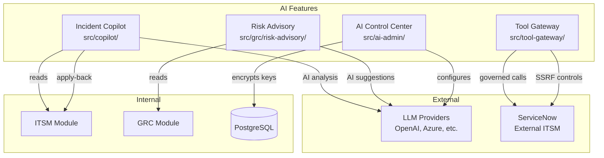
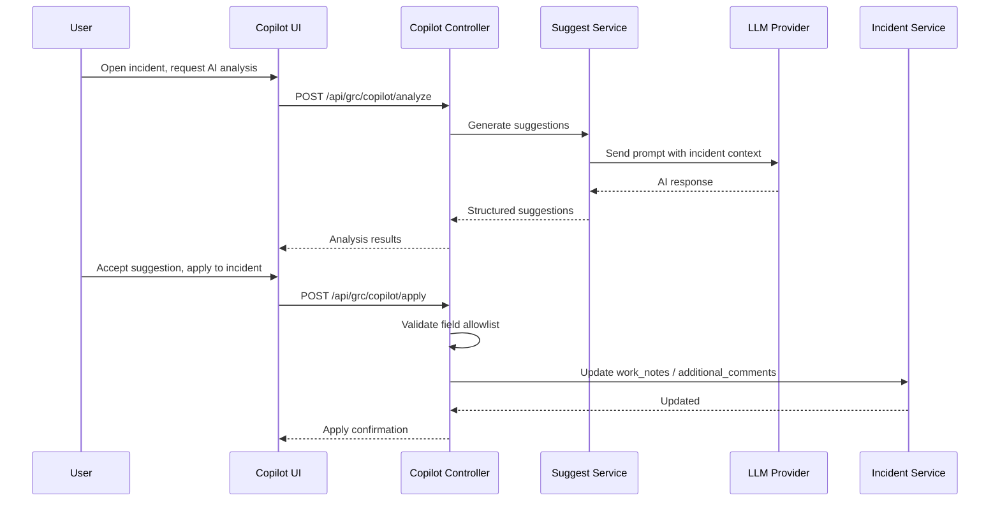
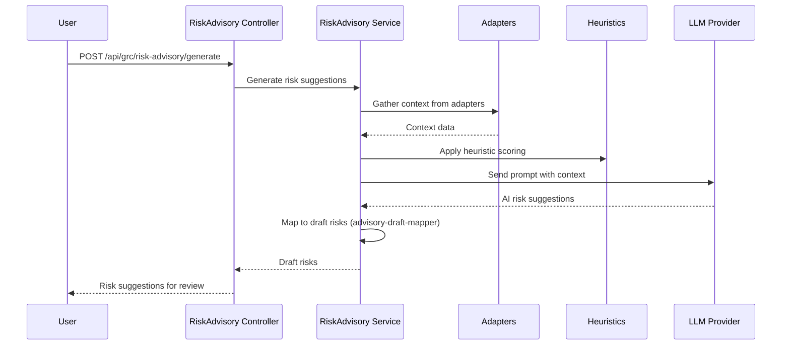
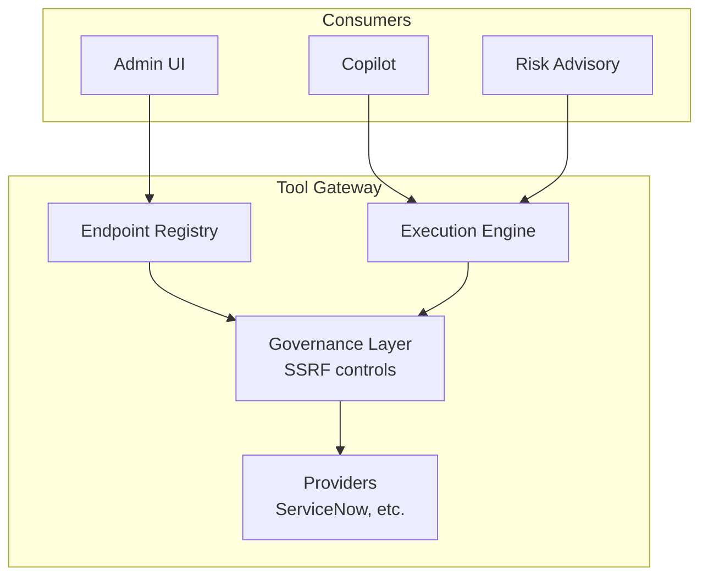

# AI Features Guide

> **Version:** 1.0 | **Last Updated:** 2026-02-26 | **Status:** Outline (Ready for Final Writing)
>
> **Audience:** Product/Engineering, AI/ML Team, IT Operations, Security, Executive
>
> **Evidence Map:** [EVIDENCE_MAP_v1.md](../discovery/EVIDENCE_MAP_v1.md) — Section 6

---

## Executive Summary

- **What this document covers:** All AI-powered features — Incident Copilot, Risk Advisory, AI Control Center (provider management), and Tool Gateway (external integrations with governance).
- **Incident Copilot:** AI-powered analysis, suggestions, and apply-back for ITSM incidents. Integrates with configurable LLM providers. Apply-back is strictly allowlisted to `work_notes` and `additional_comments` fields only.
- **Risk Advisory:** AI-powered risk identification and draft risk generation from contextual data, with heuristic scoring and adapter pattern.
- **AI Control Center:** Admin UI for managing AI provider configurations (OpenAI, Azure, etc.), API key encryption at rest, feature policies per tenant.
- **Tool Gateway:** Governed external API integrations (e.g., ServiceNow). Endpoint registration with SSRF controls and governance layer.
- **Security posture:** API keys encrypted at rest, SSRF protection on Tool Gateway, all AI features behind full guard stack, audit logging on all AI actions.
- **Known limitations:** No streaming responses. No fine-tuning pipeline. No vector DB / RAG. Provider configs are per-tenant but no usage metering.

---

## Table of Contents

1. [AI Architecture Overview](#1-ai-architecture-overview)
2. [Incident Copilot](#2-incident-copilot)
3. [Risk Advisory](#3-risk-advisory)
4. [AI Control Center](#4-ai-control-center)
5. [Tool Gateway](#5-tool-gateway)
6. [Security & Governance](#6-security--governance)
7. [Configuration](#7-configuration)
8. [Operations Runbook](#8-operations-runbook)
9. [Troubleshooting](#9-troubleshooting)
10. [Validation Checklist](#10-validation-checklist)

---

## 1. AI Architecture Overview

### 1.1 AI Module Map



> **EVIDENCE:** `backend-nest/src/copilot/`, `backend-nest/src/ai-admin/`, `backend-nest/src/tool-gateway/`, `backend-nest/src/grc/risk-advisory/`

### 1.2 Provider Abstraction

<!-- AI features use configurable providers — not hardcoded to any single LLM -->
<!-- AiProviderConfig entity stores per-tenant provider settings -->

---

## 2. Incident Copilot

### 2.1 Architecture



### 2.2 Sub-modules

| Sub-module | Path | Purpose |
|-----------|------|---------|
| Suggest | `src/copilot/suggest/` | AI suggestion generation |
| Apply | `src/copilot/apply/` | Apply-back to ITSM records |
| Learning | `src/copilot/learning/` | Learning from feedback |
| Indexing | `src/copilot/indexing/` | Context indexing |
| ServiceNow | `src/copilot/servicenow/` | ServiceNow data adapter |

> **Evidence Map:** [Section 6.1](../discovery/EVIDENCE_MAP_v1.md#61-incident-copilot)

### 2.3 Entities

| Entity | Purpose |
|--------|---------|
| (in `src/copilot/entities/`) | Copilot session, suggestion history |
| IncidentAiAnalysis | AI analysis results persisted per incident |

### 2.4 Endpoints

| Method | Route | Description |
|--------|-------|-------------|
| POST | `/copilot/analyze` | Trigger AI analysis on incident |
| POST | `/copilot/apply` | Apply AI suggestion to incident |
| GET | `/copilot/suggestions/:incidentId` | Get suggestions for incident |
| POST | `/itsm/incidents/:id/copilot/analyze` | ITSM-side copilot trigger |

### 2.5 Apply-back Allowlist

> **SECURITY:** Only `work_notes` and `additional_comments` fields are permitted for AI apply-back. This is a hard-coded allowlist — never expand without explicit approval.

### 2.6 UI Page

| Page | Route | Component |
|------|-------|-----------|
| Copilot | `/copilot` | `CopilotPage.tsx` |
| Incident AI Panel | (inline) | Within `ItsmIncidentDetail.tsx` |

---

## 3. Risk Advisory

### 3.1 Architecture



### 3.2 Components

| Component | Path | Purpose |
|-----------|------|---------|
| Controller | `src/grc/risk-advisory/risk-advisory.controller.ts` | API endpoints |
| Service | `src/grc/risk-advisory/risk-advisory.service.ts` | Core logic |
| Adapters | `src/grc/risk-advisory/adapters/` | Data gathering adapters |
| Heuristics | `src/grc/risk-advisory/heuristics/` | Scoring algorithms |
| Draft Mapper | `src/grc/risk-advisory/advisory-draft-mapper.ts` | Maps AI output → GrcRisk drafts |

> **Evidence Map:** [Section 6.2](../discovery/EVIDENCE_MAP_v1.md#62-risk-advisory-ai)

### 3.3 Tests

| Test | Path |
|------|------|
| Draft Mapper | `advisory-draft-mapper.spec.ts` |

---

## 4. AI Control Center

### 4.1 Architecture

<!-- Admin-only module for configuring AI providers -->
<!-- Per-tenant provider config with encrypted API keys -->

> **Evidence Map:** [Section 6.3](../discovery/EVIDENCE_MAP_v1.md#63-ai-control-center)

### 4.2 Entities

| Entity | Table | Purpose |
|--------|-------|---------|
| AiProviderConfig | `ai_provider_configs` | Provider settings (name, endpoint, model, encrypted key) |
| (Feature policies) | — | Per-tenant AI feature toggles |

### 4.3 API Key Encryption

<!-- Encryption module at src/ai-admin/encryption/ -->
<!-- Keys encrypted at rest in PostgreSQL -->
<!-- Decrypted only when making API calls -->

> **SECURITY:** AI provider API keys are encrypted at rest. Never log or expose decrypted keys.

> **EVIDENCE:** `backend-nest/src/ai-admin/encryption/`

### 4.4 Endpoints

| Method | Route | Description |
|--------|-------|-------------|
| GET | `/admin/ai-providers` | List configured providers |
| POST | `/admin/ai-providers` | Add provider config |
| PATCH | `/admin/ai-providers/:id` | Update provider config |
| DELETE | `/admin/ai-providers/:id` | Remove provider config |
| POST | `/admin/ai-providers/:id/test` | Test provider connectivity |

### 4.5 UI Page

| Page | Route | Component |
|------|-------|-----------|
| AI Control Center | `/admin/ai-control-center` | `AdminAiControlCenter.tsx` |

### 4.6 Migration

<!-- 1742600000000-CreateAiControlCenterTables.ts -->

> **EVIDENCE:** `backend-nest/src/migrations/1742600000000-CreateAiControlCenterTables.ts`

---

## 5. Tool Gateway

### 5.1 Architecture



> **Evidence Map:** [Section 6.4](../discovery/EVIDENCE_MAP_v1.md#64-tool-gateway)

### 5.2 Components

| Component | Path | Purpose |
|-----------|------|---------|
| Controller | `src/tool-gateway/tool-gateway.controller.ts` | API endpoints |
| Service | `src/tool-gateway/tool-gateway.service.ts` | Core logic |
| Entities | `src/tool-gateway/entities/` | Endpoint registrations |
| Providers | `src/tool-gateway/providers/` | ServiceNow provider |
| DTOs | `src/tool-gateway/dto/` | Request/response DTOs |

### 5.3 Endpoint Registration

<!-- ToolGatewayEndpoint entity: URL, auth method, headers, SSRF validation -->

### 5.4 SSRF Controls

> **SECURITY:** Tool Gateway includes SSRF protection:
> - URL allowlisting (only registered endpoints)
> - Private IP range blocking
> - DNS rebinding protection
> - Request timeout enforcement

### 5.5 ServiceNow Provider

<!-- Built-in ServiceNow adapter for table API, incident queries, change queries -->

> **EVIDENCE:** `backend-nest/src/tool-gateway/providers/`

### 5.6 Endpoints

| Method | Route | Description |
|--------|-------|-------------|
| GET | `/admin/tool-gateway/endpoints` | List registered endpoints |
| POST | `/admin/tool-gateway/endpoints` | Register new endpoint |
| PATCH | `/admin/tool-gateway/endpoints/:id` | Update endpoint |
| DELETE | `/admin/tool-gateway/endpoints/:id` | Remove endpoint |
| POST | `/admin/tool-gateway/execute` | Execute tool call |

### 5.7 UI Page

| Page | Route | Component |
|------|-------|-----------|
| Tool Gateway Admin | `/admin/tool-gateway` | `AdminToolGateway.tsx` |

### 5.8 Migration

<!-- 1742700000000-CreateToolGatewayTables.ts -->

> **EVIDENCE:** `backend-nest/src/migrations/1742700000000-CreateToolGatewayTables.ts`

---

## 6. Security & Governance

### 6.1 AI-Specific Security Controls

| Control | Implementation | Evidence |
|---------|---------------|----------|
| API key encryption | AES encryption at rest | `src/ai-admin/encryption/` |
| Apply-back allowlist | Hard-coded field list | Copilot apply module |
| SSRF protection | URL validation + private IP blocking | Tool Gateway governance |
| Guard stack | JwtAuthGuard + TenantGuard + PermissionsGuard | All AI endpoints |
| Audit logging | All AI actions logged | AuditModule integration |
| Tenant isolation | Provider configs scoped to tenant | `tenantId` on AiProviderConfig |

### 6.2 Data Flow Security

<!-- No customer data sent to LLM without explicit user action -->
<!-- Prompt contents are not persisted (only structured results) -->
<!-- Tool Gateway prevents arbitrary outbound calls -->

### 6.3 Admin-Only Access

<!-- AI Control Center and Tool Gateway are admin-only pages -->

---

## 7. Configuration

### 7.1 Environment Variables

| Variable | Required | Description |
|----------|----------|-------------|
| `AI_ENCRYPTION_KEY` | Yes (if AI enabled) | Encryption key for AI provider API keys |
| (Provider-specific) | Via UI | Configured per-tenant in AI Control Center |

> **SECURITY:** Never commit AI_ENCRYPTION_KEY or provider API keys. Use environment variables only.

### 7.2 Feature Policies

<!-- Per-tenant toggle for AI features -->

---

## 8. Operations Runbook

### 8.1 Enable AI Features

```bash
# 1. Set encryption key in .env
AI_ENCRYPTION_KEY=<generate with openssl rand -hex 32>

# 2. Restart backend to pick up config
docker compose -f docker-compose.staging.yml restart backend

# 3. Navigate to Admin → AI Control Center
# 4. Add provider configuration (e.g., OpenAI)
# 5. Test connectivity via UI
```

### 8.2 Tool Gateway Setup

```bash
# 1. Navigate to Admin → Tool Gateway
# 2. Register external endpoint (e.g., ServiceNow instance)
# 3. Configure authentication (Basic, Bearer, API Key)
# 4. Test endpoint connectivity
```

### 8.3 Monitoring AI Usage

<!-- Check audit logs for AI actions -->
<!-- Monitor LLM provider rate limits -->

---

## 9. Troubleshooting

| Symptom | Cause | Resolution |
|---------|-------|------------|
| "AI provider not configured" | No provider in AI Control Center | Add provider via admin UI |
| "Encryption key missing" | `AI_ENCRYPTION_KEY` not set | Set in `.env` and restart |
| Copilot returns empty analysis | Provider API key invalid/expired | Update key in AI Control Center |
| Tool Gateway connection refused | SSRF controls blocking | Verify endpoint URL is in allowlist |
| Apply-back fails with "field not allowed" | Attempting non-allowlisted field | Only `work_notes` and `additional_comments` permitted |
| Tool Gateway timeout | External service slow/down | Increase timeout or check external service |

---

## 10. Validation Checklist

| # | Check | Expected | Command / Steps | Status |
|---|-------|----------|-----------------|--------|
| 1 | AI Control Center page loads | Admin page renders | Navigate to `/admin/ai-control-center` | |
| 2 | Provider CRUD | 200 OK | Add/edit/delete provider via UI | |
| 3 | Provider test | Connectivity confirmed | Click "Test" on provider config | |
| 4 | API key encryption | Key not visible in DB | Query `ai_provider_configs` — key should be encrypted | |
| 5 | Copilot analysis | AI response returned | Trigger analysis on an incident | |
| 6 | Copilot apply-back | Only allowed fields | Attempt apply to work_notes | |
| 7 | Apply-back rejection | Error for disallowed field | Attempt apply to non-allowlisted field | |
| 8 | Tool Gateway page loads | Admin page renders | Navigate to `/admin/tool-gateway` | |
| 9 | Endpoint registration | Endpoint saved | Register test endpoint | |
| 10 | SSRF protection | Blocked | Attempt to register private IP endpoint | |

---

## Appendix

### A. Related Documents

- [ITSM Guide — Incident Copilot](./03_ITSM.md)
- [GRC Guide — Risk Advisory](./04_GRC.md)
- [Technical Architecture](./02_TECHNICAL.md)
- [Evidence Map — AI Features](../discovery/EVIDENCE_MAP_v1.md#6-ai-features)
