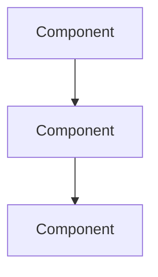
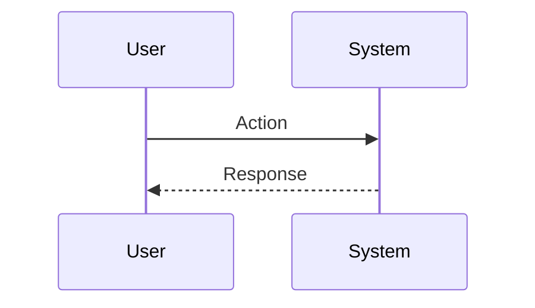

# Document Section Template — Reusable Skeleton

> **Purpose:** Every document in the six-doc suite MUST follow this skeleton structure.
> Sections may be adapted per document type, but the order and callout conventions are mandatory.

---

## Template Structure

```markdown
# [Document Title]

> **Version:** 1.0 | **Last Updated:** YYYY-MM-DD | **Status:** Draft
>
> **Audience:** [Product/Engineering | IT Operations | Auditors | Executive]
>
> **Evidence Map:** [EVIDENCE_MAP_v1.md](../discovery/EVIDENCE_MAP_v1.md)

---

## Executive Summary

<!-- MAX ONE PAGE. Bullet points only. No paragraphs. -->

- **What this document covers:** [1-2 sentences]
- **Key capabilities:** [3-5 bullets]
- **Deployment model:** [1 bullet]
- **Security posture:** [1 bullet]
- **Known limitations:** [1-2 bullets, honest about gaps]

---

## Table of Contents

<!-- Auto-generated or manual. Must reflect all H2 sections. -->

1. [What You Can Do](#what-you-can-do)
2. [What's Included](#whats-included)
3. [What's Not Included Yet](#whats-not-included-yet)
4. [Architecture at a Glance](#architecture-at-a-glance)
5. [Core Flows](#core-flows)
6. [Configuration](#configuration)
7. [Security & Governance](#security--governance)
8. [Operations Runbook](#operations-runbook)
9. [Troubleshooting](#troubleshooting)
10. [Validation Checklist](#validation-checklist)

---

## 1. What You Can Do

<!-- Feature inventory: what the system enables TODAY. -->
<!-- Use a table with Status column: [IMPL] / [PARTIAL] / [PLANNED] -->

| # | Capability | Status | Evidence |
|---|-----------|--------|----------|
| 1 | [Feature name] | [IMPL] | `path/to/controller.ts` |
| 2 | [Feature name] | [PLANNED] | ComingSoonPage placeholder |

---

## 2. What's Included

<!-- Detailed breakdown of implemented features. -->
<!-- Each sub-section should reference the Evidence Map. -->

### 2.1 [Feature Area]

> **Evidence Map:** See [EVIDENCE_MAP_v1.md, Section X.Y](../discovery/EVIDENCE_MAP_v1.md)

[Description of feature, citing specific files/endpoints/entities]

**Key endpoints:**
- `GET /grc/[resource]` — List with pagination
- `POST /grc/[resource]` — Create
- `GET /grc/[resource]/:id` — Detail
- `PATCH /grc/[resource]/:id` — Update
- `DELETE /grc/[resource]/:id` — Delete

**Key UI pages:**
- `/[route]` — List view
- `/[route]/:id` — Detail view

---

## 3. What's Not Included Yet

<!-- Honest about gaps. Reference ComingSoonPage placeholders. -->

| Feature | Status | Notes |
|---------|--------|-------|
| [Feature] | [PLANNED] | UI placeholder exists, no backend implementation |
| [Feature] | [PARTIAL] | Backend module exists, UI not connected |

---

## 4. Architecture at a Glance

<!-- ONE Mermaid diagram showing the high-level architecture for this document's scope. -->



> **EVIDENCE:** [Reference to architecture files]

---

## 5. Core Flows

<!-- 1-3 Mermaid sequence or state diagrams for the most important flows. -->

### 5.1 [Flow Name]



> **VALIDATION:** [How to verify this flow works]

---

## 6. Configuration

<!-- Environment variables, config files, feature flags. -->

| Variable | Required | Default | Description |
|----------|----------|---------|-------------|
| `VAR_NAME` | Yes/No | `default` | Description |

> **SECURITY:** Never commit actual secret values. Use environment variables only.

---

## 7. Security & Governance

<!-- Authentication, authorization, audit logging, data protection. -->

### 7.1 Authentication

[Describe auth mechanism with evidence citations]

### 7.2 Authorization (RBAC)

[Describe permission model with evidence citations]

### 7.3 Audit Trail

[Describe audit logging with evidence citations]

> **SECURITY:** [Key security note for this document's domain]

---

## 8. Operations Runbook

<!-- Start/stop, logs, backup, monitoring. Ops-team focused. -->

### 8.1 Start / Stop / Restart

```bash
# Commands for this component
```

### 8.2 Logs

```bash
# How to view logs for this component
```

### 8.3 Health Checks

| Endpoint | Expected | Command |
|----------|----------|---------|
| `/health/live` | 200 OK | `curl http://localhost:3002/health/live` |

### 8.4 Backup & Recovery

[Describe backup strategy or reference DB-BACKUP-RUNBOOK.md]

---

## 9. Troubleshooting

<!-- Common errors and resolutions. -->

| Symptom | Likely Cause | Resolution |
|---------|-------------|------------|
| 401 Unauthorized | Missing/expired JWT | Re-authenticate |
| 404 Not Found | Wrong route prefix | Use `/api/grc/...` not `/grc/...` from browser |

---

## 10. Validation Checklist

<!-- PASS/FAIL items to verify the documented system is working. -->

| # | Check | Expected Result | Command / Steps | Status |
|---|-------|----------------|-----------------|--------|
| 1 | [Check name] | [Expected] | [Command] | PASS / FAIL |
| 2 | [Check name] | [Expected] | [Command] | PASS / FAIL |

---

## Appendix

### A. Glossary

| Term | Definition |
|------|-----------|
| CMDB | Configuration Management Database |
| CAPA | Corrective and Preventive Action |

### B. References

- [Evidence Map](../discovery/EVIDENCE_MAP_v1.md)
- [Discovery Pack](../discovery/DISCOVERY_PACK_v1.md)
- [Style Guide](../templates/DOC_STYLE_GUIDE.md)
```

---

## Adaptation Notes

- **Infrastructure doc**: Expand sections 6 (Configuration) and 8 (Operations Runbook)
- **Technical doc**: Expand section 4 (Architecture) with module-level diagrams
- **ITSM / GRC docs**: Expand section 2 (What's Included) with per-feature detail
- **Bridges doc**: Expand section 5 (Core Flows) with cross-domain sequences
- **AI Features doc**: Expand sections 2 and 7 (Security for AI governance)
