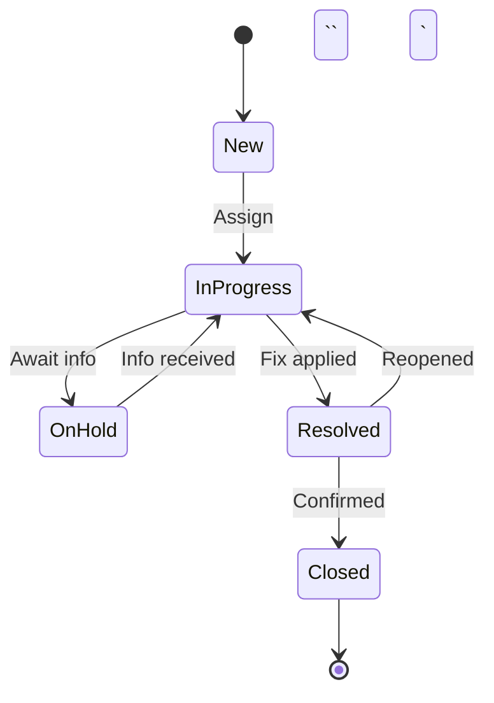

# Documentation Style Guide — GRC Platform

> **Version:** 1.0 | **Applies to:** All six enterprise documentation sets

---

## 1. Writing Tone & Voice

| Principle | Guideline |
|-----------|-----------|
| **Audience-first** | Write for the reader: ops teams need commands, auditors need evidence, executives need summaries. |
| **Precision** | Prefer concrete file paths, endpoint routes, and config keys over vague descriptions. |
| **Implemented vs Planned** | Always label clearly. Never imply a feature exists if it is planned. |
| **No secrets** | Never include credentials, API keys, tokens, or passwords. Use `<PLACEHOLDER>` notation. |
| **Active voice** | "The backend validates the JWT token" not "The JWT token is validated by the backend." |
| **Present tense** | Describe the system as it is now. Use future tense only for planned features. |

---

## 2. Document Structure Rules

Every document in the six-doc suite MUST follow this order:

1. **Title + metadata block** (version, last updated, audience)
2. **Executive Summary** (one page max — bullets, not paragraphs)
3. **Table of Contents** (auto-generated or manual)
4. **Body sections** (per template)
5. **Validation Checklist** (PASS/FAIL items)
6. **Appendix** (optional: glossary, references)

### Section Numbering

Use hierarchical numbering: `1.`, `1.1`, `1.1.1` (max 3 levels).

### Headers

```markdown
# Document Title          ← H1 (one per document)
## Major Section          ← H2 (numbered: ## 1. Infrastructure)
### Sub-section           ← H3 (numbered: ### 1.1 Docker Compose)
#### Detail               ← H4 (sparingly)
```

---

## 3. Callout Conventions

Use blockquote callouts with consistent emoji-free prefixes:

```markdown
> **SECURITY:** This endpoint requires JwtAuthGuard + TenantGuard + PermissionsGuard.

> **RISK:** DB_SYNC=true in production will cause non-deterministic schema changes. The app will exit(1).

> **VALIDATION:** Run `curl -i http://localhost/api/grc/controls` — expect 401, not 404.

> **OPS:** Restart with `docker compose -f docker-compose.staging.yml restart backend`.

> **PLANNED:** This feature has a UI placeholder (ComingSoonPage) but is not yet implemented.

> **EVIDENCE:** See `backend-nest/src/grc/entities/grc-risk.entity.ts` for the data model.
```

### Callout Types

| Prefix | When to Use |
|--------|------------|
| `SECURITY` | Authentication, authorization, encryption, secrets, SSRF |
| `RISK` | Architectural risks, data loss scenarios, known limitations |
| `VALIDATION` | How to verify a claim (commands, endpoints, expected responses) |
| `OPS` | Operational commands, restart procedures, log locations |
| `PLANNED` | Features not yet implemented — avoid overclaiming |
| `EVIDENCE` | Link to source code, entity, controller, config file |

---

## 4. Implemented vs Planned Labeling

### Inline Labels

Use brackets in tables and lists:

```markdown
| Feature | Status |
|---------|--------|
| Risk Management | **[IMPL]** Full CRUD + risk-control links |
| Risk Assessments (advanced) | **[PLANNED]** ComingSoonPage placeholder |
| LDAP/SSO | **[PARTIAL]** Directory exists, depth unverified |
```

### Section-level Labels

For entire sections about planned features:

```markdown
### 4.5 WebSocket Real-time Support [PLANNED]

> **PLANNED:** Nginx locations for `/ws/` and `/socket.io/` are configured,
> but no backend WebSocket implementation exists yet.
```

---

## 5. Evidence Citation Format

### Internal Code References

Always use relative paths from the repo root:

```markdown
> **EVIDENCE:** `backend-nest/src/grc/entities/grc-risk.entity.ts`

See controller: `backend-nest/src/grc/controllers/grc-risk.controller.ts`

Configuration: `docker-compose.staging.yml` (lines 60-116)
```

### Endpoint References

```markdown
**Endpoint:** `GET /grc/risks` (external: `GET /api/grc/risks`)
**Guards:** JwtAuthGuard + TenantGuard + PermissionsGuard
**Headers:** `Authorization: Bearer <token>`, `x-tenant-id: <uuid>`
```

### Evidence Map References

When citing the evidence map:

```markdown
> **Evidence Map:** See [EVIDENCE_MAP_v1.md, Section 4.1 — Risk Management](../discovery/EVIDENCE_MAP_v1.md#41-risk-management)
```

---

## 6. Mermaid Diagram Standards

### 6.1 Architecture Diagrams

Use `graph TD` (top-down) for system architecture:

```markdown
```mermaid
graph TD
    subgraph "External"
        USER[User Browser]
        CF[Cloudflare]
    end
    subgraph "Docker Compose"
        FE[Frontend<br/>nginx + React]
        BE[Backend<br/>NestJS :3002]
        DB[(PostgreSQL 15)]
    end
    USER --> CF --> FE
    FE -->|/api/* prefix strip| BE
    BE --> DB
`` `
```

### 6.2 Sequence Diagrams

Use `sequenceDiagram` for request flows:

```markdown
```mermaid
sequenceDiagram
    participant U as User
    participant N as Nginx
    participant B as Backend
    participant D as Database
    U->>N: GET /api/grc/risks
    N->>B: GET /grc/risks (prefix stripped)
    B->>B: JwtAuthGuard
    B->>B: TenantGuard (x-tenant-id)
    B->>D: SELECT * FROM grc_risks WHERE tenantId = ?
    D-->>B: rows
    B-->>N: { success: true, data: { items, total, page, pageSize } }
    N-->>U: 200 OK
`` `
```

### 6.3 State Machine / Workflow Diagrams

Use `stateDiagram-v2` for lifecycle flows:

```markdown


### 6.4 Entity Relationship Diagrams

Use `erDiagram` for data models:

```markdown
```mermaid
erDiagram
    GRC_RISK ||--o{ GRC_RISK_CONTROL : "mitigated by"
    GRC_CONTROL ||--o{ GRC_RISK_CONTROL : "mitigates"
    GRC_CONTROL ||--o{ GRC_CONTROL_EVIDENCE : "evidenced by"
    GRC_EVIDENCE ||--o{ GRC_CONTROL_EVIDENCE : "supports"
`` `
```

### Diagram Guidelines

- Keep diagrams focused — one concept per diagram
- Label all arrows with action verbs
- Use subgraphs to group related components
- Include port numbers and protocol info where relevant
- Mark planned components with dashed lines: `A -.-> B`

---

## 7. Table Conventions

### Inventory Tables

```markdown
| # | Module | Path | Status | Evidence |
|---|--------|------|--------|----------|
| 1 | HealthModule | `src/health/` | [IMPL] | health.controller.ts |
```

### Configuration Tables

```markdown
| Variable | Required | Default | Description |
|----------|----------|---------|-------------|
| `JWT_SECRET` | Yes | — | JWT signing secret (min 32 chars) |
| `DB_HOST` | No | `localhost` | PostgreSQL host |
```

### Checklist Tables

```markdown
| # | Check | Expected | Command | Status |
|---|-------|----------|---------|--------|
| 1 | Backend health | 200 OK | `curl http://localhost:3002/health/live` | PASS / FAIL |
```

---

## 8. Code Block Conventions

### Shell Commands

Always specify the language and include comments:

```markdown
```bash
# Start staging environment
docker compose -f docker-compose.staging.yml up -d

# Check container health
docker compose -f docker-compose.staging.yml ps

# View backend logs (last 100 lines)
docker compose -f docker-compose.staging.yml logs --tail=100 backend
`` `
```

### Configuration Snippets

```markdown
```yaml
# docker-compose.staging.yml — backend service (excerpt)
backend:
  build:
    context: ./backend-nest
    dockerfile: Dockerfile
  environment:
    NODE_ENV: production
    PORT: 3002
`` `
```

---

## 9. Cross-Document Linking

Use relative markdown links between documents in the suite:

```markdown
See [Infrastructure Guide](./01_INFRASTRUCTURE.md) for deployment details.
See [Evidence Map](../discovery/EVIDENCE_MAP_v1.md#41-risk-management) for code references.
```

---

## 10. Version & Metadata Block

Every document starts with:

```markdown
# Document Title

> **Version:** 1.0 | **Last Updated:** YYYY-MM-DD | **Status:** Draft / Review / Final
>
> **Audience:** Product/Engineering, IT Operations, Auditors, Executive
>
> **Evidence Map:** [EVIDENCE_MAP_v1.md](../discovery/EVIDENCE_MAP_v1.md)
```
