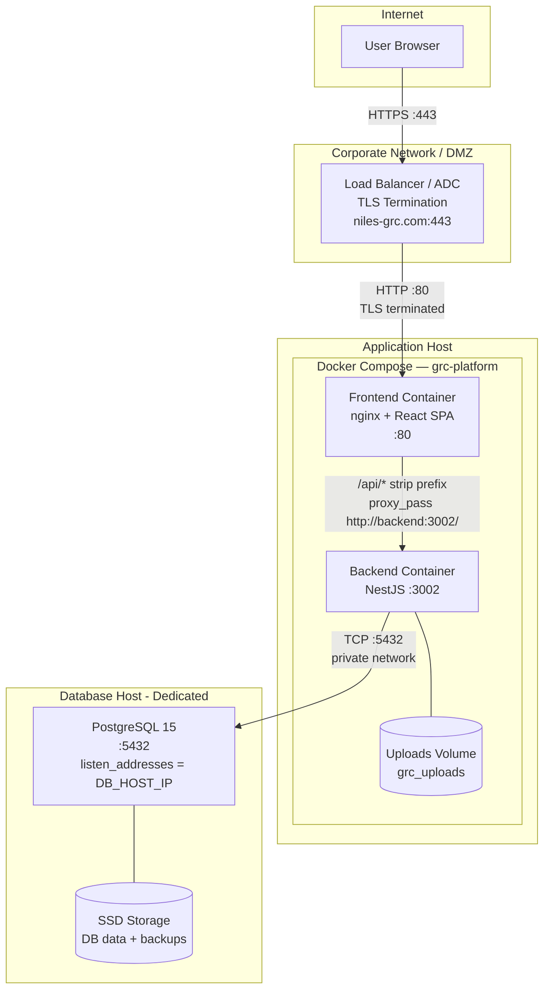
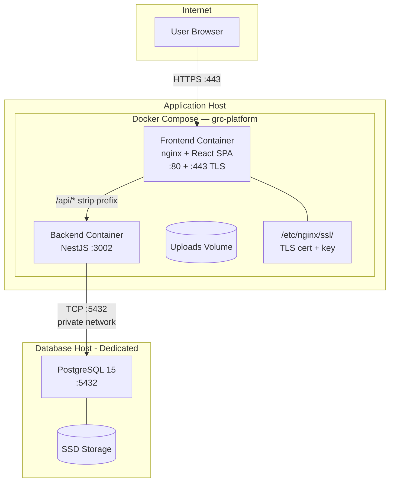

# Installation & Deployment Guide (BT Runbook)

> **Version:** 1.1 | **Last Updated:** 2026-02-26 | **Status:** Final
>
> **Audience:** IT Operations, Data Center Team, DevOps Engineers
>
> **Evidence Map:** [EVIDENCE_MAP_v1.md](../discovery/EVIDENCE_MAP_v1.md) — Section 1

---

## Executive Summary

- **What this guide covers:** Step-by-step installation and deployment of the GRC Platform from bare metal to first admin login.
- **Deployment model:** Docker Compose on a dedicated application server + dedicated PostgreSQL database host. TLS terminated at corporate load balancer / ADC.
- **Domain:** `niles-grc.com` (API served under `/api` on the same domain).
- **Quick Start time:** 30–45 minutes for a standard deployment with Docker Compose.
- **Production readiness:** Includes security hardening, backup procedures, monitoring recommendations, and Go/No-Go checklist.
- **Prerequisites:** Application server (Ubuntu 22.04 recommended), Docker Engine 24+, Docker Compose v2, dedicated PostgreSQL 15 database host, minimum 4 CPU / 8 GB RAM / 50 GB SSD per host.
- **Key decisions:**
  - Database MUST run on a dedicated host (not a container on the application server).
  - TLS MUST be terminated at the corporate load balancer / ADC (not at the application layer).
  - Ports 3002 and 5432 MUST never be exposed publicly.

---

## Table of Contents

1. [Quick Start (30–45 min)](#1-quick-start-3045-min)
2. [Prerequisites](#2-prerequisites)
3. [Architecture & Topology](#3-architecture--topology)
4. [Step-by-Step: System Preparation](#4-step-by-step-system-preparation)
5. [Step-by-Step: Database Host Setup](#5-step-by-step-database-host-setup)
6. [Step-by-Step: Application Deployment](#6-step-by-step-application-deployment)
7. [Step-by-Step: Post-Deploy Validation](#7-step-by-step-post-deploy-validation)
8. [First Admin Login & Tenant Bootstrap](#8-first-admin-login--tenant-bootstrap)
9. [Operations Runbook](#9-operations-runbook)
10. [Security Hardening](#10-security-hardening)
11. [Production Notes & Red Lines](#11-production-notes--red-lines)
12. [Troubleshooting](#12-troubleshooting)
13. [Go/No-Go Checklist](#13-gono-go-checklist)

---

## 1. Quick Start (30–45 min)

> **Audience:** Experienced Linux admin who wants to get running fast.

### 1.1 TL;DR Steps

```
1. Provision dedicated DB host (PostgreSQL 15) on private network
2. Configure pg_hba.conf to allow connections from app host only
3. Provision application server (Ubuntu 22.04, 4 CPU, 8 GB RAM, 50 GB SSD)
4. Configure corporate LB/ADC for TLS termination → forward HTTP to app host :80
5. Install Docker Engine + Docker Compose v2 on app host
6. Clone/retrieve repository or deployment artifacts
7. Configure .env file (point DB_HOST to dedicated DB host)
8. Generate secrets (JWT, encryption keys)
9. docker compose -f docker-compose.staging.yml up -d
10. Run database migrations
11. Run required seed scripts
12. Verify health endpoints
13. Configure DNS: niles-grc.com → LB/ADC VIP
14. Create first admin user / verify demo admin login
```

### 1.2 Minimum Viable Commands

```bash
# === On Database Host ===
# Install PostgreSQL 15
sudo apt update && sudo apt install -y postgresql-15

# Configure for remote access from app host
sudo sed -i "s/#listen_addresses = 'localhost'/listen_addresses = '<DB_HOST_IP>'/" \
  /etc/postgresql/15/main/postgresql.conf

# Allow app host connections only (pg_hba.conf)
echo "host  grc_db  grc_user  <APP_HOST_IP>/32  scram-sha-256" | \
  sudo tee -a /etc/postgresql/15/main/pg_hba.conf

# Create database and user
sudo -u postgres psql -c "CREATE USER grc_user WITH PASSWORD '<DB_PASSWORD>';"
sudo -u postgres psql -c "CREATE DATABASE grc_db OWNER grc_user;"
sudo systemctl restart postgresql

# === On Application Host ===
# Prerequisites (Ubuntu 22.04)
sudo apt update && sudo apt install -y docker.io docker-compose-v2
sudo usermod -aG docker $USER && newgrp docker

# Retrieve artifacts
git clone <REPO_URL> /opt/grc-platform
cd /opt/grc-platform

# Configure environment
cp backend-nest/.env.production.template .env

# Edit .env — set the following:
#   DB_HOST=<DB_HOST_IP>  (dedicated database host, NOT 'db' or 'localhost')
#   DB_PORT=5432
#   DB_USER=grc_user
#   DB_PASSWORD=<DB_PASSWORD>
#   DB_NAME=grc_db
#   DB_SYNC=false

# Generate secrets
sed -i "s|^JWT_SECRET=.*|JWT_SECRET=$(openssl rand -hex 32)|" .env
echo "REFRESH_TOKEN_SECRET=$(openssl rand -hex 32)" >> .env
echo "AI_ENCRYPTION_KEY=$(openssl rand -hex 32)" >> .env

# Create upload directory
mkdir -p staging-data/uploads
chown -R 1001:65533 staging-data
chmod -R 775 staging-data

# Deploy
docker compose -f docker-compose.staging.yml up -d --build

# Wait for health checks (60-90s)
sleep 90

# Verify
docker compose -f docker-compose.staging.yml ps
curl -i http://localhost/api/grc/controls  # Expect 401 (not 404)

# Run migrations
docker compose -f docker-compose.staging.yml exec backend \
  npx typeorm migration:run -d dist/data-source.js

# Run required seeds
docker compose -f docker-compose.staging.yml exec backend \
  node dist/scripts/seed-grc.js
docker compose -f docker-compose.staging.yml exec backend \
  node dist/scripts/seed-standards.js
docker compose -f docker-compose.staging.yml exec backend \
  node dist/scripts/seed-itsm-choices.js
```

---

## 2. Prerequisites

### 2.1 Hardware Requirements

#### Application Host

| Requirement | Minimum | Recommended | Notes |
|------------|---------|-------------|-------|
| CPU | 2 cores | 4+ cores | Backend is CPU-bound during AI operations |
| RAM | 4 GB | 8+ GB | NestJS + nginx |
| Disk | 20 GB | 50+ GB SSD | Docker images, uploads, logs |
| Network | 100 Mbps | 1 Gbps | For file uploads and API traffic |

#### Database Host (Dedicated)

| Requirement | Minimum | Recommended | Notes |
|------------|---------|-------------|-------|
| CPU | 2 cores | 4+ cores | Query processing |
| RAM | 4 GB | 8+ GB | PostgreSQL shared_buffers + work_mem |
| Disk | 20 GB | 100+ GB SSD | Database growth, WAL, backups |
| Network | 1 Gbps | 1 Gbps | Low-latency private link to app host |

### 2.2 Software Requirements

| Software | Version | Where | Notes |
|----------|---------|-------|-------|
| OS | Ubuntu 22.04 LTS | Both hosts | Other Linux distros supported |
| Docker Engine | 24.0+ | App host | `docker --version` |
| Docker Compose | v2.20+ | App host | `docker compose version` |
| PostgreSQL | 15 | DB host | Native install (not container) |
| Git | 2.30+ | App host | Optional, for source-based deploy |

### 2.3 Network Requirements

| Port | Protocol | Direction | Source | Destination | Purpose |
|------|----------|-----------|--------|-------------|---------|
| 443 | HTTPS | Inbound | Users | LB/ADC VIP | Frontend + API (TLS terminated at LB) |
| 80 | HTTP | Inbound | LB/ADC | App host | Forwarded traffic from LB |
| 22 | SSH | Inbound | Admin | Both hosts | Server administration |
| 5432 | TCP | Private | App host | DB host | PostgreSQL (private network only) |
| 3002 | TCP | Internal | nginx | backend | Backend API (container-to-container) |

> **RED LINE:** Ports 5432 and 3002 MUST NOT be exposed to external networks. Only port 443 (via LB/ADC) should be public-facing.

### 2.4 DNS & TLS

| Item | Configuration |
|------|--------------|
| Domain | `niles-grc.com` |
| DNS A Record | `niles-grc.com` → LB/ADC VIP |
| TLS Certificate | Installed on LB/ADC (corporate CA or public CA) |
| TLS Termination | At LB/ADC — app host receives plain HTTP on port 80 |
| API Path | `https://niles-grc.com/api/*` → reverse-proxied to backend |

### 2.5 Firewall Rules

```bash
# Application Host
sudo ufw default deny incoming
sudo ufw default allow outgoing
sudo ufw allow from <LB_ADC_IP> to any port 80    # HTTP from LB only
sudo ufw allow 22/tcp                               # SSH
sudo ufw enable

# Database Host
sudo ufw default deny incoming
sudo ufw default allow outgoing
sudo ufw allow from <APP_HOST_IP> to any port 5432  # PostgreSQL from app host only
sudo ufw allow 22/tcp                                # SSH
sudo ufw enable
```

---

## 3. Architecture & Topology

### 3.1 Primary Topology: Corporate LB/ADC + Docker Compose + Dedicated DB Host



> **EVIDENCE:** `docker-compose.staging.yml`, `frontend/nginx.conf`

### 3.2 Fallback Topology: nginx TLS Termination + Dedicated DB Host

Use this only if no corporate LB/ADC is available.



> **NOTE:** For fallback TLS, use `frontend/nginx-https.conf` and mount certificates into the frontend container. See Section 10.3.

### 3.3 Routing Architecture

```
User Browser
  - https://niles-grc.com/dashboard      -> React SPA (frontend container)
  - https://niles-grc.com/api/grc/risks  -> nginx strips /api -> backend /grc/risks
  - https://niles-grc.com/api/auth/login -> nginx strips /api -> backend /auth/login
```

| External Path | Internal Path | Handler |
|--------------|---------------|---------|
| `/*` (non-API) | `/*` | React SPA via `try_files` |
| `/api/*` | `/*` (prefix stripped) | NestJS backend via `proxy_pass` |

> **CRITICAL:** Backend controllers use `@Controller('grc/...')` with NO `api/` prefix. Nginx strips `/api` before forwarding.

---

## 4. Step-by-Step: System Preparation

### 4.1 Application Host — OS Setup

```bash
# Update system packages
sudo apt update && sudo apt upgrade -y

# Install required packages
sudo apt install -y \
  docker.io \
  docker-compose-v2 \
  git \
  curl \
  openssl

# Enable Docker service
sudo systemctl enable docker
sudo systemctl start docker

# Add deploy user to docker group
sudo usermod -aG docker $USER
newgrp docker

# Verify Docker
docker --version
docker compose version
```

### 4.2 User & Permissions

> **SECURITY:** Do not run production services as root. Use a dedicated deploy user with docker group access.

```bash
# Create dedicated deploy user
sudo useradd -m -s /bin/bash grc-deploy
sudo usermod -aG docker grc-deploy

# Switch to deploy user for all subsequent steps
sudo su - grc-deploy
```

### 4.3 Disk Preparation

```bash
# Check available disk space (minimum 50 GB recommended)
df -h

# If using a separate data partition:
# sudo mkdir -p /var/lib/docker
# sudo mount /dev/sdX1 /var/lib/docker
# Add to /etc/fstab for persistence
```

---

## 5. Step-by-Step: Database Host Setup

> **IMPORTANT:** The database MUST run on a dedicated host, not as a container on the application server. This ensures data isolation, independent scaling, and proper backup procedures.

### 5.1 Install PostgreSQL 15

```bash
# On the dedicated database host
sudo apt update && sudo apt install -y postgresql-15 postgresql-client-15

# Verify installation
sudo -u postgres psql -c "SELECT version();"
```

### 5.2 Configure Network Access

```bash
# Edit postgresql.conf — bind to the private network IP
sudo sed -i "s/#listen_addresses = 'localhost'/listen_addresses = '<DB_HOST_PRIVATE_IP>'/" \
  /etc/postgresql/15/main/postgresql.conf

# Edit pg_hba.conf — allow connections from application host ONLY
echo "host  grc_db  grc_user  <APP_HOST_IP>/32  scram-sha-256" | \
  sudo tee -a /etc/postgresql/15/main/pg_hba.conf

# Restart PostgreSQL to apply changes
sudo systemctl restart postgresql
```

### 5.3 Create Database and User

```bash
sudo -u postgres psql <<EOF
CREATE USER grc_user WITH PASSWORD '<STRONG_DB_PASSWORD>';
CREATE DATABASE grc_db OWNER grc_user;
GRANT ALL PRIVILEGES ON DATABASE grc_db TO grc_user;
\c grc_db
CREATE EXTENSION IF NOT EXISTS "uuid-ossp";
CREATE EXTENSION IF NOT EXISTS "pgcrypto";
EOF
```

### 5.4 PostgreSQL Tuning (Production)

```bash
# Edit postgresql.conf for production workload
sudo tee -a /etc/postgresql/15/main/conf.d/grc-tuning.conf <<EOF
# Connection settings
max_connections = 100

# Memory settings (adjust based on available RAM)
shared_buffers = 2GB
effective_cache_size = 6GB
work_mem = 64MB
maintenance_work_mem = 512MB

# WAL settings
wal_buffers = 64MB
min_wal_size = 1GB
max_wal_size = 4GB

# Checkpoint settings
checkpoint_completion_target = 0.9

# Logging
log_min_duration_statement = 1000
log_connections = on
log_disconnections = on
EOF

sudo systemctl restart postgresql
```

### 5.5 Verify Connectivity from Application Host

```bash
# From the application host, verify DB connectivity
psql -h <DB_HOST_IP> -U grc_user -d grc_db -c "SELECT 1;"
```

### 5.6 Backup Configuration on Database Host

```bash
# Create backup directory
sudo mkdir -p /var/backups/grc
sudo chown postgres:postgres /var/backups/grc

# Manual backup
sudo -u postgres pg_dump grc_db | gzip > /var/backups/grc/grc_$(date +%Y%m%d_%H%M%S).sql.gz

# Manual restore
gunzip -c /var/backups/grc/grc_YYYYMMDD_HHMMSS.sql.gz | sudo -u postgres psql grc_db

# Set up daily backup cron job (run: sudo -u postgres crontab -e)
# 0 2 * * * pg_dump grc_db | gzip > /var/backups/grc/grc_$(date +\%Y\%m\%d).sql.gz
# 0 3 * * * find /var/backups/grc -name "*.sql.gz" -mtime +30 -delete
```

---

## 6. Step-by-Step: Application Deployment

### 6.1 Retrieve Artifacts

```bash
# Option A: Git clone (if server has repo access)
git clone <REPO_URL> /opt/grc-platform
cd /opt/grc-platform

# Option B: Archive deployment (pre-built images)
# Transfer docker-compose.staging.yml + .env + pre-built images
# docker load < grc-backend.tar
# docker load < grc-frontend.tar
```

### 6.2 Environment Setup

```bash
# Copy production template
cp backend-nest/.env.production.template .env

# Configure database connection (DEDICATED DB HOST)
# Edit .env and set:
#   DB_HOST=<DB_HOST_PRIVATE_IP>    # NOT 'db' — dedicated host
#   DB_PORT=5432
#   DB_USER=grc_user
#   DB_PASSWORD=<STRONG_DB_PASSWORD>
#   DB_NAME=grc_db
#   DB_SYNC=false                    # MUST be false in production

# Generate required secrets
sed -i "s|^JWT_SECRET=.*|JWT_SECRET=$(openssl rand -hex 32)|" .env
echo "REFRESH_TOKEN_SECRET=$(openssl rand -hex 32)" >> .env
echo "AI_ENCRYPTION_KEY=$(openssl rand -hex 32)" >> .env
```

### 6.3 Required Environment Variables

| Variable | Required | How to Generate | Description |
|----------|----------|----------------|-------------|
| `JWT_SECRET` | Yes | `openssl rand -hex 32` | JWT signing secret (min 32 chars) |
| `REFRESH_TOKEN_SECRET` | Yes | `openssl rand -hex 32` | Refresh token signing secret |
| `REFRESH_TOKEN_EXPIRES_IN` | Yes | e.g., `7d` | Refresh token TTL |
| `DB_HOST` | Yes | `<DB_HOST_PRIVATE_IP>` | **Dedicated DB host IP** (not container) |
| `DB_PORT` | Yes | `5432` | PostgreSQL port |
| `DB_USER` | Yes | — | PostgreSQL user |
| `DB_PASSWORD` | Yes | — | PostgreSQL password (strong, generated) |
| `DB_NAME` | Yes | — | PostgreSQL database name |
| `DB_SYNC` | Yes | `false` | **MUST be false** in production |
| `NODE_ENV` | Yes | `production` | Runtime environment |
| `PORT` | Yes | `3002` | Backend listening port |
| `DEMO_ADMIN_EMAIL` | Yes | — | Initial admin email |
| `DEMO_ADMIN_PASSWORD` | Yes | — | Initial admin password |
| `AI_ENCRYPTION_KEY` | Optional | `openssl rand -hex 32` | For AI feature encryption |

> **SECURITY:** Never use default or weak secrets. Generate all keys with `openssl rand -hex 32`. Never commit `.env` files to version control.

> **RED LINE:** Setting `DB_SYNC=true` in production will cause the application to exit immediately with `process.exit(1)`. This is an intentional safety mechanism.

### 6.4 Upload Directory Setup

```bash
mkdir -p staging-data/uploads
chown -R 1001:65533 staging-data
chmod -R 775 staging-data
```

> **EVIDENCE:** `docker-compose.staging.yml` volume mounts for `./staging-data:/data`

### 6.5 Docker Compose Up

```bash
# Build and start application services (backend + frontend)
docker compose -f docker-compose.staging.yml up -d --build

# Monitor startup (wait for containers to be healthy)
watch -n 5 'docker compose -f docker-compose.staging.yml ps'

# Expected: backend and frontend services show "healthy"
# Typical startup time: 60-90 seconds
```

### 6.6 Database Migrations

```bash
# Show pending migrations
docker compose -f docker-compose.staging.yml exec backend \
  npx typeorm migration:show -d dist/data-source.js

# Run all pending migrations
docker compose -f docker-compose.staging.yml exec backend \
  npx typeorm migration:run -d dist/data-source.js
```

> **OPS:** Always run `migration:show` before `migration:run` to verify what will be applied.

### 6.7 Seed Data

#### Required for Production

```bash
# Core GRC seed data (risks, controls, policies)
docker compose -f docker-compose.staging.yml exec backend \
  node dist/scripts/seed-grc.js

# Compliance standards (ISO 27001, NIST, etc.)
docker compose -f docker-compose.staging.yml exec backend \
  node dist/scripts/seed-standards.js

# Compliance frameworks
docker compose -f docker-compose.staging.yml exec backend \
  node dist/scripts/seed-frameworks.js

# ITSM choice lists (picklist values)
docker compose -f docker-compose.staging.yml exec backend \
  node dist/scripts/seed-itsm-choices.js

# ITSM baseline data
docker compose -f docker-compose.staging.yml exec backend \
  node dist/scripts/seed-itsm-baseline.js

# SOA profiles
docker compose -f docker-compose.staging.yml exec backend \
  node dist/scripts/seed-soa.js

# Onboarding wizard data
docker compose -f docker-compose.staging.yml exec backend \
  node dist/scripts/seed-onboarding.js
```

#### Optional Demo Seeds (Non-Production)

```bash
# CMDB content pack (demo CI classes + sample CIs)
docker compose -f docker-compose.staging.yml exec backend \
  node dist/scripts/seed-cmdb-content-pack-v1.js

# Golden flow demo data
docker compose -f docker-compose.staging.yml exec backend \
  node dist/scripts/seed-golden-flow.js

# Demo story scenario
docker compose -f docker-compose.staging.yml exec backend \
  node dist/scripts/seed-demo-story.js

# Notification demo templates
docker compose -f docker-compose.staging.yml exec backend \
  node dist/scripts/seed-notification-demo.js

# API catalog demo entries
docker compose -f docker-compose.staging.yml exec backend \
  node dist/scripts/seed-api-catalog-demo.js

# CMDB Model Intelligence demo
docker compose -f docker-compose.staging.yml exec backend \
  node dist/scripts/seed-cmdb-mi-demo.js

# Full scenario pack
docker compose -f docker-compose.staging.yml exec backend \
  node dist/scripts/seed-scenario-pack.js
```

> **OPS:** All seed scripts are idempotent — safe to re-run. They will skip existing records.

---

## 7. Step-by-Step: Post-Deploy Validation

### 7.1 Container Health

```bash
# All application containers should show "healthy"
docker compose -f docker-compose.staging.yml ps

# Expected output:
# grc-staging-backend   running (healthy)
# grc-staging-frontend  running (healthy)
```

### 7.2 Health Endpoint Checks

```bash
# Backend liveness (inside container — use wget as curl may not be installed)
docker compose -f docker-compose.staging.yml exec backend \
  wget -q -S -O /dev/null http://localhost:3002/health/live

# Backend readiness
docker compose -f docker-compose.staging.yml exec backend \
  wget -q -S -O /dev/null http://localhost:3002/health/ready

# Backend DB connectivity (verifies connection to dedicated DB host)
docker compose -f docker-compose.staging.yml exec backend \
  wget -q -S -O /dev/null http://localhost:3002/health/db

# Backend auth check
docker compose -f docker-compose.staging.yml exec backend \
  wget -q -S -O /dev/null http://localhost:3002/health/auth

# Frontend health (from app host)
curl -s http://localhost/frontend-health
# Expected: "healthy"
```

### 7.3 Routing Validation

```bash
# API routing: should return 401 (not 404)
curl -i http://localhost/api/grc/controls
# Expected: HTTP 401 Unauthorized (JSON response from backend guards)
# If you get 404: nginx routing is broken

# Direct backend access: should return 401
curl -i http://localhost:3002/grc/controls
# Expected: HTTP 401 Unauthorized
```

> **VALIDATION:** If `/api/grc/controls` returns 404 instead of 401, the nginx `proxy_pass` trailing slash is missing. Check `nginx.conf` line: `proxy_pass http://backend/;` (trailing slash critical).

### 7.4 TLS Validation (via LB/ADC)

```bash
# Verify TLS from outside the network
curl -I https://niles-grc.com/
# Expected: HTTP/2 200, valid TLS certificate

curl -I https://niles-grc.com/api/grc/controls
# Expected: HTTP/2 401 (backend auth guard)
```

### 7.5 Migration Verification

```bash
docker compose -f docker-compose.staging.yml exec backend \
  npx typeorm migration:show -d dist/data-source.js
```

### 7.6 Platform Validation

```bash
docker compose -f docker-compose.staging.yml exec backend \
  node dist/scripts/platform-validate.js
```

---

## 8. First Admin Login & Tenant Bootstrap

### 8.1 Default Demo Tenant

The seed scripts create a default demo tenant with ID `00000000-0000-0000-0000-000000000001`. This can be used for initial testing or replaced with a production tenant.

### 8.2 First Admin Login

```bash
# Login with demo admin credentials (set in .env as DEMO_ADMIN_EMAIL / DEMO_ADMIN_PASSWORD)
curl -X POST https://niles-grc.com/api/auth/login \
  -H "Content-Type: application/json" \
  -d '{"email": "<DEMO_ADMIN_EMAIL>", "password": "<DEMO_ADMIN_PASSWORD>"}'

# Expected: JSON response with accessToken and refreshToken
```

### 8.3 Tenant Bootstrap Steps

1. Login as admin at `https://niles-grc.com/login`
2. Navigate to Admin → Tenants
3. Create production tenant (or use default demo tenant)
4. Configure tenant settings
5. Create operational users with appropriate roles
6. Adopt compliance frameworks (Admin → Frameworks)

### 8.4 Initial Configuration Checklist

| Step | Action | UI Path |
|------|--------|---------|
| 1 | Verify admin login | `/login` |
| 2 | Configure tenant settings | `/admin/settings` |
| 3 | Adopt compliance frameworks | `/admin/frameworks` |
| 4 | Configure AI providers (optional) | `/admin/ai-control-center` |
| 5 | Register Tool Gateway endpoints (optional) | `/admin/tool-gateway` |
| 6 | Create additional users | `/admin/users` |
| 7 | Assign roles and permissions | `/admin/users/:id/roles` |

---

## 9. Operations Runbook

### 9.1 Start / Stop / Restart

```bash
# Start all services
docker compose -f docker-compose.staging.yml up -d

# Stop all services (preserves data)
docker compose -f docker-compose.staging.yml down

# Restart specific service
docker compose -f docker-compose.staging.yml restart backend

# Rebuild and restart (after code changes)
docker compose -f docker-compose.staging.yml up -d --build backend frontend
```

> **RED LINE:** Never use `docker compose down -v` in production — this removes volumes. Never use `docker volume prune` — it may delete the upload volume.

### 9.2 Viewing Logs

```bash
# All services (last 100 lines)
docker compose -f docker-compose.staging.yml logs --tail=100

# Backend only (follow mode)
docker compose -f docker-compose.staging.yml logs -f --tail=100 backend

# Frontend/nginx logs
docker compose -f docker-compose.staging.yml logs --tail=100 frontend

# Database logs (on DB host)
sudo journalctl -u postgresql --no-pager -n 100

# Search for errors
docker compose -f docker-compose.staging.yml logs backend 2>&1 | grep -i error
```

### 9.3 Backup & Restore

#### Backup (on Database Host)

```bash
# Create timestamped backup
sudo -u postgres pg_dump grc_db | gzip \
  > /var/backups/grc/grc_$(date +%Y%m%d_%H%M%S).sql.gz

# Verify backup integrity
gunzip -t /var/backups/grc/grc_YYYYMMDD_HHMMSS.sql.gz
```

#### Restore (on Database Host)

```bash
# Stop backend to prevent writes during restore (on app host)
docker compose -f docker-compose.staging.yml stop backend

# Restore from backup (on DB host)
gunzip -c /var/backups/grc/grc_YYYYMMDD_HHMMSS.sql.gz | \
  sudo -u postgres psql grc_db

# Restart backend (on app host)
docker compose -f docker-compose.staging.yml start backend
```

> **OPS:** Always keep at least the last 7 daily backups for rollback capability.

### 9.4 Upgrade Procedure

```bash
# 1. Backup database (MANDATORY before upgrade — on DB host)
sudo -u postgres pg_dump grc_db | gzip \
  > /var/backups/grc/pre-upgrade-$(date +%Y%m%d).sql.gz

# 2. Pull latest code (on app host)
cd /opt/grc-platform
git pull origin main

# 3. Rebuild and restart
docker compose -f docker-compose.staging.yml up -d --build

# 4. Run pending migrations
docker compose -f docker-compose.staging.yml exec backend \
  npx typeorm migration:run -d dist/data-source.js

# 5. Verify health
docker compose -f docker-compose.staging.yml ps
curl http://localhost:3002/health/ready

# 6. Run platform validation
docker compose -f docker-compose.staging.yml exec backend \
  node dist/scripts/platform-validate.js
```

### 9.5 Rollback Procedure

```bash
# 1. Stop services (on app host)
docker compose -f docker-compose.staging.yml down

# 2. Revert to previous version
git checkout <previous-tag-or-commit>

# 3. Restore database from pre-upgrade backup (on DB host)
gunzip -c /var/backups/grc/pre-upgrade-YYYYMMDD.sql.gz | \
  sudo -u postgres psql grc_db

# 4. Rebuild and start with previous version (on app host)
docker compose -f docker-compose.staging.yml up -d --build

# 5. Verify health
docker compose -f docker-compose.staging.yml ps
```

### 9.6 Monitoring & Alerting (Recommendations)

> **PLANNED:** No built-in monitoring dashboards exist. The `/metrics` endpoint is available for Prometheus scraping.

**Recommended monitoring stack:**
- **Prometheus** — scrape `/metrics` endpoint
- **Grafana** — dashboards for API latency, error rates, DB connections
- **Alertmanager** — alerts for health endpoint failures, disk usage, backup failures

**Key metrics to monitor:**

| Metric | Threshold | Action |
|--------|-----------|--------|
| Health endpoint down | >30s | Page on-call |
| Disk usage | >80% | Run Docker prune + expand disk |
| DB connections | >80% pool | Investigate connection leaks |
| API error rate (5xx) | >1% | Check backend logs |
| Backup age | >24h | Investigate backup cron |
| DB host disk usage | >70% | Expand disk / archive old backups |

### 9.7 Disk Cleanup

```bash
# Remove unused Docker images (safe)
docker image prune -f

# Remove unused Docker build cache
docker builder prune -f

# Check disk usage
df -h
docker system df
```

> **RED LINE:** NEVER run `docker volume prune` — it can destroy the upload volume. Use `docker image prune` and `docker builder prune` only.

---

## 10. Security Hardening

### 10.1 Least Privilege

- Dedicated deploy user (not root) on both hosts
- Docker group access only on app host
- PostgreSQL user with minimal required grants on DB host
- No `sudo` for application operations

### 10.2 Firewall Configuration

See Section 2.5 for detailed UFW rules.

### 10.3 TLS/SSL Configuration

**Primary (Corporate LB/ADC — Recommended):**
- TLS certificate installed on the load balancer / ADC
- LB terminates TLS and forwards plain HTTP to app host port 80
- All external traffic goes through `https://niles-grc.com`

**Fallback (nginx TLS — Only if no LB/ADC available):**

```bash
# Mount certificates into frontend container
# In docker-compose.staging.yml, add to frontend service:
#   volumes:
#     - /etc/ssl/niles-grc:/etc/nginx/ssl:ro
#
# Use nginx-https.conf instead of nginx.conf:
#   Copy frontend/nginx-https.conf to frontend/nginx.conf before build
#   Or mount as volume: /path/to/nginx-https.conf:/etc/nginx/conf.d/default.conf:ro
```

> **EVIDENCE:** `frontend/nginx-https.conf` for direct TLS termination configuration.

### 10.4 Secrets Rotation

| Secret | Rotation Period | Impact |
|--------|----------------|--------|
| `JWT_SECRET` | Quarterly | All users must re-authenticate |
| `REFRESH_TOKEN_SECRET` | Quarterly | All refresh tokens invalidated |
| `DB_PASSWORD` | Quarterly | Update on DB host + app .env + restart |
| `AI_ENCRYPTION_KEY` | Annually | AI provider keys re-encrypted |

### 10.5 Database Security

- `pg_hba.conf` restricts access to app host IP only
- `listen_addresses` bound to private network IP only (not `0.0.0.0`)
- Strong password for `grc_user` (generated with `openssl rand -hex 32`)
- No public-facing port exposure for PostgreSQL

### 10.6 SSRF Controls (Tool Gateway)

The Tool Gateway has a governance layer with URL allowlisting and private IP blocking.

### 10.7 Audit Log Monitoring

The AuditLog entity captures all mutations. Regularly review audit logs for suspicious activity via Admin → Audit Logs.

---

## 11. Production Notes & Red Lines

### 11.1 Absolute Red Lines

| # | Rule | Consequence of Violation |
|---|------|-------------------------|
| 1 | `DB_SYNC` MUST be `false` in production | App exits with `process.exit(1)` — intentional safety |
| 2 | Port 3002 (backend) MUST NOT be publicly exposed | Direct API access bypasses nginx security headers |
| 3 | Port 5432 (PostgreSQL) MUST NOT be publicly exposed | Database compromise risk |
| 4 | NEVER run `docker volume prune` | May destroy upload volume data |
| 5 | NEVER run `docker compose down -v` | Destroys all named volumes including data |
| 6 | Database MUST be on dedicated host | Not a container on app host — data isolation requirement |
| 7 | TLS MUST be terminated at LB/ADC | Professional DC security model — no self-signed certs in production |
| 8 | NEVER commit `.env` files to git | Secret exposure risk |

### 11.2 Production Configuration

| Setting | Value | Notes |
|---------|-------|-------|
| `NODE_ENV` | `production` | Required for optimized build |
| `DB_SYNC` | `false` | Mandatory — use migrations only |
| `DB_HOST` | `<DB_HOST_PRIVATE_IP>` | Dedicated host, not `db` or `localhost` |
| Domain | `niles-grc.com` | DNS A → LB/ADC VIP |
| API Path | `/api/*` | Nginx strips prefix |

### 11.3 Capacity Planning

| Component | Current Limit | Scaling Path |
|-----------|--------------|--------------|
| Application | Single Docker Compose node | Kubernetes (planned) |
| Database | Single PostgreSQL host | Read replicas / managed DB |
| Storage | Local SSD | NFS / S3 for uploads (planned) |

---

## 12. Troubleshooting

### 12.1 Common Installation Errors

| Symptom | Likely Cause | Resolution |
|---------|-------------|------------|
| Backend can't connect to DB | Wrong `DB_HOST` in .env | Set to dedicated DB host IP |
| `connection refused` on 5432 | `pg_hba.conf` or `listen_addresses` wrong | Check DB host config (Section 5.2) |
| Backend 404 on `/api/grc/*` | Nginx `proxy_pass` missing trailing slash | Verify `proxy_pass http://backend/;` |
| `DB_SYNC` process exit(1) | `DB_SYNC=true` in .env | Set `DB_SYNC=false` and use migrations |
| Frontend shows blank page | API URL misconfigured | Verify `REACT_APP_API_URL` is empty (same-origin) |
| 401 on all endpoints | `JWT_SECRET` not set or wrong | Check `JWT_SECRET` in `.env`, restart backend |
| 403 HTML response | Cloudflare challenge or WAF | Verify DNS and CDN configuration |
| 403 JSON response | PermissionsGuard rejection | Check user permissions for the action |
| Migration error | Out-of-order migrations | Run `migration:show` to identify gaps |
| Upload permission denied | Wrong directory ownership | `chown -R 1001:65533 staging-data && chmod -R 775 staging-data` |
| Container OOM killed | Insufficient RAM | Increase server RAM or set memory limits |

### 12.2 Diagnostic Commands

```bash
# Container status
docker compose -f docker-compose.staging.yml ps

# Backend logs (recent)
docker compose -f docker-compose.staging.yml logs --tail=120 backend

# Database connectivity (inside backend container)
docker compose -f docker-compose.staging.yml exec backend \
  wget -q -S -O /dev/null http://localhost:3002/health/db

# Check nginx config
docker compose -f docker-compose.staging.yml exec frontend \
  nginx -T | head -50

# Check environment variables (safely — no secrets)
docker compose -f docker-compose.staging.yml exec backend \
  sh -c 'echo NODE_ENV=$NODE_ENV PORT=$PORT DB_HOST=$DB_HOST DB_SYNC=$DB_SYNC'

# Database connection test (from DB host)
sudo -u postgres pg_isready

# Database connection test (from app host)
psql -h <DB_HOST_IP> -U grc_user -d grc_db -c "SELECT 1;"

# List applied migrations
docker compose -f docker-compose.staging.yml exec backend \
  npx typeorm migration:show -d dist/data-source.js
```

### 12.3 Log Analysis Patterns

```bash
# Find TypeORM errors
docker compose -f docker-compose.staging.yml logs backend 2>&1 | grep -i "typeorm\|migration\|query"

# Find auth failures
docker compose -f docker-compose.staging.yml logs backend 2>&1 | grep -i "401\|unauthorized\|jwt"

# Find permission errors
docker compose -f docker-compose.staging.yml logs backend 2>&1 | grep -i "403\|forbidden\|permission"

# Find unhandled exceptions
docker compose -f docker-compose.staging.yml logs backend 2>&1 | grep -i "unhandled\|uncaught\|fatal"

# DB host — check PostgreSQL logs
sudo journalctl -u postgresql --since "1 hour ago" | grep -i "error\|fatal\|panic"
```

---

## 13. Go/No-Go Checklist

> **Purpose:** Complete this checklist before declaring the environment production-ready.

### 13.1 Infrastructure

| # | Check | Expected | Status |
|---|-------|----------|--------|
| 1 | Application containers healthy | `healthy` status | |
| 2 | DB host reachable from app host | `psql -h <DB_HOST> -c "SELECT 1"` succeeds | |
| 3 | Upload directory writable | Write test passes | |
| 4 | Firewall configured (app host) | Only 80 (from LB), 22 open | |
| 5 | Firewall configured (DB host) | Only 5432 (from app host), 22 open | |
| 6 | TLS active on LB/ADC | HTTPS serves valid cert at niles-grc.com | |
| 7 | DNS resolves correctly | `niles-grc.com` → LB/ADC VIP | |

### 13.2 Application

| # | Check | Expected | Status |
|---|-------|----------|--------|
| 8 | Backend `/health/live` | 200 OK | |
| 9 | Backend `/health/ready` | 200 OK | |
| 10 | Backend `/health/db` | 200 OK (connects to dedicated DB host) | |
| 11 | Backend `/health/auth` | 200 OK with refresh config | |
| 12 | Frontend serves | HTML page loads at niles-grc.com | |
| 13 | Frontend health | `curl /frontend-health` → "healthy" | |
| 14 | API routing | `/api/grc/controls` → 401 (not 404) | |

### 13.3 Data

| # | Check | Expected | Status |
|---|-------|----------|--------|
| 15 | All migrations applied | `migration:show` — all checked | |
| 16 | GRC seed data present | Risks, Controls, Policies exist | |
| 17 | Standards seeded | ISO 27001, NIST, etc. | |
| 18 | ITSM choices seeded | Picklist values present | |

### 13.4 Security

| # | Check | Expected | Status |
|---|-------|----------|--------|
| 19 | `DB_SYNC=false` | Confirmed in .env | |
| 20 | `JWT_SECRET` is strong | >= 32 random hex chars | |
| 21 | `.env` not in git | `.gitignore` excludes it | |
| 22 | No default passwords | All secrets generated | |
| 23 | Rate limiting active | 429 on rapid auth calls | |
| 24 | DB not publicly accessible | Port 5432 blocked from internet | |
| 25 | Backend not publicly accessible | Port 3002 blocked from internet | |

### 13.5 Operations

| # | Check | Expected | Status |
|---|-------|----------|--------|
| 26 | Backup procedure tested | Backup + restore cycle verified on DB host | |
| 27 | Rollback procedure documented | Team reviewed | |
| 28 | Monitoring configured | Health checks monitored | |
| 29 | Log rotation configured | Logs don't fill disk | |
| 30 | Platform validation green | `platform-validate.js` passes | |
| 31 | Admin login works | Demo admin can authenticate at niles-grc.com | |
| 32 | First user created | Operational user with correct roles | |

---

## Validation Checklist

- [x] Executive Summary present
- [x] Dedicated DB host topology documented
- [x] LB/ADC TLS termination as primary model
- [x] Domain niles-grc.com referenced throughout
- [x] API path `/api` routing documented
- [x] Two topology diagrams (primary LB + fallback nginx TLS)
- [x] Production Notes & Red Lines section
- [x] Seed scripts split into required vs optional
- [x] No secrets or credentials in document
- [x] Copy/paste commands use placeholders

---

## Appendix

### A. Related Documents

- [Infrastructure Guide](./01_INFRASTRUCTURE.md)
- [Technical Architecture](./02_TECHNICAL.md)
- [Evidence Map — Infrastructure](../discovery/EVIDENCE_MAP_v1.md#1-infrastructure)
- [Docker Compose File](../../docker-compose.staging.yml)
- [Env Template](../../backend-nest/.env.production.template)

### B. File Reference

| File | Purpose |
|------|---------|
| `docker-compose.staging.yml` | Production/staging deployment |
| `docker-compose.nest.yml` | Local development |
| `backend-nest/.env.production.template` | Production env template |
| `backend-nest/.env.example` | Development env template |
| `frontend/nginx.conf` | Reverse proxy configuration |
| `frontend/nginx-https.conf` | HTTPS configuration (fallback) |
| `backend-nest/Dockerfile` | Backend container image |
| `frontend/Dockerfile` | Frontend container image |
| `ops/staging-db-validate.sh` | DB validation script |
| `ops/staging-deploy-validate.sh` | Deploy validation script |

### C. Seed Script Reference

| Script | Purpose | Required for Prod | Idempotent |
|--------|---------|-------------------|-----------|
| `seed-grc.js` | Core GRC data | Yes | Yes |
| `seed-standards.js` | Compliance standards | Yes | Yes |
| `seed-frameworks.js` | Compliance frameworks | Yes | Yes |
| `seed-itsm-choices.js` | ITSM picklist values | Yes | Yes |
| `seed-itsm-baseline.js` | ITSM baseline data | Yes | Yes |
| `seed-soa.js` | SOA profiles | Yes | Yes |
| `seed-onboarding.js` | Onboarding wizard | Yes | Yes |
| `seed-cmdb-content-pack-v1.js` | CMDB baseline | No (demo) | Yes |
| `seed-golden-flow.js` | Demo golden path | No (demo) | Yes |
| `seed-demo-story.js` | Demo scenario | No (demo) | Yes |
| `seed-notification-demo.js` | Notification templates | No (demo) | Yes |
| `seed-api-catalog-demo.js` | API catalog entries | No (demo) | Yes |
| `seed-cmdb-mi-demo.js` | CMDB Model Intelligence | No (demo) | Yes |
| `seed-scenario-pack.js` | Full scenario demo | No (demo) | Yes |
