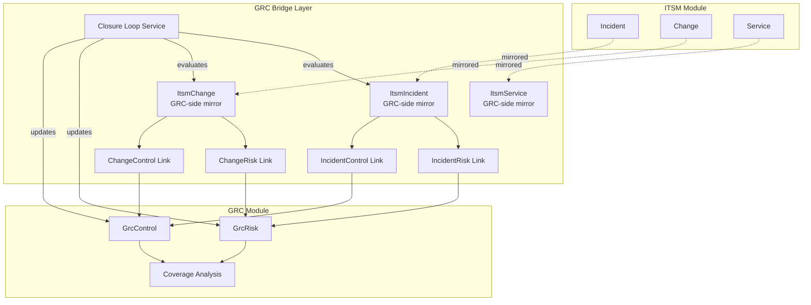
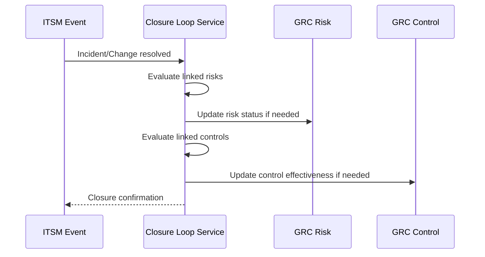
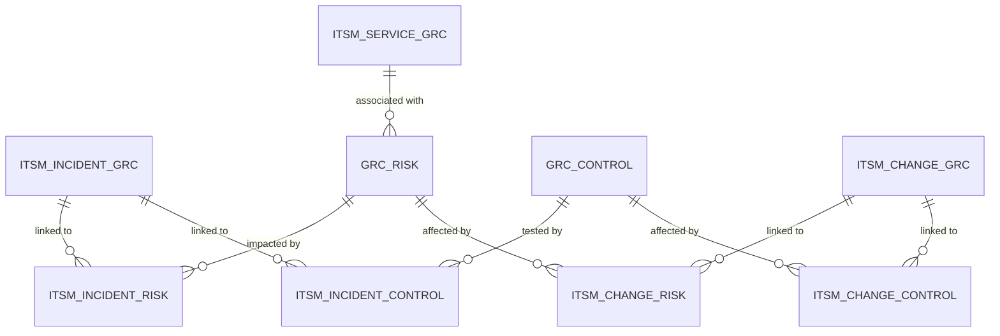
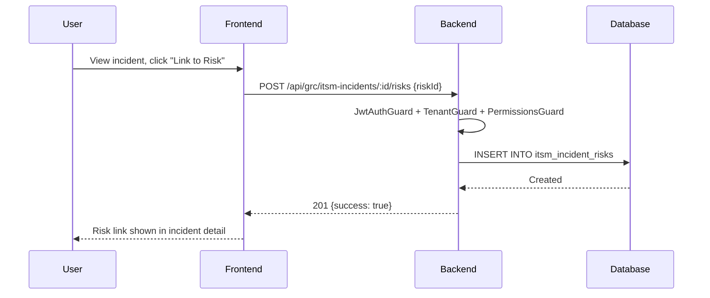
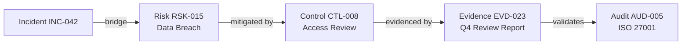

# ITSM-GRC Bridges Guide

> **Version:** 1.0 | **Last Updated:** 2026-02-26 | **Status:** Outline (Ready for Final Writing)
>
> **Audience:** Product/Engineering, Compliance Officers, IT Operations, Auditors
>
> **Evidence Map:** [EVIDENCE_MAP_v1.md](../discovery/EVIDENCE_MAP_v1.md) — Section 5

---

## Executive Summary

- **What this document covers:** The bridge layer that connects ITSM operational records (Incidents, Changes, Services) to GRC governance structures (Risks, Controls), plus the Closure Loop that auto-evaluates GRC impact from ITSM events.
- **Architecture pattern:** Dedicated bridge entities in the GRC module (`src/grc/entities/itsm-*.entity.ts`) mirror ITSM records and create many-to-many links to Risks and Controls.
- **Bridge types:** Incident↔GRC, Change↔GRC, Service↔GRC, and a Closure Loop service for automated cross-domain analysis.
- **Coverage Analysis:** Cross-domain dashboard showing risk-to-control and control-to-evidence coverage percentages.
- **Business value:** Enables auditors to trace from an operational incident directly to the risks it impacts and the controls that should have mitigated it — a key compliance requirement.
- **Known limitations:** Bridge links are manual (no auto-discovery from ITSM events). Closure Loop is implemented but may need validation of edge cases.

---

## Table of Contents

1. [Bridge Architecture Overview](#1-bridge-architecture-overview)
2. [Incident ↔ GRC Bridge](#2-incident--grc-bridge)
3. [Change ↔ GRC Bridge](#3-change--grc-bridge)
4. [Service ↔ GRC Bridge](#4-service--grc-bridge)
5. [Closure Loop (Automated Analysis)](#5-closure-loop-automated-analysis)
6. [Coverage Analysis (Cross-Domain)](#6-coverage-analysis-cross-domain)
7. [Data Model Overview](#7-data-model-overview)
8. [Core Flows](#8-core-flows)
9. [Security & Governance](#9-security--governance)
10. [Troubleshooting](#10-troubleshooting)
11. [Validation Checklist](#11-validation-checklist)

---

## 1. Bridge Architecture Overview

### 1.1 Cross-Domain Architecture

> **EVIDENCE:** `backend-nest/src/grc/entities/itsm-*.entity.ts`, `backend-nest/src/grc/services/closure-loop.service.ts`

### 1.2 Design Rationale

<!-- Why bridge entities live in GRC module (not ITSM) -->
<!-- Separation of concerns: ITSM owns operations, GRC owns governance -->
<!-- Bridge entities enable GRC queries without ITSM module dependency -->

---

## 2. Incident ↔ GRC Bridge

### 2.1 Entities

| Entity | File | Purpose |
|--------|------|---------|
| ItsmIncident (GRC) | `src/grc/entities/itsm-incident.entity.ts` | GRC-side incident mirror |
| ItsmIncidentRisk | `src/grc/entities/itsm-incident-risk.entity.ts` | Incident ↔ Risk link |
| ItsmIncidentControl | `src/grc/entities/itsm-incident-control.entity.ts` | Incident ↔ Control link |

> **Evidence Map:** [Section 5.1](../discovery/EVIDENCE_MAP_v1.md#51-incident--grc)

### 2.2 Controller & Service

| Component | File |
|-----------|------|
| Controller | `src/grc/controllers/itsm-incident.controller.ts` |
| Service | `src/grc/services/itsm-incident.service.ts` |

### 2.3 Endpoints

| Method | Route | Description |
|--------|-------|-------------|
| GET | `/grc/itsm-incidents` | List bridge incidents |
| GET | `/grc/itsm-incidents/:id` | Get bridge incident detail |
| POST | `/grc/itsm-incidents/:id/risks` | Link incident to risk |
| DELETE | `/grc/itsm-incidents/:id/risks/:riskId` | Remove incident-risk link |
| POST | `/grc/itsm-incidents/:id/controls` | Link incident to control |
| DELETE | `/grc/itsm-incidents/:id/controls/:controlId` | Remove incident-control link |

### 2.4 Use Case: Incident → Risk Tracing

<!-- Auditor wants to know: "Which risks were impacted by incident INC-0042?" -->
<!-- Flow: Query bridge → get linked risks → assess risk impact -->

---

## 3. Change ↔ GRC Bridge

### 3.1 Entities

| Entity | File | Purpose |
|--------|------|---------|
| ItsmChange (GRC) | `src/grc/entities/itsm-change.entity.ts` | GRC-side change mirror |
| ItsmChangeRisk | `src/grc/entities/itsm-change-risk.entity.ts` | Change ↔ Risk link |
| ItsmChangeControl | `src/grc/entities/itsm-change-control.entity.ts` | Change ↔ Control link |

> **Evidence Map:** [Section 5.2](../discovery/EVIDENCE_MAP_v1.md#52-change--grc)

### 3.2 Controller & Service

| Component | File |
|-----------|------|
| Controller | `src/grc/controllers/itsm-change.controller.ts` |
| Service | `src/grc/services/itsm-change.service.ts` |

### 3.3 Endpoints

| Method | Route | Description |
|--------|-------|-------------|
| GET | `/grc/itsm-changes` | List bridge changes |
| GET | `/grc/itsm-changes/:id` | Get bridge change detail |
| POST | `/grc/itsm-changes/:id/risks` | Link change to risk |
| DELETE | `/grc/itsm-changes/:id/risks/:riskId` | Remove change-risk link |
| POST | `/grc/itsm-changes/:id/controls` | Link change to control |
| DELETE | `/grc/itsm-changes/:id/controls/:controlId` | Remove change-control link |

### 3.4 Use Case: Change Impact Assessment

<!-- Before approving a change: "Which controls are affected by this change?" -->
<!-- Flow: Query bridge → get linked controls → assess control effectiveness -->

---

## 4. Service ↔ GRC Bridge

### 4.1 Entities

| Entity | File | Purpose |
|--------|------|---------|
| ItsmService (GRC) | `src/grc/entities/itsm-service.entity.ts` | GRC-side service mirror |

> **Evidence Map:** [Section 5.3](../discovery/EVIDENCE_MAP_v1.md#53-service--grc)

### 4.2 Controller & Service

| Component | File |
|-----------|------|
| Controller | `src/grc/controllers/itsm-service.controller.ts` |
| Service | `src/grc/services/itsm-service.service.ts` |

### 4.3 Use Case: Service Risk Profile

<!-- "What risks are associated with our CRM service?" -->
<!-- Flow: Service → linked risks → risk treatments → control mapping -->

---

## 5. Closure Loop (Automated Analysis)

### 5.1 Service

| Component | File |
|-----------|------|
| Service | `src/grc/services/closure-loop.service.ts` |
| Tests | `src/grc/services/closure-loop.service.spec.ts` |
| Documentation | `docs/CLOSURE-LOOP-API.md` |

> **Evidence Map:** [Section 5.4](../discovery/EVIDENCE_MAP_v1.md#54-closure-loop)

### 5.2 Closure Loop Flow

### 5.3 Business Logic

<!-- What the closure loop evaluates -->
<!-- When it triggers -->
<!-- What it updates -->

---

## 6. Coverage Analysis (Cross-Domain)

### 6.1 Controller

| Component | File |
|-----------|------|
| Controller | `src/grc/controllers/grc-coverage.controller.ts` |

> **Evidence Map:** [Section 5.5](../discovery/EVIDENCE_MAP_v1.md#55-coverage-analysis-cross-domain)

### 6.2 Coverage Metrics

<!-- Risk → Control coverage: % of risks with at least one linked control -->
<!-- Control → Evidence coverage: % of controls with at least one evidence -->
<!-- ITSM → GRC coverage: % of incidents/changes linked to risks -->

### 6.3 UI Page

| Page | Route | Component |
|------|-------|-----------|
| Coverage Dashboard | `/coverage` | `Coverage.tsx` |

---

## 7. Data Model Overview

### 7.1 Complete Bridge ER Diagram

### 7.2 Key Columns

<!-- Bridge entities share: id (uuid), tenantId, source entity reference, timestamps -->
<!-- Link entities: bridge entity FK + GRC entity FK + metadata -->

---

## 8. Core Flows

### 8.1 Linking an Incident to a Risk

### 8.2 Coverage Report Generation

<!-- Flow: User navigates to Coverage → Backend queries all links → Calculates percentages → Returns dashboard data -->

### 8.3 Audit Trail: Incident → Risk → Control → Evidence

<!-- Full traceability chain for auditors -->

---

## 9. Security & Governance

### 9.1 Permission Requirements

<!-- Bridge operations require both ITSM and GRC permissions -->

> **SECURITY:** Linking ITSM records to GRC entities requires appropriate permissions for both domains.

### 9.2 Tenant Isolation

<!-- Bridge entities include tenantId — cross-tenant links are prevented -->

### 9.3 Audit Logging

<!-- All bridge link/unlink operations are logged in audit trail -->

---

## 10. Troubleshooting

| Symptom | Cause | Resolution |
|---------|-------|------------|
| Bridge incident not found | ITSM incident not mirrored to GRC | Ensure incident exists in both ITSM and GRC bridge tables |
| Coverage shows 0% | No bridge links created | Create incident/change → risk/control links |
| Closure loop not triggering | Event not propagated | Check closure loop service logs |
| Permission denied on link | Missing cross-domain permissions | User needs both ITSM and GRC permissions |

---

## 11. Validation Checklist

| # | Check | Expected | Command / Steps | Status |
|---|-------|----------|-----------------|--------|
| 1 | Incident-Risk link | 201 Created | `POST /grc/itsm-incidents/:id/risks` | |
| 2 | Incident-Control link | 201 Created | `POST /grc/itsm-incidents/:id/controls` | |
| 3 | Change-Risk link | 201 Created | `POST /grc/itsm-changes/:id/risks` | |
| 4 | Change-Control link | 201 Created | `POST /grc/itsm-changes/:id/controls` | |
| 5 | Coverage endpoint | Percentage data | `GET /grc/coverage` | |
| 6 | Closure loop tests | All pass | `npm test -- closure-loop` | |
| 7 | Tenant isolation | No cross-tenant links | Attempt link with wrong tenantId | |
| 8 | Bridge list endpoint | Items returned | `GET /grc/itsm-incidents` | |
| 9 | Full audit trail | Incident→Risk→Control→Evidence | Navigate bridge links end-to-end | |
| 10 | Permission enforcement | 403 for unauthorized | Test with restricted user | |

---

## Appendix

### A. Related Documents

- [ITSM Module Guide](./03_ITSM.md)
- [GRC Module Guide](./04_GRC.md)
- [Evidence Map — Bridges](../discovery/EVIDENCE_MAP_v1.md#5-itsm-grc-bridges)
- [Closure Loop API Doc](../../docs/CLOSURE-LOOP-API.md)
